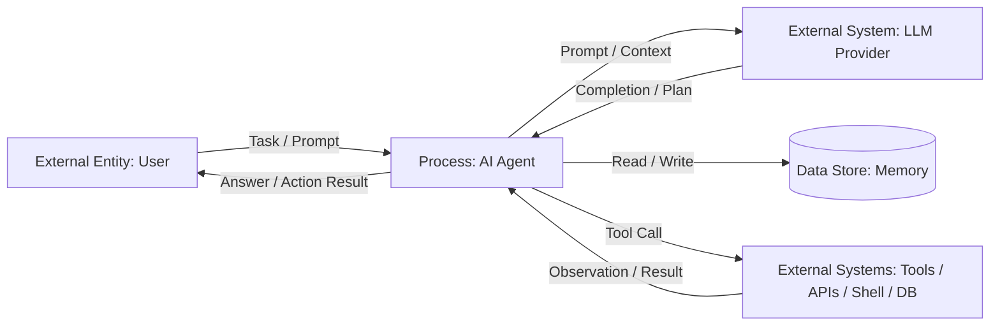

# 01 — Введение: что такое AI-агент и чем он опасен

> Навигация: [Оглавление](../../README.md) · [← Назад](../../README.md) · [Вперёд →](02-threat-model.md)

*Кратко: AI-агент — это LLM, подключённая к памяти, инструментам и циклу принятия решений. В отличие от обычной LLM, агент не только пишет текст, но и может выполнять действия в системе.*

> Примеры в разделе — на Go. Те же примеры на других языках:
> [Python](../../examples/python/part-1/01-introduction.py) ·
> [TypeScript](../../examples/typescript/part-1/01-introduction.ts)

## Суть

**AI-агент** — это программная система, где LLM используется не только для генерации текста, но и для выбора следующего шага: прочитать данные, вызвать инструмент, изменить состояние, обратиться к API, записать результат, продолжить цикл или завершить задачу.

Минимальная формула:

```text
AI Agent = LLM + Context + Memory + Tools + Planning Loop + Policy Layer
```

Главная разница:

- обычная LLM отвечает текстом;
- RAG-система подмешивает внешние данные в контекст;
- агент планирует шаги и вызывает инструменты;
- автономный агент может выполнять несколько шагов без постоянного подтверждения человека.

Метафора:

> **LLM — калькулятор. Агент — робот с отвёрткой.**
>
> Калькулятор может ошибиться в ответе. Робот может ошибиться и что-то открутить.

## LLM vs RAG vs Agent

| Система | Что делает | Состояние | Доступ к системе | Главный риск |
|---|---|---:|---|---|
| LLM / chatbot | Генерирует текст | Обычно stateless | Нет прямого доступа | Галлюцинации, prompt injection, вредный ответ |
| RAG | Читает внешние документы и отвечает по ним | Контекст запроса | Доступ к базе знаний / поиску | Подмена контекста, утечка данных, indirect prompt injection |
| Agent | Планирует и вызывает tools | Память + цикл | API, файлы, shell, БД, браузер, почта | Реальные действия, tool misuse, privilege escalation, data exfiltration |

Вывод:

> Чем больше у системы **памяти, инструментов и автономности**, тем больше поверхность атаки.

## Из чего состоит агент

Типовой агент состоит из следующих частей:

1. **User Input** — задача пользователя или внешний сигнал.
2. **System / Developer Instructions** — управляющие правила поведения.
3. **Context Builder** — сборка контекста из задачи, памяти, RAG и истории.
4. **LLM Planner** — выбор следующего шага.
5. **Tool Router** — маршрутизация вызовов к инструментам.
6. **Tools** — API, shell, база данных, браузер, почта, файловая система.
7. **Memory** — краткосрочная или долгосрочная память агента.
8. **Policy Layer** — права, scopes, лимиты, sandbox, approval.
9. **Observability** — логи, trace, audit trail, метрики.
10. **Output** — ответ пользователю или результат действия во внешней системе.

Критичная мысль:

> LLM не должна напрямую выполнять действие. Между решением модели и реальным tool call должен быть слой политики.

Для LLM часто достаточно санитизации входа; у агента критичны этапы выбора инструмента, авторизации и исполнения — **угроза смещается вправо по конвейеру** (вход → план → tool call → наблюдение → выход).

## DFD Level 0 — агент как чёрный ящик

DFD показывает внешние сущности, процессы, хранилища данных, потоки данных и границы доверия. На первом уровне агент можно рассматривать как один процесс.



На этом уровне уже видны главные зоны риска:

| Зона | Что может пойти не так |
|---|---|
| User → Agent | prompt injection, вредная задача, token bombing |
| Agent → LLM | утечка приватного контекста внешнему провайдеру |
| Agent ↔ Memory | сохранение вредной инструкции, memory poisoning |
| Agent → Tools | опасное действие, tool hijacking, misuse |
| Tools → Agent | poisoned tool output, подмена результата |
| Agent → User | раскрытие секретов, уверенная галлюцинация |

## Угроза / контекст

Агент опаснее обычной LLM по трём причинам.

### 1. Действия

LLM может написать неправильный совет. Агент может выполнить неправильное действие:

- удалить файл;
- отправить письмо;
- вызвать платный API;
- создать задачу;
- изменить запись в БД;
- выгрузить данные наружу.

### 2. Доступ

Чтобы быть полезным, агенту часто дают доступ к данным и системам:

- документы;
- почта;
- календарь;
- CRM;
- Git;
- shell;
- база данных;
- внутренние API;
- внешние сервисы.

Если доступ выдан слишком широко, ошибка агента превращается в инцидент безопасности.

### 3. Автономность

Агент может работать циклом:

```text
plan → tool call → observe → re-plan → tool call → observe → final
```

Если цикл не ограничен, появляются дополнительные риски:

- бесконечные tool calls;
- перерасход токенов;
- DoS внешних сервисов;
- накопление ошибок;
- цепочка действий без подтверждения человека.

## Базовый принцип безопасности

> **AI-агент — недоверенный исполнитель.**

Это значит:

- агент может ошибиться;
- агент может быть атакован через входные данные;
- агент может неправильно выбрать инструмент;
- агент может поверить вредному документу;
- агент может раскрыть данные;
- агент может выполнить опасное действие;
- агенту нельзя выдавать больше прав, чем нужно для конкретной задачи.

Практический вывод:

> Не надо пытаться сделать агента «умным и безопасным только промптом». Безопасность должна быть вынесена в код, права, политики, лимиты, sandbox, approval и аудит.

## Подходы и контрмеры

Минимальный набор защит для агента:

| Контрмера | Для чего нужна |
|---|---|
| Least privilege | агент получает только нужные tools и scopes |
| Tool allowlist | агент может вызывать только разрешённые инструменты |
| Parameter validation | аргументы tool call проверяются схемой |
| Human approval | опасные действия требуют подтверждения |
| Sandbox | код, shell и файлы выполняются в изоляции |
| Context isolation | данные не смешиваются с управляющими инструкциями |
| Memory sanitization | в память не попадают вредные инструкции и секреты |
| Egress control | агент не может отправлять данные куда угодно |
| Loop limits | ограничение количества шагов, токенов и стоимости |
| Audit logging | все действия агента записываются и проверяются |

## Пример (Go)

Иллюстративный skeleton: LLM предлагает действие, но реальный tool call проходит через policy check и audit log.

```go
package agent

import (
	"context"
	"errors"
	"fmt"
)

type ToolCall struct {
	Name string
	Args map[string]any
}

type Step struct {
	FinalAnswer string
	ToolCall    *ToolCall
}

type LLMClient interface {
	Plan(ctx context.Context, task string) (Step, error)
	Summarize(ctx context.Context, task string, observation string) (string, error)
}

type Tool interface {
	Call(ctx context.Context, args map[string]any) (string, error)
}

type Policy interface {
	AllowToolCall(ctx context.Context, call ToolCall) error
}

type AuditLogger interface {
	ToolCallRequested(ctx context.Context, call ToolCall)
	ToolCallDenied(ctx context.Context, call ToolCall, reason error)
	ToolCallExecuted(ctx context.Context, call ToolCall, observation string)
}

type Agent struct {
	LLM    LLMClient
	Tools  map[string]Tool
	Policy Policy
	Log    AuditLogger
}

func (a *Agent) Run(ctx context.Context, task string) (string, error) {
	// Риск: prompt injection может быть уже внутри task.
	// Поэтому task нельзя считать доверенной управляющей инструкцией.
	step, err := a.LLM.Plan(ctx, task)
	if err != nil {
		return "", err
	}

	if step.ToolCall == nil {
		// Риск: output может содержать секреты или галлюцинации.
		// В реальной системе здесь нужен output validation / redaction.
		return step.FinalAnswer, nil
	}

	call := *step.ToolCall

	tool, ok := a.Tools[call.Name]
	if !ok {
		return "", fmt.Errorf("unknown tool: %s", call.Name)
	}

	// Риск: tool hijacking / tool misuse.
	// Модель не должна вызывать инструмент напрямую.
	// Сначала проверяем права, scope, параметры и необходимость approval.
	a.Log.ToolCallRequested(ctx, call)
	if err := a.Policy.AllowToolCall(ctx, call); err != nil {
		a.Log.ToolCallDenied(ctx, call, err)
		return "", fmt.Errorf("tool call denied: %w", err)
	}

	observation, err := tool.Call(ctx, call.Args)
	if err != nil {
		return "", err
	}

	if observation == "" {
		return "", errors.New("empty tool observation")
	}

	a.Log.ToolCallExecuted(ctx, call, observation)

	// Риск: tool output может быть poisoned.
	// Нельзя слепо превращать observation в новые инструкции.
	return a.LLM.Summarize(ctx, task, observation)
}
```

Что показывает пример:

- LLM только предлагает следующий шаг;
- tool call не выполняется напрямую;
- есть allowlist инструментов;
- есть policy check;
- есть audit log;
- output и observation считаются потенциально недоверенными.

## Чек-лист

- [ ] Агент описан как набор компонентов: input, context, planner, tools, memory, policy, logs, output.
- [ ] Для каждого tool указано, какие действия он может выполнять.
- [ ] Для каждого tool указаны scopes / роли / ограничения.
- [ ] Опасные действия требуют human approval.
- [ ] Все tool calls логируются.
- [ ] Есть ограничение количества шагов agent loop.
- [ ] Есть ограничение токенов / стоимости / времени выполнения.
- [ ] Внешние документы и web-страницы считаются недоверенными.
- [ ] Память агента не используется как доверенный источник инструкций.
- [ ] Секреты не передаются в LLM без необходимости.
- [ ] Есть отдельный слой output validation / redaction.

## Литература

- [Список литературы](../literature.md#практические-руководства)
- [OWASP Agentic AI — Threats and Mitigations](https://genai.owasp.org/resource/agentic-ai-threats-and-mitigations/)
- [OWASP Top 10 for Agentic Applications 2026](https://genai.owasp.org/resource/owasp-top-10-for-agentic-applications-for-2026/)
- [Microsoft Learn — Data-flow diagram elements](https://learn.microsoft.com/en-us/training/modules/tm-create-a-threat-model-using-foundational-data-flow-diagram-elements/)

## См. также

- [02 — Модель угроз (Threat Model)](02-threat-model.md)
