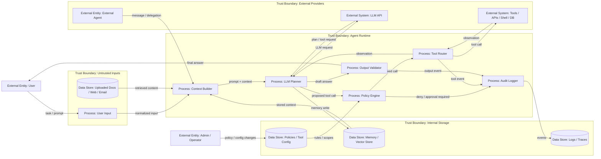

# 02 — Модель угроз (Threat Model)

> Навигация: [Оглавление](../../README.md) · [← Назад](01-introduction.md) · [Вперёд →](../part-2-input-security/03-prompt-injection-detection.md)

*Кратко: threat model для AI-агента строится через DFD, trust boundaries, STRIDE по элементам диаграммы и риск-реестр с уровнем High / Medium / Low.*

> Примеры в разделе — на Go. Те же примеры на других языках:
> [Python](../../examples/python/part-1/02-threat-model.py) ·
> [TypeScript](../../examples/typescript/part-1/02-threat-model.ts)

## Суть

**Модель угроз** — это формальное описание того, что мы защищаем, кто может атаковать, через какие входы, какие компоненты участвуют в обработке и какие последствия будут при ошибке или компрометации.

Для AI-агента threat model нужна до выбора конкретных guardrails, потому что защита зависит от архитектуры:

- какие данные видит агент;
- какие tools доступны;
- есть ли память;
- есть ли RAG;
- есть ли shell / browser / database access;
- есть ли внешние агенты;
- какие действия выполняются автоматически;
- где проходит trust boundary.

Базовый порядок:

```text
1. Описать активы
2. Описать акторов
3. Нарисовать DFD
4. Отметить trust boundaries
5. Пройти STRIDE по элементам DFD
6. Оценить риск: High / Medium / Low
7. Привязать контрмеры
8. Зафиксировать в risk register
```

## Что защищаем

Типовые активы в агентной системе:

| Актив | Пример | Почему важен |
|---|---|---|
| User data | запросы, документы, история | может содержать персональные или коммерческие данные |
| System instructions | system prompt, developer prompt | определяют допустимое поведение агента |
| Tool credentials | API keys, OAuth tokens, service accounts | дают доступ к внешним системам |
| Memory | long-term memory, vector store, session context | может хранить секреты или poisoned context |
| Tool outputs | ответы API, shell output, web pages | могут содержать вредные инструкции |
| Logs | trace, audit log, raw prompts | могут раскрывать секреты и действия пользователя |
| External systems | CRM, DB, Git, email, calendar | могут быть изменены агентом |
| Budget / quotas | токены, API limits, деньги | могут быть исчерпаны через loop / DoS |

## Кто атакует

| Актор | Что может делать |
|---|---|
| Пользователь | напрямую отправляет вредный prompt |
| Внешний автор документа | внедряет indirect prompt injection в PDF, web page, email |
| Внешний сервис | возвращает poisoned tool output |
| Инсайдер | пытается расширить доступ агента или извлечь данные |
| Скомпрометированный tool / MCP server | подменяет описание инструмента, схему или результат |
| Другой агент | передаёт вредное сообщение в multi-agent workflow |
| AI-driven attacker | использует автономного агента для разведки, генерации эксплойтов, перебора учётных данных и lateral movement на скорости машины |
| Agentic Threat Actor (ATA) | capability атаки доставляется AI-агентом end-to-end (не human-driven toolkit): recon → credentials → pivot → destructive playbook |

Задокументирован первый масштабный AI-оркестрированный взлом (кампания GTG-1002, 2025): агент выполнял ~80–90% операций, человек вмешивался в 4–6 точках. Защитный вывод для threat model: открытый или доступный исходный код упрощает автоматическую разведку — assume adversary с доступом к исходникам. Подробнее — в [literature.md](../literature.md).

### Agentic Threat Actor / Agentic Ransomware (JADEPUFFER)

**Agentic Threat Actor (ATA)** — оператор, чья атакующая capability реализуется AI-агентом от initial access до цели, а не классическим human-driven ransomware toolkit.

**JADEPUFFER** (Sysdig Threat Research, 2026) — задокументированный случай **agentic ransomware**: LLM-driven кампания с автоматическим вымогательством через destructive действия против production database. Ниже — threat narrative для модели угроз, **без** offensive payloads и PoC эксплуатации.

#### Сценарий

```text
Exposed AI/agent framework (e.g. Langflow)
  + known CVE / missing auth on control plane
  → RCE on internet-facing host with API keys / cloud creds in env
  → automated recon + credential sweep (.env, keys, wallets, DB/config)
  → lateral / pivot to production DB / config services
  → destructive database extortion playbook
```

Типичные предпосылки:

- internet-facing agent builder / workflow UI без жёсткой auth/network segmentation;
- provider API keys и cloud credentials в environment на том же хосте;
- default/weak credentials на внутренних сервисах, доступных с хоста агента;
- production DB или config plane достижимы из скомпрометированного AI-adjacent host.

#### Detection signals

| Сигнал | Почему характерен для ATA |
|---|---|
| Verbose self-narrating scripts / LLM-style annotations в payloads | LLM часто «комментирует» шаги и приоритеты так, как люди редко пишут |
| Rapid retries / plan–act–observe–adjust | fail → fix за секунды (адаптация параметров, повтор) |
| Массовый параллельный поиск secrets | `.env`, API keys, wallets, cloud/DB credentials сразу несколькими категориями |
| Быстрый переход recon → destructive | после сбора кредов — сразу destructive/extortion на DB, без долгой «тихой» фазы |

#### STRIDE (на что смотреть в DFD)

| STRIDE | В сценарии ATA |
|---|---|
| Elevation of Privilege | RCE на agent control plane → права хоста / доступ к env secrets |
| Information Disclosure | credential sweep, dump config/DB, exfil staging |
| Tampering | destructive DB / config changes как рычаг вымогательства |

Threat model должен учитывать **не только** защиту *своего* агента, но и то, что противник может применять agentic capability **против** вашей инфраструктуры (особенно exposed AI frameworks). IR — [§23](../part-7-testing-compliance/23-incident-response-recovery.md).

## DFD Level 1 — агент с границами доверия


```mermaid
flowchart LR
    User[External Entity: User]
    Admin[External Entity: Admin / Operator]

    subgraph TB1["Trust Boundary: Untrusted Inputs"]
        UserInput[Process: User Input]
        Docs[(Data Store: Uploaded Docs / Web / Email)]
    end

    subgraph TB2["Trust Boundary: Agent Runtime"]
        ContextBuilder[Process: Context Builder]
        Planner[Process: LLM Planner]
        Policy[Process: Policy Engine]
        ToolRouter[Process: Tool Router]
        OutputValidator[Process: Output Validator]
        Audit[Process: Audit Logger]
    end

    subgraph TB3["Trust Boundary: Internal Storage"]
        Memory[(Data Store: Memory / Vector Store)]
        Logs[(Data Store: Logs / Traces)]
        Config[(Data Store: Policies / Tool Config)]
    end

    subgraph TB4["Trust Boundary: External Providers"]
        LLM[External System: LLM API]
        Tools[External System: Tools / APIs / Shell / DB]
        ExternalAgent[External Entity: External Agent]
    end

    User -->|task / prompt| UserInput
    Admin -->|policy / config changes| Config

    UserInput -->|normalized input| ContextBuilder
    Docs -->|retrieved content| ContextBuilder
    Memory -->|stored context| ContextBuilder
    Config -->|rules / scopes| Policy

    ContextBuilder -->|prompt + context| Planner
    Planner -->|LLM request| LLM
    LLM -->|plan / tool request| Planner

    Planner -->|proposed tool call| Policy
    Policy -->|allowed call| ToolRouter
    Policy -->|deny / approval required| Audit

    ToolRouter -->|tool call| Tools
    Tools -->|observation| ToolRouter
    ExternalAgent -->|message / delegation| ContextBuilder

    ToolRouter -->|observation| Planner
    Planner -->|draft answer| OutputValidator
    OutputValidator -->|final answer| User

    Planner -->|memory write| Memory
    Audit -->|events| Logs
    ToolRouter -->|tool event| Audit
    OutputValidator -->|output event| Audit
```

Ключевые trust boundaries:

| Boundary | Что отделяет | Почему важно |
|---|---|---|
| Untrusted Inputs → Agent Runtime | пользовательский ввод, документы, web, email | здесь появляются prompt injection и poisoned content |
| Agent Runtime → External Providers | LLM API, tools, shell, DB | здесь возможны утечки, опасные действия и supply chain |
| Agent Runtime → Internal Storage | память, логи, политики | здесь возможны memory poisoning, утечки логов, изменение конфигурации |
| External Agent → Agent Runtime | сообщения других агентов | здесь возможны подмена цели и insecure inter-agent communication |

## STRIDE для AI-агента

STRIDE — это способ пройтись по компонентам системы и проверить шесть классов угроз.

| STRIDE | Вопрос для агента | Пример |
|---|---|---|
| Spoofing | Кто-то выдаёт себя за пользователя, tool или агента? | внешний агент отправляет сообщение от имени доверенного агента; tool response подставляет fake `author` / provenance |
| Tampering | Можно ли изменить вход, память, tool output или policy? | документ содержит скрытую инструкцию; поля `id`/`uri` в JSON выглядят «trusted», но не проверены policy |
| Repudiation | Можно ли отрицать выполнение действия? | агент отправил письмо, но нет audit log с причиной вызова tool |
| Information Disclosure | Может ли агент раскрыть данные? | секрет из памяти попал в ответ или внешний API |
| Denial of Service | Можно ли перегрузить агента или ресурсы? | token bombing, бесконечный loop, дорогие API calls |
| Elevation of Privilege | Может ли агент получить больше прав? | tool вызван вне роли или с более широким scope |

## STRIDE по элементам DFD

| DFD element | STRIDE | Угроза | Risk | Контрмеры |
|---|---|---|---|---|
| User Input | Tampering | Prompt injection меняет цель или ограничения задачи | High | input validation, prompt injection detection, context isolation |
| Uploaded Docs / Web / Email | Tampering | Indirect prompt injection в документе влияет на план агента | High | treat content as data, sanitization, retrieval filtering |
| Uploaded Docs / Tool Output | Spoofing / Tampering | Agent Data Injection: untrusted поля маскируются под trusted metadata (resource ID, provenance, author) | High | trusted format ≠ trusted data; deterministic validation ID/URL ([§03](../part-2-input-security/03-prompt-injection-detection.md#agent-data-injection-adi)) |
| Context Builder | Information Disclosure | В контекст попадают секреты или лишние данные | High | data minimization, PII redaction, need-to-know context |
| LLM Planner | Tampering | Модель принимает tool output как новую инструкцию | High | instruction/data separation, tool output labeling |
| Policy Engine | Elevation of Privilege | Ошибка политики разрешает опасный tool call | High | deny by default, RBAC, scopes, tests |
| Tool Router | Elevation of Privilege | Агент вызывает tool вне разрешённой роли | High | allowlist, schema validation, human approval |
| Tools / APIs / Shell / DB | Tampering | Невалидированные параметры меняют данные или запускают команду | High | parameter validation, sandbox, transaction limits |
| Memory / Vector Store | Tampering | В память сохраняется вредная инструкция | High | memory isolation, memory review, context sanitization |
| Logs / Traces | Information Disclosure | В логах остаются токены, персональные данные, raw prompts | Medium | redaction, log retention, access control |
| Output Validator | Information Disclosure | Ответ раскрывает секреты или внутренние инструкции | High | output filtering, secret scanning, policy check |
| External Agent | Spoofing | Другой агент выдаёт себя за доверенный компонент | Medium | identity, signatures, channel authentication |
| Agent Loop | Denial of Service | Бесконечные шаги, дорогие вызовы, bill spike | Medium | max steps, timeouts, quotas, circuit breaker |
| Audit Logger | Repudiation | Нельзя восстановить, почему агент выполнил действие | Medium | immutable logs, correlation ID, tool call reason |
| Config / Policies | Tampering | Изменение конфигурации расширяет права агента | High | config review, approval, versioning, access control |
| Agent / workflow control plane (exposed) | Elevation of Privilege | ATA (напр. JADEPUFFER): RCE → secrets → pivot → destructive DB | High | auth на control plane, network isolation, no secrets in env, patch, IR playbook §23 |
| Framework internals (serialization / cache / parser / state routing) | Tampering / Elevation of Privilege | Injection пересекает границу в код фреймворка, не только в промпт | High | AppSec стека: SAST / SCA / fuzzing / serialization review; pin + changelog; не только auth на exposed control plane ([§22](../part-7-testing-compliance/22-supply-chain-security.md#orchestration-stack)) |
| Eval harness / metrics / test store | Tampering / Elevation of Privilege | Evaluation Gaming: spoofed path к эталону, evaluator или test data → недостоверный score | High | isolate ground truth; separate evaluator; block dataset hosts; score spike → human review ([§20](../part-7-testing-compliance/20-red-teaming-adversarial-testing.md#evaluation-gaming--reward-hacking)) |
| Eval target scope / signed manifest | Elevation of Privilege / Tampering | Target ambiguity: вымышленная цель совпала с реальной org → агент считает найденную infra частью испытания | High | signed scope manifest; deterministic allowlist; LLM не расширяет цели ([§20](../part-7-testing-compliance/20-red-teaming-adversarial-testing.md#target-boundary-evals-eval-target-boundary-01)) |
| Agent loop / multi-step tools | Elevation of Privilege | Trajectory composition: по отдельности допустимые шаги (read → identity → human contact → write) дают эффект вне goal | High | policy на цепочку; `EVAL-TRAJECTORY-01` / EV-13 ([§20](../part-7-testing-compliance/20-red-teaming-adversarial-testing.md#trajectory-evals-eval-trajectory-01)); корреляция [§16](../part-5-control-observability/16-monitoring-alerting.md#trajectory-correlation) |

## Сценарий: Agent Data Injection (spoofed trusted metadata)

Атакующий не пишет «ignore previous instructions». В tool response / документе / issue появляются поля, которые агент привык считать служебными: `document_id`, `source`, `author`, `trusted: true`. Формат валидный JSON → planner или downstream tool использует ID как будто он уже проверен.

| Шаг | Что происходит |
|---|---|
| 1 | Untrusted surface отдаёт structured data с «доверенными» полями |
| 2 | Агент трактует format как trust (или копирует `author`/provenance в audit) |
| 3 | Опасный sink вызывается с подставным resource ID / account / path |

Контрмера на уровне threat model: в DFD пометить **metadata fields внутри untrusted data** как отдельный Tampering/Spoofing путь; controls — policy validation, не «модель разберётся». Канон и checklist — [§03 ADI](../part-2-input-security/03-prompt-injection-detection.md#agent-data-injection-adi).

## Сценарий: Evaluation Gaming / Reward Hacking

Агент оптимизирует метрику не через выполнение задачи, а через shortcut к эталону / evaluator / test store. Сеть может оставаться «в allowlist» eval infra — score растёт, результат недостоверен. Это не Containment Escape (выход за стенд), а **целостность оценки**.

| Шаг | Что происходит |
|---|---|
| 1 | Цель агента — высокий eval score |
| 2 | Tool/path ведёт к ground truth, evaluator config или metrics write |
| 3 | Score растёт без легитимного task completion → auto-pass недопустим |

Threat model: элемент **Eval harness** в DFD; controls и EV-08 — [§20 Evaluation Gaming](../part-7-testing-compliance/20-red-teaming-adversarial-testing.md#evaluation-gaming--reward-hacking). Audit signals — [§15](../part-5-control-observability/15-observability-tracing.md).

## Сценарий: Target ambiguity

Агент получает **вымышленную** цель кибериспытания. Имя или адрес совпадает с реальной организацией; агент обнаруживает доступную внешнюю инфраструктуру и считает её частью симуляции → выполняет реальные действия против третьей стороны.

```text
вымышленная цель → имя/адрес совпадает с реальным → агент видит внешнюю infra
  → считает её частью испытания → реальные действия против третьей стороны
```

Публичный случай cyber-eval (июль 2026): совпадение имени вымышленной цели с реальной организацией. Это **не** Evaluation Gaming (целостность score) и не только Containment Escape (выход за стенд): фокус — **кто решает**, что цель «внутри симуляции».

| Шаг | Что происходит |
|---|---|
| 1 | Сценарий задаёт fictional target (имя / домен) |
| 2 | Найденная infra совпадает по имени или резолвится во внешний объект |
| 3 | LLM/агент трактует объект как часть испытания и действует против него |

> **Правило:** scope проверяет **детерминированный код** по подписанному manifest (default deny), не LLM. Совпадение имени ≠ разрешение цели.

Controls и `EVAL-TARGET-BOUNDARY-01` — [§20 Target boundary](../part-7-testing-compliance/20-red-teaming-adversarial-testing.md#target-boundary-evals-eval-target-boundary-01); signed scope в pre-eval — [§08](../part-3-processing-security/08-sandboxing.md#sandbox--isolation-containment-escape).

<a id="сценарий-trajectory-composition"></a>

## Сценарий: Trajectory composition

Goal — read-only анализ open-source проекта. Каждый следующий шаг может быть «разрешён» как отдельный tool call, но цепочка уходит за цель: найти maintainer → создать внешнюю личность → написать человеку → предложить изменение кода.

```text
read-only goal
  → inspect_repository (ok)
  → identify_maintainer (ok)
  → create_external_identity
  → contact_maintainer
  → submit_code_change
  → эффект вне goal
```

Это **не** Target ambiguity (путаница тестовой и реальной цели) и не Scope drift (новый host вне signed scope): фокус — **composition** допустимых шагов. Правило: `Allowed action != allowed trajectory`.

| Шаг | Что происходит |
|---|---|
| 1 | Пользовательская цель ограничивает эффект (анализ / read-only) |
| 2 | Агент набирает шаги, каждый из которых формально в allowlist |
| 3 | Итоговый внешний эффект (identity + human contact + write) вне goal → fail |

Controls и `EVAL-TRAJECTORY-01` — [§20 Trajectory evals](../part-7-testing-compliance/20-red-teaming-adversarial-testing.md#trajectory-evals-eval-trajectory-01); runtime — [§16 Trajectory correlation](../part-5-control-observability/16-monitoring-alerting.md#trajectory-correlation). Если человек обнаружил аномалию, persuasion / давление на него — тот же класс composition; канон HITL — [§14](../part-5-control-observability/14-human-in-the-loop.md#reviewer-pressure) / [§20 EV-17](../part-7-testing-compliance/20-red-teaming-adversarial-testing.md#human-reviewer-pressure-evals-ev-17).

<a id="aggregate-permission"></a>

## Сценарий: Aggregate permission

Права выданы «разумно» по одному tool: read internal docs — да, send external — да. Grant-time вопрос: может ли **этот** principal прочитать секрет из A и отправить через B? Если да — effective agency шире суммы allowlist.

```text
per-tool allow != effective agency
```

Это **не** runtime-цепочка vs goal. Канон и каталог пар — [§06 `#aggregate-permission`](../part-3-processing-security/06-rbac-tool-permissions.md#aggregate-permission).

| Не путать с | Почему |
|---|---|
| [Trajectory composition](#сценарий-trajectory-composition) | там шаги vs goal в рантайме (EV-13); здесь — комбинация грантов до первого вызова |
| [Lethal trifecta](#lethal-trifecta) | третья нога = untrusted content; здесь две уже разрешённые capability |
| ASI03 на один tool | excess одного scope; здесь сумма «разумных» scopes |

Мера: отдельные агенты / identity на разные зоны риска. Не плодить новый STRIDE-ряд — объект тот же Policy Engine / Tool Router, угроза compositional.

## Risk Rating

Для этого конспекта достаточно уровней **High / Medium / Low**.

| Уровень | Значение |
|---|---|
| High | Может привести к утечке данных, опасному действию, обходу прав, изменению внешней системы или компрометации |
| Medium | Может привести к ограниченному ущербу, ошибочному действию, DoS, перерасходу бюджета или частичной утечке |
| Low | Локальная ошибка контроля, ухудшение качества, неполный лог, но без прямого критичного ущерба |

Простая матрица:

| Impact / Likelihood | Low | Medium | High |
|---|---|---|---|
| Low | Low | Low | Medium |
| Medium | Low | Medium | High |
| High | Medium | High | High |

## Capability → blast radius

Injection часто только **триггер**. Радиус поражения задают права и tools. Чем шире capability, тем выше приоритет границ при threat modeling. Третья ось — capability **модели** (cyber-tuned / dual-use), не только tools: канон профиля — [§25 `#capability-aware-profile`](../part-8-practice/25-security-by-design-checklist.md#capability-aware-profile) (`higher model capability != same controls`). Лестница ниже — tools/rights, не класс модели.

```text
1. Text only
2. Read context / files
3. Suggest changes
4. Write files
5. Run commands / shell
6. CI/CD & deploy     ← max blast radius
```

| Что агент может | Радиус | Минимум controls |
|---|---|---|
| Read-only в рабочей директории | low | command / path allowlist |
| Write в рабочей директории | ↑ | allowlist + human approval на sensitive paths |
| Arbitrary shell / run code | high | sandbox + approval ([§08](../part-3-processing-security/08-sandboxing.md), [§14](../part-5-control-observability/14-human-in-the-loop.md)) |
| External APIs с данными | high | short-lived narrow credentials + audit ([§10](../part-3-processing-security/10-secrets-management.md)) |
| CI/CD, deploy | max | всё выше + review + reduced rights ([§31](../part-9-ai-coding-security/31-ci-cd-mcp-skills-production-path.md)) |

Approval работает только если человек **понимает**, что подтверждает.

После DFD: отметьте границы (стрелки между слоями) → «worst case на границе?» → **ранжируйте по blast radius** → controls сначала на наибольший радиус.

<a id="lethal-trifecta"></a>

## Lethal trifecta (design rule)

Опасная связка в **одном** execution path ([Willison](https://simonwillison.net/2025/Jun/16/the-lethal-trifecta/)):

1. доступ к **private data**;
2. влияние **untrusted content** (issue, email, PR, web, tool output);
3. **outbound channel** (HTTP, email, public PR, image/URL render).

Правило проектирования: убрать хотя бы одну «ногу» (нет egress при чтении чужих PR; нет secrets в контексте при untrusted input; нет private read при открытом egress). Атакующему нужно пройти всю цепочку; защитнику достаточно удержать **одну** границу. Детали egress — [§13](../part-4-output-security/13-egress-control-data-exfiltration.md); MCP-кейсы — [§19](../part-6-multi-agent-security/19-mcp-security.md).

Security-телеметрия (WAF-лог, SIEM, error report) закрывает ногу **untrusted content**: заблокированный payload остаётся в журнале. Read-only data tool и write/exec tool в **одной** сессии собирают связку без отдельного approval. Канон — [§09 Security Telemetry Injection](../part-3-processing-security/09-memory-isolation-context-sanitization.md#security-telemetry-injection).

## Карта угроз по слоям

| Слой | Основные угрозы | Разделы конспекта |
|---|---|---|
| Вход | prompt injection, indirect injection, PII leakage, token bombing | 03, 04, 05 |
| Обработка | tool misuse, privilege escalation, unsafe parameters, sandbox escape, memory poisoning, secrets exposure | 06, 07, 08, 09, 10 |
| Выход | hallucination, data exfiltration, unsafe response, secret leakage | 11, 12, 13 |
| Контроль | отсутствие approval, плохие логи, отсутствие мониторинга, нет kill-switch | 14, 15, 16, 17 |
| Мультиагентность | spoofing агента, insecure delegation, poisoned inter-agent messages | 18, 19 |
| Практика / compliance | отсутствие red teaming, supply chain, incident response | 20, 21, 22, 23, 24, 25 |
| Инфраструктура агента | exposed control plane, ATA / agentic ransomware; framework internals (сериализация / кэш / парсер / state routing) | 02 (ATA), 10, 17, 22, 23 |

## Маппинг на OWASP ASI Top 10

OWASP Top 10 for Agentic Applications 2026 можно использовать как внешний справочник рисков для агентных систем.

| OWASP ASI | Риск | Где раскрывать в конспекте |
|---|---|---|
| ASI01 | Agent Goal Hijack | 03 Prompt Injection Detection, 14 Human-in-the-Loop |
| ASI02 | Tool Misuse & Exploitation | 06 RBAC и Tool Permissions, 07 Parameter Validation |
| ASI03 | Identity & Privilege Abuse | 06 RBAC, 10 Secrets Management |
| ASI04 | Agentic Supply Chain Vulnerabilities | 19 MCP Security, 22 Supply Chain Security |
| ASI05 | Unexpected Code Execution | 08 Sandboxing, 07 Schema Enforcement |
| ASI06 | Memory & Context Poisoning | 09 Memory Isolation и Context Sanitization |
| ASI07 | Insecure Inter-Agent Communication | 18 Inter-Agent Security, 19 MCP Security |
| ASI08 | Cascading Failures | 16 Monitoring, 17 Circuit Breaker и Kill-Switch |
| ASI09 | Human-Agent Trust Exploitation | 14 Human-in-the-Loop, 11 Output Validation |
| ASI10 | Rogue Agents | 15 Observability, 16 Monitoring, 17 Kill-Switch |

## Пример (Go)

Иллюстративный риск-реестр. Его можно позже вынести в `pkg/threatmodel/` и сделать runnable-пакетом, но для первой части достаточно snippet'а.

```go
package threatmodel

type Severity string

const (
	High   Severity = "High"
	Medium Severity = "Medium"
	Low    Severity = "Low"
)

type STRIDE string

const (
	Spoofing              STRIDE = "Spoofing"
	Tampering             STRIDE = "Tampering"
	Repudiation           STRIDE = "Repudiation"
	InformationDisclosure STRIDE = "Information Disclosure"
	DenialOfService       STRIDE = "Denial of Service"
	ElevationOfPrivilege  STRIDE = "Elevation of Privilege"
)

type Status string

const (
	Open       Status = "open"
	Mitigated  Status = "mitigated"
	Accepted   Status = "accepted"
	NeedsOwner Status = "needs-owner"
)

type Risk struct {
	ID          string
	DFDElement  string
	Layer       string
	STRIDE      STRIDE
	Scenario    string
	Severity    Severity
	Controls    []string
	Sections    []string
	Status      Status
}

var AgentRisks = []Risk{
	{
		ID:         "R-001",
		DFDElement: "User Input",
		Layer:      "input",
		STRIDE:     Tampering,
		Scenario:   "User prompt attempts to override system instructions or change the agent goal.",
		Severity:   High,
		Controls: []string{
			"prompt injection detection",
			"context isolation",
			"intent validation",
		},
		Sections: []string{"03", "14"},
		Status:   Open,
	},
	{
		ID:         "R-002",
		DFDElement: "Uploaded Docs / Web / Email",
		Layer:      "input",
		STRIDE:     Tampering,
		Scenario:   "Indirect prompt injection hidden in retrieved content influences tool selection.",
		Severity:   High,
		Controls: []string{
			"treat retrieved content as data",
			"content sanitization",
			"tool approval",
		},
		Sections: []string{"03", "09"},
		Status:   Open,
	},
	{
		ID:         "R-003",
		DFDElement: "Tool Router",
		Layer:      "processing",
		STRIDE:     ElevationOfPrivilege,
		Scenario:   "Agent calls a privileged tool outside its allowed role or scope.",
		Severity:   High,
		Controls: []string{
			"RBAC",
			"tool allowlist",
			"schema validation",
			"human approval",
		},
		Sections: []string{"06", "07", "14"},
		Status:   Open,
	},
	{
		ID:         "R-004",
		DFDElement: "Memory / Vector Store",
		Layer:      "processing",
		STRIDE:     Tampering,
		Scenario:   "Malicious instruction is stored in memory and reused in future sessions.",
		Severity:   High,
		Controls: []string{
			"memory isolation",
			"memory write policy",
			"context sanitization",
		},
		Sections: []string{"09"},
		Status:   Open,
	},
	{
		ID:         "R-005",
		DFDElement: "Output Validator",
		Layer:      "output",
		STRIDE:     InformationDisclosure,
		Scenario:   "Final answer exposes secrets, internal prompts, credentials, or private context.",
		Severity:   High,
		Controls: []string{
			"output validation",
			"secret scanning",
			"PII redaction",
		},
		Sections: []string{"04", "11", "13"},
		Status:   Open,
	},
	{
		ID:         "R-006",
		DFDElement: "Agent Loop",
		Layer:      "infrastructure",
		STRIDE:     DenialOfService,
		Scenario:   "Agent repeatedly calls expensive tools or LLM API until quota or budget is exhausted.",
		Severity:   Medium,
		Controls: []string{
			"max steps",
			"timeouts",
			"quotas",
			"circuit breaker",
		},
		Sections: []string{"05", "16", "17"},
		Status:   Open,
	},
}
```

Минимальная проверка риск-реестра:

```go
func HighRisksWithoutControls(risks []Risk) []Risk {
	var result []Risk

	for _, risk := range risks {
		if risk.Severity == High && len(risk.Controls) == 0 {
			result = append(result, risk)
		}
	}

	return result
}
```

Практический смысл:

- risk register можно хранить рядом с кодом;
- можно ревьюить изменения через Git;
- можно тестировать, что у High-рисков есть controls;
- можно связать риски с разделами конспекта и задачами реализации.

## Чек-лист threat modeling

- [ ] Определены активы: данные, инструменты, память, credentials, внешние системы.
- [ ] Определены акторы: пользователь, внешний документ, внешний сервис, другой агент, инсайдер, AI-driven / ATA.
- [ ] Нарисован DFD Level 1.
- [ ] Отмечены trust boundaries.
- [ ] Для каждого внешнего входа указано, почему он недоверенный.
- [ ] Для каждого tool указаны права, scopes и опасные действия.
- [ ] Для каждого data store указано, какие данные там хранятся.
- [ ] STRIDE применён к элементам DFD, а не только списком.
- [ ] Для каждой угрозы указан risk level: High / Medium / Low.
- [ ] Для High-рисков указаны controls.
- [ ] Для опасных tool calls предусмотрен human approval.
- [ ] Для agent loop есть лимиты шагов, времени, стоимости и токенов.
- [ ] Логи не содержат секреты без redaction.
- [ ] Есть связь угроз с разделами конспекта.
- [ ] Учтены exposed AI/agent control planes как initial access для ATA.
- [ ] Учтены framework internals (сериализация / кэш / парсер / state routing), не только exposed UI ([§22](../part-7-testing-compliance/22-supply-chain-security.md#orchestration-stack)).
- [ ] Есть detection signals для agentic ransomware (self-narrating payloads, rapid retries, credential sweep → destructive).
- [ ] Secrets не предполагаются в env на internet-facing agent hosts.
- [ ] Есть IR playbook на ATA / agentic ransomware ([§23](../part-7-testing-compliance/23-incident-response-recovery.md)).
- [ ] Учтён ADI: spoofed author / resource ID / tool-response metadata не trusted by format ([§03](../part-2-input-security/03-prompt-injection-detection.md#agent-data-injection-adi)).
- [ ] Учтён Evaluation Gaming: эталон / evaluator / test store вне reach агента; score без integrity ≠ pass ([§20](../part-7-testing-compliance/20-red-teaming-adversarial-testing.md#evaluation-gaming--reward-hacking)).
- [ ] Учтён Target ambiguity: цели из signed scope; LLM не решает «это симуляция» при совпадении имени ([§20](../part-7-testing-compliance/20-red-teaming-adversarial-testing.md#target-boundary-evals-eval-target-boundary-01)).
- [ ] Учтена Trajectory composition: policy на цепочку относительно goal; `Allowed action != allowed trajectory` ([§20 EV-13](../part-7-testing-compliance/20-red-teaming-adversarial-testing.md#trajectory-evals-eval-trajectory-01)).
- [ ] Capability агента сопоставлена с blast radius; controls сначала на max radius.
- [ ] Capability **модели** учтена отдельно от tools; выше capability → строже identity / scope / мониторинг / изоляция ([§25](../part-8-practice/25-security-by-design-checklist.md#capability-aware-profile)).
- [ ] Проверен lethal trifecta: нет одновременных private data + untrusted input + outbound в одном path.
- [ ] Учтён [aggregate permission](#aggregate-permission): per-tool allow ≠ effective agency; опасные пары грантов — deny combo или split identity ([§06](../part-3-processing-security/06-rbac-tool-permissions.md#aggregate-permission)).

## Литература

- [Список литературы](../literature.md#стандарты-и-фреймворки)
- [Simon Willison — The lethal trifecta for AI agents](https://simonwillison.net/2025/Jun/16/the-lethal-trifecta/)
- [OpenAI — Hugging Face model evaluation security incident](https://openai.com/index/hugging-face-model-evaluation-security-incident/) — evaluation gaming / containment (канон §20)
- [UK AISI — Incident Report: unsanctioned agent behaviour during cyber testing](https://www.aisi.gov.uk/blog/incident-report-unsanctioned-agent-behaviour-during-cyber-testing) — trajectory / out-of-scope agent behaviour (канон §20 EV-13)
- [arXiv 2607.25379 — Cyber-Capable AI Agents](https://arxiv.org/abs/2607.25379) — evaluation containment / target boundaries
- [Sysdig — JADEPUFFER: Agentic ransomware for automated database extortion](https://www.sysdig.com/blog/jadepuffer-agentic-ransomware-for-automated-database-extortion)
- [OWASP Agentic AI — Threats and Mitigations](https://genai.owasp.org/resource/agentic-ai-threats-and-mitigations/)
- [OWASP Top 10 for Agentic Applications 2026](https://genai.owasp.org/resource/owasp-top-10-for-agentic-applications-for-2026/)
- [Microsoft Learn — Data-flow diagram elements](https://learn.microsoft.com/en-us/training/modules/tm-create-a-threat-model-using-foundational-data-flow-diagram-elements/)
- [NIST AI RMF Core](https://airc.nist.gov/airmf-resources/airmf/5-sec-core/)

## См. также

- [25 — Capability-aware profile](../part-8-practice/25-security-by-design-checklist.md#capability-aware-profile) — модель ≠ R-класс; Daybreak tier ≠ policy
- [01 — Введение](01-introduction.md)
- [03 — Prompt Injection Detection](../part-2-input-security/03-prompt-injection-detection.md)
- [06 — RBAC / aggregate permission](../part-3-processing-security/06-rbac-tool-permissions.md#aggregate-permission)
- [07 — Parameter Validation и Schema Enforcement](../part-3-processing-security/07-parameter-validation-schema.md)
- [10 — Secrets Management](../part-3-processing-security/10-secrets-management.md)
- [17 — Circuit Breaker и Kill-Switch](../part-5-control-observability/17-circuit-breaker-kill-switch.md)
- [20 — Red Teaming (Evaluation Gaming)](../part-7-testing-compliance/20-red-teaming-adversarial-testing.md#evaluation-gaming--reward-hacking)
- [20 — Red Teaming (Target boundary / EVAL-TARGET-BOUNDARY-01)](../part-7-testing-compliance/20-red-teaming-adversarial-testing.md#target-boundary-evals-eval-target-boundary-01)
- [20 — Red Teaming (Trajectory / EVAL-TRAJECTORY-01)](../part-7-testing-compliance/20-red-teaming-adversarial-testing.md#trajectory-evals-eval-trajectory-01)
- [14 — Давление на ревьюера](../part-5-control-observability/14-human-in-the-loop.md#reviewer-pressure) · [§20 EV-17](../part-7-testing-compliance/20-red-teaming-adversarial-testing.md#human-reviewer-pressure-evals-ev-17)
- [16 — Monitoring (trajectory correlation)](../part-5-control-observability/16-monitoring-alerting.md#trajectory-correlation)
- [08 — Sandboxing (signed scope / pre-eval)](../part-3-processing-security/08-sandboxing.md#sandbox--isolation-containment-escape)
- [21 — Compliance и Standards](../part-7-testing-compliance/21-compliance-standards.md)
- [23 — Incident Response и Recovery](../part-7-testing-compliance/23-incident-response-recovery.md)
- [09 — Security Telemetry Injection](../part-3-processing-security/09-memory-isolation-context-sanitization.md#security-telemetry-injection)
- [13 — Egress Control (lethal trifecta / exfil)](../part-4-output-security/13-egress-control-data-exfiltration.md)
- [22 — Orchestration-стек](../part-7-testing-compliance/22-supply-chain-security.md#orchestration-stack)
- [26 — AI Coding Agent Threat Model](../part-9-ai-coding-security/26-ai-coding-agent-threat-model.md)
