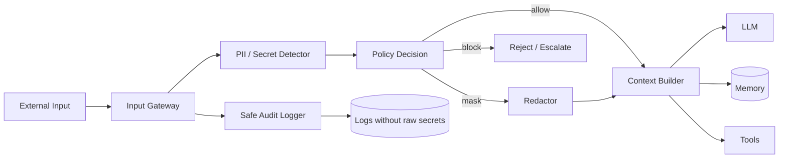

# 04 — PII Redaction и Content Filtering

> Навигация: [Оглавление](../../README.md) · [← Назад](03-prompt-injection-detection.md) · [Вперёд →](05-rate-limiting-quotas-token-bombing.md)

*Кратко: входной слой должен находить персональные данные, секреты и вредный контент до передачи в LLM, tools, память, RAG и логи.*

> Примеры в разделе — на Go. Те же примеры на других языках:
> [Python](../../examples/python/part-2/04-pii-redaction-content-filtering.py) ·
> [TypeScript](../../examples/typescript/part-2/04-pii-redaction-content-filtering.ts)

## Суть

**PII Redaction** — это обнаружение и маскирование персональных данных и секретов.

**Content Filtering** — это проверка входного текста на запрещённый, опасный или нежелательный контент.

Для AI-агента это нужно не только ради ответа пользователю. Входные данные могут попасть дальше:

- в prompt;
- в память агента;
- в RAG index;
- в tool arguments;
- во внешний API;
- в логи;
- в trace / observability;
- в датасет для последующего анализа.

Если не фильтровать вход, агент может случайно распространить то, что вообще не должно было покинуть входной gateway.

## Что защищаем

| Тип данных | Примеры | Риск |
|---|---|---|
| PII | ФИО, телефон, email, адрес, паспорт | Нарушение приватности |
| Secrets | API key, token, password, private key | Компрометация систем |
| Financial data | карты, счета, платежи | Финансовый риск |
| Health data | диагнозы, анализы, медкарты | Высокочувствительные данные |
| Business confidential | договоры, цены, коммерческие условия | Утечка бизнеса |
| Unsafe content | вредные инструкции, токсичный контент | Нарушение policy |

## DFD: redaction до модели и логов



Главное правило:

```text
Сырые sensitive data не должны автоматически попадать в LLM, memory, tools и logs.
```

## Redaction vs Masking vs Blocking

| Подход | Что делает | Когда использовать |
|---|---|---|
| Redact | Удаляет значение: `[REDACTED]` | секреты, ключи, пароли |
| Mask | Частично скрывает: `+7 *** ***-12-34` | телефоны, карты, email |
| Replace | Заменяет типом: `[EMAIL]`, `[PHONE]` | аналитика без исходных значений |
| Hash | Сохраняет сопоставимость без раскрытия | дедупликация, корреляция |
| Encrypt | Можно восстановить при наличии ключа | контролируемые внутренние процессы |
| Block | Полностью отклоняет ввод | критичные секреты или запрещённый контент |

## Где ставить фильтрацию

Минимум четыре точки:

```text
1. Pre-LLM: до отправки в модель
2. Pre-tool: до передачи аргументов в tool
3. Pre-memory: до сохранения в память
4. Pre-log: до записи в логи / trace
```

Важно: фильтрация только перед LLM недостаточна. Агент может передать исходный текст в tool или сохранить его в memory.

## Подходы и контрмеры

### 1. Secret detection отдельно от PII

PII и secrets похожи по механике, но разные по риску.

- PII часто можно маскировать.
- Secrets лучше блокировать или полностью редактировать.

Пример:

```text
email=user@example.com      → [EMAIL]
sk-... / ghp_... / token=... → [SECRET_REDACTED]
```

### 2. Данные в логи — только после sanitization

Плохо:

```text
log.Info("agent input", "prompt", rawPrompt)
```

Лучше:

```text
log.Info("agent input", "prompt", sanitizedPrompt, "redactions", redactionCount)
```

### 3. Не ломать полезность данных

Если агенту реально нужен email для отправки письма, нельзя просто удалить email на входе. Нужно передать его в ограниченный tool с проверкой прав.

Правильная логика:

```text
LLM видит [EMAIL].
Email tool получает реальный email только после policy check.
```

### 4. Content filtering отделить от redaction

Redaction отвечает на вопрос:

```text
Есть ли sensitive data?
```

Content filtering отвечает на вопрос:

```text
Разрешён ли этот тип контента или задачи?
```

Это разные решения.

## Пример (Go): PII и secret detector

```go
package inputsecurity

import (
	"regexp"
)

type EntityType string

const (
	EntityEmail  EntityType = "EMAIL"
	EntityPhone  EntityType = "PHONE"
	EntitySecret EntityType = "SECRET"
)

type Entity struct {
	Type  EntityType
	Start int
	End   int
	Value string
}

type Recognizer struct {
	Type    EntityType
	Pattern *regexp.Regexp
}

var recognizers = []Recognizer{
	{
		Type:    EntityEmail,
		Pattern: regexp.MustCompile(`[a-zA-Z0-9._%+\-]+@[a-zA-Z0-9.\-]+\.[a-zA-Z]{2,}`),
	},
	{
		Type:    EntityPhone,
		Pattern: regexp.MustCompile(`(?i)(\+?\d[\d\s\-()]{8,}\d)`),
	},
	{
		Type:    EntitySecret,
		Pattern: regexp.MustCompile(`(?i)(api[_-]?key|token|password|secret)\s*[:=]\s*[^\s]+`),
	},
}

func DetectEntities(input string) []Entity {
	var entities []Entity

	for _, r := range recognizers {
		matches := r.Pattern.FindAllStringIndex(input, -1)
		for _, m := range matches {
			entities = append(entities, Entity{
				Type:  r.Type,
				Start: m[0],
				End:   m[1],
				Value: input[m[0]:m[1]],
			})
		}
	}

	return entities
}
```

## Пример (Go): redaction

```go
package inputsecurity

import "strings"

func Redact(input string, entities []Entity) string {
	if len(entities) == 0 {
		return input
	}

	// Простой вариант для конспекта: заменяем найденные значения.
	// В production лучше учитывать пересечения span'ов и сортировку по offset.
	output := input
	for _, entity := range entities {
		replacement := "[" + string(entity.Type) + "]"
		if entity.Type == EntitySecret {
			replacement = "[SECRET_REDACTED]"
		}
		output = strings.ReplaceAll(output, entity.Value, replacement)
	}

	return output
}
```

## Пример (Go): policy decision

```go
package inputsecurity

type InputAction string

const (
	ActionAllow InputAction = "allow"
	ActionMask  InputAction = "mask"
	ActionBlock InputAction = "block"
)

type RedactionDecision struct {
	Action   InputAction
	Reason   string
	Entities []Entity
}

func DecideRedaction(input string) RedactionDecision {
	entities := DetectEntities(input)

	for _, entity := range entities {
		if entity.Type == EntitySecret {
			return RedactionDecision{
				Action:   ActionBlock,
				Reason:   "secret detected in input",
				Entities: entities,
			}
		}
	}

	if len(entities) > 0 {
		return RedactionDecision{
			Action:   ActionMask,
			Reason:   "PII detected; input should be masked before LLM/logs",
			Entities: entities,
		}
	}

	return RedactionDecision{Action: ActionAllow}
}
```

## Пример (Go): общий input pipeline

```go
package inputsecurity

import "fmt"

type SanitizedInput struct {
	OriginalAllowed bool
	Text            string
	Redacted        bool
	Reason          string
}

func SanitizeForLLM(input string) (SanitizedInput, error) {
	injection := DetectPromptInjection(input)
	if !injection.Allowed {
		return SanitizedInput{}, fmt.Errorf("prompt injection blocked: %s", injection.Reason)
	}

	decision := DecideRedaction(input)

	switch decision.Action {
	case ActionBlock:
		return SanitizedInput{}, fmt.Errorf("input blocked: %s", decision.Reason)
	case ActionMask:
		return SanitizedInput{
			OriginalAllowed: false,
			Text:            Redact(input, decision.Entities),
			Redacted:        true,
			Reason:          decision.Reason,
		}, nil
	default:
		return SanitizedInput{
			OriginalAllowed: true,
			Text:            input,
		}, nil
	}
}
```

## Практические ошибки

| Ошибка | Почему плохо |
|---|---|
| Логировать raw prompt | В логи попадают секреты и PII |
| Маскировать только перед LLM | Tool и memory всё равно могут получить сырые данные |
| Считать email всегда безопасным | Email может быть PII и идентификатором пользователя |
| Удалять всё подряд | Агент теряет полезность |
| Не хранить metadata redaction | Потом невозможно понять, что было изменено |
| Доверять только regex | Regex не ловит все формы PII и secrets |

## Чек-лист

- [ ] Есть список sensitive data для проекта.
- [ ] PII и secrets обрабатываются разными правилами.
- [ ] Secrets блокируются или полностью редактируются.
- [ ] PII маскируется до LLM, memory и logs.
- [ ] Tool arguments проходят отдельную проверку.
- [ ] Raw input не пишется в audit logs.
- [ ] Есть redaction metadata: сколько и какие типы сущностей найдены.
- [ ] Для опасного контента есть block / approval сценарий.
- [ ] Пользователь получает понятное сообщение при блокировке.

## Литература

- [Список литературы](../literature.md#инструменты)
- OWASP LLM02:2025 Sensitive Information Disclosure — https://genai.owasp.org/llmrisk/llm02-insecure-output-handling/
- Microsoft Presidio — https://microsoft.github.io/presidio/
- NIST Privacy Framework — https://www.nist.gov/privacy-framework
- OpenAI Moderation — https://developers.openai.com/api/docs/guides/moderation

## См. также

- [03 — Prompt Injection Detection](03-prompt-injection-detection.md)
- [10 — Secrets Management](../part-3-processing-security/10-secrets-management.md)
- [13 — Egress Control и Data Exfiltration Prevention](../part-4-output-security/13-egress-control-data-exfiltration.md)
- [15 — Observability и Tracing](../part-5-control-observability/15-observability-tracing.md)
