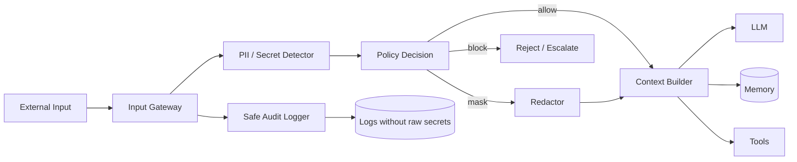

# 04 — PII Redaction и Content Filtering

> Навигация: [Оглавление](../../README.md) · [← Назад](03-prompt-injection-detection.md) · [Вперёд →](05-rate-limiting-quotas-token-bombing.md)

*Кратко: входной слой должен находить персональные данные, секреты и вредный контент до передачи в LLM, tools, память, RAG и логи.*

> Примеры в разделе — на Go. Те же примеры на других языках:
> [Python](../../examples/python/part-2/04-pii-redaction-content-filtering.py) ·
> [TypeScript](../../examples/typescript/part-2/04-pii-redaction-content-filtering.ts)

## Суть

**PII Redaction** — это обнаружение и маскирование персональных данных и секретов.

**Content Filtering** — это проверка входного текста на запрещённый, опасный или нежелательный контент.

Для AI-агента это нужно не только ради ответа пользователю. Входные данные могут попасть дальше:

- в prompt;
- в память агента;
- в RAG index;
- в tool arguments;
- во внешний API;
- в логи;
- в trace / observability;
- в датасет для последующего анализа.

Если не фильтровать вход, агент может случайно распространить то, что вообще не должно было покинуть входной gateway.

## Что защищаем

| Тип данных | Примеры | Риск |
|---|---|---|
| PII | ФИО, телефон, email, адрес, паспорт | Нарушение приватности |
| Secrets | API key, token, password, private key | Компрометация систем |
| Financial data | карты, счета, платежи | Финансовый риск |
| Health data | диагнозы, анализы, медкарты | Высокочувствительные данные |
| Business confidential | договоры, цены, коммерческие условия | Утечка бизнеса |
| Unsafe content | вредные инструкции, токсичный контент | Нарушение policy |

## DFD: redaction до модели и логов


```mermaid
flowchart LR
    Input[External Input] --> Gateway[Input Gateway]
    Gateway --> Detector[PII / Secret Detector]
    Detector --> Decision[Policy Decision]

    Decision -->|mask| Redactor[Redactor]
    Decision -->|block| Reject[Reject / Escalate]
    Decision -->|allow| Context[Context Builder]

    Redactor --> Context
    Context --> LLM[LLM]
    Context --> Memory[(Memory)]
    Context --> Tools[Tools]

    Gateway --> SafeLog[Safe Audit Logger]
    SafeLog --> Logs[(Logs without raw secrets)]
```

Главное правило:

```text
Сырые sensitive data не должны автоматически попадать в LLM, memory, tools и logs.
```

## Redaction vs Masking vs Blocking

| Подход | Что делает | Когда использовать |
|---|---|---|
| Redact | Удаляет значение: `[REDACTED]` | секреты, ключи, пароли |
| Mask | Частично скрывает: `+7 *** ***-12-34` | телефоны, карты, email |
| Replace | Заменяет типом: `[EMAIL]`, `[PHONE]` | аналитика без исходных значений |
| Hash | Сохраняет сопоставимость без раскрытия | дедупликация, корреляция |
| Encrypt | Можно восстановить при наличии ключа | контролируемые внутренние процессы |
| Block | Полностью отклоняет ввод | критичные секреты или запрещённый контент |

Таблица выше — **тактики** замены символов / отклонения. Ниже — **политика sanitization engine**: какой режим выбрать и когда обращать псевдонимы. Не сливать в один enum.

<a id="sanitization-engine"></a>

## Sanitization engine (4 режима)

| Режим | Смысл | Типичный выбор |
|---|---|---|
| **Removal** | вырезать значение | секреты (D4), запрещённые поля |
| **Masking** | частично скрыть / тип-токен | телефоны, карты для UI/логов |
| **Pseudonymization** | стабильный плейсхолдер (`[EMAIL_a3f2]`) | correlation внутри сессии/tenant |
| **Generalization** | огрубить (город вместо адреса, год вместо DOB) | аналитика / external при минимизации |

Правило выбора:

```text
Secrets (D4) → removal / block.
External inference → irreversible transform (нет mapping наружу).
Internal + нужен restore для privileged tool → reversible pseudonym;
mapping token↔value только внутри периметра.
```

Обратимость:

```text
Reversible: mapping внутри периметра; депсевдонимизация после ответа / перед privileged tool.
Irreversible: внешняя модель, экспорт, секреты — mapping не создаём или уничтожаем сразу.
```

**Quasi-identifiers:** комбинации косвенных признаков (ZIP + DOB + пол и т.п.) могут реидентифицировать субъект. Маскировать / обобщать **наборы** полей, не только прямые идентификаторы (email, паспорт). Опора: [NIST SP 800-188](../literature.md#стандарты-и-фреймворки).

**LLM не DLP:**

```text
Нельзя: «попроси LLM вычистить PII» как единственный контроль.
Нужно: детерминированные проверки + NER / secret scanner;
LLM-judge только на спорном; решение — policy layer.
```

Mapping депсевдонимизации **не** писать в логи / traces — [§15](../part-5-control-observability/15-observability-tracing.md#no-pseudonym-mapping-in-logs).

### Go snippet: SanitizeMode

```go
type SanitizeMode string

const (
	ModeRemoval          SanitizeMode = "removal"
	ModeMasking          SanitizeMode = "masking"
	ModePseudonymization SanitizeMode = "pseudonymization"
	ModeGeneralization   SanitizeMode = "generalization"
)

// MappingStore — reversible pseudonym token↔value; не логировать содержимое store.
type MappingStore interface {
	Put(token, value string)
	Get(token string) (string, bool)
}

func StablePseudonym(kind, value, tenantSecret string) string {
	sum := sha256.Sum256([]byte(tenantSecret + "|" + kind + "|" + value))
	return fmt.Sprintf("[%s_%x]", kind, sum[:3]) // короткий стабильный хвост
}

func ApplySanitize(mode SanitizeMode, kind, value string, store MappingStore, tenantSecret string) string {
	switch mode {
	case ModeRemoval:
		return ""
	case ModeMasking:
		if len(value) <= 4 {
			return "****"
		}
		return value[:2] + "***" + value[len(value)-2:]
	case ModePseudonymization:
		token := StablePseudonym(kind, value, tenantSecret)
		if store != nil {
			store.Put(token, value)
		}
		return token
	case ModeGeneralization:
		// учебный stub: политика generalization — доменно-специфична
		return "[" + kind + "_GENERALIZED]"
	default:
		return "[REDACTED]"
	}
}
```

<a id="five-control-points"></a>

## Где ставить фильтрацию

Пять точек контроля (вход → обработка → выход):

```text
1. Pre-context: до сборки контекста (вложения, лишние поля, allowlist) — minimize / §09
2. Pre-LLM: до отправки в модель
3. Pre-tool: до передачи аргументов в tool
4. Pre-memory / Pre-log: до memory и до логов / trace
5. Post-model: после ответа модели — Output Gate §11
```

Фильтрация только перед LLM недостаточна: сырые данные уходят в tool/memory/logs, а вредный ответ — наружу без Output Gate. Post-model **не** заменяет входные точки; канон проверки ответа — [§11](../part-4-output-security/11-output-validation-fact-checking.md#post-model-control-point).

Mask / normalize на входе — ступень [guardrail pipeline §03](03-prompt-injection-detection.md#guardrail-pipeline-router) (эвристики → block|mask|normalize → detector → judge). Канон router / taxonomy и решения вроде `route internal` / `reduce context` — [§03](03-prompt-injection-detection.md); здесь — механика redaction и content filtering.

<a id="ai-data-classes-d0-d4"></a>

## Классы данных для AI (D0–D4)

Таблица «Что защищаем» выше — **типы** чувствительности (PII, secrets…). **D0–D4** — канон «что можно отдать **модели**» (inference). Каналы наружу (HTTP/email) — классы egress в [§13](../part-4-output-security/13-egress-control-data-exfiltration.md); не сливать enum'ы.

| Класс | Смысл | В модель |
|---|---|---|
| **D0** Public | публичное | `external` / `internal` OK |
| **D1** Internal | внутреннее без NDA / regulated | `internal` по умолчанию; `external` только по явной policy |
| **D2** Confidential-NDA | коммерческая тайна / NDA | **только** `internal` (или `specialized`) inference |
| **D3** Regulated | ПДн / отрасль / compliance | **только** `internal` + minimization / legal basis |
| **D4** Secrets | ключи, токены, пароли | **никогда** (`reject`) |

```text
D4 никогда в модель.
D2–D3 — только внутренний inference.
NDA регуляркой не ловится — маркируем источник.
```

Минимизация: в контекст модели — нужные поля / summary, не «весь документ» и не сырое вложение целиком ([§09](../part-3-processing-security/09-memory-isolation-context-sanitization.md#resource-ai-labels)).

Мост к egress-классам §13 (ориентир, не идентичность кода):

| D* (модель) | Близкий egress-класс §13 |
|---|---|
| D0 | Public |
| D1 | Internal |
| D2 | Confidential |
| D3 | Personal (+ legal basis) |
| D4 | Secret |

Маршрутизация AI Gateway: [§13 `#inference-routing`](../part-4-output-security/13-egress-control-data-exfiltration.md#inference-routing).

### Go snippet: AIDataClass → inference route

```go
type AIDataClass string

const (
	D0Public           AIDataClass = "d0_public"
	D1Internal         AIDataClass = "d1_internal"
	D2ConfidentialNDA  AIDataClass = "d2_confidential_nda"
	D3Regulated        AIDataClass = "d3_regulated"
	D4Secrets          AIDataClass = "d4_secrets"
)

// InferenceRoute — семантика как в §13 (internal|external|specialized|reject).
type InferenceRoute string

const (
	RouteInternal    InferenceRoute = "internal"
	RouteExternal    InferenceRoute = "external"
	RouteSpecialized InferenceRoute = "specialized"
	RouteReject      InferenceRoute = "reject"
)

func AllowedInference(dc AIDataClass) (InferenceRoute, error) {
	switch dc {
	case D4Secrets:
		return RouteReject, errors.New("D4 secrets must never reach a model")
	case D3Regulated, D2ConfidentialNDA:
		return RouteInternal, nil
	case D1Internal:
		return RouteInternal, nil
	case D0Public:
		return RouteExternal, nil
	default:
		return RouteReject, errors.New("unknown AI data class")
	}
}
```

Синхрон: [Python](../../examples/python/part-2/04-pii-redaction-content-filtering.py) · [TypeScript](../../examples/typescript/part-2/04-pii-redaction-content-filtering.ts).

## Подходы и контрмеры

### 1. Secret detection отдельно от PII

PII и secrets похожи по механике, но разные по риску.

- PII часто можно маскировать.
- Secrets лучше блокировать или полностью редактировать.

Пример:

```text
email=user@example.com      → [EMAIL]
sk-... / ghp_... / token=... → [SECRET_REDACTED]
```

### 2. Данные в логи — только после sanitization

Плохо:

```text
log.Info("agent input", "prompt", rawPrompt)
```

Лучше:

```text
log.Info("agent input", "prompt", sanitizedPrompt, "redactions", redactionCount)
```

### 3. Не ломать полезность данных

Если агенту реально нужен email для отправки письма, нельзя просто удалить email на входе. Нужно передать его в ограниченный tool с проверкой прав.

Правильная логика:

```text
LLM видит [EMAIL].
Email tool получает реальный email только после policy check.
```

### 4. Content filtering отделить от redaction

Redaction отвечает на вопрос:

```text
Есть ли sensitive data?
```

Content filtering отвечает на вопрос:

```text
Разрешён ли этот тип контента или задачи?
```

Это разные решения.

## Пример (Go): PII и secret detector

```go
package inputsecurity

import (
	"regexp"
)

type EntityType string

const (
	EntityEmail  EntityType = "EMAIL"
	EntityPhone  EntityType = "PHONE"
	EntitySecret EntityType = "SECRET"
)

type Entity struct {
	Type  EntityType
	Start int
	End   int
	Value string
}

type Recognizer struct {
	Type    EntityType
	Pattern *regexp.Regexp
}

var recognizers = []Recognizer{
	{
		Type:    EntityEmail,
		Pattern: regexp.MustCompile(`[a-zA-Z0-9._%+\-]+@[a-zA-Z0-9.\-]+\.[a-zA-Z]{2,}`),
	},
	{
		Type:    EntityPhone,
		Pattern: regexp.MustCompile(`(?i)(\+?\d[\d\s\-()]{8,}\d)`),
	},
	{
		Type:    EntitySecret,
		Pattern: regexp.MustCompile(`(?i)(api[_-]?key|token|password|secret)\s*[:=]\s*[^\s]+`),
	},
}

func DetectEntities(input string) []Entity {
	var entities []Entity

	for _, r := range recognizers {
		matches := r.Pattern.FindAllStringIndex(input, -1)
		for _, m := range matches {
			entities = append(entities, Entity{
				Type:  r.Type,
				Start: m[0],
				End:   m[1],
				Value: input[m[0]:m[1]],
			})
		}
	}

	return entities
}
```

## Пример (Go): redaction

```go
package inputsecurity

import "strings"

func Redact(input string, entities []Entity) string {
	if len(entities) == 0 {
		return input
	}

	// Простой вариант для конспекта: заменяем найденные значения.
	// В production лучше учитывать пересечения span'ов и сортировку по offset.
	output := input
	for _, entity := range entities {
		replacement := "[" + string(entity.Type) + "]"
		if entity.Type == EntitySecret {
			replacement = "[SECRET_REDACTED]"
		}
		output = strings.ReplaceAll(output, entity.Value, replacement)
	}

	return output
}
```

## Пример (Go): policy decision

```go
package inputsecurity

type InputAction string

const (
	ActionAllow InputAction = "allow"
	ActionMask  InputAction = "mask"
	ActionBlock InputAction = "block"
)

type RedactionDecision struct {
	Action   InputAction
	Reason   string
	Entities []Entity
}

func DecideRedaction(input string) RedactionDecision {
	entities := DetectEntities(input)

	for _, entity := range entities {
		if entity.Type == EntitySecret {
			return RedactionDecision{
				Action:   ActionBlock,
				Reason:   "secret detected in input",
				Entities: entities,
			}
		}
	}

	if len(entities) > 0 {
		return RedactionDecision{
			Action:   ActionMask,
			Reason:   "PII detected; input should be masked before LLM/logs",
			Entities: entities,
		}
	}

	return RedactionDecision{Action: ActionAllow}
}
```

## Пример (Go): общий input pipeline

```go
package inputsecurity

import "fmt"

type SanitizedInput struct {
	OriginalAllowed bool
	Text            string
	Redacted        bool
	Reason          string
}

func SanitizeForLLM(input string) (SanitizedInput, error) {
	injection := DetectPromptInjection(input)
	if !injection.Allowed {
		return SanitizedInput{}, fmt.Errorf("prompt injection blocked: %s", injection.Reason)
	}

	decision := DecideRedaction(input)

	switch decision.Action {
	case ActionBlock:
		return SanitizedInput{}, fmt.Errorf("input blocked: %s", decision.Reason)
	case ActionMask:
		return SanitizedInput{
			OriginalAllowed: false,
			Text:            Redact(input, decision.Entities),
			Redacted:        true,
			Reason:          decision.Reason,
		}, nil
	default:
		return SanitizedInput{
			OriginalAllowed: true,
			Text:            input,
		}, nil
	}
}
```

## Практические ошибки

| Ошибка | Почему плохо |
|---|---|
| Логировать raw prompt | В логи попадают секреты и PII |
| Маскировать только перед LLM | Tool и memory всё равно могут получить сырые данные |
| Считать email всегда безопасным | Email может быть PII и идентификатором пользователя |
| Удалять всё подряд | Агент теряет полезность |
| Не хранить metadata redaction | Потом невозможно понять, что было изменено |
| Доверять только regex | Regex не ловит все формы PII и secrets |
| «LLM, вычисти PII» как DLP | Пропуск / галлюцинации; нет policy — нужен [sanitization engine](#sanitization-engine) |
| Логировать mapping псевдонимов | Восстановление PII из логов ([§15](../part-5-control-observability/15-observability-tracing.md#no-pseudonym-mapping-in-logs)) |

## Чек-лист

- [ ] Есть список sensitive data для проекта.
- [ ] Задана лестница [D0–D4](#ai-data-classes-d0-d4); D4 не уходит в модель; D2–D3 — только internal inference.
- [ ] Источники с NDA / regulated **маркированы** (не надеяться на regex).
- [ ] В контекст модели уходит минимизированный набор полей / summary.
- [ ] Закрыты [пять точек контроля](#five-control-points) (Pre-context … Post-model), не только Pre-LLM.
- [ ] Выбран режим [sanitization engine](#sanitization-engine) (removal / masking / pseudonymization / generalization) и правило обратимости.
- [ ] Quasi-identifiers учтены как наборы полей, не только прямые ID.
- [ ] PII-очистка не делегирована LLM как единственному контролю.
- [ ] PII и secrets обрабатываются разными правилами.
- [ ] Secrets блокируются или полностью редактируются.
- [ ] PII маскируется до LLM, memory и logs.
- [ ] Tool arguments проходят отдельную проверку.
- [ ] Raw input не пишется в audit logs; mapping депсевдонимизации не логируется.
- [ ] Есть redaction metadata: сколько и какие типы сущностей найдены (без сырых значений mapping).
- [ ] Для опасного контента есть block / approval сценарий.
- [ ] Пользователь получает понятное сообщение при блокировке.

## Литература

- [Список литературы](../literature.md#стандарты-и-фреймворки) — NIST SP 800-188, ENISA Data Pseudonymisation
- [Список литературы](../literature.md#инструменты)
- OWASP LLM02:2025 Sensitive Information Disclosure — https://genai.owasp.org/llmrisk/llm022025-sensitive-information-disclosure/
- Microsoft Presidio — https://microsoft.github.io/presidio/
- NIST Privacy Framework — https://www.nist.gov/privacy-framework
- OpenAI Moderation — https://developers.openai.com/api/docs/guides/moderation

## См. также

- [03 — Prompt Injection / decision set](03-prompt-injection-detection.md)
- [09 — Memory / RAG (атрибуты ресурса)](../part-3-processing-security/09-memory-isolation-context-sanitization.md#resource-ai-labels)
- [10 — Secrets Management](../part-3-processing-security/10-secrets-management.md)
- [11 — Output Gate (Post-model)](../part-4-output-security/11-output-validation-fact-checking.md#post-model-control-point)
- [13 — Egress / inference routing](../part-4-output-security/13-egress-control-data-exfiltration.md#inference-routing)
- [15 — Observability (mapping не в логах)](../part-5-control-observability/15-observability-tracing.md#no-pseudonym-mapping-in-logs)
