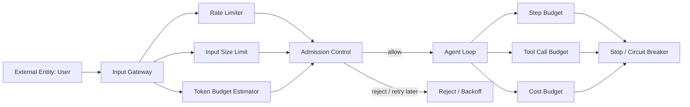

# 05 — Rate Limiting, Quotas и Token Bombing

> Навигация: [Оглавление](../../README.md) · [← Назад](04-pii-redaction-content-filtering.md) · [Вперёд →](../part-3-processing-security/06-rbac-tool-permissions.md)

*Кратко: входной слой должен ограничивать частоту запросов, размер входа, стоимость обработки, количество tool calls и глубину агентного цикла.*

> Примеры в разделе — на Go. Те же примеры на других языках:
> [Python](../../examples/python/part-2/05-rate-limiting-quotas-token-bombing.py) ·
> [TypeScript](../../examples/typescript/part-2/05-rate-limiting-quotas-token-bombing.ts)

## Суть

**Rate limiting** ограничивает частоту запросов.

**Quotas** ограничивают суммарное потребление ресурсов за период.

**Token bombing** — это атака или ошибка, при которой пользовательский ввод, документы, история, RAG-контекст или агентный цикл приводят к чрезмерному расходу токенов, денег, времени или tool calls.

Для AI-агента это важнее, чем для обычного API:

- один пользовательский запрос может породить много LLM-вызовов;
- один LLM-вызов может породить tool call;
- tool call может вернуть большой документ;
- документ может снова попасть в модель;
- агент может уйти в loop;
- стоимость растёт не линейно, а каскадом.

## Что ограничивать

| Ресурс | Пример лимита |
|---|---|
| Requests | 30 запросов в минуту на пользователя |
| Input size | максимум 50 KB raw text |
| Estimated tokens | максимум 8 000 input tokens |
| Output tokens | максимум 1 000 output tokens |
| Tool calls | максимум 5 tool calls на задачу |
| Agent steps | максимум 8 шагов reasoning/action loop |
| Cost | максимум 0.50 USD на задачу |
| Memory writes | максимум 3 записи в память за задачу |
| External fetch size | максимум 1 MB ответа от внешнего URL |
| Concurrency | максимум 2 активные задачи на пользователя |

## DFD: ресурсный gateway



Главная идея:

```text
Лимиты должны стоять не только на HTTP request, но и внутри агентного цикла.
```

## Угрозы / контекст

| Угроза | Как выглядит | Риск |
|---|---|---|
| Request flood | много коротких запросов | DoS |
| Token bombing | огромный prompt / документ | рост стоимости и задержек |
| Context stuffing | пользователь набивает контекст мусором | деградация качества |
| Retrieval bombing | RAG возвращает слишком много chunks | рост токенов |
| Tool loop | агент бесконечно вызывает tools | DoS / cost blowup |
| Output flooding | модель генерирует слишком длинный ответ | стоимость / задержка |
| Concurrent abuse | много параллельных задач | исчерпание ресурсов |
| Budget bypass | пользователь дробит задачу на мелкие запросы | обход квот |

## High / Medium / Low

| Risk | Критерий |
|---|---|
| High | может остановить сервис, резко увеличить расходы, запустить tool loop |
| Medium | вызывает заметную задержку, перерасход токенов или частичный DoS |
| Low | локальное превышение лимита без системного эффекта |

## Подходы и контрмеры

### 1. Admission control до LLM

До вызова модели нужно решить:

```text
Можно ли вообще принять эту задачу?
```

Проверки:

- размер входа;
- примерная оценка токенов;
- rate limit пользователя;
- дневная / месячная квота;
- активные задачи пользователя;
- тип операции.

### 2. Бюджеты внутри agent loop

Даже если запрос принят, агенту нельзя дать бесконечно работать.

```text
maxSteps
maxToolCalls
maxTokens
maxCost
maxDuration
```

### 3. Лимитировать tool output

Очень частая ошибка: ограничили вход пользователя, но tool вернул 10 MB HTML.

Нужно ограничивать:

- HTTP response size;
- количество строк из БД;
- количество файлов;
- количество RAG chunks;
- размер observation, который возвращается в LLM.

### 4. Деградация вместо падения

При достижении лимита лучше:

- попросить уточнить задачу;
- обрезать контекст;
- сделать summary вместо полного анализа;
- вернуть partial result;
- предложить retry позже;
- отправить задачу на approval.

### 5. Квоты привязывать к субъекту

Не только IP.

Лучше учитывать:

```text
user id + org id + API key + IP + session id + tool scope
```

## Пример (Go): простая оценка токенов

Это грубая оценка. Для production лучше использовать tokenizer конкретной модели.

```go
package inputsecurity

import "unicode/utf8"

func EstimateTokens(text string) int {
	// Очень грубое приближение для конспекта:
	// 1 token ≈ 4 chars для английского.
	// Для русского и смешанного текста оценка может отличаться.
	chars := utf8.RuneCountInString(text)
	if chars == 0 {
		return 0
	}
	return chars/4 + 1
}
```

## Пример (Go): admission control

```go
package inputsecurity

import "fmt"

type RequestLimits struct {
	MaxBytes       int
	MaxInputTokens int
	MaxRequestsMin int
}

type AdmissionDecision struct {
	Allowed bool
	Reason  string
}

func CheckAdmission(input string, limits RequestLimits) AdmissionDecision {
	if len([]byte(input)) > limits.MaxBytes {
		return AdmissionDecision{
			Allowed: false,
			Reason:  fmt.Sprintf("input too large: %d bytes", len([]byte(input))),
		}
	}

	estimatedTokens := EstimateTokens(input)
	if estimatedTokens > limits.MaxInputTokens {
		return AdmissionDecision{
			Allowed: false,
			Reason:  fmt.Sprintf("input token budget exceeded: %d tokens", estimatedTokens),
		}
	}

	return AdmissionDecision{Allowed: true}
}
```

## Пример (Go): in-memory rate limiter

Для production лучше использовать Redis / gateway / service mesh rate limiting. Этот пример нужен только для понимания механики.

```go
package inputsecurity

import (
	"sync"
	"time"
)

type Bucket struct {
	Count     int
	ResetTime time.Time
}

type RateLimiter struct {
	mu      sync.Mutex
	window  time.Duration
	limit   int
	buckets map[string]Bucket
}

func NewRateLimiter(limit int, window time.Duration) *RateLimiter {
	return &RateLimiter{
		limit:   limit,
		window:  window,
		buckets: make(map[string]Bucket),
	}
}

func (r *RateLimiter) Allow(subject string) bool {
	r.mu.Lock()
	defer r.mu.Unlock()

	now := time.Now()
	bucket := r.buckets[subject]

	if now.After(bucket.ResetTime) {
		bucket = Bucket{
			Count:     0,
			ResetTime: now.Add(r.window),
		}
	}

	if bucket.Count >= r.limit {
		r.buckets[subject] = bucket
		return false
	}

	bucket.Count++
	r.buckets[subject] = bucket
	return true
}
```

## Пример (Go): бюджет агентного цикла

```go
package inputsecurity

import "fmt"

type AgentBudget struct {
	MaxSteps     int
	MaxToolCalls int
	MaxTokens    int

	Steps     int
	ToolCalls int
	Tokens    int
}

func (b *AgentBudget) AddStep() error {
	b.Steps++
	if b.Steps > b.MaxSteps {
		return fmt.Errorf("agent step budget exceeded: %d", b.Steps)
	}
	return nil
}

func (b *AgentBudget) AddToolCall() error {
	b.ToolCalls++
	if b.ToolCalls > b.MaxToolCalls {
		return fmt.Errorf("tool call budget exceeded: %d", b.ToolCalls)
	}
	return nil
}

func (b *AgentBudget) AddTokens(n int) error {
	b.Tokens += n
	if b.Tokens > b.MaxTokens {
		return fmt.Errorf("token budget exceeded: %d", b.Tokens)
	}
	return nil
}
```

## Пример (Go): использование бюджета в loop

```go
package inputsecurity

import "context"

type AgentStep struct {
	Observation string
	UsesTool    bool
}

type StepRunner interface {
	Next(ctx context.Context) (AgentStep, bool, error)
}

func RunWithBudget(ctx context.Context, runner StepRunner, budget *AgentBudget) error {
	for {
		if err := budget.AddStep(); err != nil {
			return err
		}

		step, done, err := runner.Next(ctx)
		if err != nil {
			return err
		}
		if done {
			return nil
		}

		if step.UsesTool {
			if err := budget.AddToolCall(); err != nil {
				return err
			}
		}

		if err := budget.AddTokens(EstimateTokens(step.Observation)); err != nil {
			return err
		}
	}
}
```

## Что логировать

- subject: user / org / api key;
- request size;
- estimated input tokens;
- actual model tokens, если доступны;
- number of agent steps;
- number of tool calls;
- rejected requests;
- reason: rate limit / size limit / token budget / cost budget;
- retry-after;
- trace id.

Не логировать raw input без sanitization.

## Практические ошибки

| Ошибка | Почему плохо |
|---|---|
| Лимит только на HTTP gateway | Agent loop может уйти в перерасход после принятия запроса |
| Нет лимита на tool output | В модель попадёт огромная observation |
| Нет лимита на RAG chunks | Контекст забивается мусором |
| Нет subject-based quotas | Пользователь обходит лимиты через сессии |
| Нет maxSteps | Агент зацикливается |
| Нет budget telemetry | Невозможно понять источник расходов |

## Чек-лист

- [ ] Есть лимит на размер входа.
- [ ] Есть оценка input tokens до LLM.
- [ ] Есть rate limit по user / org / API key.
- [ ] Есть дневные / месячные quotas.
- [ ] Есть maxSteps для agent loop.
- [ ] Есть maxToolCalls на задачу.
- [ ] Есть лимит на tool output.
- [ ] Есть лимит на RAG chunks.
- [ ] Есть timeout / deadline на задачу.
- [ ] При превышении лимитов агент корректно останавливается.
- [ ] Метрики бюджета пишутся в observability.

## Литература

- [Список литературы](../literature.md#инструменты)
- OWASP LLM10:2025 Unbounded Consumption — https://genai.owasp.org/llmrisk/llm102025-unbounded-consumption/
- OpenAI API Rate Limits — https://developers.openai.com/api/docs/guides/rate-limits
- OpenAI Structured Outputs — https://developers.openai.com/api/docs/guides/structured-outputs
- OWASP Top 10 for Large Language Model Applications — https://owasp.org/www-project-top-10-for-large-language-model-applications/

## См. также

- [03 — Prompt Injection Detection](03-prompt-injection-detection.md)
- [04 — PII Redaction и Content Filtering](04-pii-redaction-content-filtering.md)
- [07 — Parameter Validation и Schema Enforcement](../part-3-processing-security/07-parameter-validation-schema.md)
- [15 — Observability и Tracing](../part-5-control-observability/15-observability-tracing.md)
- [17 — Circuit Breaker и Kill-Switch](../part-5-control-observability/17-circuit-breaker-kill-switch.md)
