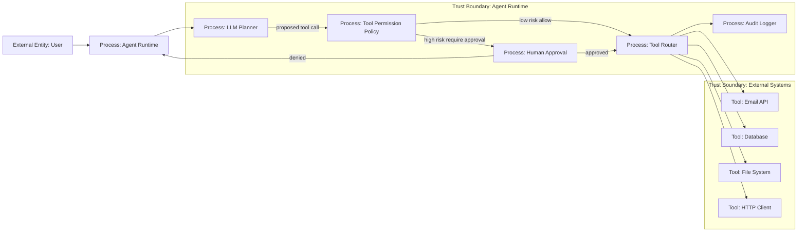

# 06 — RBAC и Tool Permissions

> Навигация: [Оглавление](../../README.md) · [← Назад](../part-2-input-security/05-rate-limiting-quotas-token-bombing.md) · [Вперёд →](07-parameter-validation-schema.md)

*Кратко: агент не должен вызывать любой tool только потому, что LLM решила это сделать. Между LLM и инструментом должен стоять слой прав: role, scope, allowlist, approval и audit.*

> Примеры в разделе — на Go. Те же примеры на других языках:
> [Python](../../examples/python/part-3/06-rbac-tool-permissions.py) ·
> [TypeScript](../../examples/typescript/part-3/06-rbac-tool-permissions.ts)

## Суть

**RBAC** — это контроль доступа по ролям.

**Tool Permissions** — это правила, которые определяют, какие инструменты агент может вызывать, с какими аргументами, на каких ресурсах и при каких условиях.

Для AI-агента это один из главных защитных слоёв. Обычное приложение вызывает функции по коду разработчика. Агент может выбрать tool динамически на основе текста, который частично пришёл от пользователя, документа, сайта, письма или другого агента.

Главное правило:

```text
LLM не вызывает tool напрямую.
LLM только предлагает действие.
Runtime проверяет права и только потом выполняет tool.
```

## Что защищаем

| Объект | Пример | Риск |
|---|---|---|
| Tool | `send_email`, `delete_file`, `run_sql` | опасное действие |
| Action | read / write / delete / send / execute | эскалация через действие |
| Resource | файл, таблица БД, почта, API | доступ к чужому ресурсу |
| Scope | `orders:read`, `orders:write` | лишние полномочия |
| Actor | user, agent, service account | confused deputy |
| Session | конкретная задача агента | перенос прав между задачами |

## DFD: LLM не имеет прямого доступа к tools



## Threat model

| Угроза | Пример | Risk | Контроль |
|---|---|---:|---|
| Excessive agency | агенту дали `delete`, хотя нужен только `read` | High | least privilege, tool allowlist |
| Tool hijacking | prompt injection заставляет вызвать `send_email` | High | permission check, approval |
| Privilege escalation | агент вызывает tool с правами администратора | High | scoped credentials, RBAC |
| Confused deputy | пользователь с низкими правами использует агента с высокими правами | High | actor-bound permissions |
| Unsafe automation | агент выполняет irreversible действие без подтверждения | High | human-in-the-loop |
| Repudiation | нельзя доказать, кто вызвал tool | Medium | audit log, trace id |
| Over-broad tool | один tool умеет читать, писать и удалять | Medium | разделение tools по операциям |

## Модель прав

Минимальная модель должна учитывать не только имя tool.

```text
can(actor, role, scope, tool, action, resource, risk, session) -> allow / deny / approval
```

Плохой вариант:

```text
agent can call database_tool
```

Нормальный вариант:

```text
agent can call orders.read for customer_id=123 during session=abc
agent cannot call orders.delete
agent can call email.send only after approval
```

## Уровни действий

| Уровень | Пример | Политика |
|---|---|---|
| Read-only | поиск, чтение справочника, получение статуса | можно разрешить по scope |
| Internal write | запись черновика, сохранение заметки | разрешить по scope + audit |
| External write | отправка письма, публикация, изменение CRM | approval |
| Destructive | удаление, закрытие доступа, платеж | strict approval / deny by default |
| Code execution | shell, SQL write, browser automation | sandbox + approval + limits |

## Go snippet: permission check перед tool call

```go
package agentsec

import (
	"context"
	"errors"
	"fmt"
)

type Risk string

const (
	RiskLow    Risk = "low"
	RiskMedium Risk = "medium"
	RiskHigh   Risk = "high"
)

type ToolAction string

const (
	ActionRead    ToolAction = "read"
	ActionWrite   ToolAction = "write"
	ActionDelete  ToolAction = "delete"
	ActionExecute ToolAction = "execute"
	ActionSend    ToolAction = "send"
)

type Actor struct {
	UserID string
	Roles  []string
	Scopes []string
}

type ToolCall struct {
	Name     string
	Action   ToolAction
	Resource string
	Args     map[string]any
	Risk     Risk
}

type Decision string

const (
	Allow           Decision = "allow"
	Deny            Decision = "deny"
	RequireApproval Decision = "require_approval"
)

type Policy interface {
	Decide(actor Actor, call ToolCall) Decision
}

type SimplePolicy struct{}

func (p SimplePolicy) Decide(actor Actor, call ToolCall) Decision {
	if call.Action == ActionDelete || call.Action == ActionExecute {
		return RequireApproval
	}

	if call.Risk == RiskHigh {
		return RequireApproval
	}

	if !hasScope(actor.Scopes, call.Name+":"+string(call.Action)) {
		return Deny
	}

	return Allow
}

func hasScope(scopes []string, required string) bool {
	for _, s := range scopes {
		if s == required {
			return true
		}
	}
	return false
}

type Tool interface {
	Call(ctx context.Context, args map[string]any) (string, error)
}

type Runtime struct {
	Policy Policy
	Tools  map[string]Tool
	Audit  AuditLogger
}

type AuditLogger interface {
	LogDecision(actor Actor, call ToolCall, decision Decision)
}

func (r Runtime) ExecuteTool(ctx context.Context, actor Actor, call ToolCall) (string, error) {
	decision := r.Policy.Decide(actor, call)
	r.Audit.LogDecision(actor, call, decision)

	switch decision {
	case Deny:
		return "", errors.New("tool call denied")
	case RequireApproval:
		return "", errors.New("tool call requires human approval")
	case Allow:
		tool, ok := r.Tools[call.Name]
		if !ok {
			return "", fmt.Errorf("unknown tool: %s", call.Name)
		}
		return tool.Call(ctx, call.Args)
	default:
		return "", errors.New("unknown policy decision")
	}
}
```

Главная мысль сниппета:

```text
ToolCall проходит Policy.Decide().
Без allow tool не выполняется.
High-risk действия не выполняются автоматически.
```

## Anti-patterns

| Плохо | Почему опасно | Лучше |
|---|---|---|
| один `admin_tool` на всё | невозможно ограничить действия | маленькие tools с узкими правами |
| передавать секреты в prompt | LLM может раскрыть их в ответе | секреты подставляет executor |
| разрешить shell без sandbox | RCE by design | sandbox + allowlist команд |
| считать tool output доверенным | tool может вернуть prompt injection | маркировать output как untrusted |
| логировать raw args | утечка PII / secrets | redacted audit log |

## Маппинг на OWASP ASI / LLM Top 10

| Риск | Связь |
|---|---|
| LLM06 Excessive Agency | слишком широкие tools, права и автономность |
| LLM02 Sensitive Information Disclosure | tool может раскрыть данные |
| LLM05 Improper Output Handling | output модели превращается в действие |
| ASI02 Tool Misuse & Exploitation | tool используется не по назначению |
| ASI03 Identity & Privilege Abuse | агент действует с чужими или лишними правами |

## Чек-лист

- [ ] У каждого tool есть owner, action, risk level и описание.
- [ ] Tools разделены на read / write / delete / execute.
- [ ] Для каждого tool задан allowlist ролей и scopes.
- [ ] High-risk действия требуют human approval.
- [ ] LLM не получает прямой доступ к executor.
- [ ] Tool arguments проходят validation до исполнения.
- [ ] Credentials привязаны к actor/session/scope.
- [ ] Все tool calls логируются с trace id.
- [ ] В логах нет raw secrets.
- [ ] По умолчанию неизвестный tool запрещён.

## Литература

- [Список литературы](../literature.md#практические-руководства)
- [OWASP Top 10 for LLM Applications 2025](https://genai.owasp.org/llm-top-10/)
- [OWASP Agentic AI Threats and Mitigations](https://genai.owasp.org/resource/agentic-ai-threats-and-mitigations/)
- [OpenAI Agents SDK — Agents](https://developers.openai.com/api/docs/guides/agents)
- [OpenAI Agents SDK — Guardrails](https://openai.github.io/openai-agents-python/guardrails/)
- [NIST AI Risk Management Framework](https://www.nist.gov/itl/ai-risk-management-framework)

## См. также

- [02 — Модель угроз](../part-1-architecture-threats/02-threat-model.md)
- [07 — Parameter Validation и Schema Enforcement](07-parameter-validation-schema.md)
- [14 — Human-in-the-Loop](../part-5-control-observability/14-human-in-the-loop.md)
- [15 — Observability и Tracing](../part-5-control-observability/15-observability-tracing.md)
