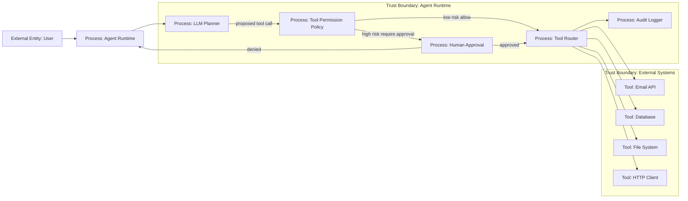

# 06 — RBAC и Tool Permissions

> Навигация: [Оглавление](../../README.md) · [← Назад](../part-2-input-security/05-rate-limiting-quotas-token-bombing.md) · [Вперёд →](07-parameter-validation-schema.md)

*Кратко: агент не должен вызывать любой tool только потому, что LLM решила это сделать. Между LLM и инструментом должен стоять слой прав: role, scope, allowlist, approval и audit.*

> Примеры в разделе — на Go. Те же примеры на других языках:
> [Python](../../examples/python/part-3/06-rbac-tool-permissions.py) ·
> [TypeScript](../../examples/typescript/part-3/06-rbac-tool-permissions.ts)

## Суть

**RBAC** — это контроль доступа по ролям.

**Tool Permissions** — это правила, которые определяют, какие инструменты агент может вызывать, с какими аргументами, на каких ресурсах и при каких условиях.

Для AI-агента это один из главных защитных слоёв. Обычное приложение вызывает функции по коду разработчика. Агент может выбрать tool динамически на основе текста, который частично пришёл от пользователя, документа, сайта, письма или другого агента.

Главное правило:

```text
LLM не вызывает tool напрямую.
LLM только предлагает действие.
Runtime проверяет права и только потом выполняет tool.
```

## Что защищаем

| Объект | Пример | Риск |
|---|---|---|
| Tool | `send_email`, `delete_file`, `run_sql` | опасное действие |
| Action | read / write / delete / send / execute | эскалация через действие |
| Resource | файл, таблица БД, почта, API | доступ к чужому ресурсу |
| Scope | `orders:read`, `orders:write` | лишние полномочия |
| Actor | user, agent, service account | confused deputy |
| Session | конкретная задача агента | перенос прав между задачами |

## DFD: LLM не имеет прямого доступа к tools


```mermaid
flowchart LR
    User[External Entity: User] --> Agent[Process: Agent Runtime]

    subgraph Runtime[Trust Boundary: Agent Runtime]
        Planner[Process: LLM Planner]
        Policy[Process: Tool Permission Policy]
        Approval[Process: Human Approval]
        Router[Process: Tool Router]
        Audit[Process: Audit Logger]
    end

    subgraph External[Trust Boundary: External Systems]
        Email[Tool: Email API]
        DB[Tool: Database]
        FS[Tool: File System]
        HTTP[Tool: HTTP Client]
    end

    Agent --> Planner
    Planner -->|proposed tool call| Policy
    Policy -->|low risk allow| Router
    Policy -->|high risk require approval| Approval
    Approval -->|approved| Router
    Approval -->|denied| Agent
    Router --> Email
    Router --> DB
    Router --> FS
    Router --> HTTP
    Router --> Audit
```

## Threat model

| Угроза | Пример | Risk | Контроль |
|---|---|---:|---|
| Excessive agency | агенту дали `delete`, хотя нужен только `read` | High | least privilege, tool allowlist |
| Tool hijacking | prompt injection заставляет вызвать `send_email` | High | permission check, approval |
| Privilege escalation | агент вызывает tool с правами администратора | High | scoped credentials, RBAC |
| Confused deputy | пользователь с низкими правами использует агента с высокими правами | High | actor-bound permissions |
| Unsafe automation | агент выполняет irreversible действие без подтверждения | High | human-in-the-loop |
| Repudiation | нельзя доказать, кто вызвал tool | Medium | audit log, trace id |
| Over-broad tool | один tool умеет читать, писать и удалять | Medium | разделение tools по операциям |

## Модель прав

Минимальная модель должна учитывать не только имя tool.

```text
can(actor, role, scope, tool, action, resource, risk, session) -> allow / deny / approval
```

Плохой вариант:

```text
agent can call database_tool
```

Нормальный вариант:

```text
agent can call orders.read for customer_id=123 during session=abc
agent cannot call orders.delete
agent can call email.send only after approval
```

## Уровни действий

| Уровень | Пример | Политика |
|---|---|---|
| Read-only | поиск, чтение справочника, получение статуса | можно разрешить по scope |
| Internal write | запись черновика, сохранение заметки | разрешить по scope + audit |
| External write | отправка письма, публикация, изменение CRM | approval |
| Destructive | удаление, закрытие доступа, платеж | strict approval / deny by default |
| Code execution | shell, SQL write, browser automation | sandbox + approval + limits |

<a id="read-vs-write"></a>

Учебный контраст read vs write — **не** канон исполнения write:

```text
teaching table != write-control canon
```

| | Read | Write |
|---|---|---|
| Примеры | поиск, статус, summary | delete, deploy, email, pipeline |
| Контроли | ACL, filter, audit, rate limit | [исполнение write](#write-controls) + [approval §14](../part-5-control-observability/14-human-in-the-loop.md) |

<a id="write-controls"></a>

### Контроли исполнения write

Набор для **write**, не для read. Approval — [§14](../part-5-control-observability/14-human-in-the-loop.md), не здесь.

```text
write controls != HITL
plan before execute != planning role
```

| Контроль | Смысл |
|---|---|
| plan before execute | сначала план (что / куда / эффект), потом вызов |
| dry-run по умолчанию | write не идёт в prod без явного execute |
| rollback | компенсирующее действие или отказ, если отката нет |
| deny при неопределённости | нет ясного эффекта / цели / scope → deny, не «попробуем» |
| approval | **не здесь** — [§14](../part-5-control-observability/14-human-in-the-loop.md) |
| extended logging | уже [§15](../part-5-control-observability/15-observability-tracing.md) |

Это контроли **исполнения**, не ступень kill-switch «все write» ([§17](../part-5-control-observability/17-circuit-breaker-kill-switch.md#kill-switch-levels)). Не путать с watchlist «план как контракт».

```go
package agentsec

import "errors"

type WriteStep string

const (
	WritePlan     WriteStep = "plan"
	WriteDryRun   WriteStep = "dry_run"
	WriteExecute  WriteStep = "execute"
	WriteRollback WriteStep = "rollback"
)

var ErrUncertainWrite = errors.New("deny: uncertain write")

// GateWrite — stub: uncertain → deny; без явного execute → dry-run. Не rollback-engine.
func GateWrite(step WriteStep, certain bool) (WriteStep, error) {
	if !certain {
		return "", ErrUncertainWrite
	}
	if step == WriteExecute || step == WriteRollback {
		return step, nil
	}
	return WriteDryRun, nil
}
```

Синхрон: [Python](../../examples/python/part-3/06-rbac-tool-permissions.py) · [TypeScript](../../examples/typescript/part-3/06-rbac-tool-permissions.ts).

## Agent Identity и Safe Tool Binding

Агент — **first-class principal**, а не «общий service account с prompt-ограничениями». Права и tools привязываются к управляемой identity, а не к тексту модели.

Источник принципов: [Microsoft — Least privilege for AI agents](https://www.microsoft.com/en-us/security/blog/2026/07/16/least-privilege-for-ai-agents-identity-access-and-tool-binding/).

### Policy

```text
1 production agent = 1 dedicated managed identity
+ named human owner
+ purpose statement («что разрешено и зачем»)
```

Запрещено:

- общий service account / API key на несколько агентов;
- «на время пилота Owner/Admin» без последующего сужения;
- полагаться на prompt («агент будет только читать») вместо hard authorization.

Identity стабильна для lifecycle (onboard / rotate / suspend / decommission). Повышенные права — через **JIT entitlements**, а не через новую identity на каждую задачу.

### Acting mode

| Режим | Смысл | Что зафиксировать |
|---|---|---|
| `own_identity` | агент действует от своего имени | `agent_id`, baseline role, scopes |
| `on_behalf_of(user)` | делегирование пользователя | `on_behalf_of`, согласие/approval, узкий scope |

Смесь режимов без явной политики → путаница ответственности при инциденте (reconciliation в логах невозможна). См. audit fields в [§15](../part-5-control-observability/15-observability-tracing.md).

### Separation и Safe Tool Binding

- Read и write — разные roles и/или разные tools; delete / export / admin — approval или JIT.
- Агенту доступен только **curated allowlist** (tools manifest): нельзя «подключить всё полезное» и считать каждый интеграционный риск изолированным.

<a id="aggregate-permission"></a>

### Aggregate permission / compositional authorization

Комбинация «разумных» грантов (email + files + tickets + repo) даёт **effective agency** шире суммы частей. Per-tool allowlist это не ловит: каждый tool по отдельности в политике, вместе — секрет из A уходит через B.

```text
per-tool allow != effective agency
```

```text
Effective Agency = Identity Permissions + Tool Combination + Data Reach + Autonomy
```

| Пара | Почему опасно вместе |
|---|---|
| read internal docs + send external | чтение + канал наружу без отдельного approval |
| read logs + create public issue | внутренние логи → публичная поверхность |
| read vulnerabilities + external model | findings уходят во внешний inference |
| create config + deploy | изменение и выкладка одним principal |

Мера: **отдельные агенты / identity на разные зоны риска**, не один манифест «всё полезное». Grant-time вопрос: может ли этот principal разрешёнными tools прочитать секрет из A и отправить через B? Если да — deny combo или split identity. Это **не** [EV-13 / trajectory](../part-7-testing-compliance/20-red-teaming-adversarial-testing.md#trajectory-evals-eval-trajectory-01): там цепочка шагов vs goal в рантайме; здесь — выдача прав.

Tool Gateway фаза «до» проверяет combo (`ForbiddenCombo` ниже), не только `Authorize(agent, tool)`.

```go
package agentsec

// ForbiddenCombo — grant-time: манифест / Gateway.Before. Не detector injection.
func ForbiddenCombo(granted map[string]bool) bool {
	pairs := [][2]string{
		{"read_internal_docs", "send_external"},
		{"read_logs", "create_public_issue"},
		{"read_vulnerabilities", "external_model"},
		{"create_config", "deploy"},
	}
	for _, p := range pairs {
		if granted[p[0]] && granted[p[1]] {
			return true
		}
	}
	return false
}
```

<a id="tool-gateway"></a>

## Tool Gateway (3 фазы)

Между предложением LLM и executor — **Tool Gateway** (не путать с [AI Gateway](../part-4-output-security/13-egress-control-data-exfiltration.md#inference-routing): путь к **модели** vs путь к **tools**). Карточка tool/server — [Trusted Tool Registry §19](../part-6-multi-agent-security/19-mcp-security.md#trusted-tool-registry).

```text
LLM предлагает tool → Tool Gateway → executor.
```

| Фаза | Контроли |
|---|---|
| **До** | агент / инициатор, acting mode, read/write, параметры ([§07](07-parameter-validation-schema.md)), чувствительные данные / data class, опасная комбинация tools, approval |
| **Во время** | rate limit, timeout, allowlist host/tool, sandbox ([§08](08-sandboxing.md)), resource limits |
| **После** | фильтрация output, redaction, injection в ответе, **пускать ли в контекст** → [Runtime Trust Gap §19](../part-6-multi-agent-security/19-mcp-security.md#runtime-trust-gap) |

### Go snippet: ToolGateway

```go
type ToolCall struct {
	AgentID   string
	Tool      string
	Args      map[string]any
	DataClass string // D0–D4 label when known
}

type ToolGateway struct {
	// Registry lookup — see §19 Trusted Tool Registry
	InRegistry func(tool string) bool
	Authorize  func(agentID, tool string) error // identity / allowlist / approval
	ComboDeny  func(agentID string) error       // aggregate: ForbiddenCombo on granted set
	Validate   func(args map[string]any) error  // §07
}

// Before — фаза «до»: registry + identity/approval + combo + schema.
func (g ToolGateway) Before(call ToolCall) error {
	if g.InRegistry != nil && !g.InRegistry(call.Tool) {
		return fmt.Errorf("tool %q not in trusted registry", call.Tool)
	}
	if g.Authorize != nil {
		if err := g.Authorize(call.AgentID, call.Tool); err != nil {
			return err
		}
	}
	if g.ComboDeny != nil {
		if err := g.ComboDeny(call.AgentID); err != nil {
			return err
		}
	}
	if g.Validate != nil {
		return g.Validate(call.Args)
	}
	return nil
}

// During: rate limit / timeout / sandbox — см. §05, §08 (не дублируем здесь).

// AfterToolOutput — фаза «после»: filter/redact; admitToContext=false → не в prompt (§19 Runtime Trust Gap).
func AfterToolOutput(raw string, injectLike bool) (admitToContext bool, safe string) {
	if injectLike {
		return false, ""
	}
	return true, raw // production: size/format/redaction
}
```

### JIT elevation

```text
baseline role (minimal)
  → time-limited elevation (role / short-lived token / per-action approval)
  → auto-drop to baseline when workflow ends
```

Временный доступ без expiry на практике становится постоянным — expiry обязателен.

### Downstream re-auth

Каждый tool / downstream API **сам** проверяет claims, role и scope на каждый вызов. Нельзя считать «orchestrator уже проверил» достаточным: weakest link — любая интеграция с implicit trust.

### Identity checklist

- [ ] У production-агента отдельная managed identity (не shared SA / API key).
- [ ] Назначен human owner и purpose statement.
- [ ] Acting mode (`own_identity` / `on_behalf_of`) задан явно в policy и логах.
- [ ] Read и write разделены (tools и/или roles).
- [ ] High-impact действия — через approval и/или JIT с expiry.
- [ ] Tool allowlist / manifest зафиксирован; неизвестный tool → deny.
- [ ] Downstream сервисы re-auth на каждый call.
- [ ] Kill-switch отзывает credentials / tokens ([§17](../part-5-control-observability/17-circuit-breaker-kill-switch.md)).

### Go: AgentPrincipal + JIT + tool allowlist

```go
package agentsec

import (
	"fmt"
	"time"
)

type ActingMode string

const (
	ActingOwn      ActingMode = "own_identity"
	ActingOnBehalf ActingMode = "on_behalf_of"
)

type AgentPrincipal struct {
	ID            string
	Owner         string // human owner
	ActingMode    ActingMode
	OnBehalfOf    string // user id if ActingOnBehalf
	BaselineRole  string
	ElevatedUntil time.Time // zero = no elevation
	AllowedTools  map[string]bool
}

func (a AgentPrincipal) EffectiveRole(now time.Time) string {
	if !a.ElevatedUntil.IsZero() && now.Before(a.ElevatedUntil) {
		return a.BaselineRole + ":elevated"
	}
	return a.BaselineRole
}

func AuthorizeTool(a AgentPrincipal, tool string, now time.Time) error {
	if a.ID == "" || a.Owner == "" {
		return fmt.Errorf("agent identity and human owner required")
	}
	if a.ActingMode == ActingOnBehalf && a.OnBehalfOf == "" {
		return fmt.Errorf("on_behalf_of required for delegated acting mode")
	}
	_ = a.EffectiveRole(now) // elevated role only while ElevatedUntil is in the future
	if !a.AllowedTools[tool] {
		return fmt.Errorf("tool %q not in agent allowlist", tool)
	}
	return nil
}
```

Правило сниппета: нет identity/owner → deny; tool вне allowlist → deny; delegated mode без `on_behalf_of` → deny.

## Go snippet: permission check перед tool call

```go
package agentsec

import (
	"context"
	"errors"
	"fmt"
)

type Risk string

const (
	RiskLow    Risk = "low"
	RiskMedium Risk = "medium"
	RiskHigh   Risk = "high"
)

type ToolAction string

const (
	ActionRead    ToolAction = "read"
	ActionWrite   ToolAction = "write"
	ActionDelete  ToolAction = "delete"
	ActionExecute ToolAction = "execute"
	ActionSend    ToolAction = "send"
)

type Actor struct {
	UserID string
	Roles  []string
	Scopes []string
}

type ToolCall struct {
	Name     string
	Action   ToolAction
	Resource string
	Args     map[string]any
	Risk     Risk
}

type Decision string

const (
	Allow           Decision = "allow"
	Deny            Decision = "deny"
	RequireApproval Decision = "require_approval"
)

type Policy interface {
	Decide(actor Actor, call ToolCall) Decision
}

type SimplePolicy struct{}

func (p SimplePolicy) Decide(actor Actor, call ToolCall) Decision {
	if call.Action == ActionDelete || call.Action == ActionExecute {
		return RequireApproval
	}

	if call.Risk == RiskHigh {
		return RequireApproval
	}

	if !hasScope(actor.Scopes, call.Name+":"+string(call.Action)) {
		return Deny
	}

	return Allow
}

func hasScope(scopes []string, required string) bool {
	for _, s := range scopes {
		if s == required {
			return true
		}
	}
	return false
}

type Tool interface {
	Call(ctx context.Context, args map[string]any) (string, error)
}

type Runtime struct {
	Policy Policy
	Tools  map[string]Tool
	Audit  AuditLogger
}

type AuditLogger interface {
	LogDecision(actor Actor, call ToolCall, decision Decision)
}

func (r Runtime) ExecuteTool(ctx context.Context, actor Actor, call ToolCall) (string, error) {
	decision := r.Policy.Decide(actor, call)
	r.Audit.LogDecision(actor, call, decision)

	switch decision {
	case Deny:
		return "", errors.New("tool call denied")
	case RequireApproval:
		return "", errors.New("tool call requires human approval")
	case Allow:
		tool, ok := r.Tools[call.Name]
		if !ok {
			return "", fmt.Errorf("unknown tool: %s", call.Name)
		}
		return tool.Call(ctx, call.Args)
	default:
		return "", errors.New("unknown policy decision")
	}
}
```

Главная мысль сниппета:

```text
ToolCall проходит Policy.Decide().
Без allow tool не выполняется.
High-risk действия не выполняются автоматически.
```

## Anti-patterns

| Плохо | Почему опасно | Лучше |
|---|---|---|
| один `admin_tool` на всё | невозможно ограничить действия | маленькие tools с узкими правами |
| передавать секреты в prompt | LLM может раскрыть их в ответе | секреты подставляет executor |
| разрешить shell без sandbox | RCE by design | sandbox + allowlist команд |
| считать tool output доверенным | tool может вернуть prompt injection | маркировать output как untrusted |
| логировать raw args | утечка PII / secrets | redacted audit log |
| shared SA / API key на N агентов | нет accountability, revoke неполный | 1 agent = 1 identity |
| Owner/Admin «на пилот» навсегда | privilege creep | task-scoped roles + access review |
| JIT без expiry | временное = постоянное | auto-drop + short-lived tokens |

## Маппинг на OWASP ASI / LLM Top 10

| Риск | Связь |
|---|---|
| LLM06 Excessive Agency | слишком широкие tools, права и автономность |
| LLM02 Sensitive Information Disclosure | tool может раскрыть данные |
| LLM05 Improper Output Handling | output модели превращается в действие |
| ASI02 Tool Misuse & Exploitation | tool используется не по назначению |
| ASI03 Identity & Privilege Abuse | агент действует с чужими или лишними правами |

## Чек-лист

- [ ] У каждого tool есть owner, action, risk level и описание.
- [ ] Tools разделены на read / write / delete / execute.
- [ ] Назван контраст [read vs write](#read-vs-write). Write идёт через [план / dry-run / rollback / deny-uncertain](#write-controls); approval — [§14](../part-5-control-observability/14-human-in-the-loop.md).
- [ ] Для каждого tool задан allowlist ролей и scopes.
- [ ] High-risk действия требуют human approval.
- [ ] LLM не получает прямой доступ к executor; вызовы идут через [Tool Gateway](#tool-gateway) (до / во время / после).
- [ ] После tool call решается, пускать ли output в контекст ([Runtime Trust Gap §19](../part-6-multi-agent-security/19-mcp-security.md#runtime-trust-gap)).
- [ ] Tool arguments проходят validation до исполнения.
- [ ] Credentials привязаны к actor/session/scope.
- [ ] У каждого production-агента отдельная identity + human owner (см. Identity checklist выше).
- [ ] Acting mode и tool allowlist enforced в runtime, не в prompt.
- [ ] Проверен [aggregate permission](#aggregate-permission): per-tool allow ≠ effective agency; опасные пары (read+send, logs+public, vulns+external model, config+deploy) — deny combo или split identity.
- [ ] Все tool calls логируются с trace id / correlation id и identity fields ([§15](../part-5-control-observability/15-observability-tracing.md)).
- [ ] В логах нет raw secrets.
- [ ] По умолчанию неизвестный tool запрещён.
- [ ] Kill-switch отзывает tokens агента ([§17](../part-5-control-observability/17-circuit-breaker-kill-switch.md)).

## Литература

- [Список литературы](../literature.md#практические-руководства) · [Стандарты](../literature.md#стандарты-и-фреймворки) — OWASP Securing Agentic Applications Guide 1.0
- [Microsoft — Least privilege for AI agents: Identity, access, and tool binding](https://www.microsoft.com/en-us/security/blog/2026/07/16/least-privilege-for-ai-agents-identity-access-and-tool-binding/) — first-class principal; [#aggregate-permission](#aggregate-permission)
- [OWASP Top 10 for LLM Applications 2025](https://genai.owasp.org/llm-top-10/)
- [OWASP Agentic AI Threats and Mitigations](https://genai.owasp.org/resource/agentic-ai-threats-and-mitigations/)
- [OpenAI Agents SDK — Agents](https://developers.openai.com/api/docs/guides/agents)
- [OpenAI Agents SDK — Guardrails](https://openai.github.io/openai-agents-python/guardrails/)
- [NIST AI Risk Management Framework](https://www.nist.gov/itl/ai-risk-management-framework)

## См. также

- [02 — Модель угроз / aggregate permission](../part-1-architecture-threats/02-threat-model.md#aggregate-permission)
- [07 — Parameter Validation и Schema Enforcement](07-parameter-validation-schema.md)
- [08 — Sandboxing](08-sandboxing.md) — фаза «во время» Tool Gateway
- [13 — AI Gateway / inference](../part-4-output-security/13-egress-control-data-exfiltration.md#inference-routing) — не путать с Tool Gateway
- [Read vs write](#read-vs-write) — учебный контраст; канон исполнения — [#write-controls](#write-controls)
- [14 — Human-in-the-Loop](../part-5-control-observability/14-human-in-the-loop.md) — approval, не dry-run
- [25 — T-09 dry-run](../part-8-practice/25-security-by-design-checklist.md) — чек-лист практики, канон здесь
- [15 — Observability и Tracing](../part-5-control-observability/15-observability-tracing.md)
- [17 — Circuit Breaker и Kill-Switch](../part-5-control-observability/17-circuit-breaker-kill-switch.md)
- [19 — Trusted Tool Registry / Runtime Trust Gap](../part-6-multi-agent-security/19-mcp-security.md#trusted-tool-registry)
