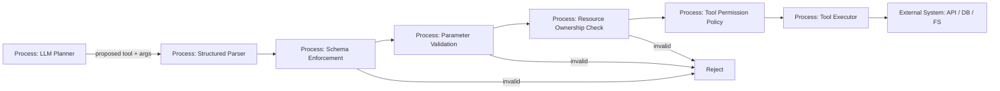

# 07 — Parameter Validation и Schema Enforcement

> Навигация: [Оглавление](../../README.md) · [← Назад](06-rbac-tool-permissions.md) · [Вперёд →](08-sandboxing.md)

*Кратко: LLM может предложить tool call, но аргументы tool call нельзя выполнять как есть. Runtime должен проверять типы, enum, диапазоны, URL, пути, resource ownership и лишние поля.*

## Суть

**Parameter Validation** — проверка значений аргументов.

**Schema Enforcement** — принудительное соблюдение схемы: какие поля допустимы, какие обязательны, какие типы разрешены и какие значения запрещены.

Для агента это критично, потому что LLM формирует аргументы динамически. Даже если tool разрешён, опасность может быть в параметрах.

Пример:

```json
{
  "tool": "read_file",
  "args": {
    "path": "../../.env"
  }
}
```

Tool вроде read-only, но параметр ведёт к утечке секрета.

Главное правило:

```text
Разрешённый tool ≠ безопасный tool call.
Безопасность проверяется на уровне параметров.
```

## Что валидировать

| Тип параметра | Что проверять | Пример риска |
|---|---|---|
| String | длина, charset, allowlist | injection, path traversal |
| Enum | только известные значения | обход режима |
| Number | min/max | cost spike, DoS |
| URL | scheme, host, port, path | SSRF, exfiltration |
| File path | base dir, extension, traversal | чтение `.env` |
| SQL/query | только safe query builder | SQL injection |
| IDs | принадлежность actor/session | доступ к чужим данным |
| JSON | deny unknown fields | скрытые параметры |
| Command args | без shell interpolation | command injection |

## DFD: schema gate перед tool executor



## Threat model

| Угроза | Пример | Risk | Контроль |
|---|---|---:|---|
| Path traversal | `../../secret.env` | High | clean path + base dir check |
| SSRF | `http://169.254.169.254` | High | URL allowlist, private IP denylist |
| Command injection | `file.txt; rm -rf /` | High | no shell, args array |
| SQL injection | LLM пишет raw SQL | High | query builder, prepared statements |
| Hidden parameters | LLM добавляет `admin=true` | High | deny unknown fields |
| Cross-tenant access | `customer_id` чужого клиента | High | ownership check |
| Resource exhaustion | `limit=1000000` | Medium | max limits |
| Unsafe mode | `dry_run=false` без approval | Medium | safe defaults |

## Правила schema enforcement

1. **Deny unknown fields** — лишние поля запрещены.
2. **Required fields** — обязательные поля должны быть явно заполнены.
3. **Safe defaults** — по умолчанию `dry_run=true`, `limit` малый, `write=false`.
4. **Allowlist over denylist** — разрешать известное, а не пытаться запретить плохое.
5. **Validate after parsing** — сначала типизированный parse, потом semantic checks.
6. **Check ownership** — ID ресурса должен принадлежать actor/session.
7. **Validate again at executor** — не доверять только LLM/schema layer.

## Go snippet: JSON schema через строгий decoder

```go
package agentsec

import (
	"encoding/json"
	"errors"
	"fmt"
	"io"
	"net/url"
	"strings"
)

type FetchURLArgs struct {
	URL     string `json:"url"`
	Timeout int    `json:"timeout_seconds"`
}

func DecodeStrict[T any](r io.Reader) (T, error) {
	var v T
	dec := json.NewDecoder(r)
	dec.DisallowUnknownFields()

	if err := dec.Decode(&v); err != nil {
		return v, err
	}
	if dec.More() {
		return v, errors.New("unexpected extra JSON data")
	}
	return v, nil
}

func ValidateFetchURLArgs(args FetchURLArgs) error {
	if args.URL == "" {
		return errors.New("url is required")
	}

	u, err := url.Parse(args.URL)
	if err != nil {
		return fmt.Errorf("invalid url: %w", err)
	}

	if u.Scheme != "https" {
		return errors.New("only https scheme is allowed")
	}

	if !allowedHost(u.Hostname()) {
		return fmt.Errorf("host is not allowed: %s", u.Hostname())
	}

	if args.Timeout <= 0 || args.Timeout > 10 {
		return errors.New("timeout must be between 1 and 10 seconds")
	}

	return nil
}

func allowedHost(host string) bool {
	allowed := []string{
		"api.example.com",
		"docs.example.com",
	}

	host = strings.ToLower(host)
	for _, h := range allowed {
		if host == h {
			return true
		}
	}
	return false
}
```

Что важно:

```text
DisallowUnknownFields запрещает скрытые параметры.
URL проверяется по scheme и host allowlist.
Timeout ограничен сверху.
```

## Go snippet: безопасная проверка пути

```go
package agentsec

import (
	"errors"
	"path/filepath"
	"strings"
)

func SafeJoin(baseDir, userPath string) (string, error) {
	if userPath == "" {
		return "", errors.New("path is required")
	}

	clean := filepath.Clean(userPath)
	if filepath.IsAbs(clean) {
		return "", errors.New("absolute paths are not allowed")
	}

	full := filepath.Join(baseDir, clean)
	baseAbs, err := filepath.Abs(baseDir)
	if err != nil {
		return "", err
	}
	fullAbs, err := filepath.Abs(full)
	if err != nil {
		return "", err
	}

	if !strings.HasPrefix(fullAbs, baseAbs+string(filepath.Separator)) && fullAbs != baseAbs {
		return "", errors.New("path escapes base directory")
	}

	return fullAbs, nil
}
```

## Go snippet: ownership check

```go
package agentsec

type ResourceAccessChecker interface {
	CanAccessCustomer(userID, customerID string) bool
}

type ReadCustomerArgs struct {
	CustomerID string `json:"customer_id"`
}

func ValidateReadCustomer(userID string, args ReadCustomerArgs, access ResourceAccessChecker) error {
	if args.CustomerID == "" {
		return errors.New("customer_id is required")
	}
	if !access.CanAccessCustomer(userID, args.CustomerID) {
		return errors.New("customer does not belong to user")
	}
	return nil
}
```

## Anti-patterns

| Плохо | Почему опасно | Лучше |
|---|---|---|
| raw JSON `map[string]any` до executor | нет строгих типов | typed structs |
| принимать лишние поля | скрытые режимы | `DisallowUnknownFields` |
| валидировать только prompt'ом | LLM может ошибиться | deterministic validation |
| raw SQL от модели | SQL injection / data leak | predefined queries |
| shell string | command injection | `exec.CommandContext` с args |
| URL без allowlist | SSRF / exfiltration | allowlist доменов |
| path без base dir | чтение секретов | safe path join |

## Маппинг на OWASP ASI / LLM Top 10

| Риск | Связь |
|---|---|
| LLM05 Improper Output Handling | output модели передаётся downstream без проверки |
| LLM06 Excessive Agency | tool call получает слишком широкое действие |
| LLM02 Sensitive Information Disclosure | параметры ведут к чтению чужих данных |
| ASI02 Tool Misuse & Exploitation | tool используется через вредные параметры |
| ASI03 Identity & Privilege Abuse | параметры обходят права actor |

## Чек-лист

- [ ] Каждый tool имеет явную input schema.
- [ ] Unknown fields запрещены.
- [ ] Все поля имеют min/max/enum/format checks.
- [ ] URL проверяются по scheme и host allowlist.
- [ ] File path не может выйти за base directory.
- [ ] Shell не используется для пользовательских аргументов.
- [ ] SQL не генерируется моделью напрямую.
- [ ] Resource IDs проверяются на принадлежность actor.
- [ ] Dangerous flags требуют approval.
- [ ] Validation errors логируются без raw secrets.

## Литература

- [Список литературы](../literature.md#практические-руководства)
- [OWASP Top 10 for LLM Applications 2025](https://genai.owasp.org/llm-top-10/)
- [OWASP Agentic AI Threats and Mitigations](https://genai.owasp.org/resource/agentic-ai-threats-and-mitigations/)
- [OpenAI Agents SDK — Agents](https://developers.openai.com/api/docs/guides/agents)
- [OpenAI Agents SDK — Guardrails](https://openai.github.io/openai-agents-python/guardrails/)
- [NIST AI Risk Management Framework](https://www.nist.gov/itl/ai-risk-management-framework)

## См. также

- [06 — RBAC и Tool Permissions](06-rbac-tool-permissions.md)
- [08 — Sandboxing](08-sandboxing.md)
- [13 — Egress Control и Data Exfiltration Prevention](../part-4-output-security/13-egress-control-data-exfiltration.md)
