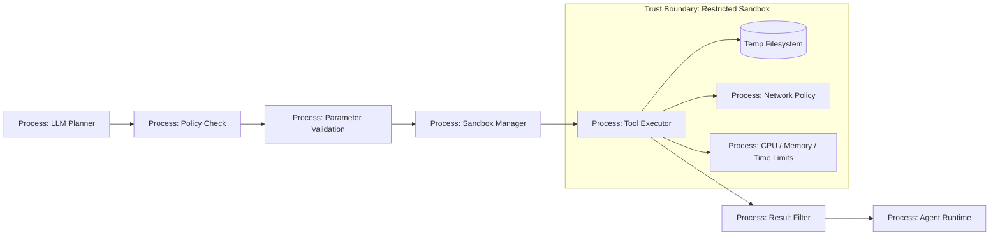

# 08 — Sandboxing

> Навигация: [Оглавление](../../README.md) · [← Назад](07-parameter-validation-schema.md) · [Вперёд →](09-memory-isolation-context-sanitization.md)

*Кратко: sandbox ограничивает среду, в которой выполняются опасные tools: shell, code execution, browser automation, file operations, external fetch и работа с пользовательскими артефактами.*

## Суть

**Sandboxing** — это изоляция выполнения. Даже если агент ошибся, prompt injection сработал или tool получил вредные параметры, ущерб должен быть ограничен.

Sandbox нужен не потому, что мы доверяем агенту меньше, чем пользователю. Sandbox нужен потому, что агент соединяет три опасных свойства:

```text
недетерминированное планирование + доступ к tools + внешние недоверенные данные
```

Главное правило:

```text
Опасный tool должен выполняться в ограниченной среде, а не в основном процессе приложения.
```

## Где нужен sandbox

| Tool / действие | Риск | Контроль |
|---|---|---|
| Shell command | RCE, удаление файлов | no shell by default, sandbox user, timeout |
| Code execution | произвольный код | container / VM / wasm |
| Browser automation | SSRF, credential leak | egress policy, isolated profile |
| File processing | zip bomb, path traversal | temp dir, size limits |
| External HTTP fetch | SSRF, exfiltration | network allowlist |
| SQL execution | data loss | read-only user, transaction rollback |
| Document parser | parser exploit | isolated process |

## DFD: sandbox вокруг dangerous tools



## Sandbox controls

| Контроль | Что ограничивает |
|---|---|
| Timeout | вечные процессы и зависания |
| CPU limit | майнинг, heavy computation |
| Memory limit | memory bomb |
| Output limit | огромный stdout / token bombing |
| Temp directory | доступ к файловой системе |
| Read-only mount | изменение системных файлов |
| No inherited env | утечка secrets |
| Network allowlist | SSRF / exfiltration |
| Non-root user | privilege escalation |
| Seccomp/AppArmor/SELinux | системные вызовы |
| Container/VM/WASM | граница исполнения |

## Threat model

| Угроза | Пример | Risk | Контроль |
|---|---|---:|---|
| RCE | модель запускает произвольную команду | High | no shell, sandbox, approval |
| Secret leak | процесс читает env | High | clean env, secretless sandbox |
| File destruction | команда удаляет рабочую директорию | High | temp dir, read-only mounts |
| SSRF | tool обращается к metadata service | High | network denylist/allowlist |
| Zip bomb | пользовательский архив распаковывается бесконечно | High | size/depth limits |
| DoS | процесс зависает | Medium | timeout, process kill |
| Output flooding | tool возвращает гигабайты текста | Medium | output cap |
| Persistence | вредный файл остаётся после запуска | Medium | disposable sandbox |

## Уровни sandbox

| Уровень | Когда достаточно | Ограничения |
|---|---|---|
| In-process validation | только безопасные read-only tools | не защищает от RCE |
| Separate process | парсеры, конвертеры, небольшие команды | нужна очистка env/fs |
| Container | shell/code/browser tools | не абсолютная граница безопасности |
| VM / microVM | выполнение чужого кода | дороже и сложнее |
| WASM | ограниченные вычисления и плагины | не для всех workloads |

## Go snippet: запуск команды с timeout и без shell

```go
package agentsec

import (
	"bytes"
	"context"
	"errors"
	"os/exec"
	"time"
)

type CommandPolicy struct {
	AllowedBinaries map[string]bool
	Timeout         time.Duration
	MaxOutputBytes  int
	WorkDir         string
}

func RunSandboxedCommand(ctx context.Context, policy CommandPolicy, name string, args ...string) (string, error) {
	if !policy.AllowedBinaries[name] {
		return "", errors.New("binary is not allowed")
	}

	if policy.Timeout <= 0 {
		policy.Timeout = 5 * time.Second
	}
	if policy.MaxOutputBytes <= 0 {
		policy.MaxOutputBytes = 64 * 1024
	}

	ctx, cancel := context.WithTimeout(ctx, policy.Timeout)
	defer cancel()

	// Важно: exec.CommandContext(name, args...) без shell.
	// Не делать: sh -c "...user input..."
	cmd := exec.CommandContext(ctx, name, args...)
	cmd.Dir = policy.WorkDir

	// Не наследуем реальные env с секретами.
	cmd.Env = []string{
		"PATH=/usr/bin:/bin",
		"LANG=C",
	}

	var stdout bytes.Buffer
	var stderr bytes.Buffer
	cmd.Stdout = &limitedBuffer{buf: &stdout, max: policy.MaxOutputBytes}
	cmd.Stderr = &limitedBuffer{buf: &stderr, max: policy.MaxOutputBytes}

	if err := cmd.Run(); err != nil {
		if ctx.Err() == context.DeadlineExceeded {
			return "", errors.New("command timed out")
		}
		return "", err
	}

	return stdout.String(), nil
}

type limitedBuffer struct {
	buf *bytes.Buffer
	max int
}

func (w *limitedBuffer) Write(p []byte) (int, error) {
	remaining := w.max - w.buf.Len()
	if remaining <= 0 {
		return len(p), nil
	}
	if len(p) > remaining {
		p = p[:remaining]
	}
	_, _ = w.buf.Write(p)
	return len(p), nil
}
```

Что важно:

```text
Нет shell.
Есть timeout.
Есть output limit.
Env очищен.
Рабочая директория задаётся явно.
```

## Go snippet: sandbox policy для tool

```go
package agentsec

type SandboxPolicy struct {
	Enabled          bool
	NetworkAllowed   bool
	AllowedHosts     []string
	ReadOnly         bool
	MaxInputBytes    int64
	MaxOutputBytes   int64
	MaxDurationSec   int
	RequiresApproval bool
}

type ToolSpec struct {
	Name          string
	Action        string
	Risk          string
	SandboxPolicy SandboxPolicy
}

var Tools = map[string]ToolSpec{
	"read_docs": {
		Name:   "read_docs",
		Action: "read",
		Risk:   "medium",
		SandboxPolicy: SandboxPolicy{
			Enabled:        true,
			NetworkAllowed: false,
			ReadOnly:       true,
			MaxInputBytes:  1 << 20,
			MaxOutputBytes: 64 << 10,
			MaxDurationSec: 5,
		},
	},
	"run_code": {
		Name:   "run_code",
		Action: "execute",
		Risk:   "high",
		SandboxPolicy: SandboxPolicy{
			Enabled:          true,
			NetworkAllowed:   false,
			ReadOnly:         false,
			MaxInputBytes:    128 << 10,
			MaxOutputBytes:   64 << 10,
			MaxDurationSec:   3,
			RequiresApproval: true,
		},
	},
}
```

## Anti-patterns

| Плохо | Почему опасно | Лучше |
|---|---|---|
| запускать команды из основного процесса | RCE имеет права приложения | отдельный sandbox process/container |
| `sh -c` с аргументами модели | command injection | args array |
| наследовать env | утечка API keys | clean env |
| монтировать весь проект RW | удаление/изменение файлов | temp dir + read-only mounts |
| разрешить весь интернет | SSRF / exfiltration | egress allowlist |
| не ограничивать stdout | token/cost bomb | max output bytes |
| не удалять временные файлы | persistence | disposable workspace |

## Маппинг на OWASP ASI / LLM Top 10

| Риск | Связь |
|---|---|
| LLM06 Excessive Agency | агент получает слишком много возможностей выполнения |
| LLM05 Improper Output Handling | output модели превращается в команду |
| LLM10 Unbounded Consumption | sandbox ограничивает ресурсы |
| ASI02 Tool Misuse & Exploitation | dangerous tool ограничивается средой |
| ASI08 Cascading Failures | изоляция снижает blast radius |

## Чек-лист

- [ ] Dangerous tools выполняются вне основного процесса.
- [ ] Shell запрещён по умолчанию.
- [ ] Команды запускаются через args, не через строку.
- [ ] Env очищен от секретов.
- [ ] Есть timeout.
- [ ] Есть лимит CPU / memory / output.
- [ ] Есть временная рабочая директория.
- [ ] Доступ к сети запрещён или ограничен allowlist.
- [ ] Файловая система read-only, где возможно.
- [ ] Sandbox disposable: после задачи очищается.

## Литература

- [Список литературы](../literature.md#инструменты)
- [OWASP Top 10 for LLM Applications 2025](https://genai.owasp.org/llm-top-10/)
- [OWASP Agentic AI Threats and Mitigations](https://genai.owasp.org/resource/agentic-ai-threats-and-mitigations/)
- [OpenAI Agents SDK — Agents](https://developers.openai.com/api/docs/guides/agents)
- [OpenAI Agents SDK — Guardrails](https://openai.github.io/openai-agents-python/guardrails/)
- [NIST AI Risk Management Framework](https://www.nist.gov/itl/ai-risk-management-framework)

## См. также

- [07 — Parameter Validation и Schema Enforcement](07-parameter-validation-schema.md)
- [10 — Secrets Management](10-secrets-management.md)
- [17 — Circuit Breaker и Kill-Switch](../part-5-control-observability/17-circuit-breaker-kill-switch.md)
