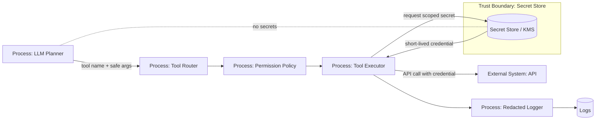

# 10 — Secrets Management

> Навигация: [Оглавление](../../README.md) · [← Назад](09-memory-isolation-context-sanitization.md) · [Вперёд →](../part-4-output-security/11-output-validation-fact-checking.md)

*Кратко: секреты не должны попадать в prompt, память, tool arguments от модели, логи и trace. Агент должен работать через scoped credentials, которые подставляет executor, а не LLM.*

> Примеры в разделе — на Go. Те же примеры на других языках:
> [Python](../../examples/python/part-3/10-secrets-management.py) ·
> [TypeScript](../../examples/typescript/part-3/10-secrets-management.ts)

## Суть

**Secrets Management** — это хранение, выдача, использование, ротация и отзыв секретов: API keys, tokens, passwords, private keys, session cookies, database credentials.

В агентных системах секреты особенно опасны, потому что агент может:

- увидеть секрет во входных данных;
- сохранить его в память;
- вставить в prompt;
- отправить во внешний tool;
- вывести пользователю;
- записать в логи;
- использовать не по назначению.

Главное правило:

```text
LLM не должна видеть секреты.
Секреты получает только executor в момент выполнения конкретного tool.
```

## Где секреты не должны появляться

| Место | Почему опасно |
|---|---|
| Prompt / context | модель может раскрыть секрет в ответе |
| Memory | секрет становится долгоживущим |
| RAG index | секрет становится searchable |
| Tool arguments от LLM | секрет может быть подменён или утечь |
| Logs / traces | широкая зона доступа |
| Ошибки / stack traces | утечка через диагностику |
| Frontend | пользователь может увидеть token |
| Notebook / examples | случайная публикация |

## DFD: secretless LLM, secrets only in executor



## Threat model

| Угроза | Пример | Risk | Контроль |
|---|---|---:|---|
| Secret in prompt | API key вставлен в контекст модели | High | secret detector, prompt redaction |
| Secret in memory | токен сохранён как факт | High | never-store policy |
| Secret in logs | args tool call содержат password | High | redacted logger |
| Over-scoped token | agent token имеет admin-доступ | High | scoped credentials |
| Long-lived token | leaked token работает месяцами | High | short-lived credentials |
| Tool exfiltration | агент отправляет secret во внешний URL | High | egress control, allowlist |
| Prompt leakage | пользователь просит показать system/env | Medium | output filter, no env in context |
| Secret in error | stack trace показывает DSN | Medium | safe error handling |

## Типы секретов

| Тип | Пример | Политика |
|---|---|---|
| API key | `sk-...`, `ghp_...` | vault + redaction |
| OAuth token | access/refresh token | short-lived + scoped |
| DB credentials | DSN, password | service account + rotation |
| Private key | PEM key | KMS/HSM where possible |
| Session cookie | browser session | isolated browser profile |
| Webhook secret | signing key | never in prompt/logs |
| Internal URL with token | signed URL | TTL + domain allowlist |

## Правила использования секретов агентом

1. **Secretless prompt** — секреты не включаются в prompt/context.
2. **Executor-side injection** — credential добавляет tool executor, не LLM.
3. **Scoped credentials** — минимальный scope под конкретный tool/action.
4. **Short-lived credentials** — временные токены лучше постоянных.
5. **Redaction everywhere** — logs, traces, errors, tool observations.
6. **No raw env inheritance** — sandbox не наследует env приложения.
7. **Rotation and revocation** — есть процесс замены и отзыва.
8. **Audit** — кто, когда и для какого tool запросил secret.

## Go snippet: secret provider и executor-side injection

```go
package agentsec

import (
	"context"
	"errors"
)

type SecretScope struct {
	ToolName string
	Action   string
	UserID   string
	Resource string
}

type SecretProvider interface {
	GetScopedToken(ctx context.Context, scope SecretScope) (string, error)
}

type ExternalAPIClient struct {
	Secrets SecretProvider
	HTTP    HTTPClient
}

type HTTPClient interface {
	Post(ctx context.Context, url string, bearerToken string, body []byte) ([]byte, error)
}

type SendRequestArgs struct {
	Endpoint string `json:"endpoint"`
	Payload  string `json:"payload"`
	// Важно: здесь нет Token/APIKey.
	// LLM не должна формировать секрет в аргументах.
}

func (c ExternalAPIClient) SendRequest(ctx context.Context, userID string, args SendRequestArgs) ([]byte, error) {
	if args.Endpoint == "" {
		return nil, errors.New("endpoint is required")
	}

	token, err := c.Secrets.GetScopedToken(ctx, SecretScope{
		ToolName: "external_api.send_request",
		Action:   "send",
		UserID:   userID,
		Resource: args.Endpoint,
	})
	if err != nil {
		return nil, err
	}

	return c.HTTP.Post(ctx, args.Endpoint, token, []byte(args.Payload))
}
```

Главная мысль:

```text
Tool args не содержат token.
Token запрашивается executor'ом после policy/validation.
```

## Go snippet: redacted logger

```go
package agentsec

import (
	"regexp"
	"strings"
)

type Redactor struct {
	patterns []*regexp.Regexp
}

func NewRedactor() Redactor {
	return Redactor{patterns: []*regexp.Regexp{
		regexp.MustCompile(`(?i)(api[_-]?key|token|password|secret)\s*[:=]\s*[^\s,]+`),
		regexp.MustCompile(`-----BEGIN [A-Z ]+PRIVATE KEY-----[\s\S]+?-----END [A-Z ]+PRIVATE KEY-----`),
		regexp.MustCompile(`(?i)bearer\s+[a-z0-9._\-]+`),
	}}
}

func (r Redactor) Redact(s string) string {
	out := s
	for _, p := range r.patterns {
		out = p.ReplaceAllString(out, "[REDACTED_SECRET]")
	}
	return out
}

type SafeLogger struct {
	Redactor Redactor
}

func (l SafeLogger) Log(event string, fields map[string]string) {
	safe := map[string]string{}
	for k, v := range fields {
		if looksSensitiveKey(k) {
			safe[k] = "[REDACTED_SECRET]"
			continue
		}
		safe[k] = l.Redactor.Redact(v)
	}

	// Здесь запись в реальный logger/tracing backend.
	_ = event
	_ = safe
}

func looksSensitiveKey(k string) bool {
	k = strings.ToLower(k)
	for _, marker := range []string{"token", "password", "secret", "api_key", "authorization"} {
		if strings.Contains(k, marker) {
			return true
		}
	}
	return false
}
```

## Secret handling by layer

| Layer | Что делать |
|---|---|
| Input | detect and redact secrets before context |
| Context | never include secrets |
| Tools | executor-side injection only |
| Memory | never store secrets |
| Logs | redact keys and values |
| Sandbox | clean env, no inherited credentials |
| Egress | block exfiltration domains |
| Incident response | rotate leaked credentials |

## Anti-patterns

| Плохо | Почему опасно | Лучше |
|---|---|---|
| `api_key` в tool args | LLM видит секрет | executor-side secret injection |
| `.env` доступен sandbox | prompt injection может прочитать env | clean env |
| один admin token на все tools | большой blast radius | per-tool scoped token |
| логировать raw request | secrets в observability | redacted logger |
| сохранять секреты в memory | долгоживущая утечка | never-store policy |
| использовать long-lived token | сложнее отозвать | short-lived credentials |
| показывать stack trace пользователю | DSN/token leak | safe errors |

## Маппинг на OWASP ASI / LLM Top 10

| Риск | Связь |
|---|---|
| LLM02 Sensitive Information Disclosure | секреты могут раскрыться через prompt/output/logs |
| LLM07 System Prompt Leakage | системные инструкции и env могут быть раскрыты |
| LLM06 Excessive Agency | агент действует с сильными credentials |
| ASI03 Identity & Privilege Abuse | misuse scoped identity / token |
| ASI02 Tool Misuse & Exploitation | tool использует секрет не по назначению |

## Чек-лист

- [ ] LLM не получает API keys, tokens, passwords.
- [ ] Tool args не содержат секреты.
- [ ] Secrets подставляет executor после policy/validation.
- [ ] Credentials имеют минимальный scope.
- [ ] Предпочтение short-lived tokens.
- [ ] Sandbox не наследует env приложения.
- [ ] Logs и traces проходят redaction.
- [ ] Memory запрещает хранить secrets.
- [ ] Ошибки не раскрывают DSN/token/env.
- [ ] Есть процесс rotation/revocation.

## Литература

- [Список литературы](../literature.md#практические-руководства)
- [OWASP Top 10 for LLM Applications 2025](https://genai.owasp.org/llm-top-10/)
- [OWASP Agentic AI Threats and Mitigations](https://genai.owasp.org/resource/agentic-ai-threats-and-mitigations/)
- [OpenAI Agents SDK — Agents](https://developers.openai.com/api/docs/guides/agents)
- [OpenAI Agents SDK — Guardrails](https://openai.github.io/openai-agents-python/guardrails/)
- [NIST AI Risk Management Framework](https://www.nist.gov/itl/ai-risk-management-framework)

## См. также

- [04 — PII Redaction и Content Filtering](../part-2-input-security/04-pii-redaction-content-filtering.md)
- [08 — Sandboxing](08-sandboxing.md)
- [13 — Egress Control и Data Exfiltration Prevention](../part-4-output-security/13-egress-control-data-exfiltration.md)
- [23 — Incident Response и Recovery](../part-7-testing-compliance/23-incident-response-recovery.md)
