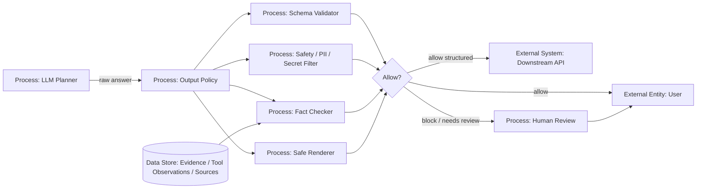

# 11 — Output Validation и Fact-Checking

> Навигация: [Оглавление](../../README.md) · [← Назад](../part-3-processing-security/10-secrets-management.md) · [Вперёд →](12-hallucination-detection.md)

*Кратко: выход модели нельзя считать доверенным. Перед показом пользователю или передачей в другой компонент ответ нужно проверить: формат, безопасность, ссылки на источники, отсутствие секретов, корректность действий и соответствие политике.*

> Примеры в разделе — на Go. Те же примеры на других языках:
> [Python](../../examples/python/part-4/11-output-validation-fact-checking.py) ·
> [TypeScript](../../examples/typescript/part-4/11-output-validation-fact-checking.ts)

## Суть

**Output Validation** — это слой проверки ответа агента перед тем, как он попадёт:

- пользователю;
- в браузер / HTML / Markdown renderer;
- в API другого сервиса;
- в базу данных;
- в tool другого агента;
- в лог / trace / отчёт;
- в цепочку автоматического действия.

Главное правило:

```text
Ответ LLM — это недоверенный выход.
Его нельзя напрямую выполнять, рендерить, сохранять или передавать дальше.
```

В обычном чат-боте плохой ответ чаще всего означает неправильный текст. В агенте плохой ответ может стать:

- аргументом следующего tool call;
- HTML/JS, который попадёт в интерфейс;
- SQL/командой/скриптом;
- письмом клиенту;
- решением об оплате, удалении, отправке, публикации;
- источником для другого агента.

Поэтому output validation — это не “красивый финальный фильтр”, а **граница безопасности между моделью и внешним миром**.

## Что проверяем на выходе

| Тип выхода | Что может пойти не так | Контроль |
|---|---|---|
| Текстовый ответ | секреты, PII, вредные инструкции, галлюцинации | redaction, policy check, fact-checking |
| JSON / structured output | неверная схема, лишние поля, опасные значения | strict schema, allowlist, reject unknown fields |
| Markdown / HTML | XSS, скрытые ссылки, tracking, phishing | escaping, sanitization, safe renderer |
| URL | SSRF, phishing, exfiltration endpoint | URL allowlist, domain policy |
| Code / shell / SQL | RCE, data loss, privilege abuse | never auto-execute, sandbox, review |
| Tool result summary | искажение результата tool | compare with raw observation |
| Citation / source | выдуманная ссылка, неверная цитата | source verification |
| Business decision | ошибочное approve/reject | human-in-the-loop, threshold |

## DFD: output validation layer



## Trust boundary

```text
Trust Boundary: Agent Runtime
  LLM Planner
  Tool Observations
  Internal State

Trust Boundary: Output Gate
  Schema validation
  Safety filtering
  Fact-checking
  Redaction
  Rendering policy

Trust Boundary: External World
  User
  Browser
  APIs
  Files
  Logs
  Other agents
```

Ключевая идея:

```text
Сырые ответы LLM не пересекают границу Output Gate без проверки.
```

## Угроза / контекст

| Угроза | Пример | Risk | Контроль |
|---|---|---:|---|
| Improper Output Handling | модель вернула HTML, который напрямую отрисован в браузере | High | escaping, sanitizer, CSP |
| Data leak | ответ содержит token, email, внутренние ID, персональные данные | High | secret/PII redaction |
| Hallucinated fact | агент уверенно пишет неподтверждённый факт | High | claim verification, citations |
| Fake citation | модель ссылается на несуществующий документ | Medium | citation resolver |
| Action laundering | опасное действие замаскировано как “рекомендация” | High | action classifier, approval |
| Tool result distortion | агент неправильно пересказал результат API | Medium | compare summary with raw observation |
| Format confusion | downstream ждёт JSON, получает текст с лишними полями | Medium | strict schema |
| Prompt leakage | модель раскрывает system/developer instructions | High | output policy, no prompt exposure |
| Phishing link | агент предлагает перейти на похожий домен | Medium | URL allowlist |
| Log contamination | ответ с секретом попадает в trace | High | redacted logging |

## Связь с OWASP / NIST

| Контроль | Связанный риск |
|---|---|
| Output validation | OWASP LLM05: Improper Output Handling |
| Secret / PII redaction | OWASP LLM02: Sensitive Information Disclosure |
| Fact-checking | OWASP LLM09: Misinformation |
| Human approval для опасных действий | OWASP LLM06: Excessive Agency |
| Test/evaluation/verification/validation | NIST AI RMF: TEVV throughout lifecycle |

## Подходы и контрмеры

### 1. Разделять типы выхода

Не все ответы одинаковы.

```text
final_text      → показать пользователю
structured_json → передать в API
tool_args       → отправить executor'у
html            → отрендерить в UI
code            → показать как текст, но не выполнять
```

Для каждого типа нужен свой policy.

### 2. Использовать allowlist, а не blacklist

Плохо:

```text
Запретить несколько опасных слов.
```

Лучше:

```text
Разрешить только ожидаемый формат, ожидаемые поля и ожидаемые типы значений.
```

### 3. Не выполнять output напрямую

```text
LLM output ≠ command
LLM output ≠ SQL
LLM output ≠ HTML
LLM output ≠ trusted JSON
```

Даже если модель “должна была” вернуть безопасный JSON, его всё равно нужно разобрать strict parser'ом и проверить.

### 4. Проверять утверждения отдельно от стиля

Красивый и уверенный ответ не означает правильный ответ.

Минимальный процесс:

```text
answer → extract claims → verify against evidence → mark unsupported → rewrite/block
```

### 5. Сохранять evidence trail

Если ответ основан на tool calls или документах, у ответа должен быть след:

```text
claim → source/tool observation → timestamp → confidence/status
```

Это нужно для аудита, incident response и red teaming.

## Go snippet: output validation pipeline

```go
package outputsec

import (
	"context"
	"errors"
	"fmt"
	"strings"
)

type OutputKind string

const (
	OutputFinalText  OutputKind = "final_text"
	OutputStructured OutputKind = "structured_json"
	OutputHTML       OutputKind = "html"
	OutputCode       OutputKind = "code"
)

type Output struct {
	Kind    OutputKind
	Text    string
	Meta    map[string]string
	Sources []SourceRef
}

type SourceRef struct {
	ID    string
	Title string
	URL   string
}

type ValidationResult struct {
	Allowed bool
	Reason  string
	Risk    string // High / Medium / Low
}

type Validator interface {
	Validate(ctx context.Context, out Output) ValidationResult
}

type Pipeline struct {
	Validators []Validator
}

func (p Pipeline) Validate(ctx context.Context, out Output) error {
	for _, v := range p.Validators {
		res := v.Validate(ctx, out)
		if !res.Allowed {
			return fmt.Errorf("output blocked: %s risk=%s", res.Reason, res.Risk)
		}
	}
	return nil
}

type SecretLeakValidator struct{}

func (SecretLeakValidator) Validate(ctx context.Context, out Output) ValidationResult {
	text := strings.ToLower(out.Text)
	markers := []string{"api_key", "authorization:", "bearer ", "password=", "secret="}
	for _, marker := range markers {
		if strings.Contains(text, marker) {
			return ValidationResult{Allowed: false, Reason: "possible secret leak", Risk: "High"}
		}
	}
	return ValidationResult{Allowed: true}
}

type HTMLPolicyValidator struct{}

func (HTMLPolicyValidator) Validate(ctx context.Context, out Output) ValidationResult {
	if out.Kind != OutputHTML {
		return ValidationResult{Allowed: true}
	}

	lower := strings.ToLower(out.Text)
	disallowed := []string{"<script", "javascript:", "onerror=", "onclick=", "<iframe"}
	for _, token := range disallowed {
		if strings.Contains(lower, token) {
			return ValidationResult{Allowed: false, Reason: "unsafe html output", Risk: "High"}
		}
	}

	return ValidationResult{Allowed: true}
}

type SourceRequiredValidator struct{}

func (SourceRequiredValidator) Validate(ctx context.Context, out Output) ValidationResult {
	if out.Meta["requires_sources"] != "true" {
		return ValidationResult{Allowed: true}
	}
	if len(out.Sources) == 0 {
		return ValidationResult{Allowed: false, Reason: "answer requires sources but none provided", Risk: "Medium"}
	}
	return ValidationResult{Allowed: true}
}

func Publish(ctx context.Context, p Pipeline, out Output) error {
	if out.Text == "" {
		return errors.New("empty output")
	}
	return p.Validate(ctx, out)
}
```

Главная мысль:

```text
Публикация ответа — отдельная операция.
Перед ней output проходит validators.
```

## Go snippet: safe structured output

```go
package outputsec

import (
	"encoding/json"
	"errors"
	"fmt"
	"strings"
)

type CustomerMessage struct {
	Subject string `json:"subject"`
	Body    string `json:"body"`
	Tone    string `json:"tone"`
}

func ParseCustomerMessage(raw []byte) (CustomerMessage, error) {
	dec := json.NewDecoder(strings.NewReader(string(raw)))
	dec.DisallowUnknownFields()

	var msg CustomerMessage
	if err := dec.Decode(&msg); err != nil {
		return CustomerMessage{}, fmt.Errorf("invalid structured output: %w", err)
	}

	if msg.Subject == "" || msg.Body == "" {
		return CustomerMessage{}, errors.New("subject and body are required")
	}

	allowedTone := map[string]bool{
		"neutral": true,
		"formal":  true,
		"friendly": true,
	}
	if !allowedTone[msg.Tone] {
		return CustomerMessage{}, fmt.Errorf("unsupported tone: %q", msg.Tone)
	}

	if strings.Contains(strings.ToLower(msg.Body), "password") {
		return CustomerMessage{}, errors.New("message may contain sensitive data")
	}

	return msg, nil
}
```

## Go snippet: проверка ссылок на источники

```go
package outputsec

type EvidenceStore interface {
	Exists(sourceID string) bool
	AllowedForUser(userID, sourceID string) bool
}

func ValidateSources(userID string, sources []SourceRef, store EvidenceStore) error {
	for _, s := range sources {
		if s.ID == "" {
			return errors.New("source id is required")
		}
		if !store.Exists(s.ID) {
			return fmt.Errorf("unknown source: %s", s.ID)
		}
		if !store.AllowedForUser(userID, s.ID) {
			return fmt.Errorf("source is not allowed for user: %s", s.ID)
		}
	}
	return nil
}
```

## Практический шаблон output policy

```yaml
output_policy:
  default: block_if_uncertain
  final_text:
    pii_redaction: true
    secret_redaction: true
    require_sources_for_factual_claims: true
  html:
    allow_raw_html: false
    render_as_text: true
  structured_json:
    strict_schema: true
    reject_unknown_fields: true
  code:
    auto_execute: false
    require_human_review: true
  external_links:
    allowlist_domains:
      - docs.example.com
      - support.example.com
```

## Чек-лист

- [ ] Сырые ответы LLM не передаются напрямую пользователю или downstream-системам.
- [ ] Для structured output используется strict schema.
- [ ] Unknown fields запрещены.
- [ ] HTML/Markdown проходит безопасный renderer/sanitizer.
- [ ] Секреты и PII редактируются до публикации и логирования.
- [ ] Фактические утверждения проверяются по evidence/source.
- [ ] Ссылки на источники проверяются на существование и доступность пользователю.
- [ ] Код/SQL/shell-команды не выполняются автоматически.
- [ ] Ответы, влияющие на бизнес-действия, требуют approval.
- [ ] Есть audit trail: prompt, tool observations, output, validation decision.

## Литература

- [Список литературы](../literature.md#инструменты)
- [OWASP LLM05:2025 Improper Output Handling](https://genai.owasp.org/llmrisk/llm052025-improper-output-handling/)
- [OWASP LLM02:2025 Sensitive Information Disclosure](https://genai.owasp.org/llmrisk/llm022025-sensitive-information-disclosure/)
- [OWASP LLM09:2025 Misinformation](https://genai.owasp.org/llmrisk/llm092025-misinformation/)
- [OpenAI Cookbook — Developing Hallucination Guardrails](https://developers.openai.com/cookbook/examples/developing_hallucination_guardrails)
- [NIST AI Risk Management Framework 1.0](https://www.nist.gov/itl/ai-risk-management-framework)

## См. также

- [04 — PII Redaction и Content Filtering](../part-2-input-security/04-pii-redaction-content-filtering.md)
- [07 — Parameter Validation и Schema Enforcement](../part-3-processing-security/07-parameter-validation-schema.md)
- [10 — Secrets Management](../part-3-processing-security/10-secrets-management.md)
- [12 — Hallucination Detection](12-hallucination-detection.md)
- [14 — Human-in-the-Loop](../part-5-control-observability/14-human-in-the-loop.md)
