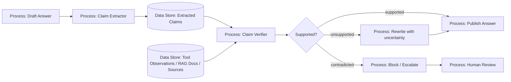

# 12 — Hallucination Detection

> Навигация: [Оглавление](../../README.md) · [← Назад](11-output-validation-fact-checking.md) · [Вперёд →](13-egress-control-data-exfiltration.md)

*Кратко: галлюцинация — это не просто “модель ошиблась”. В агенте галлюцинация может привести к неправильному tool call, ложному отчёту, фальшивой ссылке, неверному решению или опасной автоматизации. Поэтому фактические утверждения нужно проверять по источникам и наблюдениям tools.*

## Суть

**Hallucination Detection** — это проверка фактических утверждений модели на поддержку в доступных источниках.

В контексте AI-агентов важно разделять:

| Тип | Пример | Почему опасно |
|---|---|---|
| Factual hallucination | агент выдумал факт | пользователь принимает неверное решение |
| Citation hallucination | ссылка/источник не существует | создаётся ложное доверие |
| Tool hallucination | агент утверждает, что tool вернул то, чего не было | искажение результата системы |
| Action hallucination | агент считает действие выполненным, хотя оно не выполнено | операционный сбой |
| Policy hallucination | агент выдумывает правило или разрешение | обход процесса согласования |
| Identity hallucination | агент путает пользователя, клиента, tenant | утечка или неверное действие |

Главное правило:

```text
Факт считается допустимым только если он поддержан evidence.
Нет evidence — нет уверенного утверждения.
```

## Чем отличается от Output Validation

| Output Validation | Hallucination Detection |
|---|---|
| Проверяет безопасность и формат выхода | Проверяет фактическую поддержку утверждений |
| Работает с HTML, JSON, PII, schema, policy | Работает с claims, sources, tool observations |
| Может заблокировать опасный формат | Может пометить утверждение как unsupported |
| Вопрос: “можно ли это отдавать наружу?” | Вопрос: “подтверждено ли это?” |

Оба слоя нужны одновременно.

## DFD: hallucination guardrail



## Trust boundary

```text
Draft Answer — недоверенный текст модели.
Evidence — доверенные/условно доверенные источники: tool observations, документы, БД, approved references.
Verifier — отдельный слой проверки, желательно отделённый от генератора.
Published Answer — только supported / rewritten / reviewed утверждения.
```

Важно:

```text
Модель, которая сгенерировала ответ, не должна быть единственным судьёй своей правоты.
```

## Угроза / контекст

| Угроза | Пример | Risk | Контроль |
|---|---|---:|---|
| Unsupported claim | агент пишет факт без источника | Medium | claim extraction + verification |
| Contradicted claim | ответ противоречит документу/API | High | source-grounded verification |
| Fake source | ссылка выглядит правдоподобно, но не существует | High | source resolver |
| Tool result mismatch | tool вернул `false`, агент написал `true` | High | observation comparison |
| Overconfident answer | “точно”, “гарантированно” без evidence | Medium | confidence policy |
| Missing uncertainty | модель не говорит, что данных недостаточно | Medium | uncertainty rewrite |
| Stale fact | агент использует старую информацию | Medium | freshness check |
| Wrong tenant/user | факт взят из чужого контекста | High | tenant isolation, source ACL |
| Policy hallucination | агент пишет “это разрешено”, хотя нет approval | High | policy engine as source of truth |

## Классификация claims

Не все предложения надо проверять одинаково.

| Тип утверждения | Проверять? | Пример |
|---|---:|---|
| Фактическое | Да | “Счёт оплачен 12 мая” |
| Числовое | Да | “Сумма 30 000 рублей” |
| Ссылка на источник | Да | “Согласно документу X” |
| Результат tool | Да | “API вернул статус success” |
| Мнение | Обычно нет | “Это удобный подход” |
| Рекомендация | Частично | “Лучше сделать так” |
| Предупреждение | Частично | “Это может быть опасно” |
| Творческий текст | Нет / низкий приоритет | “Напиши метафору” |

## Статусы проверки

| Статус | Значение | Что делать |
|---|---|---|
| `supported` | claim подтверждён evidence | можно публиковать |
| `unsupported` | evidence нет | переписать с неопределённостью или убрать |
| `contradicted` | evidence противоречит claim | блокировать или отправить на review |
| `stale` | источник устарел | обновить источник / пометить дату |
| `not_checkable` | claim нельзя проверить автоматически | не усиливать уверенность |

## Подходы и контрмеры

### 1. Grounded generation

Лучше не просто “проверять после”, а заставлять ответ строиться вокруг evidence:

```text
retrieved docs / tool observations → answer with citations → claim verification
```

### 2. Claim extraction

Из ответа выделяются проверяемые утверждения:

```text
"Компания получила оплату 12 мая 2026 на сумму 30 000 рублей."
→ claim.amount = 30000
→ claim.date = 2026-05-12
→ claim.event = payment_received
```

### 3. Verification against evidence

Проверка должна идти не “по памяти модели”, а по источникам:

- tool observation;
- RAG document;
- database query;
- approved knowledge base;
- verified external source;
- audit log.

### 4. Confidence policy

Не запрещать все сомнительные ответы. Лучше управлять формулировкой:

| Проверка | Разрешённая формулировка |
|---|---|
| supported | “В документе указано…” |
| unsupported | “В предоставленных источниках я не вижу подтверждения…” |
| contradicted | “Это противоречит источнику…” |
| stale | “По данным на дату X…” |

### 5. Отдельный verifier

Для важных сценариев verifier лучше отделить от генератора:

```text
Generator model → Draft
Verifier model / deterministic checker → Claim status
Policy → Publish / rewrite / block
```

## Go snippet: claim model

```go
package outputsec

import "time"

type ClaimType string

const (
	ClaimFact      ClaimType = "fact"
	ClaimNumber    ClaimType = "number"
	ClaimCitation  ClaimType = "citation"
	ClaimTool      ClaimType = "tool_result"
	ClaimPolicy    ClaimType = "policy"
	ClaimOpinion   ClaimType = "opinion"
)

type ClaimStatus string

const (
	Supported    ClaimStatus = "supported"
	Unsupported  ClaimStatus = "unsupported"
	Contradicted ClaimStatus = "contradicted"
	Stale        ClaimStatus = "stale"
	NotCheckable ClaimStatus = "not_checkable"
)

type Claim struct {
	ID        string
	Text      string
	Type      ClaimType
	SourceIDs []string
	CreatedAt time.Time
}

type ClaimResult struct {
	ClaimID    string
	Status     ClaimStatus
	EvidenceID string
	Reason     string
	Confidence float64
}
```

## Go snippet: verifier interface

```go
package outputsec

import (
	"context"
	"strings"
)

type Evidence struct {
	ID      string
	Text    string
	FreshAt string
	ACL     []string // user IDs / tenant IDs / roles
}

type EvidenceStore interface {
	Find(ctx context.Context, claim Claim) ([]Evidence, error)
}

type ClaimVerifier struct {
	Store EvidenceStore
}

func (v ClaimVerifier) Verify(ctx context.Context, claim Claim) (ClaimResult, error) {
	if claim.Type == ClaimOpinion {
		return ClaimResult{ClaimID: claim.ID, Status: NotCheckable, Reason: "opinion"}, nil
	}

	evidence, err := v.Store.Find(ctx, claim)
	if err != nil {
		return ClaimResult{}, err
	}
	if len(evidence) == 0 {
		return ClaimResult{ClaimID: claim.ID, Status: Unsupported, Reason: "no evidence found"}, nil
	}

	for _, e := range evidence {
		if supports(claim.Text, e.Text) {
			return ClaimResult{
				ClaimID:    claim.ID,
				Status:     Supported,
				EvidenceID: e.ID,
				Reason:     "matched evidence",
				Confidence: 0.8,
			}, nil
		}
	}

	return ClaimResult{ClaimID: claim.ID, Status: Unsupported, Reason: "evidence found but no support", Confidence: 0.4}, nil
}

func supports(claimText, evidenceText string) bool {
	// Упрощённый пример. В реальной системе здесь может быть:
	// - exact match для чисел/дат/id;
	// - semantic similarity;
	// - отдельный verifier model;
	// - проверка по БД/API.
	claimText = strings.ToLower(claimText)
	evidenceText = strings.ToLower(evidenceText)
	return strings.Contains(evidenceText, claimText)
}
```

## Go snippet: policy для публикации

```go
package outputsec

import "fmt"

type PublishDecision string

const (
	PublishAllow  PublishDecision = "allow"
	PublishRewrite PublishDecision = "rewrite"
	PublishBlock  PublishDecision = "block"
	PublishReview PublishDecision = "review"
)

type HallucinationPolicy struct {
	BlockContradictions bool
	ReviewHighImpact    bool
}

func (p HallucinationPolicy) Decide(results []ClaimResult, highImpact bool) (PublishDecision, error) {
	for _, r := range results {
		if r.Status == Contradicted && p.BlockContradictions {
			return PublishBlock, fmt.Errorf("contradicted claim: %s", r.ClaimID)
		}
	}

	if highImpact && p.ReviewHighImpact {
		for _, r := range results {
			if r.Status == Unsupported || r.Status == NotCheckable {
				return PublishReview, fmt.Errorf("high-impact answer contains unverified claim: %s", r.ClaimID)
			}
		}
	}

	for _, r := range results {
		if r.Status == Unsupported || r.Status == Stale {
			return PublishRewrite, nil
		}
	}

	return PublishAllow, nil
}
```

## Go snippet: безопасная переформулировка unsupported claims

```go
package outputsec

import "strings"

func RewriteWithUncertainty(answer string, results []ClaimResult) string {
	needsUncertainty := false
	for _, r := range results {
		if r.Status == Unsupported || r.Status == Stale || r.Status == NotCheckable {
			needsUncertainty = true
			break
		}
	}

	if !needsUncertainty {
		return answer
	}

	prefix := "По доступным источникам это не подтверждено полностью. "
	if strings.HasPrefix(answer, prefix) {
		return answer
	}
	return prefix + answer
}
```

## Мини-чеклист для hallucination guardrail

```text
1. Есть ли в ответе проверяемые факты?
2. Есть ли для каждого факта источник?
3. Источник существует?
4. Пользователь имеет право видеть этот источник?
5. Источник свежий?
6. Ответ не искажает tool observation?
7. Нет ли противоречия между ответом и evidence?
8. Нужно ли добавить неопределённость?
9. Нужно ли отправить на human review?
```

## Практическая политика

```yaml
hallucination_policy:
  factual_claims:
    require_evidence: true
    unsupported: rewrite_with_uncertainty
    contradicted: block
  citations:
    require_existing_source_id: true
    require_user_access: true
  tool_results:
    compare_with_raw_observation: true
  high_impact_answers:
    unsupported_claims: human_review
  freshness:
    require_date_for_time_sensitive_claims: true
```

## Когда достаточно простого подхода

Простой deterministic checker подойдёт, если:

- проверяются даты, суммы, ID, статусы;
- есть structured tool observation;
- есть явные source IDs;
- важно быстро отсеять очевидные ошибки.

Verifier model нужен, если:

- claims сформулированы свободным языком;
- источники большие;
- нужна семантическая проверка;
- нужно классифицировать “supported / unsupported / contradicted”.

## Чек-лист

- [ ] Ответы с фактами требуют источников.
- [ ] Источники проверяются на существование.
- [ ] Проверяется доступ пользователя к источнику.
- [ ] Tool observations не пересказываются без сравнения.
- [ ] Unsupported claims переписываются с неопределённостью или удаляются.
- [ ] Contradicted claims блокируются.
- [ ] Для time-sensitive claims указывается дата источника.
- [ ] Для high-impact сценариев включён human review.
- [ ] Verifier отделён от generator в критичных сценариях.
- [ ] Решения verifier логируются для аудита.

## Литература

- [Список литературы](../literature.md#академические-исследования)
- [OpenAI Cookbook — Developing Hallucination Guardrails](https://developers.openai.com/cookbook/examples/developing_hallucination_guardrails)
- [OpenAI Guardrails Python — Hallucination Detection](https://openai.github.io/openai-guardrails-python/ref/checks/hallucination_detection/)
- [OWASP LLM09:2025 Misinformation](https://genai.owasp.org/llmrisk/llm092025-misinformation/)
- [NIST AI RMF 1.0](https://www.nist.gov/itl/ai-risk-management-framework)

## См. также

- [02 — Модель угроз](../part-1-architecture-threats/02-threat-model.md)
- [11 — Output Validation и Fact-Checking](11-output-validation-fact-checking.md)
- [15 — Observability и Tracing](../part-5-control-observability/15-observability-tracing.md)
- [20 — Red Teaming и Adversarial Testing](../part-7-testing-compliance/20-red-teaming-adversarial-testing.md)
