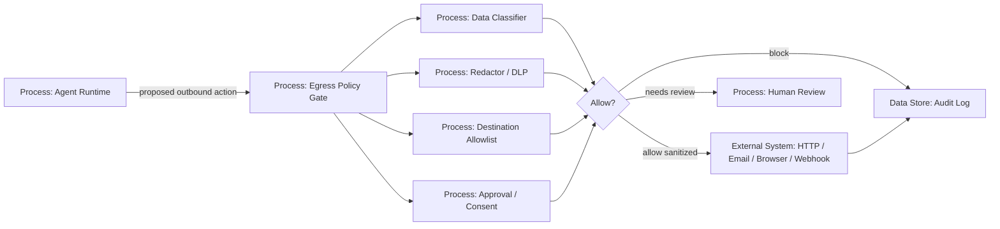

# 13 — Egress Control и Data Exfiltration Prevention

> Навигация: [Оглавление](../../README.md) · [← Назад](12-hallucination-detection.md) · [Вперёд →](../part-5-control-observability/14-human-in-the-loop.md)

*Кратко: агент не должен свободно отправлять данные наружу. Любой исходящий канал — HTTP, email, webhook, browser, файл, лог, другой агент — должен проходить через egress policy, redaction, allowlist и audit.*

> Примеры в разделе — на Go. Те же примеры на других языках:
> [Python](../../examples/python/part-4/13-egress-control-data-exfiltration.py) ·
> [TypeScript](../../examples/typescript/part-4/13-egress-control-data-exfiltration.ts)

## Суть

**Egress Control** — это контроль исходящих данных и соединений.

В обычном приложении egress control часто означает сетевые правила: куда сервис может ходить. В AI-агенте этого недостаточно, потому что данные могут уйти через:

- ответ пользователю;
- HTTP request;
- email;
- webhook;
- browser automation;
- file upload;
- tool arguments;
- logs/traces;
- RAG/memory write;
- сообщение другому агенту;
- ошибку / stack trace.

Главное правило:

```text
Агент не отправляет данные наружу напрямую.
Любой egress проходит через policy gate.
```

## Что считаем egress

| Канал | Пример | Риск |
|---|---|---|
| User response | агент показывает секрет пользователю | data leak |
| HTTP request | POST на внешний URL | exfiltration |
| Email | письмо с вложением не тому получателю | data breach |
| Webhook | отправка internal payload в чужой endpoint | data exfiltration |
| Browser | переход на phishing/tracking URL | leakage, SSRF-like |
| File upload | выгрузка CSV/логов наружу | mass leak |
| Logs/traces | token/PII в observability backend | persistent leak |
| Memory/RAG | секрет сохранён в long-term storage | future leak |
| Multi-agent message | другой агент получает лишний контекст | cross-agent leakage |
| Tool args | LLM вставила secret в аргумент tool | credential leak |

## DFD: egress policy gate



## Trust boundary

```text
Agent Runtime — может содержать чувствительный контекст.
Egress Policy Gate — решает, что можно отправлять, кому и в каком виде.
External Destinations — недоверенная внешняя среда.
```

Критичное правило:

```text
Destination + Data + Actor + Purpose проверяются вместе.
```

Недостаточно проверить только URL. Нужно понять:

```text
что отправляем → кому → от чьего имени → зачем → есть ли право → нужно ли редактировать
```

## Угроза / контекст

| Угроза | Пример | Risk | Контроль |
|---|---|---:|---|
| Direct exfiltration | агент отправляет документ на attacker.com | High | destination allowlist |
| Secret exfiltration | API key уходит в HTTP body | High | secret detection + redaction |
| PII leakage | персональные данные уходят в внешний сервис | High | DLP, consent, minimization |
| Cross-tenant leak | данные tenant A отправлены tenant B | High | tenant isolation, ACL |
| Log exfiltration | секрет попадает в trace backend | High | redacted logger |
| Email misdelivery | агент отправляет отчёт не тому адресу | High | recipient policy, approval |
| Browser leakage | агент открывает URL с query-параметрами | Medium | URL sanitizer |
| Covert channel | данные закодированы в URL/path/base64 | High | payload classifier, size limits |
| Tool chaining | один tool читает файл, другой отправляет наружу | High | flow-aware policy |
| Over-sharing | агент отправляет весь документ вместо выдержки | Medium | data minimization |

## Подходы и контрмеры

### 1. Destination allowlist

Разрешать не “любой интернет”, а конкретные назначения:

```yaml
egress:
  http_allowlist:
    - api.company.local
    - docs.company.com
  email_domains:
    - company.com
  webhooks:
    - https://hooks.company.com/agent-events
```

Для опасных действий — approval.

### 2. Data classification

Перед отправкой данные классифицируются:

| Класс | Примеры | Политика |
|---|---|---|
| Public | публичная документация | можно отправлять разрешённым destinations |
| Internal | внутренний текст, логи без PII | только approved systems |
| Confidential | договоры, финансы, клиентские данные | approval + minimization |
| Secret | токены, ключи, пароли | block / redact |
| Personal | email, телефон, паспорт, медицинские данные | consent + legal basis + redaction |

### 3. Data minimization

Плохо:

```text
Отправить весь документ во внешний API.
```

Лучше:

```text
Отправить только нужные поля / summary / anonymized excerpt.
```

### 4. Flow-aware policy

Нужно отслеживать цепочку:

```text
read_file(secret.txt) → summarize → http_post(external_url)
```

Даже если `http_post` сам по себе разрешён, данные из чувствительного источника могут быть запрещены к отправке.

### 5. Approval для high-risk egress

Примеры, где нужен human confirmation:

- отправка email наружу;
- отправка вложений;
- публикация на сайт;
- выгрузка таблиц/CSV;
- отправка данных в новый домен;
- отправка confidential/personal данных.

## Go snippet: egress request model

```go
package outputsec

import (
	"context"
	"errors"
	"fmt"
	"net/url"
	"strings"
)

type DataClass string

const (
	DataPublic       DataClass = "public"
	DataInternal     DataClass = "internal"
	DataConfidential DataClass = "confidential"
	DataSecret       DataClass = "secret"
	DataPersonal     DataClass = "personal"
)

type EgressChannel string

const (
	ChannelHTTP    EgressChannel = "http"
	ChannelEmail   EgressChannel = "email"
	ChannelBrowser EgressChannel = "browser"
	ChannelLog     EgressChannel = "log"
	ChannelAgent   EgressChannel = "agent_message"
)

type EgressRequest struct {
	UserID      string
	TenantID    string
	Channel     EgressChannel
	Destination string
	Payload     string
	DataClasses []DataClass
	Purpose     string
}

type EgressDecision struct {
	Allowed       bool
	NeedsApproval bool
	Reason        string
	SanitizedBody string
}
```

## Go snippet: destination allowlist + data policy

```go
package outputsec

type EgressPolicy struct {
	AllowedHTTPDomains  map[string]bool
	AllowedEmailDomains map[string]bool
}

func (p EgressPolicy) Decide(ctx context.Context, req EgressRequest) (EgressDecision, error) {
	if req.Destination == "" {
		return EgressDecision{}, errors.New("destination is required")
	}

	if contains(req.DataClasses, DataSecret) {
		return EgressDecision{Allowed: false, Reason: "secret data cannot leave runtime"}, nil
	}

	if contains(req.DataClasses, DataPersonal) || contains(req.DataClasses, DataConfidential) {
		return EgressDecision{
			Allowed:       false,
			NeedsApproval: true,
			Reason:        "personal/confidential data requires approval",
		}, nil
	}

	switch req.Channel {
	case ChannelHTTP, ChannelBrowser:
		if !p.allowedURL(req.Destination) {
			return EgressDecision{Allowed: false, Reason: "destination domain is not allowed"}, nil
		}
	case ChannelEmail:
		if !p.allowedEmail(req.Destination) {
			return EgressDecision{Allowed: false, Reason: "recipient domain is not allowed"}, nil
		}
	case ChannelLog:
		// Logs are internal, but still need redaction.
	default:
		return EgressDecision{Allowed: false, Reason: "unsupported egress channel"}, nil
	}

	return EgressDecision{Allowed: true, SanitizedBody: redact(req.Payload)}, nil
}

func (p EgressPolicy) allowedURL(raw string) bool {
	u, err := url.Parse(raw)
	if err != nil || u.Scheme == "" || u.Hostname() == "" {
		return false
	}
	if u.Scheme != "https" {
		return false
	}
	return p.AllowedHTTPDomains[strings.ToLower(u.Hostname())]
}

func (p EgressPolicy) allowedEmail(addr string) bool {
	parts := strings.Split(addr, "@")
	if len(parts) != 2 {
		return false
	}
	domain := strings.ToLower(parts[1])
	return p.AllowedEmailDomains[domain]
}

func contains(classes []DataClass, target DataClass) bool {
	for _, c := range classes {
		if c == target {
			return true
		}
	}
	return false
}

func redact(s string) string {
	markers := []string{"api_key=", "password=", "token=", "secret="}
	out := s
	for _, m := range markers {
		idx := strings.Index(strings.ToLower(out), m)
		if idx >= 0 {
			out = out[:idx] + m + "[REDACTED]"
		}
	}
	return out
}
```

## Go snippet: flow-aware taint tracking

```go
package outputsec

type Taint string

const (
	TaintNone         Taint = "none"
	TaintUserInput    Taint = "user_input"
	TaintSecretSource Taint = "secret_source"
	TaintPersonalData Taint = "personal_data"
	TaintTenantData   Taint = "tenant_data"
)

type AgentValue struct {
	Value  string
	Taints []Taint
}

func (v AgentValue) HasTaint(t Taint) bool {
	for _, x := range v.Taints {
		if x == t {
			return true
		}
	}
	return false
}

func BuildEgressFromValue(userID, tenantID, dest string, val AgentValue) EgressRequest {
	classes := []DataClass{DataInternal}

	if val.HasTaint(TaintSecretSource) {
		classes = append(classes, DataSecret)
	}
	if val.HasTaint(TaintPersonalData) {
		classes = append(classes, DataPersonal)
	}
	if val.HasTaint(TaintTenantData) {
		classes = append(classes, DataConfidential)
	}

	return EgressRequest{
		UserID:      userID,
		TenantID:    tenantID,
		Channel:     ChannelHTTP,
		Destination: dest,
		Payload:     val.Value,
		DataClasses: classes,
		Purpose:     "agent_outbound_request",
	}
}
```

Главная мысль:

```text
Проверяется не только текст payload, но и происхождение данных.
```

## Go snippet: safe HTTP client для agents

```go
package outputsec

import (
	"bytes"
	"context"
	"fmt"
	"net/http"
)

type SafeHTTPClient struct {
	Policy EgressPolicy
	Client *http.Client
}

func (c SafeHTTPClient) Post(ctx context.Context, req EgressRequest) (*http.Response, error) {
	decision, err := c.Policy.Decide(ctx, req)
	if err != nil {
		return nil, err
	}
	if decision.NeedsApproval {
		return nil, fmt.Errorf("egress requires approval: %s", decision.Reason)
	}
	if !decision.Allowed {
		return nil, fmt.Errorf("egress blocked: %s", decision.Reason)
	}

	httpReq, err := http.NewRequestWithContext(ctx, http.MethodPost, req.Destination, bytes.NewBufferString(decision.SanitizedBody))
	if err != nil {
		return nil, err
	}
	httpReq.Header.Set("Content-Type", "application/json")

	return c.Client.Do(httpReq)
}
```

## Egress policy template

```yaml
egress_policy:
  default: deny

  http:
    require_https: true
    allowlist_domains:
      - api.company.local
      - docs.company.com
    block_private_networks: true
    max_payload_bytes: 32768

  email:
    allowlist_domains:
      - company.com
    external_recipients_require_approval: true
    attachments_require_approval: true

  data_classes:
    public:
      action: allow
    internal:
      action: allow_to_approved_destinations
    confidential:
      action: require_approval
    personal:
      action: require_approval_and_redaction
    secret:
      action: block

  logs:
    redact_secrets: true
    redact_pii: true

  flow_tracking:
    enabled: true
    block_secret_taint: true
    review_personal_data_taint: true
```

## Практические правила

1. **Default deny** — если destination неизвестен, блокировать.
2. **HTTPS only** — никаких исходящих HTTP без TLS.
3. **No private network access** — агенту нельзя сканировать внутреннюю сеть через URL.
4. **Allowlist domains** — только заранее разрешённые домены.
5. **Payload size limits** — ограничение объёма исходящих данных.
6. **Secret class = block** — секреты не покидают runtime.
7. **Personal/confidential = approval** — человеческое подтверждение.
8. **Redaction before logs** — логи тоже egress.
9. **Flow-aware controls** — учитывать происхождение данных.
10. **Audit every decision** — allow/block/review должны логироваться.

## Чем egress отличается от secrets management

| Secrets Management | Egress Control |
|---|---|
| где и как хранить секреты | куда и какие данные можно отправлять |
| executor получает scoped credential | outbound action проходит policy |
| защищает token/password/key | защищает любые чувствительные данные |
| фокус: доступ к секрету | фокус: выход данных наружу |

Они дополняют друг друга:

```text
Secrets Management запрещает LLM видеть секрет.
Egress Control запрещает отправить секрет наружу, если он всё-таки появился в runtime.
```

## Чек-лист

- [ ] Все исходящие каналы проходят через egress policy.
- [ ] По умолчанию egress запрещён.
- [ ] HTTP/browser destinations проверяются по allowlist.
- [ ] Email recipients проверяются по domain/recipient policy.
- [ ] Personal/confidential данные требуют approval.
- [ ] Secret data блокируется.
- [ ] Payload проходит secret/PII redaction.
- [ ] Есть лимиты размера исходящих payload.
- [ ] Учитывается происхождение данных: tool, file, memory, user input, tenant.
- [ ] Логи и traces считаются egress-каналом.
- [ ] Все решения allow/block/review логируются.

## Литература

- [Список литературы](../literature.md#практические-руководства)
- [OWASP LLM02:2025 Sensitive Information Disclosure](https://genai.owasp.org/llmrisk/llm022025-sensitive-information-disclosure/)
- [OWASP LLM05:2025 Improper Output Handling](https://genai.owasp.org/llmrisk/llm052025-improper-output-handling/)
- [OWASP Agentic AI — Threats and Mitigations](https://genai.owasp.org/resource/agentic-ai-threats-and-mitigations/)
- [NIST AI RMF 1.0](https://www.nist.gov/itl/ai-risk-management-framework)

## См. также

- [04 — PII Redaction и Content Filtering](../part-2-input-security/04-pii-redaction-content-filtering.md)
- [06 — RBAC и Tool Permissions](../part-3-processing-security/06-rbac-tool-permissions.md)
- [10 — Secrets Management](../part-3-processing-security/10-secrets-management.md)
- [14 — Human-in-the-Loop](../part-5-control-observability/14-human-in-the-loop.md)
- [15 — Observability и Tracing](../part-5-control-observability/15-observability-tracing.md)
