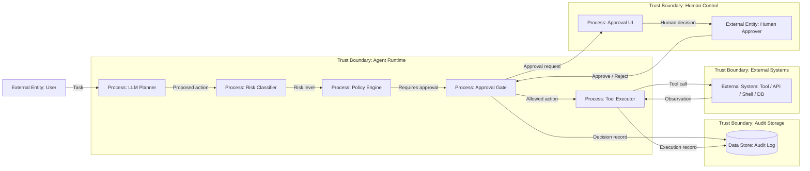

# 14 — Human-in-the-Loop

> Навигация: [Оглавление](../../README.md) · [← Назад](../part-4-output-security/13-egress-control-data-exfiltration.md) · [Вперёд →](15-observability-tracing.md)

*Кратко: Human-in-the-Loop — это контрольная точка перед опасным действием агента. Человек не “чинит LLM”, а утверждает или отклоняет конкретное действие с понятным контекстом, риском и audit trail.*

> Примеры в разделе — на Go. Те же примеры на других языках:
> [Python](../../examples/python/part-5/14-human-in-the-loop.py) ·
> [TypeScript](../../examples/typescript/part-5/14-human-in-the-loop.ts)

## Суть

AI-агент не должен выполнять опасные действия напрямую.

Правильная модель:

```text
LLM предлагает действие → policy оценивает риск → при необходимости человек подтверждает → runtime выполняет tool call → audit log фиксирует решение
```

Human-in-the-Loop нужен не для каждого шага. Он нужен для действий, где ошибка агента может привести к ущербу:

- отправка письма или сообщения от имени пользователя;
- удаление, изменение или публикация данных;
- платежи, заказы, сделки, юридически значимые действия;
- доступ к приватным данным;
- внешний egress: отправка данных в API, webhook, email, CRM, облако;
- запуск команд в shell / CI / production;
- изменение прав, токенов, секретов, политик.

Главная мысль:

> Человек подтверждает **действие**, а не “хороший ли ответ написала модель”.

## DFD



## Угроза / контекст

| Угроза | Пример | Risk |
|---|---|---|
| Approval bypass | агент вызывает tool напрямую, минуя approval gate | High |
| Approval fatigue | человек подтверждает всё подряд, не читая | Medium |
| Недостаточный контекст | человеку показывают “approve?”, но не показывают аргументы tool call | High |
| Подмена действия | UI показывает одно действие, runtime выполняет другое | High |
| Repudiation | невозможно доказать, кто и что подтвердил | Medium |
| Prompt injection через approval text | недоверенный контент попадает в текст подтверждения как инструкция | Medium |
| Auto-approval опасных действий | high-risk действие ошибочно считается safe | High |

## Подходы и контрмеры

### 1. Risk-based approval

Не все действия требуют человека.

| Risk | Что делать |
|---|---|
| Low | выполнить автоматически, но залогировать |
| Medium | выполнить автоматически только при allowlist / лимитах |
| High | требовать approval |
| Critical | требовать approval + second approver / manual execution |

### 2. Показывать человеку именно tool call

Плохо:

```text
Агент хочет продолжить. Подтвердить?
```

Хорошо:

```text
Tool: send_email
To: client@example.com
Subject: Коммерческое предложение
Data classification: external
Risk: High
Reason: отправка сообщения наружу от имени пользователя
```

### 3. Immutable audit trail

В audit log нужно фиксировать:

- `run_id`;
- `action_id`;
- имя tool;
- аргументы tool call после валидации;
- кто подтвердил;
- когда подтвердил;
- какой риск был присвоен;
- какой policy rule сработал;
- результат выполнения;
- отказ / timeout / cancel.

### 4. Separation of proposal and execution

LLM может предложить действие, но не должна сама его выполнять.

```text
LLM output != command
LLM output -> structured action proposal -> policy -> approval -> executor
```

### 5. Не смешивать approval и prompt

Текст, который показывается человеку, может содержать недоверенные данные: письмо, документ, веб-страницу, вывод tool.

Его нельзя вставлять в управляющие инструкции без маркировки:

```text
UNTRUSTED_CONTENT_START
...
UNTRUSTED_CONTENT_END
```

## Пример (Go)

### Типы действий и решений

```go
package approval

import (
    "context"
    "errors"
    "fmt"
    "time"
)

type RiskLevel string

const (
    RiskLow      RiskLevel = "Low"
    RiskMedium   RiskLevel = "Medium"
    RiskHigh     RiskLevel = "High"
    RiskCritical RiskLevel = "Critical"
)

type ToolAction struct {
    ID        string
    RunID     string
    Tool      string
    Args      map[string]any
    Risk      RiskLevel
    Reason    string
    CreatedAt time.Time
}

type Decision string

const (
    Approved Decision = "approved"
    Rejected Decision = "rejected"
    TimedOut Decision = "timed_out"
)

type ApprovalDecision struct {
    ActionID   string
    Decision   Decision
    ApproverID string
    Reason     string
    DecidedAt  time.Time
}

type ApprovalService interface {
    RequestApproval(ctx context.Context, action ToolAction) (ApprovalDecision, error)
}

type AuditLogger interface {
    LogApprovalRequested(ctx context.Context, action ToolAction) error
    LogApprovalDecision(ctx context.Context, decision ApprovalDecision) error
    LogToolExecuted(ctx context.Context, action ToolAction, result any) error
}
```

### Policy gate перед tool execution

```go
type Tool interface {
    Call(ctx context.Context, args map[string]any) (any, error)
}

type Runtime struct {
    Tools    map[string]Tool
    Approval ApprovalService
    Audit    AuditLogger
}

func RequiresApproval(action ToolAction) bool {
    switch action.Risk {
    case RiskHigh, RiskCritical:
        return true
    default:
        return false
    }
}

func (r *Runtime) Execute(ctx context.Context, action ToolAction) (any, error) {
    tool, ok := r.Tools[action.Tool]
    if !ok {
        return nil, fmt.Errorf("unknown tool: %s", action.Tool)
    }

    if RequiresApproval(action) {
        if err := r.Audit.LogApprovalRequested(ctx, action); err != nil {
            return nil, err
        }

        decision, err := r.Approval.RequestApproval(ctx, action)
        if err != nil {
            return nil, err
        }

        if err := r.Audit.LogApprovalDecision(ctx, decision); err != nil {
            return nil, err
        }

        if decision.Decision != Approved {
            return nil, errors.New("tool action was not approved")
        }
    }

    result, err := tool.Call(ctx, action.Args)
    if err != nil {
        return nil, err
    }

    if err := r.Audit.LogToolExecuted(ctx, action, result); err != nil {
        return nil, err
    }

    return result, nil
}
```

### Пример risk classifier

```go
func ClassifyAction(tool string, args map[string]any) (RiskLevel, string) {
    switch tool {
    case "send_email", "publish_post", "delete_file", "run_shell":
        return RiskHigh, "external side effect or destructive action"
    case "search_docs", "read_public_page":
        return RiskLow, "read-only action"
    case "query_database":
        if args["readonly"] == true {
            return RiskMedium, "internal data access"
        }
        return RiskHigh, "database write operation"
    default:
        return RiskHigh, "unknown tool requires explicit approval"
    }
}
```

## Чек-лист

- [ ] Опасные tools не вызываются напрямую из LLM output.
- [ ] Есть risk classifier для tool actions.
- [ ] High-risk действия требуют approval.
- [ ] Человеку показываются tool name, args, risk, reason.
- [ ] Approval фиксируется в audit log.
- [ ] Отклонение и timeout обрабатываются безопасно.
- [ ] Approval UI не скрывает реальные аргументы действия.
- [ ] Для critical actions есть second approver или manual execution.
- [ ] Недоверенный контент в approval request явно маркируется.
- [ ] Auto-approval разрешён только для low-risk действий.

## Литература

- [Список литературы](../literature.md#практические-руководства)
- [OpenAI Agents SDK — Agents](https://developers.openai.com/api/docs/guides/agents)
- [OWASP Agentic AI — Threats and Mitigations](https://genai.owasp.org/resource/agentic-ai-threats-and-mitigations/)
- [NIST AI Risk Management Framework](https://www.nist.gov/itl/ai-risk-management-framework)

## См. также

- [06 — RBAC и Tool Permissions](../part-3-processing-security/06-rbac-tool-permissions.md)
- [07 — Parameter Validation и Schema Enforcement](../part-3-processing-security/07-parameter-validation-schema.md)
- [13 — Egress Control и Data Exfiltration Prevention](../part-4-output-security/13-egress-control-data-exfiltration.md)
- [15 — Observability и Tracing](15-observability-tracing.md)
