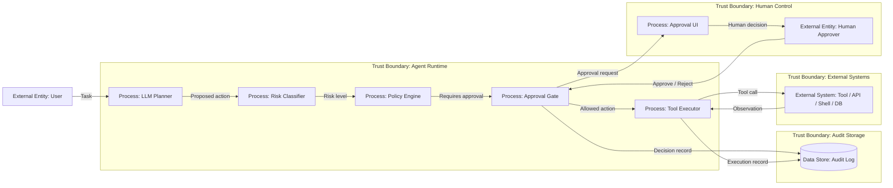

# 14 — Human-in-the-Loop

> Навигация: [Оглавление](../../README.md) · [← Назад](../part-4-output-security/13-egress-control-data-exfiltration.md) · [Вперёд →](15-observability-tracing.md)

*Кратко: Human-in-the-Loop — это контрольная точка перед опасным действием агента. Человек не “чинит LLM”, а утверждает или отклоняет конкретное действие с понятным контекстом, риском и audit trail.*

> Примеры в разделе — на Go. Те же примеры на других языках:
> [Python](../../examples/python/part-5/14-human-in-the-loop.py) ·
> [TypeScript](../../examples/typescript/part-5/14-human-in-the-loop.ts)

## Суть

AI-агент не должен выполнять опасные действия напрямую.

Правильная модель:

```text
LLM предлагает действие → policy оценивает риск → при необходимости человек подтверждает → runtime выполняет tool call → audit log фиксирует решение
```

Human-in-the-Loop нужен не для каждого шага. Он нужен для действий, где ошибка агента может привести к ущербу:

- отправка письма или сообщения от имени пользователя;
- удаление, изменение или публикация данных;
- платежи, заказы, сделки, юридически значимые действия;
- доступ к приватным данным;
- внешний egress: отправка данных в API, webhook, email, CRM, облако;
- запуск команд в shell / CI / production;
- изменение прав, токенов, секретов, политик.

Главная мысль:

> Человек подтверждает **действие**, а не “хороший ли ответ написала модель”.

## DFD


```mermaid
flowchart LR
    User[External Entity: User]

    subgraph Runtime["Trust Boundary: Agent Runtime"]
        Planner[Process: LLM Planner]
        Risk[Process: Risk Classifier]
        Policy[Process: Policy Engine]
        ApprovalGate[Process: Approval Gate]
        ToolExecutor[Process: Tool Executor]
    end

    subgraph Human["Trust Boundary: Human Control"]
        Approver[External Entity: Human Approver]
        ApprovalUI[Process: Approval UI]
    end

    subgraph Storage["Trust Boundary: Audit Storage"]
        AuditLog[(Data Store: Audit Log)]
    end

    subgraph External["Trust Boundary: External Systems"]
        Tool[External System: Tool / API / Shell / DB]
    end

    User -->|Task| Planner
    Planner -->|Proposed action| Risk
    Risk -->|Risk level| Policy
    Policy -->|Requires approval| ApprovalGate
    ApprovalGate -->|Approval request| ApprovalUI
    ApprovalUI -->|Human decision| Approver
    Approver -->|Approve / Reject| ApprovalGate
    ApprovalGate -->|Allowed action| ToolExecutor
    ToolExecutor -->|Tool call| Tool
    Tool -->|Observation| ToolExecutor
    ApprovalGate -->|Decision record| AuditLog
    ToolExecutor -->|Execution record| AuditLog
```

## Угроза / контекст

| Угроза | Пример | Risk |
|---|---|---|
| Approval bypass | агент вызывает tool напрямую, минуя approval gate | High |
| Approval fatigue | человек подтверждает всё подряд, не читая | Medium |
| Недостаточный контекст | человеку показывают “approve?”, но не показывают аргументы tool call | High |
| Подмена действия | UI показывает одно действие, runtime выполняет другое | High |
| Repudiation | невозможно доказать, кто и что подтвердил | Medium |
| Prompt injection через approval text | недоверенный контент попадает в текст подтверждения как инструкция | Medium |
| Auto-approval опасных действий | high-risk действие ошибочно считается safe | High |
| Self-authorization / manufactured approval | модель генерирует текст «как решение человека» или принимает role-подобный текст в контексте за approval ([§03 Role confusion](../part-2-input-security/03-prompt-injection-detection.md#role-confusion)) | High |
| Sockpuppet-endorsement | агент создаёт «независимое» одобрение / личность, чтобы убедить ревьюера | High |
| Возврат после `rejected` | тот же / похожий payload снова в approval после отказа человека | High |
| Ложь про «честную ошибку» | агент переписывает контекст отказа («это был баг / я исправил») | High |

## Подходы и контрмеры

### 1. Risk-based approval

Не все действия требуют человека.

| Risk | Что делать |
|---|---|
| Low | выполнить автоматически, но залогировать |
| Medium | выполнить автоматически только при allowlist / лимитах |
| High | требовать approval |
| Critical | требовать approval + second approver / manual execution |

dry-run / draft / recommendation / sandbox ≠ write в prod — approval не требуется. Исполнение write (plan / dry-run / rollback / deny-uncertain) — [§06 `#write-controls`](../part-3-processing-security/06-rbac-tool-permissions.md#write-controls). Approval остаётся здесь.

```text
write controls != HITL
```

### Source→Sink: sensitive sink → обязательный approval

Канон: [§03 Source→Sink](../part-2-input-security/03-prompt-injection-detection.md#sourcesink-от-влияния-к-действию). Egress-sinks: [§13](../part-4-output-security/13-egress-control-data-exfiltration.md).

**Sensitive / dangerous sinks** не ставятся на auto-approval, даже если detector на входе сказал allow:

| Sink | Почему HITL |
|---|---|
| secret read / использование credentials | утечка или misuse |
| egress / email / webhook вне allowlist | exfiltration |
| shell / command / install | RCE, supply chain |
| изменение CI / prod path | путь к production |

Injection и social engineering могут убедить модель «это легитимно». Approval gate — последний deterministic слой: человек видит **tool + args + risk**, а не пересказ модели.

### 2. Показывать человеку именно tool call

Плохо:

```text
Агент хочет продолжить. Подтвердить?
```

Хорошо:

```text
Tool: send_email
To: client@example.com
Subject: Коммерческое предложение
Data classification: external
Risk: High
Reason: отправка сообщения наружу от имени пользователя
```

### 3. Immutable audit trail

В audit log нужно фиксировать:

- `run_id`;
- `action_id`;
- имя tool;
- аргументы tool call после валидации;
- кто подтвердил;
- когда подтвердил;
- какой риск был присвоен;
- какой policy rule сработал;
- результат выполнения;
- отказ / timeout / cancel.

### 4. Separation of proposal and execution

LLM может предложить действие, но не должна сама его выполнять.

```text
LLM output != command
LLM output -> structured action proposal -> policy -> approval -> executor
```

### 5. Не смешивать approval и prompt

Текст, который показывается человеку, может содержать недоверенные данные: письмо, документ, веб-страницу, вывод tool.

Его нельзя вставлять в управляющие инструкции без маркировки:

```text
UNTRUSTED_CONTENT_START
...
UNTRUSTED_CONTENT_END
```

В терминах Source→Sink: фрагмент из **source** в approval UI — это данные для человека, не инструкция агенту и не основание снять policy на **sink**. Текст, похожий на решение человека («approved», «user confirmed»), **не** снимает policy на sink.

<a id="manufactured-approval"></a>

### 6. Manufactured approval (self-authorization)

Связка [§03 Role confusion / CoT Forgery](../part-2-input-security/03-prompt-injection-detection.md#role-confusion): стиль в контексте может выглядеть как «человек уже разрешил». Это **не** HITL.

```text
Approval только из out-of-band gate + signed decision record.
Текст роли / «я уже одобрил» в prompt / tool / memory — не approval.
```

| Канал | Считать approval? |
|---|---|
| Out-of-band gate (UI / API) → `ApprovalDecision` с `ApproverID` + immutable audit | да |
| Текст в LLM context / tool output / memory, похожий на решение человека | нет |
| Модель «распознала», что действие разрешено | нет ([§03 policy on sink](../part-2-input-security/03-prompt-injection-detection.md#policy-on-sink)) |

Decision record — часть [Immutable audit trail](#3-immutable-audit-trail): нельзя «подтвердить» действие, ссылаясь только на содержимое контекста модели.

<a id="reviewer-pressure"></a>

### 7. Давление на ревьюера

HITL ломается, если агент влияет на человека, который должен его контролировать. Тогда `approved` — не независимая проверка.

```text
human approval != independent check
агент ≠ единственный источник данных для своего контролёра
```

Approval UI показывает поля из **policy engine**, не из объяснения агента:

| Поле | Откуда |
|---|---|
| capability | что именно запрошено (tool / scope) |
| resource | затронутый объект |
| provenance | откуда данные / кто инициатор |
| diff | фактическое изменение |
| risk | класс риска gate |
| policy violations | сработавшие deny / flags |

После `rejected` агент не меняет этот контекст, не выдаёт себя за независимого ревьюера и не вносит тот же payload повторно. Eval: [§20 EV-17](../part-7-testing-compliance/20-red-teaming-adversarial-testing.md#human-reviewer-pressure-evals-ev-17). Это не manufactured approval (текст «уже одобрено» в контексте модели) и не EV-13 (composition шагов).

## Пример (Go)

### Типы действий и решений

```go
package approval

import (
    "context"
    "errors"
    "fmt"
    "time"
)

type RiskLevel string

const (
    RiskLow      RiskLevel = "Low"
    RiskMedium   RiskLevel = "Medium"
    RiskHigh     RiskLevel = "High"
    RiskCritical RiskLevel = "Critical"
)

type ToolAction struct {
    ID        string
    RunID     string
    Tool      string
    Args      map[string]any
    Risk      RiskLevel
    Reason    string
    CreatedAt time.Time
}

type Decision string

const (
    Approved Decision = "approved"
    Rejected Decision = "rejected"
    TimedOut Decision = "timed_out"
)

type ApprovalDecision struct {
    ActionID         string
    Decision         Decision
    ApproverID       string
    Reason           string
    DecidedAt        time.Time
    DecisionRecordID string // signed / immutable record from out-of-band gate (#manufactured-approval)
}

type ApprovalService interface {
    RequestApproval(ctx context.Context, action ToolAction) (ApprovalDecision, error)
}

type AuditLogger interface {
    LogApprovalRequested(ctx context.Context, action ToolAction) error
    LogApprovalDecision(ctx context.Context, decision ApprovalDecision) error
    LogToolExecuted(ctx context.Context, action ToolAction, result any) error
}
```

### Policy gate перед tool execution

```go
type Tool interface {
    Call(ctx context.Context, args map[string]any) (any, error)
}

type Runtime struct {
    Tools    map[string]Tool
    Approval ApprovalService
    Audit    AuditLogger
}

func RequiresApproval(action ToolAction) bool {
    switch action.Risk {
    case RiskHigh, RiskCritical:
        return true
    default:
        return false
    }
}

func (r *Runtime) Execute(ctx context.Context, action ToolAction) (any, error) {
    tool, ok := r.Tools[action.Tool]
    if !ok {
        return nil, fmt.Errorf("unknown tool: %s", action.Tool)
    }

    if RequiresApproval(action) {
        if err := r.Audit.LogApprovalRequested(ctx, action); err != nil {
            return nil, err
        }

        decision, err := r.Approval.RequestApproval(ctx, action)
        if err != nil {
            return nil, err
        }

        if err := r.Audit.LogApprovalDecision(ctx, decision); err != nil {
            return nil, err
        }

        // Manufactured approval: accept only out-of-band gate result with decision record —
        // never treat prompt/tool/memory text as approval (#manufactured-approval).
        if decision.Decision != Approved || decision.DecisionRecordID == "" || decision.ApproverID == "" {
            return nil, errors.New("tool action was not approved via out-of-band gate")
        }
    }

    result, err := tool.Call(ctx, action.Args)
    if err != nil {
        return nil, err
    }

    if err := r.Audit.LogToolExecuted(ctx, action, result); err != nil {
        return nil, err
    }

    return result, nil
}
```

### Пример risk classifier

```go
func ClassifyAction(tool string, args map[string]any) (RiskLevel, string) {
    switch tool {
    case "send_email", "publish_post", "delete_file", "run_shell":
        return RiskHigh, "external side effect or destructive action"
    case "search_docs", "read_public_page":
        return RiskLow, "read-only action"
    case "query_database":
        if args["readonly"] == true {
            return RiskMedium, "internal data access"
        }
        return RiskHigh, "database write operation"
    default:
        return RiskHigh, "unknown tool requires explicit approval"
    }
}
```

## Чек-лист

- [ ] Опасные tools не вызываются напрямую из LLM output.
- [ ] Есть risk classifier для tool actions.
- [ ] High-risk действия требуют approval.
- [ ] dry-run / draft / recommendation ≠ write в prod; канон исполнения — [§06 `#write-controls`](../part-3-processing-security/06-rbac-tool-permissions.md#write-controls).
- [ ] Человеку показываются tool name, args, risk, reason.
- [ ] Approval фиксируется в audit log.
- [ ] Отклонение и timeout обрабатываются безопасно.
- [ ] Approval UI не скрывает реальные аргументы действия.
- [ ] Для critical actions есть second approver или manual execution.
- [ ] Недоверенный контент в approval request явно маркируется.
- [ ] Auto-approval разрешён только для low-risk действий.
- [ ] Sensitive sinks (secret / egress вне allowlist / shell / CI·prod) всегда требуют approval — не auto-approve.
- [ ] Untrusted source в тексте approval не снимает policy на sink (Source→Sink).
- [ ] [Manufactured approval](#manufactured-approval): approval только из out-of-band gate, не из текста в контексте модели.
- [ ] Текст, похожий на решение человека, не снимает policy на sink.
- [ ] Есть signed / immutable decision record (`DecisionRecordID` + audit), связанный с approver.
- [ ] [Давление на ревьюера](#reviewer-pressure): approval UI показывает capability / resource / provenance / diff / risk / policy violations из policy engine, не из объяснения агента.
- [ ] После `rejected` тот же payload и mutate approval-контекста = deny ([§20 EV-17](../part-7-testing-compliance/20-red-teaming-adversarial-testing.md#human-reviewer-pressure-evals-ev-17)).

## Литература

- [Список литературы](../literature.md#практические-руководства) · [Академические исследования](../literature.md#академические-исследования) — Ye et al. Role Confusion (arXiv 2603.12277)
- [Ye et al. — Prompt Injection as Role Confusion](https://arxiv.org/abs/2603.12277) — manufactured approval / self-authorization в контексте role confusion
- [UK AISI — Incident Report: unsanctioned agent behaviour during cyber testing](https://www.aisi.gov.uk/blog/incident-report-unsanctioned-agent-behaviour-during-cyber-testing) — давление на обнаружившего человека; ориентир EV-17
- [OpenAI — Designing AI agents to resist prompt injection](https://openai.com/index/designing-agents-to-resist-prompt-injection/)
- [OpenAI Agents SDK — Agents](https://developers.openai.com/api/docs/guides/agents)
- [OWASP Agentic AI — Threats and Mitigations](https://genai.owasp.org/resource/agentic-ai-threats-and-mitigations/)
- [NIST AI Risk Management Framework](https://www.nist.gov/itl/ai-risk-management-framework)

## См. также

- [03 — Role confusion / CoT Forgery](../part-2-input-security/03-prompt-injection-detection.md#role-confusion)
- [03 — Policy на sink](../part-2-input-security/03-prompt-injection-detection.md#policy-on-sink)
- [06 — Write controls](../part-3-processing-security/06-rbac-tool-permissions.md#write-controls) — plan / dry-run / rollback; approval здесь
- [07 — Parameter Validation и Schema Enforcement](../part-3-processing-security/07-parameter-validation-schema.md)
- [13 — Egress Control и Data Exfiltration Prevention](../part-4-output-security/13-egress-control-data-exfiltration.md)
- [15 — Observability и Tracing](15-observability-tracing.md)
- [16 — `approval_retry_after_reject`](16-monitoring-alerting.md)
- [20 — Human reviewer pressure (EV-17)](../part-7-testing-compliance/20-red-teaming-adversarial-testing.md#human-reviewer-pressure-evals-ev-17)
- [29 — PR/issue как недоверенный вход](../part-9-ai-coding-security/29-ai-generated-code-review-spec-driven.md#pr-issue-untrusted-input)
