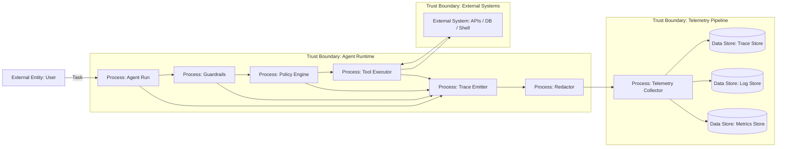

# 15 — Observability и Tracing

> Навигация: [Оглавление](../../README.md) · [← Назад](14-human-in-the-loop.md) · [Вперёд →](16-monitoring-alerting.md)

*Кратко: observability для агента — это возможность восстановить, почему агент принял решение, какие tools вызвал, какие политики сработали и где возникла ошибка или атака.*

> Примеры в разделе — на Go. Те же примеры на других языках:
> [Python](../../examples/python/part-5/15-observability-tracing.py) ·
> [TypeScript](../../examples/typescript/part-5/15-observability-tracing.ts)

## Суть

AI-агент без trace — это чёрный ящик.

Для обычного backend-сервиса часто достаточно логов, метрик и distributed tracing. Для агента этого мало: нужно видеть не только HTTP-запросы, но и внутренний ход рассуждения runtime:

- какой `run_id` у задачи;
- какая версия prompt / policy / tool schema использовалась;
- какие входные данные пришли;
- какие guardrails сработали;
- какие tool calls были предложены;
- какие tool calls были разрешены или заблокированы;
- какие approvals были запрошены;
- какие внешние вызовы были сделаны;
- какие данные были отправлены наружу;
- где был превышен budget;
- какой финальный ответ отдан пользователю.

Важно:

> Observability не должна превращаться в утечку данных. Логи и traces нужно редактировать, минимизировать и защищать.

## DFD



## Что наблюдать

### 1. Trace

Trace показывает путь одного agent run.

Минимальный набор spans:

```text
agent.run
  input.validation
  context.build
  llm.plan
  policy.check
  approval.request
  tool.call
  output.validation
  final.response
```

### 2. Logs

Логи фиксируют события:

- tool allowed / denied;
- approval requested / approved / rejected;
- prompt injection detected;
- secret detected;
- egress blocked;
- budget exceeded;
- circuit breaker opened;
- kill-switch activated.

### 3. Metrics

Метрики нужны для мониторинга:

- количество запусков;
- latency;
- стоимость / token usage;
- tool calls per run;
- denied tool calls;
- approvals;
- egress blocks;
- injection attempts;
- redaction hits;
- hallucination flags;
- errors;
- loop limit hits.

### 4. Audit events

Audit log отличается от обычного debug log.

Он нужен для разбирательства:

```text
кто → что → когда → через какой tool → с какими правами → с каким решением policy → с каким результатом
```

## Угроза / контекст

| Угроза | Пример | Risk |
|---|---|---|
| Невозможно расследовать инцидент | агент отправил данные наружу, но нет trace | High |
| Секреты в логах | API key попал в debug log | High |
| Логи можно подменить | злоумышленник удаляет следы tool call | High |
| Нет correlation id | невозможно связать ответ, tool call и approval | Medium |
| Overlogging | в traces сохраняются полные документы и PII | High |
| Underlogging | фиксируется только финальный ответ, но не policy decisions | Medium |
| Недостаточный retention | следы инцидента исчезли раньше расследования | Medium |

## Подходы и контрмеры

### 1. Единый `run_id`

Каждый запуск агента должен иметь идентификатор:

```text
run_id → spans → tool calls → approvals → logs → metrics → final output
```

### 2. Redaction по умолчанию

Нельзя логировать:

- секреты;
- access tokens;
- session cookies;
- приватные ключи;
- полные персональные данные;
- полные документы без необходимости;
- raw prompt с приватным контекстом.

### 3. События безопасности отдельно от debug

Security events должны быть структурированными:

```json
{
  "event": "tool_denied",
  "run_id": "run_123",
  "tool": "send_email",
  "reason": "requires_approval",
  "risk": "High"
}
```

### 4. Trace должен фиксировать policy decisions

Не достаточно знать, что tool был вызван. Нужно знать, почему он был разрешён.

Фиксировать:

- rule id;
- role / scope;
- tool name;
- validated args hash;
- risk level;
- approval status.

### 5. Нельзя доверять observability pipeline как security boundary

Логи помогают расследовать, но не заменяют:

- RBAC;
- sandbox;
- egress control;
- approval;
- rate limits;
- kill-switch.

## Пример (Go)

### Audit event

```go
package observability

import (
    "context"
    "crypto/sha256"
    "encoding/hex"
    "encoding/json"
    "log"
    "regexp"
    "time"
)

type Severity string

const (
    Info  Severity = "INFO"
    Warn  Severity = "WARN"
    Error Severity = "ERROR"
)

type AuditEvent struct {
    Time      time.Time      `json:"time"`
    RunID     string         `json:"run_id"`
    Event     string         `json:"event"`
    Severity  Severity       `json:"severity"`
    Component string         `json:"component"`
    Tool      string         `json:"tool,omitempty"`
    Risk      string         `json:"risk,omitempty"`
    Decision  string         `json:"decision,omitempty"`
    Reason    string         `json:"reason,omitempty"`
    Attrs     map[string]any `json:"attrs,omitempty"`
}
```

### Redacted logger

```go
type Logger struct{}

var secretPatterns = []*regexp.Regexp{
    regexp.MustCompile(`(?i)(api[_-]?key|token|secret|password)\s*[:=]\s*['"]?[^'"\s]+`),
    regexp.MustCompile(`(?i)bearer\s+[a-z0-9._\-]+`),
}

func Redact(s string) string {
    out := s
    for _, re := range secretPatterns {
        out = re.ReplaceAllString(out, "[REDACTED]")
    }
    return out
}

func HashValue(s string) string {
    sum := sha256.Sum256([]byte(s))
    return hex.EncodeToString(sum[:])
}

func (l Logger) Emit(ctx context.Context, event AuditEvent) error {
    if event.Time.IsZero() {
        event.Time = time.Now().UTC()
    }

    for k, v := range event.Attrs {
        if str, ok := v.(string); ok {
            event.Attrs[k] = Redact(str)
        }
    }

    b, err := json.Marshal(event)
    if err != nil {
        return err
    }

    log.Println(string(b))
    return nil
}
```

### Логирование policy decision

```go
func LogPolicyDecision(
    ctx context.Context,
    logger Logger,
    runID string,
    tool string,
    decision string,
    reason string,
    risk string,
    args map[string]any,
) error {
    argsJSON, _ := json.Marshal(args)

    return logger.Emit(ctx, AuditEvent{
        RunID:     runID,
        Event:     "policy_decision",
        Severity:  Info,
        Component: "policy",
        Tool:      tool,
        Risk:      risk,
        Decision:  decision,
        Reason:    reason,
        Attrs: map[string]any{
            "args_hash": HashValue(string(argsJSON)),
        },
    })
}
```

### Логирование заблокированного egress

```go
func LogEgressBlocked(ctx context.Context, logger Logger, runID, url, reason string) error {
    return logger.Emit(ctx, AuditEvent{
        RunID:     runID,
        Event:     "egress_blocked",
        Severity:  Warn,
        Component: "egress",
        Reason:    reason,
        Attrs: map[string]any{
            "url": Redact(url),
        },
    })
}
```

## Чек-лист

- [ ] У каждого agent run есть `run_id`.
- [ ] Tool calls, policy decisions и approvals связаны одним trace.
- [ ] Секреты и PII редактируются до записи в логи.
- [ ] Логируются не только ошибки, но и denied actions.
- [ ] High-risk действия попадают в audit log.
- [ ] Есть retention policy для security logs.
- [ ] Логи нельзя менять обычным пользователям агента.
- [ ] В trace видно версию prompt / policy / tool schema.
- [ ] Есть метрики по отказам guardrails.
- [ ] Observability не используется вместо реальных security controls.

## Литература

- [Список литературы](../literature.md#инструменты)
- [OpenTelemetry Documentation](https://opentelemetry.io/docs/)
- [OpenTelemetry Signals](https://opentelemetry.io/docs/concepts/signals/)
- [OpenTelemetry Logs Specification](https://opentelemetry.io/docs/specs/otel/logs/)
- [OpenAI Agents SDK — Agents](https://developers.openai.com/api/docs/guides/agents)
- [NIST AI RMF Playbook](https://airc.nist.gov/airmf-resources/playbook/)

## См. также

- [14 — Human-in-the-Loop](14-human-in-the-loop.md)
- [16 — Monitoring и Alerting](16-monitoring-alerting.md)
- [17 — Circuit Breaker и Kill-Switch](17-circuit-breaker-kill-switch.md)
- [20 — Red Teaming и Adversarial Testing](../part-7-testing-compliance/20-red-teaming-adversarial-testing.md)
