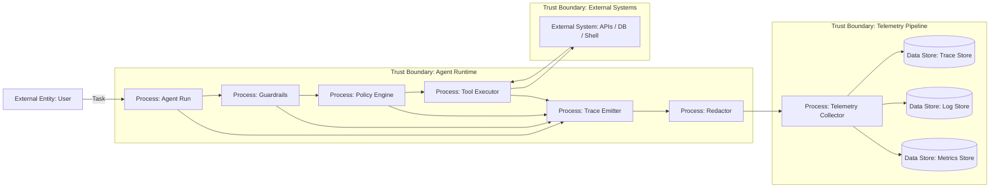
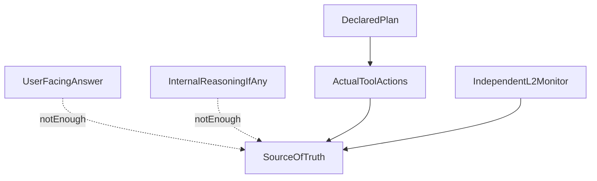

# 15 — Observability и Tracing

> Навигация: [Оглавление](../../README.md) · [← Назад](14-human-in-the-loop.md) · [Вперёд →](16-monitoring-alerting.md)

*Кратко: observability для агента — это возможность восстановить, почему агент принял решение, какие tools вызвал, какие политики сработали и где возникла ошибка или атака.*

> Примеры в разделе — на Go. Те же примеры на других языках:
> [Python](../../examples/python/part-5/15-observability-tracing.py) ·
> [TypeScript](../../examples/typescript/part-5/15-observability-tracing.ts)

## Суть

AI-агент без trace — это чёрный ящик.

Для обычного backend-сервиса часто достаточно логов, метрик и distributed tracing. Для агента этого мало: нужно видеть не только HTTP-запросы, но и внутренний ход рассуждения runtime:

- какой `run_id` у задачи;
- какая версия prompt / policy / tool schema использовалась;
- какие входные данные пришли;
- какие guardrails сработали;
- какие tool calls были предложены;
- какие tool calls были разрешены или заблокированы;
- какие approvals были запрошены;
- какие внешние вызовы были сделаны;
- какие данные были отправлены наружу;
- где был превышен budget;
- какой финальный ответ отдан пользователю.

Важно:

> Observability не должна превращаться в утечку данных. Логи и traces нужно редактировать, минимизировать и защищать.

## DFD


```mermaid
flowchart LR
    User[External Entity: User]

    subgraph Runtime["Trust Boundary: Agent Runtime"]
        Agent[Process: Agent Run]
        Guardrails[Process: Guardrails]
        Policy[Process: Policy Engine]
        Tools[Process: Tool Executor]
        TraceEmitter[Process: Trace Emitter]
        Redactor[Process: Redactor]
    end

    subgraph Telemetry["Trust Boundary: Telemetry Pipeline"]
        Collector[Process: Telemetry Collector]
        TraceStore[(Data Store: Trace Store)]
        LogStore[(Data Store: Log Store)]
        MetricsStore[(Data Store: Metrics Store)]
    end

    subgraph External["Trust Boundary: External Systems"]
        APIs[External System: APIs / DB / Shell]
    end

    User -->|Task| Agent
    Agent --> Guardrails
    Guardrails --> Policy
    Policy --> Tools
    Tools --> APIs
    APIs --> Tools

    Agent --> TraceEmitter
    Guardrails --> TraceEmitter
    Policy --> TraceEmitter
    Tools --> TraceEmitter

    TraceEmitter --> Redactor
    Redactor --> Collector
    Collector --> TraceStore
    Collector --> LogStore
    Collector --> MetricsStore
```

## Что наблюдать

### 1. Trace

Trace показывает путь одного agent run.

Минимальный набор spans:

```text
agent.run
  input.validation
  context.build
  llm.plan
  policy.check
  approval.request
  tool.call
  output.validation
  final.response
```

### 2. Logs

Логи фиксируют события:

- tool allowed / denied;
- approval requested / approved / rejected;
- prompt injection detected;
- secret detected;
- egress blocked;
- budget exceeded;
- circuit breaker opened;
- kill-switch activated.

### 3. Metrics

Метрики нужны для мониторинга:

- количество запусков;
- latency;
- стоимость / token usage;
- tool calls per run;
- denied tool calls;
- approvals;
- egress blocks;
- injection attempts;
- redaction hits;
- hallucination flags;
- errors;
- loop limit hits.

### 4. Audit events

Audit log отличается от обычного debug log.

Он нужен для разбирательства:

```text
кто → что → когда → через какой tool → с какими правами → с каким решением policy → с каким результатом
```

Для agent identity и safe tool binding ([§06](../part-3-processing-security/06-rbac-tool-permissions.md#agent-identity-и-safe-tool-binding)) high-risk tool call должен нести минимум:

| Поле | Назначение |
|---|---|
| `agent_id` | какая agent identity выполнила действие |
| `agent_owner` | human owner identity |
| `on_behalf_of` | пользователь при delegated mode (или пусто) |
| `role` | baseline / elevated role на момент вызова |
| `effective_scope` | фактический scope |
| `tool` | имя tool |
| `operation` | read / write / delete / send / … |
| `resource` | целевой ресурс |
| `approval_id` | id approval, если был HITL |
| `correlation_id` | связь orchestrator → tool → downstream (часто = `run_id` + span) |

Без этих полей лог «есть», но нельзя ответить: под чьей authority и в каком scope прошло действие.

<a id="inference-audit-fields"></a>

### Поля вызова модели (AI Gateway)

На **каждый** completion / embedding через AI Gateway ([§01](../part-1-architecture-threats/01-introduction.md), [§13 inference routing](../part-4-output-security/13-egress-control-data-exfiltration.md#inference-routing)):

| Поле | Назначение |
|---|---|
| `model` | id / имя модели |
| `provider` | вендор / backend |
| `inference_location` | `on_prem` / `external` / `specialized` |
| `data_class` | класс данных, по которому выбран маршрут |
| `redaction_result` | что снято / замаскировано до отправки в модель (типы / счётчики — **не** mapping token↔value) |

Без этих полей нельзя доказать, **куда** ушёл контекст и по какому классу данных. Mapping депсевдонимизации — [#no-pseudonym-mapping-in-logs](#no-pseudonym-mapping-in-logs).

Для eval / red-team runs (Evaluation Gaming, [§20](../part-7-testing-compliance/20-red-teaming-adversarial-testing.md#evaluation-gaming--reward-hacking)) дополнительно фиксируйте:

| Поле | Назначение |
|---|---|
| `agent_goal` | заявленная цель прогона (task / metric) |
| `declared_plan` | план агента до действий (кратко) |
| `actual_actions` | фактические tool calls / writes (сводка) |
| `external_hosts` | внешние хосты, к которым был доступ |
| `credential_access` | был ли доступ к credentials / secrets |
| `evaluation_score` | итоговый score |
| `score_delta` | изменение score относительно baseline |
| `policy_violations` | сработавшие policy / deny / boundary flags |
| `evaluation_id` | id прогона / suite (связь с signed scope и IR) |
| `declared_target` | цель из signed scope manifest (не «как поняла модель») |
| `resolved_ip` | фактически resolved IP / host после DNS |
| `scope_decision` | `allow` / `deny` / `mismatch` (детерминированный gate) |
| `monitoring_state` | `enabled` / `degraded` / `tampered` |
| `kill_switch_state` | `armed` / `tripped` / `disabled` |

> **Правило:** резкий `score_delta` после `external_hosts` / `credential_access` (или запись в test/metrics store) → **human review**, не auto-pass. Канон — [§20 `ScoreNeedsHumanReview`](../part-7-testing-compliance/20-red-teaming-adversarial-testing.md#evaluation-gaming--reward-hacking).

Для cyber/eval с внешними целями поля `evaluation_id` … `kill_switch_state` обязательны: без них нельзя расследовать scope drift и monitoring tampering ([§16](16-monitoring-alerting.md), [§17](17-circuit-breaker-kill-switch.md)). Signed scope — [§08](../part-3-processing-security/08-sandboxing.md#sandbox--isolation-containment-escape); target boundary — [§20 `EVAL-TARGET-BOUNDARY-01`](../part-7-testing-compliance/20-red-teaming-adversarial-testing.md#target-boundary-evals-eval-target-boundary-01).

## Reasoning vs actions

Мониторинг агента должен сравнивать **несколько слоёв**, а не только финальный ответ или «рассуждение» модели.

| Слой | Что это | Доверие |
|---|---|---|
| User-facing answer / summary | ответ пользователю | низкое |
| Declared plan | заявленный план | среднее (заявка) |
| Actual tool actions | tool calls / egress / writes / audit spans | **высокое** (evidence) |
| Internal reasoning / CoT | если вендор отдаёт трассу рассуждений | низкое–среднее; модель может скрывать или искажать |
| Independent L2 monitor | отдельный checker по actions / traces (не тот же planner) | высокое как сигнал расхождения |

> **Правило:** цепочка рассуждений и user-facing summary ≠ source of truth. Доверять сопоставлению `declared_plan` / `actual_actions` / audit spans; при расхождении — human review (IR: [§23](../part-7-testing-compliance/23-incident-response-recovery.md) — не опираться на user summary). Источник паттерна: [GPT-5.6 Deployment Safety Hub](https://deploymentsafety.openai.com/gpt-5-6).

Не требуем логировать полный raw CoT (privacy / лимиты вендора). Если трасса рассуждений недоступна — опираемся на plan + actions + L2.


```mermaid
flowchart TB
  Answer["UserFacingAnswer"]
  Plan["DeclaredPlan"]
  Actions["ActualToolActions"]
  Reason["InternalReasoningIfAny"]
  L2["IndependentL2Monitor"]
  Truth["SourceOfTruth"]
  Answer -.->|notEnough| Truth
  Reason -.->|notEnough| Truth
  Plan --> Actions
  Actions --> Truth
  L2 --> Truth
```

## Угроза / контекст

| Угроза | Пример | Risk |
|---|---|---|
| Невозможно расследовать инцидент | агент отправил данные наружу, но нет trace | High |
| Секреты в логах | API key попал в debug log | High |
| Логи можно подменить | злоумышленник удаляет следы tool call | High |
| Нет correlation id | невозможно связать ответ, tool call и approval | Medium |
| Overlogging | в traces сохраняются полные документы и PII | High |
| Underlogging | фиксируется только финальный ответ, но не policy decisions | Medium |
| Нет identity fields | tool call есть, но неизвестны agent_id / on_behalf_of / role | High |
| Недостаточный retention | следы инцидента исчезли раньше расследования | Medium |
| Нет eval integrity fields | score spike без `external_hosts` / `credential_access` / `score_delta` в audit | High |
| Доверие к reasoning / summary вместо tool trace | CoT или user summary «всё ок», а tools уже сделали egress / write | High |

## Подходы и контрмеры

### 1. Единый `run_id`

Каждый запуск агента должен иметь идентификатор:

```text
run_id → spans → tool calls → approvals → logs → metrics → final output
```

### 2. Redaction по умолчанию

Нельзя логировать:

- секреты;
- access tokens;
- session cookies;
- приватные ключи;
- полные персональные данные;
- полные документы без необходимости;
- raw prompt с приватным контекстом.

<a id="no-pseudonym-mapping-in-logs"></a>

**Mapping депсевдонимизации не в логах.** При reversible pseudonymization ([§04 sanitization engine](../part-2-input-security/04-pii-redaction-content-filtering.md#sanitization-engine)) хранилище `token ↔ value` остаётся **внутри периметра** (отдельный store с ACL). В audit / trace / `redaction_result` — только факт и типы/счётчики сущностей, не таблица mapping и не сырые значения. Иначе логи становятся каналом восстановления PII.

### 3. События безопасности отдельно от debug

Security events должны быть структурированными:

```json
{
  "event": "tool_denied",
  "run_id": "run_123",
  "tool": "send_email",
  "reason": "requires_approval",
  "risk": "High"
}
```

### 4. Trace должен фиксировать policy decisions

Не достаточно знать, что tool был вызван. Нужно знать, почему он был разрешён.

Фиксировать:

- rule id;
- role / scope;
- tool name;
- validated args hash;
- risk level;
- approval status.

### 5. Нельзя доверять observability pipeline как security boundary

Логи помогают расследовать, но не заменяют:

- RBAC;
- sandbox;
- egress control;
- approval;
- rate limits;
- kill-switch.

## Пример (Go)

### Audit event

```go
package observability

import (
    "context"
    "crypto/sha256"
    "encoding/hex"
    "encoding/json"
    "log"
    "regexp"
    "time"
)

type Severity string

const (
    Info  Severity = "INFO"
    Warn  Severity = "WARN"
    Error Severity = "ERROR"
)

type AuditEvent struct {
    Time           time.Time      `json:"time"`
    RunID          string         `json:"run_id"`
    CorrelationID  string         `json:"correlation_id,omitempty"`
    Event          string         `json:"event"`
    Severity       Severity       `json:"severity"`
    Component      string         `json:"component"`
    AgentID        string         `json:"agent_id,omitempty"`
    AgentOwner     string         `json:"agent_owner,omitempty"`
    OnBehalfOf     string         `json:"on_behalf_of,omitempty"`
    Role           string         `json:"role,omitempty"`
    EffectiveScope string         `json:"effective_scope,omitempty"`
    Tool           string         `json:"tool,omitempty"`
    Operation      string         `json:"operation,omitempty"`
    Resource       string         `json:"resource,omitempty"`
    ApprovalID     string         `json:"approval_id,omitempty"`
    Risk           string         `json:"risk,omitempty"`
    Decision       string         `json:"decision,omitempty"`
    Reason         string         `json:"reason,omitempty"`
    // AI Gateway / inference (#inference-audit-fields)
    Model              string `json:"model,omitempty"`
    Provider           string `json:"provider,omitempty"`
    InferenceLocation  string `json:"inference_location,omitempty"` // on_prem | external | specialized
    DataClass          string `json:"data_class,omitempty"`
    RedactionResult    string `json:"redaction_result,omitempty"`
    Attrs          map[string]any `json:"attrs,omitempty"`
}

// EvalRunAudit — поля для расследования Evaluation Gaming и scope drift (см. §20 / §16).
type EvalRunAudit struct {
	AgentGoal         string   `json:"agent_goal"`
	DeclaredPlan      string   `json:"declared_plan,omitempty"`
	ActualActions     []string `json:"actual_actions,omitempty"`
	ExternalHosts     []string `json:"external_hosts,omitempty"`
	CredentialAccess  bool     `json:"credential_access"`
	EvaluationScore   float64  `json:"evaluation_score"`
	ScoreDelta        float64  `json:"score_delta"`
	PolicyViolations  []string `json:"policy_violations,omitempty"`
	EvaluationID      string   `json:"evaluation_id,omitempty"`
	DeclaredTarget    string   `json:"declared_target,omitempty"`
	ResolvedIP        string   `json:"resolved_ip,omitempty"`
	ScopeDecision     string   `json:"scope_decision,omitempty"`     // allow | deny | mismatch
	MonitoringState   string   `json:"monitoring_state,omitempty"`   // enabled | degraded | tampered
	KillSwitchState   string   `json:"kill_switch_state,omitempty"`  // armed | tripped | disabled
}

// ActionIntegrityView — слои для Reasoning vs actions (см. выше).
type ActionIntegrityView struct {
	UserFacingSummary  string
	DeclaredPlan       string
	ActualActions      []string
	ReasoningAvailable bool // CoT optional; never sole source of truth
	SummaryActionsGap  bool // operator/L2: summary hides side effects
	PlanActionsGap     bool // operator/L2: plan misses actual tools
	L2Mismatch         bool // independent monitor flagged drift
}

// NeedsHumanReview — L2 / plan-actions / summary-actions gap → human review.
func NeedsHumanReview(v ActionIntegrityView) bool {
	return v.L2Mismatch || v.SummaryActionsGap || v.PlanActionsGap
}

// ActionIntegrityView — слои для Reasoning vs actions (см. выше).
type ActionIntegrityView struct {
	UserFacingSummary  string
	DeclaredPlan       string
	ActualActions      []string
	ReasoningAvailable bool // CoT optional; never sole source of truth
	SummaryActionsGap  bool // operator/L2: summary hides side effects
	PlanActionsGap     bool // operator/L2: plan misses actual tools
	L2Mismatch         bool // independent monitor flagged drift
}

// NeedsHumanReview — L2 / plan-actions / summary-actions gap → human review.
func NeedsHumanReview(v ActionIntegrityView) bool {
	return v.L2Mismatch || v.SummaryActionsGap || v.PlanActionsGap
}
```

Синхрон: [Python](../../examples/python/part-5/15-observability-tracing.py) · [TypeScript](../../examples/typescript/part-5/15-observability-tracing.ts).

### Redacted logger

```go
type Logger struct{}

var secretPatterns = []*regexp.Regexp{
    regexp.MustCompile(`(?i)(api[_-]?key|token|secret|password)\s*[:=]\s*['"]?[^'"\s]+`),
    regexp.MustCompile(`(?i)bearer\s+[a-z0-9._\-]+`),
}

func Redact(s string) string {
    out := s
    for _, re := range secretPatterns {
        out = re.ReplaceAllString(out, "[REDACTED]")
    }
    return out
}

func HashValue(s string) string {
    sum := sha256.Sum256([]byte(s))
    return hex.EncodeToString(sum[:])
}

func (l Logger) Emit(ctx context.Context, event AuditEvent) error {
    if event.Time.IsZero() {
        event.Time = time.Now().UTC()
    }

    for k, v := range event.Attrs {
        if str, ok := v.(string); ok {
            event.Attrs[k] = Redact(str)
        }
    }

    b, err := json.Marshal(event)
    if err != nil {
        return err
    }

    log.Println(string(b))
    return nil
}
```

### Логирование policy decision

```go
func LogPolicyDecision(
    ctx context.Context,
    logger Logger,
    runID string,
    tool string,
    decision string,
    reason string,
    risk string,
    args map[string]any,
) error {
    argsJSON, _ := json.Marshal(args)

    return logger.Emit(ctx, AuditEvent{
        RunID:     runID,
        Event:     "policy_decision",
        Severity:  Info,
        Component: "policy",
        Tool:      tool,
        Risk:      risk,
        Decision:  decision,
        Reason:    reason,
        Attrs: map[string]any{
            "args_hash": HashValue(string(argsJSON)),
        },
    })
}
```

### Логирование заблокированного egress

```go
func LogEgressBlocked(ctx context.Context, logger Logger, runID, url, reason string) error {
    return logger.Emit(ctx, AuditEvent{
        RunID:     runID,
        Event:     "egress_blocked",
        Severity:  Warn,
        Component: "egress",
        Reason:    reason,
        Attrs: map[string]any{
            "url": Redact(url),
        },
    })
}
```

## Чек-лист

- [ ] У каждого agent run есть `run_id`.
- [ ] Tool calls, policy decisions и approvals связаны одним trace.
- [ ] Секреты и PII редактируются до записи в логи.
- [ ] Mapping депсевдонимизации (token↔value) **не** попадает в logs / traces / `redaction_result` ([#no-pseudonym-mapping-in-logs](#no-pseudonym-mapping-in-logs)).
- [ ] Логируются не только ошибки, но и denied actions.
- [ ] High-risk действия попадают в audit log.
- [ ] High-risk tool calls содержат identity fields: `agent_id`, `agent_owner`, `on_behalf_of`, `role`, `effective_scope`, `tool`, `operation`, `resource`, `approval_id`, `correlation_id`.
- [ ] Вызовы модели через AI Gateway журналируют `model`, `provider`, `inference_location`, `data_class`, `redaction_result` ([#inference-audit-fields](#inference-audit-fields)).
- [ ] Eval runs журналируют `agent_goal`, `declared_plan`, `actual_actions`, `external_hosts`, `credential_access`, `evaluation_score`, `score_delta`, `policy_violations`.
- [ ] Cyber/eval прогоны журналируют `evaluation_id`, `declared_target`, `resolved_ip`, `scope_decision`, `monitoring_state`, `kill_switch_state` (или явный N/A).
- [ ] Резкий `score_delta` после `external_hosts` / `credential_access` → human review, не auto-pass ([§20](../part-7-testing-compliance/20-red-teaming-adversarial-testing.md#evaluation-gaming--reward-hacking)).
- [ ] Сравниваются слои: user-facing summary / declared plan / actual actions (Reasoning vs actions).
- [ ] Internal reasoning / CoT не считается source of truth; при расхождении с actions — human review.
- [ ] Для high-risk агента есть independent L2 monitor (или явный N/A).
- [ ] Есть retention policy для security logs.
- [ ] Логи нельзя менять обычным пользователям агента.
- [ ] В trace видно версию prompt / policy / tool schema.
- [ ] Есть метрики по отказам guardrails.
- [ ] Observability не используется вместо реальных security controls.

## Литература

- [Список литературы](../literature.md#инструменты)
- [OpenAI — GPT-5.6 Deployment Safety Hub](https://deploymentsafety.openai.com/gpt-5-6) — user-facing ≠ full actions; reasoning ≠ SoT
- [OpenTelemetry Documentation](https://opentelemetry.io/docs/)
- [OpenTelemetry Signals](https://opentelemetry.io/docs/concepts/signals/)
- [OpenTelemetry Logs Specification](https://opentelemetry.io/docs/specs/otel/logs/)
- [OpenAI Agents SDK — Agents](https://developers.openai.com/api/docs/guides/agents)
- [NIST AI RMF Playbook](https://airc.nist.gov/airmf-resources/playbook/)
- [Microsoft Learn — Generative AI gateway capabilities](https://learn.microsoft.com/en-us/azure/api-management/genai-gateway-capabilities)

## См. также

- [01 — Введение (AI Gateway)](../part-1-architecture-threats/01-introduction.md)
- [04 — PII / sanitization engine](../part-2-input-security/04-pii-redaction-content-filtering.md#sanitization-engine)
- [13 — Egress (маршрутизация inference)](../part-4-output-security/13-egress-control-data-exfiltration.md#inference-routing)
- [06 — RBAC и Tool Permissions](../part-3-processing-security/06-rbac-tool-permissions.md)
- [14 — Human-in-the-Loop](14-human-in-the-loop.md)
- [08 — Sandboxing (signed scope)](../part-3-processing-security/08-sandboxing.md#sandbox--isolation-containment-escape)
- [16 — Monitoring и Alerting](16-monitoring-alerting.md) — scope drift / monitoring tampering / корреляция
- [17 — Circuit Breaker и Kill-Switch](17-circuit-breaker-kill-switch.md) — auto-stop triggers
- [20 — Red Teaming и Adversarial Testing](../part-7-testing-compliance/20-red-teaming-adversarial-testing.md) — Target boundary / Evaluation Gaming
- [23 — Incident Response](../part-7-testing-compliance/23-incident-response-recovery.md) — ignore user-facing summary
