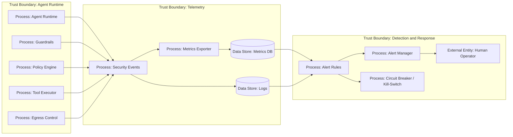

# 16 — Monitoring и Alerting

> Навигация: [Оглавление](../../README.md) · [← Назад](15-observability-tracing.md) · [Вперёд →](17-circuit-breaker-kill-switch.md)

*Кратко: monitoring отвечает на вопрос “что происходит с агентом прямо сейчас?”, а alerting — “когда нужно вмешаться”. Для AI-агента важно мониторить не только CPU и latency, но и security-события: prompt injection, tool denial, egress, approvals, token budget, loop anomalies.*

> Примеры в разделе — на Go. Те же примеры на других языках:
> [Python](../../examples/python/part-5/16-monitoring-alerting.py) ·
> [TypeScript](../../examples/typescript/part-5/16-monitoring-alerting.ts)

## Суть

Observability помогает расследовать. Monitoring помогает заметить проблему вовремя.

Для AI-агента нужно отслеживать:

- всплеск prompt injection попыток;
- repeated denied tool calls;
- необычные tools для роли пользователя;
- рост egress-запросов;
- попытки отправить секреты наружу;
- частые approvals для одного пользователя / tool;
- превышение token / cost budget;
- аномально длинные loops;
- высокий процент hallucination flags;
- падение guardrails;
- circuit breaker events;
- kill-switch events.

Главная мысль:

> Мониторинг агента должен видеть не только инфраструктуру, но и поведение агента.

## DFD



## Что мониторить

### Security events

| Event | Что означает |
|---|---|
| `prompt_injection_detected` | вход содержит попытку изменить инструкции агента |
| `tool_denied` | tool call заблокирован policy |
| `approval_requested` | действие требует подтверждения |
| `approval_rejected` | человек отклонил действие |
| `secret_detected` | найден секрет во входе, памяти или выходе |
| `egress_blocked` | попытка отправить данные в запрещённый destination |
| `schema_validation_failed` | tool args не прошли строгую валидацию |
| `budget_exceeded` | превышен лимит токенов, стоимости или шагов |
| `circuit_breaker_opened` | tool/runtime временно остановлен |
| `kill_switch_activated` | аварийно отключён агент или часть tools |

### Метрики

```text
agent_runs_total
agent_run_errors_total
agent_tool_calls_total
agent_tool_denied_total
agent_approvals_requested_total
agent_approvals_rejected_total
agent_prompt_injection_detected_total
agent_secrets_detected_total
agent_egress_blocked_total
agent_budget_exceeded_total
agent_loop_limit_hit_total
agent_circuit_breaker_open_total
agent_kill_switch_active
```

### Алерты

| Alert | Условие | Severity |
|---|---|---|
| Injection spike | `prompt_injection_detected_total` резко вырос | High |
| Egress blocked | есть попытки отправки на запрещённые домены | High |
| Tool abuse | один пользователь часто получает `tool_denied` | Medium |
| Approval storm | много high-risk approval requests | Medium |
| Budget runaway | стоимость / токены растут выше лимита | High |
| Breaker open | circuit breaker открылся для critical tool | High |
| Kill-switch active | активирован kill-switch | Critical |

## Угроза / контекст

| Угроза | Пример | Risk |
|---|---|---|
| Silent exfiltration | данные уходят наружу, но нет алерта | High |
| Cost runaway | агент попадает в loop и тратит бюджет | High |
| Guardrail bypass | protection падает, но runtime продолжает работу | High |
| Alert fatigue | слишком много шумных алертов | Medium |
| Нет run-level drilldown | алерт есть, но нельзя найти конкретный trace | Medium |
| Позднее обнаружение атаки | мониторинг смотрит только CPU/RAM | High |
| Нет реакции | алерт пришёл, но circuit breaker не сработал | Medium |

## Подходы и контрмеры

### 1. Security-first metrics

Инфраструктурные метрики важны, но для агента нужны отдельные security-метрики.

Плохой минимум:

```text
latency, CPU, memory
```

Хороший минимум:

```text
latency, errors, token usage, tool_denied, egress_blocked, secrets_detected, approvals, breaker_state
```

### 2. Алерт должен вести к trace

Каждый алерт должен содержать:

- `run_id`;
- user / tenant hash;
- tool;
- risk;
- policy rule;
- affected destination;
- ссылку на trace / logs.

### 3. Разделить warning и auto-response

Не каждый алерт должен останавливать систему.

| Событие | Реакция |
|---|---|
| один denied tool call | log only |
| 10 denied calls за 5 минут | alert |
| egress с secret | block + high alert |
| token runaway | stop run |
| compromised tool | disable tool |

### 4. Детектировать поведенческие аномалии

Примеры:

- один пользователь вызывает tools чаще обычного;
- read-only агент пытается выполнить write action;
- tool, который обычно вызывается редко, внезапно стал массовым;
- вырос процент blocked egress;
- увеличился средний number of steps per run.

## Пример (Go)

### Security signal

```go
package monitoring

import (
    "context"
    "fmt"
    "sync"
    "time"
)

type Severity string

const (
    Low      Severity = "Low"
    Medium   Severity = "Medium"
    High     Severity = "High"
    Critical Severity = "Critical"
)

type SecuritySignal struct {
    Time     time.Time
    RunID    string
    UserHash string
    Event    string
    Tool     string
    Severity Severity
    Reason   string
    Attrs    map[string]string
}
```

### Простой in-memory счетчик событий

```go
type CounterStore struct {
    mu     sync.Mutex
    counts map[string]int
}

func NewCounterStore() *CounterStore {
    return &CounterStore{
        counts: make(map[string]int),
    }
}

func (s *CounterStore) Inc(key string) {
    s.mu.Lock()
    defer s.mu.Unlock()
    s.counts[key]++
}

func (s *CounterStore) Get(key string) int {
    s.mu.Lock()
    defer s.mu.Unlock()
    return s.counts[key]
}
```

### Alert rule

```go
type Alert struct {
    Name     string
    Severity Severity
    Message  string
    RunID    string
}

type AlertSink interface {
    Send(ctx context.Context, alert Alert) error
}

type Rule struct {
    Name      string
    Event     string
    Threshold int
    Severity  Severity
}

func (r Rule) Evaluate(signal SecuritySignal, store *CounterStore) *Alert {
    if signal.Event != r.Event {
        return nil
    }

    key := fmt.Sprintf("%s:%s:%s", r.Event, signal.UserHash, signal.Tool)
    store.Inc(key)

    if store.Get(key) < r.Threshold {
        return nil
    }

    return &Alert{
        Name:     r.Name,
        Severity: r.Severity,
        Message:  fmt.Sprintf("threshold reached for event=%s tool=%s", signal.Event, signal.Tool),
        RunID:    signal.RunID,
    }
}
```

### Monitoring pipeline

```go
type Monitor struct {
    Store *CounterStore
    Rules []Rule
    Sink  AlertSink
}

func (m *Monitor) Handle(ctx context.Context, signal SecuritySignal) error {
    if signal.Time.IsZero() {
        signal.Time = time.Now().UTC()
    }

    for _, rule := range m.Rules {
        alert := rule.Evaluate(signal, m.Store)
        if alert == nil {
            continue
        }

        if err := m.Sink.Send(ctx, *alert); err != nil {
            return err
        }
    }

    return nil
}
```

### Набор правил

```go
var Rules = []Rule{
    {
        Name:      "Prompt injection spike",
        Event:     "prompt_injection_detected",
        Threshold: 5,
        Severity:  High,
    },
    {
        Name:      "Repeated denied tool calls",
        Event:     "tool_denied",
        Threshold: 3,
        Severity:  Medium,
    },
    {
        Name:      "Blocked egress attempts",
        Event:     "egress_blocked",
        Threshold: 1,
        Severity:  High,
    },
    {
        Name:      "Budget runaway",
        Event:     "budget_exceeded",
        Threshold: 1,
        Severity:  High,
    },
}
```

## Чек-лист

- [ ] Есть security events для guardrails, policy, egress и tools.
- [ ] Есть метрики по denied actions.
- [ ] Есть метрики по prompt injection attempts.
- [ ] Есть метрики по secrets detected / redacted.
- [ ] Есть метрики по token / cost budget.
- [ ] Алерт содержит `run_id`.
- [ ] Алерт можно связать с trace.
- [ ] High-risk events не теряются в debug logs.
- [ ] Есть правила для auto-response.
- [ ] Есть защита от alert fatigue.
- [ ] Kill-switch и circuit breaker тоже мониторятся.
- [ ] Online/monitoring-сигналы — дополнительный слой evals, не замена pre-release testing; слои описаны в [20 — Типы evals для AI-agent security](../part-7-testing-compliance/20-red-teaming-adversarial-testing.md#типы-evals-для-ai-agent-security).

## Литература

- [Список литературы](../literature.md#инструменты)
- [OpenTelemetry Documentation](https://opentelemetry.io/docs/)
- [OpenTelemetry Signals](https://opentelemetry.io/docs/concepts/signals/)
- [OWASP Agentic AI — Threats and Mitigations](https://genai.owasp.org/resource/agentic-ai-threats-and-mitigations/)
- [NIST AI RMF Playbook](https://airc.nist.gov/airmf-resources/playbook/)

## См. также

- [15 — Observability и Tracing](15-observability-tracing.md)
- [17 — Circuit Breaker и Kill-Switch](17-circuit-breaker-kill-switch.md)
- [13 — Egress Control и Data Exfiltration Prevention](../part-4-output-security/13-egress-control-data-exfiltration.md)
- [20 — Red Teaming и Adversarial Testing](../part-7-testing-compliance/20-red-teaming-adversarial-testing.md)
