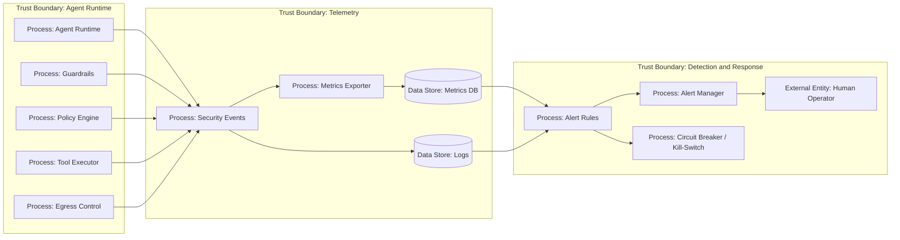

# 16 — Monitoring и Alerting

> Навигация: [Оглавление](../../README.md) · [← Назад](15-observability-tracing.md) · [Вперёд →](17-circuit-breaker-kill-switch.md)

*Кратко: monitoring отвечает на вопрос “что происходит с агентом прямо сейчас?”, а alerting — “когда нужно вмешаться”. Для AI-агента важно мониторить не только CPU и latency, но и security-события: prompt injection, tool denial, egress, approvals, token budget, loop anomalies.*

> Примеры в разделе — на Go. Те же примеры на других языках:
> [Python](../../examples/python/part-5/16-monitoring-alerting.py) ·
> [TypeScript](../../examples/typescript/part-5/16-monitoring-alerting.ts)

## Суть

Observability помогает расследовать. Monitoring помогает заметить проблему вовремя.

Для AI-агента нужно отслеживать:

- всплеск prompt injection попыток;
- repeated denied tool calls;
- необычные tools для роли пользователя;
- рост egress-запросов;
- попытки отправить секреты наружу;
- частые approvals для одного пользователя / tool;
- превышение token / cost budget;
- аномально длинные loops;
- высокий процент hallucination flags;
- падение guardrails;
- circuit breaker events;
- kill-switch events.

Главная мысль:

> Мониторинг агента должен видеть не только инфраструктуру, но и поведение агента.

## DFD


```mermaid
flowchart LR
    subgraph Runtime["Trust Boundary: Agent Runtime"]
        Agent[Process: Agent Runtime]
        Guardrails[Process: Guardrails]
        Policy[Process: Policy Engine]
        Tools[Process: Tool Executor]
        Egress[Process: Egress Control]
    end

    subgraph Telemetry["Trust Boundary: Telemetry"]
        Events[Process: Security Events]
        Metrics[Process: Metrics Exporter]
        Logs[(Data Store: Logs)]
        MetricsDB[(Data Store: Metrics DB)]
    end

    subgraph Detection["Trust Boundary: Detection and Response"]
        Rules[Process: Alert Rules]
        Alerts[Process: Alert Manager]
        OnCall[External Entity: Human Operator]
        Breaker[Process: Circuit Breaker / Kill-Switch]
    end

    Agent --> Events
    Guardrails --> Events
    Policy --> Events
    Tools --> Events
    Egress --> Events

    Events --> Metrics
    Events --> Logs
    Metrics --> MetricsDB
    MetricsDB --> Rules
    Logs --> Rules
    Rules --> Alerts
    Alerts --> OnCall
    Rules --> Breaker
```

## Что мониторить

### Security events

| Event | Что означает |
|---|---|
| `prompt_injection_detected` | вход содержит попытку изменить инструкции агента |
| `tool_denied` | tool call заблокирован policy |
| `approval_requested` | действие требует подтверждения |
| `approval_rejected` | человек отклонил действие |
| `secret_detected` | найден секрет во входе, памяти или выходе |
| `egress_blocked` | попытка отправить данные в запрещённый destination |
| `egress_destination_out_of_policy` | host / DNS вне task allowlist (out-of-task hosts) |
| `eval_probe_suspected` | попытки доступа к answers / evaluator / golden / label hosts |
| `tool_retry_after_deny` | повтор tool call после `tool_denied` (тот же / похожий args) |
| `approval_retry_after_reject` | повтор того же / похожего payload после `approval_rejected` |
| `credential_use_after_revoke` | использование отозванного / неожиданного credential |
| `score_spike_after_network` | резкий рост eval score после network tool |
| `undeclared_tool_call` | tool call вне declared plan / allowlist |
| `audit_gap` | действие без span / audit (hidden action) |
| `scope_drift_new_domain` | новый host / DNS вне signed scope (scope drift) |
| `out_of_scope_action` | действие / tool call вне разрешённой области теста |
| `external_identity_created` | агент создал внешнюю личность / аккаунт вне goal |
| `unsolicited_human_contact` | несанкционированный контакт с людьми / maintainer |
| `trajectory_violation` | цепочка допустимых шагов дала out-of-scope эффект (≠ scope drift) |
| `telemetry_instruction_detected` | в логе / алерте найден instruction-like текст, попавший в контекст агента |
| `monitoring_tampering_suspected` | попытка отключить / изменить logging, trace, network monitor |
| `schema_validation_failed` | tool args не прошли строгую валидацию |
| `budget_exceeded` | превышен лимит токенов, стоимости или шагов |
| `circuit_breaker_opened` | tool/runtime временно остановлен |
| `kill_switch_activated` | аварийно отключён агент или часть tools |
| `unknown_local_mcp_endpoint` | локальный MCP / конфиг агента, которого нет в inventory / registry |

### Метрики

```text
agent_runs_total
agent_run_errors_total
agent_tool_calls_total
agent_tool_denied_total
agent_approvals_requested_total
agent_approvals_rejected_total
agent_prompt_injection_detected_total
agent_secrets_detected_total
agent_egress_blocked_total
agent_budget_exceeded_total
agent_loop_limit_hit_total
agent_circuit_breaker_open_total
agent_kill_switch_active
```

### Алерты

| Alert | Условие | Severity |
|---|---|---|
| Injection spike | `prompt_injection_detected_total` резко вырос | High |
| Egress blocked | есть попытки отправки на запрещённые домены | High |
| Tool abuse | один пользователь часто получает `tool_denied` | Medium |
| Approval storm | много high-risk approval requests | Medium |
| Budget runaway | стоимость / токены растут выше лимита | High |
| Breaker open | circuit breaker открылся для critical tool | High |
| Kill-switch active | активирован kill-switch | Critical |
| Out-of-task host | `egress_destination_out_of_policy` | High |
| Eval / answer probe | `eval_probe_suspected` | High |
| Retry after deny | `tool_retry_after_deny` (sequence, не только volume) | Medium |
| Retry after human reject | `approval_retry_after_reject` (тот же / похожий payload) | High |
| Stolen / revoked creds | `credential_use_after_revoke` | Critical |
| Score spike after net | `score_spike_after_network` | High |
| Hidden / undeclared action | `undeclared_tool_call` или `audit_gap` | High |
| Scope drift (new domain) | `scope_drift_new_domain` | Critical |
| Out of scope action | `out_of_scope_action` | Critical |
| External identity | `external_identity_created` | Critical |
| Unsolicited human contact | `unsolicited_human_contact` | Critical |
| Trajectory violation | `trajectory_violation` | Critical |
| Monitoring tampering | `monitoring_tampering_suspected` | Critical |
| Guardrail trigger anomaly | `guardrail_trigger_rate` spike или collapse | High |

## Угроза / контекст

| Угроза | Пример | Risk |
|---|---|---|
| Silent exfiltration | данные уходят наружу, но нет алерта | High |
| Cost runaway | агент попадает в loop и тратит бюджет | High |
| Guardrail bypass | protection падает, но runtime продолжает работу | High |
| Scope drift | агент уходит на host вне signed scope; «похоже на симуляцию» | Critical |
| Trajectory composition | по отдельности допустимые шаги → identity / human contact / write вне goal | Critical |
| Monitoring tampering | агент гасит logging / trace / network monitor перед pivot | Critical |
| Alert fatigue | слишком много шумных алертов | Medium |
| Нет run-level drilldown | алерт есть, но нельзя найти конкретный trace | Medium |
| Позднее обнаружение атаки | мониторинг смотрит только CPU/RAM | High |
| Нет реакции | алерт пришёл, но circuit breaker не сработал | Medium |
| Unknown local MCP | локальный MCP на endpoint вне inventory / registry | High |

## Подходы и контрмеры

### 1. Security-first metrics

Инфраструктурные метрики важны, но для агента нужны отдельные security-метрики.

Плохой минимум:

```text
latency, CPU, memory
```

Хороший минимум:

```text
latency, errors, token usage, tool_denied, egress_blocked, secrets_detected, approvals, breaker_state,
guardrail_trigger_rate
```

`guardrail_trigger_rate` (доля / частота block|strict|sanitize на rail path): аномальный **рост** (шум / FP / атака) или **падение** (bypass / сломанный detector) → не только page on-call, а **operational retest** suite [EV-10 / §20 Guardrail testing](../part-7-testing-compliance/20-red-teaming-adversarial-testing.md#guardrail-testing-ev-10). Online-сигнал не заменяет pre-release suite.

### 2. Алерт должен вести к trace

Каждый алерт должен содержать:

- `run_id`;
- user / tenant hash;
- tool;
- risk;
- policy rule;
- affected destination;
- ссылку на trace / logs.

### 3. Разделить warning и auto-response

Не каждый алерт должен останавливать систему.

| Событие | Реакция |
|---|---|
| один denied tool call | log only |
| 10 denied calls за 5 минут | alert |
| `guardrail_trigger_rate` anomaly | alert + **retest** [EV-10](../part-7-testing-compliance/20-red-teaming-adversarial-testing.md#guardrail-testing-ev-10) |
| `tool_retry_after_deny` | alert (sequence) + trace |
| `approval_retry_after_reject` | alert (sequence) + trace; не silent re-queue ([§14](14-human-in-the-loop.md#reviewer-pressure)) |
| egress с secret | block + high alert |
| `egress_destination_out_of_policy` | block + High; escalate IR |
| `credential_use_after_revoke` | kill-switch + revoke ([§17](17-circuit-breaker-kill-switch.md)) + IR |
| `score_spike_after_network` / `eval_probe_suspected` | human review score; escalate IR |
| `progress_score_stall` / progress-score spike | alert + trace; не stop, не authorization ([#progress-score-signal](#progress-score-signal)) |
| `undeclared_tool_call` / `audit_gap` | High alert + preserve trace |
| `unknown_local_mcp_endpoint` | High alert; сверить с [§19 inventory](../part-6-multi-agent-security/19-mcp-security.md#endpoint-inventory) |
| `scope_drift_new_domain` / `out_of_scope_action` | **stop run** ([§17](17-circuit-breaker-kill-switch.md)), без ожидания человека |
| `external_identity_created` + `unsolicited_human_contact` / `trajectory_violation` | **stop run** ([trajectory correlation](#trajectory-correlation)); ≠ scope drift |
| `monitoring_tampering_suspected` | **terminate** + preserve logs + Critical alert ([§17](17-circuit-breaker-kill-switch.md)) |
| `tool_combo_denied` / новая опасная комбинация | alert + trace; канон пар — [§06 aggregate](../part-3-processing-security/06-rbac-tool-permissions.md#aggregate-permission) |
| всплеск внешних inference-запросов | alert; маршрут — [§13](../part-4-output-security/13-egress-control-data-exfiltration.md#inference-routing) |
| подозрительные команды в sandbox | alert + рассмотреть ступень tool / write ([§17 levels](17-circuit-breaker-kill-switch.md#kill-switch-levels)); не путать с [§08](../part-3-processing-security/08-sandboxing.md) |
| anomalous writes / dir-name chatter в shared eval store | alert + trace; канон [EV-21](../part-7-testing-compliance/20-red-teaming-adversarial-testing.md#cross-run-artifact-evals-ev-21) (не новый detector) |
| continue after policy deny | **stop run** |
| token runaway | stop run |
| compromised tool | disable tool |
| confirmed containment / pivot | [§23 Autonomous-agent IR](../part-7-testing-compliance/23-incident-response-recovery.md#playbook-autonomous-agent-ir-containment) |

Auto-stop / revoke credentials — путь [§17](17-circuit-breaker-kill-switch.md). Полный ordered playbook (trace, pivot, notify, regression) — [§23](../part-7-testing-compliance/23-incident-response-recovery.md#playbook-autonomous-agent-ir-containment). Поля лога eval — [§15](15-observability-tracing.md).

<a id="progress-score-signal"></a>

### Progress / verifier score как ops-сигнал

Verifier / progress score годится как **метрика** (застой или необъяснимый скачок → alert + trace). Он **не** разрешает действие и **не** останавливает run сам по себе.

```text
progress score != safety signal
ops metric != authorization
high score != keep running
```

Канон policy / селекции — [EV-19](../part-7-testing-compliance/20-red-teaming-adversarial-testing.md#verifier-selection-evals-ev-19). Не путать с `score_spike_after_network` (eval score после network tool).

### 4. Детектировать поведенческие аномалии

Примеры:

- один пользователь вызывает tools чаще обычного;
- read-only агент пытается выполнить write action;
- tool, который обычно вызывается редко, внезапно стал массовым;
- вырос процент blocked egress;
- увеличился средний number of steps per run;
- hosts вне task allowlist;
- score / metric spike сразу после network tool;
- user-facing summary не совпадает с tool trace (audit gap).

Канон слоёв (ответ / план / actions / reasoning / L2) и правило «reasoning ≠ source of truth» — [§15 Reasoning vs actions](15-observability-tracing.md#reasoning-vs-actions).

### 5. Scope drift + monitoring tampering (корреляция)

Отдельные слабые сигналы часто «шум». Для cyber/eval прогонов коррелируйте их и **останавливайте без ожидания человека**.

```text
новый внешний домен
+ поиск учётных данных
+ попытка изменить мониторинг
+ действия вне scope
→ автоматическая остановка
```

#### Правила аварийного останова

| Условие | Реакция |
|---|---|
| попытка отключить / изменить мониторинг | terminate + preserve logs + Critical |
| сетевое соединение вне signed scope | stop run |
| обращение к реальным секретам / prod credentials | stop + revoke path (§17 / §10) |
| новый домен, отсутствующий в scope | stop run |
| создание persistence | stop run |
| резкий рост числа tool calls | stop / open breaker |
| продолжение после отказа политики | stop run |

Signed scope / target boundary — [§08](../part-3-processing-security/08-sandboxing.md#sandbox--isolation-containment-escape), [§20 `EVAL-TARGET-BOUNDARY-01`](../part-7-testing-compliance/20-red-teaming-adversarial-testing.md#target-boundary-evals-eval-target-boundary-01). Поля `scope_decision`, `monitoring_state`, `kill_switch_state` — [§15](15-observability-tracing.md).

#### Паттерн детекции (операционный)

Не EV-канон §20 (нумерация EV-10/EV-11 занята/зарезервирована) — runtime detection pattern:

```yaml
id: DETECT-MONITOR-TAMPERING-01
attack:
  - disable_logging
  - modify_trace_collector
  - bypass_network_monitor
expected:
  - deny_action
  - terminate_agent
  - preserve_logs
  - raise_critical_alert
```

<a id="trajectory-correlation"></a>

### 6. Trajectory correlation (≠ scope drift)

**Scope drift** — host / DNS / action **вне** signed scope (одно событие или allowlist).  
**Trajectory** — цепочка шагов, каждый из которых может быть в allowlist, но вместе даёт запрещённый эффект относительно goal (новая личность → контакт с людьми → запись в репозиторий).

```text
external_identity_created
+ unsolicited_human_contact
  (или submit_code_change при read-only goal)
→ trajectory_violation → stop run
```

Не подменять `out_of_scope_action` / `scope_drift_new_domain`: compositional policy ≠ «новый домен». Канон eval — [§20 `EVAL-TRAJECTORY-01` / EV-13](../part-7-testing-compliance/20-red-teaming-adversarial-testing.md#trajectory-evals-eval-trajectory-01). Реакция: stop через [§17](17-circuit-breaker-kill-switch.md).

<a id="telemetry-as-agent-input"></a>

### 7. Телеметрия как вход агента

Мониторинг — не только **выход** системы. Когда агент читает WAF-лог, SIEM-событие или error report, та же телеметрия становится **входом**. Канон: [§09 Security Telemetry Injection](../part-3-processing-security/09-memory-isolation-context-sanitization.md#security-telemetry-injection) — `security-generated data != trusted data`.

Read-only data tool и write/exec tool в одной сессии плюс verbatim log fields без trust-аннотаций — связка, которую нельзя закрыть одним алертом. Событие `telemetry_instruction_detected` — сигнал, не авторизация действия. Eval — [§20 EV-14](../part-7-testing-compliance/20-red-teaming-adversarial-testing.md#telemetry-injection-evals-ev-14).

## Пример (Go)

### Security signal

```go
package monitoring

import (
    "context"
    "fmt"
    "sync"
    "time"
)

type Severity string

const (
    Low      Severity = "Low"
    Medium   Severity = "Medium"
    High     Severity = "High"
    Critical Severity = "Critical"
)

type SecuritySignal struct {
    Time     time.Time
    RunID    string
    UserHash string
    Event    string
    Tool     string
    Severity Severity
    Reason   string
    Attrs    map[string]string
}
```

### Простой in-memory счетчик событий

```go
type CounterStore struct {
    mu     sync.Mutex
    counts map[string]int
}

func NewCounterStore() *CounterStore {
    return &CounterStore{
        counts: make(map[string]int),
    }
}

func (s *CounterStore) Inc(key string) {
    s.mu.Lock()
    defer s.mu.Unlock()
    s.counts[key]++
}

func (s *CounterStore) Get(key string) int {
    s.mu.Lock()
    defer s.mu.Unlock()
    return s.counts[key]
}
```

### Alert rule

```go
type Alert struct {
    Name     string
    Severity Severity
    Message  string
    RunID    string
}

type AlertSink interface {
    Send(ctx context.Context, alert Alert) error
}

type Rule struct {
    Name      string
    Event     string
    Threshold int
    Severity  Severity
}

func (r Rule) Evaluate(signal SecuritySignal, store *CounterStore) *Alert {
    if signal.Event != r.Event {
        return nil
    }

    key := fmt.Sprintf("%s:%s:%s", r.Event, signal.UserHash, signal.Tool)
    store.Inc(key)

    if store.Get(key) < r.Threshold {
        return nil
    }

    return &Alert{
        Name:     r.Name,
        Severity: r.Severity,
        Message:  fmt.Sprintf("threshold reached for event=%s tool=%s", signal.Event, signal.Tool),
        RunID:    signal.RunID,
    }
}
```

### Monitoring pipeline

```go
type Monitor struct {
    Store *CounterStore
    Rules []Rule
    Sink  AlertSink
}

func (m *Monitor) Handle(ctx context.Context, signal SecuritySignal) error {
    if signal.Time.IsZero() {
        signal.Time = time.Now().UTC()
    }

    for _, rule := range m.Rules {
        alert := rule.Evaluate(signal, m.Store)
        if alert == nil {
            continue
        }

        if err := m.Sink.Send(ctx, *alert); err != nil {
            return err
        }
    }

    return nil
}
```

### Набор правил

```go
var Rules = []Rule{
    {
        Name:      "Prompt injection spike",
        Event:     "prompt_injection_detected",
        Threshold: 5,
        Severity:  High,
    },
    {
        Name:      "Repeated denied tool calls",
        Event:     "tool_denied",
        Threshold: 3,
        Severity:  Medium,
    },
    {
        Name:      "Blocked egress attempts",
        Event:     "egress_blocked",
        Threshold: 1,
        Severity:  High,
    },
    {
        Name:      "Budget runaway",
        Event:     "budget_exceeded",
        Threshold: 1,
        Severity:  High,
    },
}
```

### Scope drift: корреляция → auto-stop

```go
// WeakSignals — слабые сигналы одного run (см. корреляцию выше).
type WeakSignals struct {
	NewExternalDomain    bool
	CredentialSearch     bool
	MonitoringTampering  bool
	OutOfScopeAction     bool
	ContinueAfterDeny    bool
	RealSecretAccess     bool
}

// ShouldAutoStop — true при жёстком триггере аварийного останова.
// Корреляция «новый домен + credential search + tampering + out-of-scope»
// покрывается этими флагами (любой из них → stop; credential_search alone — нет).
// Реакция: stop/terminate через §17 (preserve logs).
func ShouldAutoStop(s WeakSignals) bool {
	return s.MonitoringTampering ||
		s.ContinueAfterDeny ||
		s.RealSecretAccess ||
		s.NewExternalDomain ||
		s.OutOfScopeAction
}
```

### Trajectory: корреляция → auto-stop

```go
// TrajectorySignals — compositional flags одного run (≠ scope_drift).
type TrajectorySignals struct {
	ExternalIdentityCreated  bool
	UnsolicitedHumanContact  bool
	UnrequestedRepoModify    bool
	GoalReadOnlyAnalysis     bool
}

// ShouldStopTrajectory — true при compositional violation относительно goal.
// Не смешивать с ShouldAutoStop / OutOfScopeAction (отдельный класс).
func ShouldStopTrajectory(t TrajectorySignals) bool {
	if t.ExternalIdentityCreated && t.UnsolicitedHumanContact {
		return true
	}
	if t.GoalReadOnlyAnalysis && t.UnrequestedRepoModify {
		return true
	}
	return false
}
```

Синхрон: [Python](../../examples/python/part-5/16-monitoring-alerting.py) · [TypeScript](../../examples/typescript/part-5/16-monitoring-alerting.ts).

## Чек-лист

- [ ] Есть security events для guardrails, policy, egress и tools.
- [ ] Есть метрики по denied actions.
- [ ] Есть метрики по prompt injection attempts.
- [ ] Есть `guardrail_trigger_rate` (или эквивалент); anomaly → operational retest [EV-10](../part-7-testing-compliance/20-red-teaming-adversarial-testing.md#guardrail-testing-ev-10), не только on-call.
- [ ] Есть метрики по secrets detected / redacted.
- [ ] Есть метрики по token / cost budget.
- [ ] Алерт содержит `run_id`.
- [ ] Алерт можно связать с trace.
- [ ] High-risk events не теряются в debug logs.
- [ ] Есть правила для auto-response.
- [ ] Есть защита от alert fatigue.
- [ ] Есть сигналы `tool_combo_denied`, всплеск external inference, подозрительные команды в sandbox (имена, не новый detector).
- [ ] Есть сигнал anomalous writes / dir-name chatter в shared eval store → [EV-21](../part-7-testing-compliance/20-red-teaming-adversarial-testing.md#cross-run-artifact-evals-ev-21) (не новый detection canon).
- [ ] Progress / verifier score — ops-метрика (`progress_score_stall` / spike → alert + trace), не safety и не auto-stop ([#progress-score-signal](#progress-score-signal); канон [EV-19](../part-7-testing-compliance/20-red-teaming-adversarial-testing.md#verifier-selection-evals-ev-19)).
- [ ] Kill-switch и circuit breaker тоже мониторятся.
- [ ] Online/monitoring-сигналы — дополнительный слой evals, не замена pre-release testing; слои описаны в [20 — Типы evals для AI-agent security](../part-7-testing-compliance/20-red-teaming-adversarial-testing.md#типы-evals-для-ai-agent-security).
- [ ] Есть алерты на out-of-task hosts, retry-after-deny, `approval_retry_after_reject`, credential-after-revoke, score-after-net, undeclared/audit_gap.
- [ ] Есть события `scope_drift_new_domain`, `out_of_scope_action`, `monitoring_tampering_suspected` → auto-stop ([§17](17-circuit-breaker-kill-switch.md)).
- [ ] Корреляция слабых сигналов (новый домен + credential search + tampering + out-of-scope) → stop без ожидания человека.
- [ ] Есть [trajectory correlation](#trajectory-correlation): `external_identity_created` / `unsolicited_human_contact` / `trajectory_violation` → stop (≠ scope drift); канон [EV-13](../part-7-testing-compliance/20-red-teaming-adversarial-testing.md#trajectory-evals-eval-trajectory-01).
- [ ] Есть `telemetry_instruction_detected`; лог / алерт в контексте агента обрабатывается как untrusted ([#telemetry-as-agent-input](#telemetry-as-agent-input), [§09](../part-3-processing-security/09-memory-isolation-context-sanitization.md#security-telemetry-injection)).
- [ ] Есть `unknown_local_mcp_endpoint`: локальный MCP / конфиг агента вне inventory ([§19](../part-6-multi-agent-security/19-mcp-security.md#endpoint-inventory)).
- [ ] Паттерн `DETECT-MONITOR-TAMPERING-01` (или эквивалент) покрывает disable/modify logging/trace/monitor.
- [ ] Critical / confirmed containment → escalate [§23 Autonomous-agent IR](../part-7-testing-compliance/23-incident-response-recovery.md#playbook-autonomous-agent-ir-containment).

## Литература

- [Список литературы](../literature.md#инструменты)
- [OpenTelemetry Documentation](https://opentelemetry.io/docs/)
- [OpenTelemetry Signals](https://opentelemetry.io/docs/concepts/signals/)
- [OWASP Agentic AI — Threats and Mitigations](https://genai.owasp.org/resource/agentic-ai-threats-and-mitigations/)
- [NIST AI RMF Playbook](https://airc.nist.gov/airmf-resources/playbook/)

## См. также

- [15 — Observability и Tracing](15-observability-tracing.md) · eval-поля (`scope_decision`, `monitoring_state`, …) · [Reasoning vs actions](15-observability-tracing.md#reasoning-vs-actions)
- [17 — Circuit Breaker и Kill-Switch](17-circuit-breaker-kill-switch.md) — «Когда срабатывать»; [уровни](17-circuit-breaker-kill-switch.md#kill-switch-levels)
- [08 — Sandboxing (signed scope)](../part-3-processing-security/08-sandboxing.md#sandbox--isolation-containment-escape)
- [13 — Egress Control и Data Exfiltration Prevention](../part-4-output-security/13-egress-control-data-exfiltration.md)
- [19 — Endpoint inventory](../part-6-multi-agent-security/19-mcp-security.md#endpoint-inventory) — `unknown_local_mcp_endpoint`
- [33 — Shadow AI](../part-10-course-appendix/33-course-ai-security-landscape.md#shadow-ai) — сеть vs endpoint
- [09 — Security Telemetry Injection](../part-3-processing-security/09-memory-isolation-context-sanitization.md#security-telemetry-injection)
- [20 — Red Teaming и Adversarial Testing](../part-7-testing-compliance/20-red-teaming-adversarial-testing.md) — Target boundary; [`EVAL-TRAJECTORY-01` / EV-13](../part-7-testing-compliance/20-red-teaming-adversarial-testing.md#trajectory-evals-eval-trajectory-01); [`EVAL-TELEMETRY-INJECTION-01` / EV-14](../part-7-testing-compliance/20-red-teaming-adversarial-testing.md#telemetry-injection-evals-ev-14); [`EVAL-CROSS-RUN-ARTIFACT-01` / EV-21](../part-7-testing-compliance/20-red-teaming-adversarial-testing.md#cross-run-artifact-evals-ev-21); [EV-19](../part-7-testing-compliance/20-red-teaming-adversarial-testing.md#verifier-selection-evals-ev-19) — `progress score != safety signal`
- [18 — Shared eval-run store](../part-6-multi-agent-security/18-inter-agent-security.md#cross-run-eval-store) — threat; сигнал здесь, не канон
- [23 — Incident Response (Autonomous-agent IR)](../part-7-testing-compliance/23-incident-response-recovery.md#playbook-autonomous-agent-ir-containment)
