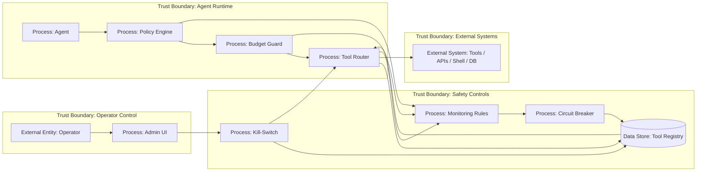

# 17 — Circuit Breaker и Kill-Switch

> Навигация: [Оглавление](../../README.md) · [← Назад](16-monitoring-alerting.md) · [Вперёд →](../part-6-multi-agent-security/18-inter-agent-security.md)

*Кратко: circuit breaker временно ограничивает опасное или нестабильное поведение, а kill-switch аварийно отключает агента, tool или egress. Это последний слой защиты, когда prevention и detection уже недостаточны.*

## Суть

Агент может попасть в опасное состояние:

- бесконечный loop;
- массовые tool calls;
- runaway cost;
- повторные запрещённые действия;
- компрометация tool;
- prompt injection wave;
- утечка данных через egress;
- падение guardrails;
- неожиданное поведение новой версии модели / prompt / tool schema.

В такой ситуации система должна не “надеяться на LLM”, а уметь остановиться.

Разница:

| Механизм | Что делает |
|---|---|
| Circuit breaker | временно блокирует конкретный tool / route / user / agent после серии ошибок или нарушений |
| Kill-switch | аварийно отключает агента, tool, egress или весь runtime |
| Budget breaker | останавливает run при превышении лимита шагов, токенов, стоимости |
| Policy breaker | блокирует класс действий при нарушении политики |
| Manual override | оператор вручную отключает компонент |

Главная мысль:

> Kill-switch должен находиться вне контроля LLM.

## DFD



## Угроза / контекст

| Угроза | Пример | Risk |
|---|---|---|
| Runaway loop | агент бесконечно вызывает search / summarize | High |
| Cost explosion | один run тратит бюджет за счёт token bombing | High |
| Compromised tool | внешний MCP/tool начинает возвращать вредные инструкции | High |
| Egress spike | агент массово отправляет данные наружу | High |
| Guardrail failure | validation падает, но runtime продолжает выполнение | High |
| Manual stop отсутствует | оператор не может быстро отключить агента | High |
| Kill-switch доступен агенту | LLM может включить/выключить защиту | Critical |
| Breaker не логируется | невозможно понять, почему tool отключён | Medium |

## Подходы и контрмеры

### 1. Kill-switch вне LLM

LLM не должна иметь tool:

```text
disable_kill_switch()
enable_all_tools()
ignore_breaker()
```

Kill-switch должен быть:

- в runtime config;
- в admin control plane;
- в feature flag;
- в защищённом storage;
- доступен только оператору / CI / incident response.

### 2. Circuit breaker per tool

Блокировать лучше не всё сразу, а конкретный компонент:

```text
send_email: open
web_search: closed
run_shell: disabled
db_write: disabled
```

### 3. Budget breaker per run

Останавливать run по лимитам:

- max steps;
- max tool calls;
- max tokens;
- max cost;
- max wall-clock time;
- max denied actions;
- max egress attempts.

### 4. Fail closed

Если guardrail, policy, approval или validation недоступны — действие должно быть заблокировано.

Плохо:

```text
policy service unavailable → allow tool call
```

Хорошо:

```text
policy service unavailable → deny high-risk action
```

### 5. Safe degradation

Отключение опасных tools не обязательно должно полностью ломать агента.

```text
write tools disabled → read-only mode
egress disabled → local-only mode
LLM provider unstable → fallback model или stop
```

## Пример (Go)

### Circuit breaker state

```go
package breaker

import (
    "context"
    "errors"
    "sync"
    "time"
)

type State string

const (
    Closed   State = "closed"
    Open     State = "open"
    HalfOpen State = "half_open"
)

type CircuitBreaker struct {
    mu        sync.Mutex
    state     State
    failures  int
    threshold int
    openedAt  time.Time
    cooldown  time.Duration
}

func NewCircuitBreaker(threshold int, cooldown time.Duration) *CircuitBreaker {
    return &CircuitBreaker{
        state:     Closed,
        threshold: threshold,
        cooldown:  cooldown,
    }
}

func (b *CircuitBreaker) Allow() bool {
    b.mu.Lock()
    defer b.mu.Unlock()

    switch b.state {
    case Closed:
        return true
    case Open:
        if time.Since(b.openedAt) >= b.cooldown {
            b.state = HalfOpen
            return true
        }
        return false
    case HalfOpen:
        return true
    default:
        return false
    }
}

func (b *CircuitBreaker) Success() {
    b.mu.Lock()
    defer b.mu.Unlock()

    b.failures = 0
    b.state = Closed
}

func (b *CircuitBreaker) Failure() {
    b.mu.Lock()
    defer b.mu.Unlock()

    b.failures++
    if b.failures >= b.threshold {
        b.state = Open
        b.openedAt = time.Now().UTC()
    }
}
```

### Kill-switch

```go
type KillSwitch interface {
    Enabled(ctx context.Context, scope string) (bool, error)
}

type MemoryKillSwitch struct {
    mu      sync.RWMutex
    closed  map[string]bool
}

func NewMemoryKillSwitch() *MemoryKillSwitch {
    return &MemoryKillSwitch{
        closed: make(map[string]bool),
    }
}

func (k *MemoryKillSwitch) Activate(scope string) {
    k.mu.Lock()
    defer k.mu.Unlock()
    k.closed[scope] = true
}

func (k *MemoryKillSwitch) Deactivate(scope string) {
    k.mu.Lock()
    defer k.mu.Unlock()
    k.closed[scope] = false
}

func (k *MemoryKillSwitch) Enabled(ctx context.Context, scope string) (bool, error) {
    k.mu.RLock()
    defer k.mu.RUnlock()
    return k.closed[scope], nil
}
```

### Safe tool executor

```go
type Tool interface {
    Call(ctx context.Context, args map[string]any) (any, error)
}

type SafeToolExecutor struct {
    ToolName string
    Tool     Tool
    Breaker  *CircuitBreaker
    Kill     KillSwitch
}

var ErrToolDisabled = errors.New("tool disabled by kill-switch")
var ErrCircuitOpen = errors.New("tool circuit breaker is open")

func (e SafeToolExecutor) Call(ctx context.Context, args map[string]any) (any, error) {
    disabled, err := e.Kill.Enabled(ctx, "tool:"+e.ToolName)
    if err != nil {
        // fail closed: если состояние kill-switch не удалось прочитать,
        // опаснее разрешить действие, чем заблокировать.
        return nil, err
    }

    if disabled {
        return nil, ErrToolDisabled
    }

    if !e.Breaker.Allow() {
        return nil, ErrCircuitOpen
    }

    result, err := e.Tool.Call(ctx, args)
    if err != nil {
        e.Breaker.Failure()
        return nil, err
    }

    e.Breaker.Success()
    return result, nil
}
```

### Budget breaker для agent loop

```go
type RunBudget struct {
    MaxSteps     int
    MaxToolCalls int
    MaxDenied    int

    Steps     int
    ToolCalls int
    Denied    int
}

func (b *RunBudget) Check() error {
    if b.Steps > b.MaxSteps {
        return errors.New("max steps exceeded")
    }
    if b.ToolCalls > b.MaxToolCalls {
        return errors.New("max tool calls exceeded")
    }
    if b.Denied > b.MaxDenied {
        return errors.New("max denied actions exceeded")
    }
    return nil
}
```

### Пример использования в loop

```go
func AgentLoop(ctx context.Context, budget *RunBudget, next func() error) error {
    for {
        budget.Steps++

        if err := budget.Check(); err != nil {
            return err
        }

        if err := next(); err != nil {
            return err
        }
    }
}
```

## Когда срабатывать

| Событие | Реакция |
|---|---|
| 1 ошибка tool | log |
| N ошибок tool подряд | open circuit breaker |
| prompt injection spike | alert + усилить approval |
| egress with secret | block egress + high alert |
| token runaway | stop run |
| compromised tool | disable tool via kill-switch |
| guardrail unavailable | fail closed for high-risk actions |
| incident confirmed | global read-only mode / full shutdown |

## Чек-лист

- [ ] Есть max steps для agent loop.
- [ ] Есть max tool calls.
- [ ] Есть token / cost budget.
- [ ] Circuit breaker работает per tool.
- [ ] Kill-switch находится вне контроля LLM.
- [ ] Kill-switch может отключить tool, egress, agent, tenant.
- [ ] При недоступности policy/guardrail используется fail closed.
- [ ] Breaker events логируются.
- [ ] Kill-switch activation логируется и алертится.
- [ ] Есть read-only / degraded mode.
- [ ] Есть ручной операторский override.
- [ ] Есть процедура восстановления после incident.

## Литература

- [Список литературы](../literature.md#стандарты-и-фреймворки)
- [OWASP Agentic AI — Threats and Mitigations](https://genai.owasp.org/resource/agentic-ai-threats-and-mitigations/)
- [NIST AI Risk Management Framework](https://www.nist.gov/itl/ai-risk-management-framework)
- [OpenTelemetry Documentation](https://opentelemetry.io/docs/)
- [OpenAI Agents SDK — Agents](https://developers.openai.com/api/docs/guides/agents)

## См. также

- [05 — Rate Limiting, Quotas и Token Bombing](../part-2-input-security/05-rate-limiting-quotas-token-bombing.md)
- [08 — Sandboxing](../part-3-processing-security/08-sandboxing.md)
- [13 — Egress Control и Data Exfiltration Prevention](../part-4-output-security/13-egress-control-data-exfiltration.md)
- [16 — Monitoring и Alerting](16-monitoring-alerting.md)
