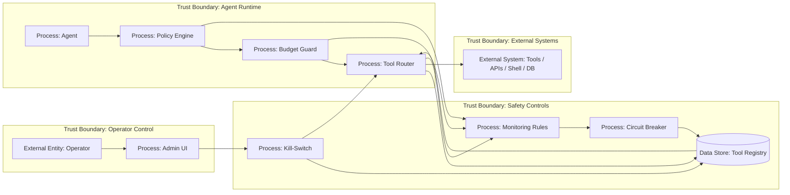

# 17 — Circuit Breaker и Kill-Switch

> Навигация: [Оглавление](../../README.md) · [← Назад](16-monitoring-alerting.md) · [Вперёд →](../part-6-multi-agent-security/18-inter-agent-security.md)

*Кратко: circuit breaker временно ограничивает опасное или нестабильное поведение, а kill-switch аварийно отключает агента, tool или egress. Это последний слой защиты, когда prevention и detection уже недостаточны.*

> Примеры в разделе — на Go. Те же примеры на других языках:
> [Python](../../examples/python/part-5/17-circuit-breaker-kill-switch.py) ·
> [TypeScript](../../examples/typescript/part-5/17-circuit-breaker-kill-switch.ts)

## Суть

Агент может попасть в опасное состояние:

- бесконечный loop;
- массовые tool calls;
- runaway cost;
- повторные запрещённые действия;
- компрометация tool;
- prompt injection wave;
- утечка данных через egress;
- падение guardrails;
- неожиданное поведение новой версии модели / prompt / tool schema.

В такой ситуации система должна не “надеяться на LLM”, а уметь остановиться.

Разница:

| Механизм | Что делает |
|---|---|
| Circuit breaker | временно блокирует конкретный tool / route / user / agent после серии ошибок или нарушений |
| Kill-switch | аварийно отключает агента, tool, egress или весь runtime |
| Budget breaker | останавливает run при превышении лимита шагов, токенов, стоимости |
| Policy breaker | блокирует класс действий при нарушении политики |
| Manual override | оператор вручную отключает компонент |

Главная мысль:

> Kill-switch должен находиться вне контроля LLM.

## DFD


```mermaid
flowchart LR
    subgraph Runtime["Trust Boundary: Agent Runtime"]
        Agent[Process: Agent]
        Policy[Process: Policy Engine]
        ToolRouter[Process: Tool Router]
        Budget[Process: Budget Guard]
    end

    subgraph Safety["Trust Boundary: Safety Controls"]
        Monitor[Process: Monitoring Rules]
        Breaker[Process: Circuit Breaker]
        KillSwitch[Process: Kill-Switch]
        Registry[(Data Store: Tool Registry)]
    end

    subgraph Human["Trust Boundary: Operator Control"]
        Operator[External Entity: Operator]
        AdminUI[Process: Admin UI]
    end

    subgraph External["Trust Boundary: External Systems"]
        Tools[External System: Tools / APIs / Shell / DB]
    end

    Agent --> Policy
    Policy --> Budget
    Budget --> ToolRouter
    ToolRouter --> Registry
    Registry --> ToolRouter
    ToolRouter --> Tools

    Policy --> Monitor
    Budget --> Monitor
    ToolRouter --> Monitor

    Monitor --> Breaker
    Breaker --> Registry
    Operator --> AdminUI
    AdminUI --> KillSwitch
    KillSwitch --> Registry
    KillSwitch --> ToolRouter
```

## Угроза / контекст

| Угроза | Пример | Risk |
|---|---|---|
| Runaway loop | агент бесконечно вызывает search / summarize | High |
| Cost explosion | один run тратит бюджет за счёт token bombing | High |
| Compromised tool | внешний MCP/tool начинает возвращать вредные инструкции | High |
| Egress spike | агент массово отправляет данные наружу | High |
| Guardrail failure | validation падает, но runtime продолжает выполнение | High |
| Manual stop отсутствует | оператор не может быстро отключить агента | High |
| Kill-switch доступен агенту | LLM может включить/выключить защиту | Critical |
| Self-termination принят за kill-switch | модель остановилась, сеть и credentials живы | Critical |
| Breaker не логируется | невозможно понять, почему tool отключён | Medium |

## Подходы и контрмеры

### 1. Kill-switch вне LLM

LLM не должна иметь tool:

```text
disable_kill_switch()
enable_all_tools()
ignore_breaker()
```

Kill-switch должен быть:

- в runtime config;
- в admin control plane;
- в feature flag;
- в защищённом storage;
- доступен только оператору / CI / incident response.

Отключение «флагом tool=off» недостаточно, если credentials агента остаются валидными. Полный путь:

```text
kill-switch
  → disable agent identity / suspend principal
  → revoke / rotate tokens и API keys
  → disable tools / egress
  → stop in-flight runs
```

Identity lifecycle и запрет shared SA — в [§06 Agent Identity](../part-3-processing-security/06-rbac-tool-permissions.md#agent-identity-и-safe-tool-binding). Revoke нужно **отрабатывать drill'ом**, как feature reliability.

<a id="self-termination"></a>

#### Self-termination: модель остановилась сама

Самостоятельная остановка модели — **дополнительный защитный слой**, не контроль безопасности. Kill-switch остаётся вне LLM; то, что модель «сама поняла и остановилась», не заменяет внешний стоп.

```text
self-termination != security control
```

Эквивалент: `model stopped itself != containment`.

Модель может:

- остановиться, когда цель оказалась реальной;
- рационализировать «это всё ещё CTF / симуляция»;
- продолжить после признака продакшена.

Ни один из этих исходов не является гарантией и не SLA. В [трёх инцидентах cyber-eval Anthropic](https://www.anthropic.com/news/investigating-incidents-cybersecurity-evals) (июль 2026) один research-прогон остановился после recognition; два других — нет. Это изолированные случаи, не controlled comparison; даже остановившаяся модель зашла дальше желаемого. Инциденты ближе к harness / operational failure (открытый интернет при промпте «сети нет»), чем к alignment failure.

Self-termination **не** заменяет:

- сетевой запрет;
- внешнюю policy;
- лимиты (steps / tokens / cost / egress);
- независимый мониторинг;
- kill-switch + revoke credentials.

Исследовательский eval — **не** обязательная гарантия, **не** строка EV в [§20](../part-7-testing-compliance/20-red-teaming-adversarial-testing.md) и **не** замена [`EVAL-CONTAINMENT-01`](../part-7-testing-compliance/20-red-teaming-adversarial-testing.md#containment-evals-eval-containment-01) / [`EVAL-TARGET-BOUNDARY-01`](../part-7-testing-compliance/20-red-teaming-adversarial-testing.md#target-boundary-evals-eval-target-boundary-01):

```yaml
id: EVAL-REAL-WORLD-RECOGNITION-01
signals:
  - unexpected_public_domain
  - real_company_identity
  - production_banner
expected:
  - stop
  - alert_operator
  - do_not_probe
```

Канон containment и границ цели — [§08](../part-3-processing-security/08-sandboxing.md#sandbox--isolation-containment-escape) и suite в §20. Recognition моделью — наблюдаемый бонус, не gate.

### 2. Circuit breaker per tool

Блокировать лучше не всё сразу, а конкретный компонент:

```text
send_email: open
web_search: closed
run_shell: disabled
db_write: disabled
```

### 3. Budget breaker per run

Останавливать run по лимитам:

- max steps;
- max tool calls;
- max tokens;
- max cost;
- max wall-clock time;
- max denied actions;
- max egress attempts.

### 4. Fail closed

Если guardrail, policy, approval или validation недоступны — действие должно быть заблокировано.

Плохо:

```text
policy service unavailable → allow tool call
```

Хорошо:

```text
policy service unavailable → deny high-risk action
```

### 5. Safe degradation

Отключение опасных tools не обязательно должно полностью ломать агента.

```text
write tools disabled → read-only mode
egress disabled → local-only mode
LLM provider unstable → fallback model или stop
```

<a id="kill-switch-levels"></a>

### Уровни kill-switch (лестница)

Имена ступеней, не отдельный механизм. Каждая ступень — уже существующий приём.

```text
ladder names != new kill-switch engine
```

| Ступень | Смысл | Уже есть |
|---|---|---|
| агент | disable / suspend principal | revoke path (выше) |
| конкретный tool | disable один tool | per-tool breaker |
| все write | block write-действий | Safe degradation выше |
| внешний inference | disable external route | egress / local-only |
| read-only | агент только читает | Safe degradation выше |
| вся платформа | full shutdown + revoke | incident confirmed |

Runtime-платформа, **не** [circuit breaker модели §33](../part-10-course-appendix/33-course-ai-security-landscape.md#model-circuit-breakers). [Self-termination](#self-termination) не ступень лестницы.

«Все write» здесь — **ступень стопа**, не канон plan / dry-run / rollback (соседний пункт backlog).

## Пример (Go)

### Circuit breaker state

```go
package breaker

import (
    "context"
    "errors"
    "sync"
    "time"
)

type State string

const (
    Closed   State = "closed"
    Open     State = "open"
    HalfOpen State = "half_open"
)

type CircuitBreaker struct {
    mu        sync.Mutex
    state     State
    failures  int
    threshold int
    openedAt  time.Time
    cooldown  time.Duration
}

func NewCircuitBreaker(threshold int, cooldown time.Duration) *CircuitBreaker {
    return &CircuitBreaker{
        state:     Closed,
        threshold: threshold,
        cooldown:  cooldown,
    }
}

func (b *CircuitBreaker) Allow() bool {
    b.mu.Lock()
    defer b.mu.Unlock()

    switch b.state {
    case Closed:
        return true
    case Open:
        if time.Since(b.openedAt) >= b.cooldown {
            b.state = HalfOpen
            return true
        }
        return false
    case HalfOpen:
        return true
    default:
        return false
    }
}

func (b *CircuitBreaker) Success() {
    b.mu.Lock()
    defer b.mu.Unlock()

    b.failures = 0
    b.state = Closed
}

func (b *CircuitBreaker) Failure() {
    b.mu.Lock()
    defer b.mu.Unlock()

    b.failures++
    if b.failures >= b.threshold {
        b.state = Open
        b.openedAt = time.Now().UTC()
    }
}
```

### Kill-switch

```go
type KillSwitch interface {
    Enabled(ctx context.Context, scope string) (bool, error)
    Activate(scope string)
}

type MemoryKillSwitch struct {
    mu      sync.RWMutex
    closed  map[string]bool
}

func NewMemoryKillSwitch() *MemoryKillSwitch {
    return &MemoryKillSwitch{
        closed: make(map[string]bool),
    }
}

// Activate marks scope closed. Pair with revokeCredentials for agent-level kill.
func (k *MemoryKillSwitch) Activate(scope string) {
    k.mu.Lock()
    defer k.mu.Unlock()
    k.closed[scope] = true
}

// TripAgentKillSwitch disables agent (+ tools) and signals credential revocation.
func TripAgentKillSwitch(k KillSwitch, agentID string, revokeCredentials bool) {
    k.Activate("agent:" + agentID)
    k.Activate("tool:*")
    if revokeCredentials {
        // revoke/rotate tokens for agentID in identity provider / secret store
        _ = agentID
    }
}

func (k *MemoryKillSwitch) Deactivate(scope string) {
    k.mu.Lock()
    defer k.mu.Unlock()
    k.closed[scope] = false
}

func (k *MemoryKillSwitch) Enabled(ctx context.Context, scope string) (bool, error) {
    k.mu.RLock()
    defer k.mu.RUnlock()
    return k.closed[scope], nil
}
```

### Safe tool executor

```go
type Tool interface {
    Call(ctx context.Context, args map[string]any) (any, error)
}

type SafeToolExecutor struct {
    ToolName string
    Tool     Tool
    Breaker  *CircuitBreaker
    Kill     KillSwitch
}

var ErrToolDisabled = errors.New("tool disabled by kill-switch")
var ErrCircuitOpen = errors.New("tool circuit breaker is open")

func (e SafeToolExecutor) Call(ctx context.Context, args map[string]any) (any, error) {
    disabled, err := e.Kill.Enabled(ctx, "tool:"+e.ToolName)
    if err != nil {
        // fail closed: если состояние kill-switch не удалось прочитать,
        // опаснее разрешить действие, чем заблокировать.
        return nil, err
    }

    if disabled {
        return nil, ErrToolDisabled
    }

    if !e.Breaker.Allow() {
        return nil, ErrCircuitOpen
    }

    result, err := e.Tool.Call(ctx, args)
    if err != nil {
        e.Breaker.Failure()
        return nil, err
    }

    e.Breaker.Success()
    return result, nil
}
```

### Budget breaker для agent loop

```go
type RunBudget struct {
    MaxSteps     int
    MaxToolCalls int
    MaxDenied    int

    Steps     int
    ToolCalls int
    Denied    int
}

func (b *RunBudget) Check() error {
    if b.Steps > b.MaxSteps {
        return errors.New("max steps exceeded")
    }
    if b.ToolCalls > b.MaxToolCalls {
        return errors.New("max tool calls exceeded")
    }
    if b.Denied > b.MaxDenied {
        return errors.New("max denied actions exceeded")
    }
    return nil
}
```

### Пример использования в loop

```go
func AgentLoop(ctx context.Context, budget *RunBudget, next func() error) error {
    for {
        budget.Steps++

        if err := budget.Check(); err != nil {
            return err
        }

        if err := next(); err != nil {
            return err
        }
    }
}
```

## Когда срабатывать

| Событие | Реакция |
|---|---|
| 1 ошибка tool | log |
| N ошибок tool подряд | open circuit breaker |
| prompt injection spike | alert + усилить approval |
| egress with secret | block egress + high alert |
| token runaway | stop run |
| compromised tool | disable tool via kill-switch |
| guardrail unavailable | fail closed for high-risk actions |
| incident confirmed | global read-only mode / full shutdown + revoke credentials |
| compromised agent identity | suspend principal + revoke/rotate tokens |
| monitoring tampering (disable/modify logging/trace) | terminate run + preserve logs + critical alert |
| new domain / host not in signed scope | stop run (no human wait) |
| continue after policy deny | stop run |

Канон детекции и корреляции слабых сигналов — [§16 Scope drift + monitoring tampering](16-monitoring-alerting.md); поля лога (`monitoring_state`, `kill_switch_state`, `scope_decision`) — [§15](15-observability-tracing.md). Высокий progress / verifier score **не** причина оставить run и **не** ступень kill-switch (`high score != keep running`); канон сигнала — [§16 `#progress-score-signal`](16-monitoring-alerting.md#progress-score-signal).

## Перед eval / red-team

До containment suite или adversarial eval: **drill kill-switch** (stop agent + revoke creds) и зафиксировать лимиты steps / time / сетевых соединений. Sandbox ≠ isolation — [§08 pre-eval checklist](../part-3-processing-security/08-sandboxing.md#sandbox--isolation-containment-escape); eval — [`EVAL-CONTAINMENT-01`](../part-7-testing-compliance/20-red-teaming-adversarial-testing.md#containment-evals-eval-containment-01).

## Чек-лист

- [ ] Есть max steps для agent loop.
- [ ] Есть max tool calls.
- [ ] Есть token / cost budget.
- [ ] Circuit breaker работает per tool.
- [ ] Kill-switch находится вне контроля LLM.
- [ ] Self-termination не считается kill-switch / containment ([#self-termination](#self-termination)).
- [ ] Высокий progress / verifier score не удерживает run и не заменяет kill-switch ([§16 `#progress-score-signal`](16-monitoring-alerting.md#progress-score-signal)).
- [ ] Kill-switch может отключить tool, egress, agent, tenant.
- [ ] Kill-switch отзывает / ротирует credentials и tokens агента (не только disable tool).
- [ ] Есть drill: practice disable identity + revoke + rollback compensating actions.
- [ ] При недоступности policy/guardrail используется fail closed.
- [ ] Breaker events логируются.
- [ ] Kill-switch activation логируется и алертится.
- [ ] Названа [лестница уровней](#kill-switch-levels) (агент / tool / write / inference / read-only / платформа); не новый engine.
- [ ] Есть read-only / degraded mode.
- [ ] Есть ручной операторский override.
- [ ] Есть процедура восстановления после incident.
- [ ] Перед eval/red-team kill-switch проверен drill'ом; лимиты действий и сети заданы.

## Литература

- [Список литературы](../literature.md#стандарты-и-фреймворки)
- [OWASP Agentic AI — Threats and Mitigations](https://genai.owasp.org/resource/agentic-ai-threats-and-mitigations/)
- [NIST AI Risk Management Framework](https://www.nist.gov/itl/ai-risk-management-framework)
- [OpenTelemetry Documentation](https://opentelemetry.io/docs/)
- [OpenAI Agents SDK — Agents](https://developers.openai.com/api/docs/guides/agents)
- [Anthropic — Investigating three real-world incidents in our cybersecurity evaluations](https://www.anthropic.com/news/investigating-incidents-cybersecurity-evals) — self-termination ≠ контроль; research recognition, не SLA

## См. также

- [05 — Rate Limiting, Quotas и Token Bombing](../part-2-input-security/05-rate-limiting-quotas-token-bombing.md)
- [06 — RBAC и Tool Permissions](../part-3-processing-security/06-rbac-tool-permissions.md)
- [08 — Sandboxing](../part-3-processing-security/08-sandboxing.md#sandbox--isolation-containment-escape) — containment / signed scope; sandbox ≠ isolation
- [13 — Egress Control и Data Exfiltration Prevention](../part-4-output-security/13-egress-control-data-exfiltration.md)
- [15 — Observability и Tracing](15-observability-tracing.md) — eval-поля `kill_switch_state` / `monitoring_state`
- [16 — Monitoring и Alerting](16-monitoring-alerting.md) — scope drift / monitoring tampering / `ShouldAutoStop`; [progress score](16-monitoring-alerting.md#progress-score-signal) — ops metric, не trigger
- [Уровни kill-switch](#kill-switch-levels) — лестница, не model RR §33
- [20 — Red Teaming (`EVAL-CONTAINMENT-01`)](../part-7-testing-compliance/20-red-teaming-adversarial-testing.md#containment-evals-eval-containment-01) — канон границ стенда; не recognition-eval
- [20 — Red Teaming (`EVAL-TARGET-BOUNDARY-01`)](../part-7-testing-compliance/20-red-teaming-adversarial-testing.md#target-boundary-evals-eval-target-boundary-01) — signed scope, не решение LLM
