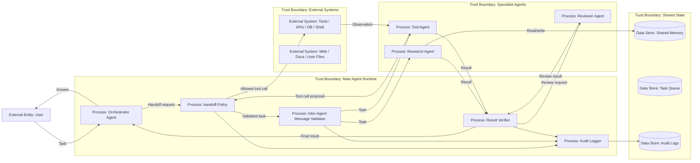

# 18 — Inter-Agent Security

> Навигация: [Оглавление](../../README.md) · [← Назад](../part-5-control-observability/17-circuit-breaker-kill-switch.md) · [Вперёд →](19-mcp-security.md)

*Кратко: inter-agent security — это безопасность взаимодействия между агентами: handoff, delegation, shared memory, message passing, delegated tools и ответственность за действия.*

## Суть

Мультиагентная система — это не просто несколько LLM рядом.

Это система, где один агент может:

- передать задачу другому агенту;
- запросить результат у специализированного агента;
- использовать общий context / memory;
- получить delegated access к tool;
- объединить ответы нескольких агентов;
- принять решение на основе результата другого агента.

Главная проблема:

> Агент не должен автоматически доверять другому агенту.

Даже если оба агента находятся внутри одной системы, их сообщения нужно считать **недоверенными данными**, пока они не прошли policy, validation и provenance check.

## Базовая модель

```text
User → Orchestrator Agent → Specialist Agent → Tool / Memory / External System
```

Риск появляется в моменте делегирования:

```text
Кто передал задачу?
Кому передал?
С какими правами?
Какие данные были переданы?
Какие tools доступны получателю?
Кто отвечает за итоговое действие?
```

## DFD



## Trust boundaries

| Boundary | Что внутри | Почему важно |
|---|---|---|
| User / External Input | пользовательские задачи, файлы, веб-страницы | источник prompt injection и подмены цели |
| Main Agent Runtime | orchestrator, policy, validator, verifier | контроль делегирования и итогового действия |
| Specialist Agents | отдельные агенты с разными ролями | нельзя давать им одинаковые права |
| Shared State | memory, queue, intermediate artifacts | риск memory poisoning и leakage |
| External Systems | tools, DB, APIs, shell | реальные side effects и утечки |

## Угроза / контекст

| Угроза | Пример | Risk |
|---|---|---|
| Agent impersonation | один агент выдаёт себя за другого | High |
| Handoff policy bypass | orchestrator передаёт задачу напрямую, минуя policy | High |
| Instruction laundering | вредная инструкция проходит через другого агента как “легитимный результат” | High |
| Delegated privilege escalation | low-privilege агент просит high-privilege агента выполнить действие | High |
| Context leakage | агент получает больше данных, чем нужно для задачи | High |
| Memory poisoning | один агент записывает вредный контекст в shared memory | High |
| Consensus manipulation | несколько агентов повторяют одну ошибку и создают ложное доверие | Medium |
| Responsibility diffusion | непонятно, какой агент принял опасное решение | Medium |
| Tool result confusion | результат одного tool принимается как инструкция для другого агента | High |
| Infinite delegation loop | агенты бесконечно передают задачу друг другу | Medium |

## Подходы и контрмеры

### 1. Явная identity для каждого агента

У каждого агента должны быть:

- `agent_id`;
- роль;
- scopes;
- разрешённые handoff targets;
- разрешённые tools;
- data access policy;
- owner / team;
- версия prompt / policy.

Пример:

```text
agent: research-agent
role: read-only research
tools: web_search, read_docs
forbidden: send_email, db_write, shell
handoff_to: reviewer-agent
```

### 2. Handoff — это tool call

Передача задачи другому агенту должна проходить через такую же защиту, как обычный tool call:

```text
handoff proposal → schema validation → policy check → budget check → trace → execution
```

Нельзя делать неявное:

```text
LLM решила передать задачу → runtime сразу вызвал другого агента
```

### 3. Delegated scopes

Если агент A передал задачу агенту B, агент B не должен автоматически получить все права агента A.

Плохо:

```text
B получает полный доступ к данным и tools A
```

Хорошо:

```text
B получает ограниченный delegated scope только под конкретную задачу
```

### 4. Message provenance

Каждое inter-agent сообщение должно содержать:

- кто отправил;
- кому отправил;
- для какой задачи;
- какой run_id;
- какой parent_action_id;
- какие данные переданы;
- какой trust level;
- подпись / hash / audit id для критичных систем.

### 5. Shared memory isolation

Общая память — опасное место.

Минимальные правила:

- не все агенты пишут в одну memory;
- write access отдельно от read access;
- память маркируется по source и trust level;
- untrusted memory не превращается в instruction;
- записи в memory проходят sanitization;
- есть TTL и owner.

### 6. Result verification

Результат другого агента — не факт.

Для high-risk задач нужен reviewer / verifier:

```text
specialist result → verifier → policy → final answer / action
```

Важно:

- verifier не должен использовать те же самые недоверенные данные без маркировки;
- verifier не должен иметь больше прав, чем нужно;
- majority vote не заменяет проверку источников и policy.

### 7. Budget для handoffs

Нужно ограничивать:

- max handoffs per run;
- max depth;
- max agents involved;
- max shared memory writes;
- max delegated tool calls;
- max cost per child agent.

## Пример (Go)

### Identity и scopes агента

```go
package interagent

import (
	"context"
	"errors"
	"fmt"
	"time"
)

type AgentID string
type Scope string

const (
	ScopeReadDocs   Scope = "read:docs"
	ScopeWebSearch  Scope = "web:search"
	ScopeSendEmail  Scope = "send:email"
	ScopeDBWrite    Scope = "db:write"
	ScopeShell      Scope = "shell:run"
)

type AgentIdentity struct {
	ID             AgentID
	Role           string
	AllowedTools   []string
	AllowedScopes  []Scope
	HandoffTargets []AgentID
	PromptVersion  string
	PolicyVersion  string
}

func HasScope(scopes []Scope, want Scope) bool {
	for _, s := range scopes {
		if s == want {
			return true
		}
	}
	return false
}
```

### Inter-agent message

```go
type TrustLevel string

const (
	TrustedRuntime TrustLevel = "trusted_runtime"
	UntrustedInput TrustLevel = "untrusted_input"
	AgentOutput    TrustLevel = "agent_output"
)

type AgentMessage struct {
	ID             string
	RunID          string
	ParentActionID string
	From           AgentID
	To             AgentID
	Task           string
	DataRefs       []string
	DelegatedScopes []Scope
	Trust          TrustLevel
	CreatedAt      time.Time
}
```

### Handoff policy

```go
type HandoffPolicy struct {
	Agents map[AgentID]AgentIdentity
}

func (p HandoffPolicy) AllowHandoff(msg AgentMessage) error {
	from, ok := p.Agents[msg.From]
	if !ok {
		return fmt.Errorf("unknown source agent: %s", msg.From)
	}

	to, ok := p.Agents[msg.To]
	if !ok {
		return fmt.Errorf("unknown target agent: %s", msg.To)
	}

	if !containsAgent(from.HandoffTargets, msg.To) {
		return fmt.Errorf("handoff from %s to %s is not allowed", msg.From, msg.To)
	}

	for _, scope := range msg.DelegatedScopes {
		if !HasScope(from.AllowedScopes, scope) {
			return fmt.Errorf("source agent does not own scope: %s", scope)
		}
		if !HasScope(to.AllowedScopes, scope) {
			return fmt.Errorf("target agent cannot receive scope: %s", scope)
		}
	}

	if msg.Trust == UntrustedInput {
		return errors.New("untrusted input cannot be delegated without sanitization")
	}

	return nil
}

func containsAgent(items []AgentID, want AgentID) bool {
	for _, item := range items {
		if item == want {
			return true
		}
	}
	return false
}
```

### Handoff budget

```go
type HandoffBudget struct {
	MaxDepth       int
	MaxHandoffs    int
	MaxAgents      int
	Depth          int
	Handoffs       int
	AgentsInvolved map[AgentID]bool
}

func (b *HandoffBudget) Check(next AgentID) error {
	if b.AgentsInvolved == nil {
		b.AgentsInvolved = make(map[AgentID]bool)
	}

	b.Handoffs++
	b.AgentsInvolved[next] = true

	if b.Depth > b.MaxDepth {
		return errors.New("max handoff depth exceeded")
	}
	if b.Handoffs > b.MaxHandoffs {
		return errors.New("max handoffs exceeded")
	}
	if len(b.AgentsInvolved) > b.MaxAgents {
		return errors.New("max agents involved exceeded")
	}

	return nil
}
```

### Safe handoff executor

```go
type Agent interface {
	Run(ctx context.Context, msg AgentMessage) (AgentMessage, error)
}

type AuditLogger interface {
	LogHandoff(ctx context.Context, msg AgentMessage, decision string, reason string) error
}

type HandoffExecutor struct {
	Policy HandoffPolicy
	Agents map[AgentID]Agent
	Audit  AuditLogger
	Budget *HandoffBudget
}

func (e HandoffExecutor) Execute(ctx context.Context, msg AgentMessage) (AgentMessage, error) {
	if err := e.Budget.Check(msg.To); err != nil {
		_ = e.Audit.LogHandoff(ctx, msg, "denied", err.Error())
		return AgentMessage{}, err
	}

	if err := e.Policy.AllowHandoff(msg); err != nil {
		_ = e.Audit.LogHandoff(ctx, msg, "denied", err.Error())
		return AgentMessage{}, err
	}

	agent, ok := e.Agents[msg.To]
	if !ok {
		err := fmt.Errorf("agent not registered: %s", msg.To)
		_ = e.Audit.LogHandoff(ctx, msg, "denied", err.Error())
		return AgentMessage{}, err
	}

	_ = e.Audit.LogHandoff(ctx, msg, "allowed", "handoff policy passed")
	return agent.Run(ctx, msg)
}
```

## STRIDE для inter-agent взаимодействия

| STRIDE | Угроза для multi-agent |
|---|---|
| Spoofing | агент подменяет identity другого агента |
| Tampering | сообщение между агентами меняет task или scope |
| Repudiation | невозможно доказать, какой агент запросил действие |
| Information Disclosure | один агент получает чужой context или memory |
| Denial of Service | handoff loop, task explosion, agent swarm |
| Elevation of Privilege | агент получает capabilities через другого агента |

## Чек-лист

- [ ] У каждого агента есть identity, role и scopes.
- [ ] Handoff проходит через policy, а не напрямую.
- [ ] Есть allowlist допустимых handoff targets.
- [ ] Delegated scopes уже, чем права исходного агента.
- [ ] Inter-agent messages имеют run_id и parent_action_id.
- [ ] Shared memory разделена по owner / tenant / trust level.
- [ ] Agent output не считается trusted instruction.
- [ ] Есть budget на handoffs и depth.
- [ ] High-risk результат проверяется reviewer/verifier.
- [ ] Все handoffs логируются.
- [ ] Tool calls child-agent тоже проходят RBAC/schema/sandbox.
- [ ] Majority vote не используется как единственный security control.

## Литература

- [Список литературы](../literature.md#стандарты-и-фреймворки)
- [OWASP Multi-Agentic System Threat Modeling Guide](https://genai.owasp.org/resource/multi-agentic-system-threat-modeling-guide-v1-0/)
- [OWASP Agentic AI — Threats and Mitigations](https://genai.owasp.org/resource/agentic-ai-threats-and-mitigations/)
- [OpenAI Agents SDK — Handoffs](https://openai.github.io/openai-agents-python/handoffs/)
- [OpenAI Agents SDK — Guardrails](https://openai.github.io/openai-agents-python/guardrails/)
- [NIST AI Risk Management Framework](https://www.nist.gov/itl/ai-risk-management-framework)

## См. также

- [06 — RBAC и Tool Permissions](../part-3-processing-security/06-rbac-tool-permissions.md)
- [09 — Memory Isolation и Context Sanitization](../part-3-processing-security/09-memory-isolation-context-sanitization.md)
- [14 — Human-in-the-Loop](../part-5-control-observability/14-human-in-the-loop.md)
- [15 — Observability и Tracing](../part-5-control-observability/15-observability-tracing.md)
- [19 — MCP Security](19-mcp-security.md)
