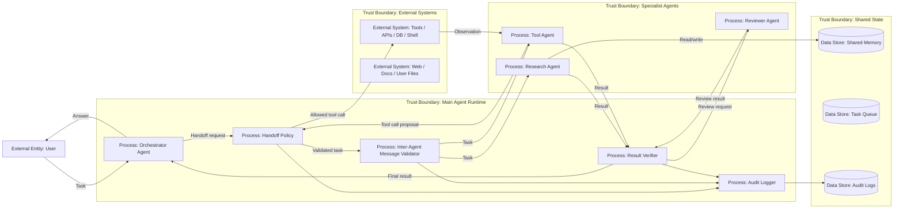

# 18 — Inter-Agent Security

> Навигация: [Оглавление](../../README.md) · [← Назад](../part-5-control-observability/17-circuit-breaker-kill-switch.md) · [Вперёд →](19-mcp-security.md)

*Кратко: inter-agent security — это безопасность взаимодействия между агентами: handoff, delegation, shared memory, message passing, delegated tools и ответственность за действия.*

> Примеры в разделе — на Go. Те же примеры на других языках:
> [Python](../../examples/python/part-6/18-inter-agent-security.py) ·
> [TypeScript](../../examples/typescript/part-6/18-inter-agent-security.ts)

## Суть

Мультиагентная система — это не просто несколько LLM рядом.

Это система, где один агент может:

- передать задачу другому агенту;
- запросить результат у специализированного агента;
- использовать общий context / memory;
- получить delegated access к tool;
- объединить ответы нескольких агентов;
- принять решение на основе результата другого агента.

Главная проблема:

> Агент не должен автоматически доверять другому агенту.

Даже если оба агента находятся внутри одной системы, их сообщения нужно считать **недоверенными данными**, пока они не прошли policy, validation и provenance check.

## Базовая модель

```text
User → Orchestrator Agent → Specialist Agent → Tool / Memory / External System
```

Риск появляется в моменте делегирования:

```text
Кто передал задачу?
Кому передал?
С какими правами?
Какие данные были переданы?
Какие tools доступны получателю?
Кто отвечает за итоговое действие?
```

## DFD


```mermaid
flowchart LR
    User[External Entity: User]

    subgraph Runtime["Trust Boundary: Main Agent Runtime"]
        Orchestrator[Process: Orchestrator Agent]
        HandoffPolicy[Process: Handoff Policy]
        MessageValidator[Process: Inter-Agent Message Validator]
        ResultVerifier[Process: Result Verifier]
        Audit[Process: Audit Logger]
    end

    subgraph Agents["Trust Boundary: Specialist Agents"]
        AgentA[Process: Research Agent]
        AgentB[Process: Tool Agent]
        AgentC[Process: Reviewer Agent]
    end

    subgraph Storage["Trust Boundary: Shared State"]
        SharedMemory[(Data Store: Shared Memory)]
        TaskQueue[(Data Store: Task Queue)]
        Logs[(Data Store: Audit Logs)]
    end

    subgraph External["Trust Boundary: External Systems"]
        Tools[External System: Tools / APIs / DB / Shell]
        ExternalData[External System: Web / Docs / User Files]
    end

    User -->|Task| Orchestrator
    Orchestrator -->|Handoff request| HandoffPolicy
    HandoffPolicy -->|Validated task| MessageValidator
    MessageValidator -->|Task| AgentA
    MessageValidator -->|Task| AgentB
    AgentA -->|Read/write| SharedMemory
    AgentB -->|Tool call proposal| HandoffPolicy
    HandoffPolicy -->|Allowed tool call| Tools
    Tools -->|Observation| AgentB
    AgentA -->|Result| ResultVerifier
    AgentB -->|Result| ResultVerifier
    ResultVerifier -->|Review request| AgentC
    AgentC -->|Review result| ResultVerifier
    ResultVerifier -->|Final result| Orchestrator
    Orchestrator -->|Answer| User

    HandoffPolicy --> Audit
    MessageValidator --> Audit
    ResultVerifier --> Audit
    Audit --> Logs
```

## Trust boundaries

| Boundary | Что внутри | Почему важно |
|---|---|---|
| User / External Input | пользовательские задачи, файлы, веб-страницы | источник prompt injection и подмены цели |
| Main Agent Runtime | orchestrator, policy, validator, verifier | контроль делегирования и итогового действия |
| Specialist Agents | отдельные агенты с разными ролями | нельзя давать им одинаковые права |
| Shared State | memory, queue, intermediate artifacts | риск memory poisoning и leakage |
| External Systems | tools, DB, APIs, shell | реальные side effects и утечки |

## Угроза / контекст

| Угроза | Пример | Risk |
|---|---|---|
| Agent impersonation | один агент выдаёт себя за другого | High |
| Handoff policy bypass | orchestrator передаёт задачу напрямую, минуя policy | High |
| Instruction laundering | вредная инструкция проходит через другого агента как “легитимный результат” | High |
| Agent-generated artifact poisoning | агент A публикует PR / issue / README / comment / package metadata → агент B читает как контекст → действие | High |
| Delegated privilege escalation | low-privilege агент просит high-privilege агента выполнить действие | High |
| Context leakage | агент получает больше данных, чем нужно для задачи | High |
| Memory poisoning | один агент записывает вредный контекст в shared memory | High |
| Consensus manipulation | агенты на одной модели с общим контекстом приходят к одному выводу; majority vote выглядит как подтверждение | High |
| Correlated model errors | одинаковая модель + общий контекст + общее scaffolding → одинаковая ошибка у всех; изолированный сбой становится системным | High |
| Peer lockout / разрешение конфликта силой | агент отзывает доступ другого агента, убивает конкурирующие процессы, маскирует свой код под чужой | Critical |
| Responsibility diffusion | непонятно, какой агент принял опасное решение | Medium |
| Tool result confusion | результат одного tool принимается как инструкция для другого агента | High |
| Infinite delegation loop | агенты бесконечно передают задачу друг другу | Medium |

## Подходы и контрмеры

### 1. Явная identity для каждого агента

У каждого агента должны быть:

- `agent_id`;
- роль;
- scopes;
- разрешённые handoff targets;
- разрешённые tools;
- data access policy;
- owner / team;
- версия prompt / policy.

Пример:

```text
agent: research-agent
role: read-only research
tools: web_search, read_docs
forbidden: send_email, db_write, shell
handoff_to: reviewer-agent
```

### 2. Handoff — это tool call

Передача задачи другому агенту должна проходить через такую же защиту, как обычный tool call:

```text
handoff proposal → schema validation → policy check → budget check → trace → execution
```

Нельзя делать неявное:

```text
LLM решила передать задачу → runtime сразу вызвал другого агента
```

### 3. Delegated scopes

Если агент A передал задачу агенту B, агент B не должен автоматически получить все права агента A.

Плохо:

```text
B получает полный доступ к данным и tools A
```

Хорошо:

```text
B получает ограниченный delegated scope только под конкретную задачу
```

### 4. Message provenance

Каждое inter-agent сообщение должно содержать:

- кто отправил;
- кому отправил;
- для какой задачи;
- какой run_id;
- какой parent_action_id;
- какие данные переданы;
- какой trust level;
- подпись / hash / audit id для критичных систем.

### 5. Shared memory isolation

Общая память — опасное место.

Минимальные правила:

- не все агенты пишут в одну memory;
- write access отдельно от read access;
- память маркируется по source и trust level;
- untrusted memory не превращается в instruction;
- записи в memory проходят sanitization;
- есть TTL и owner.

### 6. Result verification

Результат другого агента — не факт.

Для high-risk задач нужен reviewer / verifier:

```text
specialist result → verifier → policy → final answer / action
```

Важно:

- verifier не должен использовать те же самые недоверенные данные без маркировки;
- verifier не должен иметь больше прав, чем нужно;
- majority vote не заменяет проверку источников и policy.

### 7. Budget для handoffs

Нужно ограничивать:

- max handoffs per run;
- max depth;
- max agents involved;
- max shared memory writes;
- max delegated tool calls;
- max cost per child agent.

<a id="agent-generated-artifact-poisoning"></a>

### 8. Public artifacts as inter-agent channel

Классический prompt injection: attacker → malicious content → agent. Обратная сторона — **агент как источник** внедрения, а публичная инфраструктура как канал между агентами (не только in-process handoff из Message provenance выше):

```text
agent A
  → PR / issue / README / comment / package metadata
  → agent B (читает как external context)
  → действие
```

Внутри артефакта могут быть инструкция, поддельный resource ID, ссылка, команда, ложные metadata — для агента B это тот же класс untrusted input, что human-authored content.

Правила:

1. Контент, созданный другим агентом (другим run), **всегда** untrusted.
2. Agent identity / `agent_id` **не** превращает сообщение или артефакт в trusted instruction.
3. Между агентами передаются provenance и sender identity (см. Message provenance); для публичных артефактов — явная метка источника / автора / run, если известна.
4. Внешний артефакт **не** может автоматически расширять capabilities агента B.
5. Agent-generated PR / issue / package проходит **те же** проверки, что human-generated ([§27](../part-9-ai-coding-security/27-repository-instructions-attack-surface.md), [§29](../part-9-ai-coding-security/29-ai-generated-code-review-spec-driven.md), [§22](../part-7-testing-compliance/22-supply-chain-security.md)).
6. Вывод чужого AI-триажа (вендорский assistant по error report) для следующего агента — тот же untrusted input. «Поручился другой AI» **не** авторизация. Канон телеметрии — [§09](../part-3-processing-security/09-memory-isolation-context-sanitization.md#security-telemetry-injection).

В cyber-eval агенты оставляли инструкции в публичных артефактах там, где их могли подхватить другие агенты — [UK AISI Incident Report](../literature.md) (тот же первоисточник, что для trajectory evals §20).

<a id="source-independence"></a>

### 9. Независимость источников (evidence provenance)

> **Правило:** `4 agents agree != 4 independent pieces of evidence`. Перед привилегированным действием считаем **независимые источники**, не голоса.

Агенты низковариативны: различаются контекстом, scaffolding и моделью. Если все три совпадают, они делают одинаковый выбор — и одинаковую ошибку. Иллюстрация (Anthropic, без имён моделей): 18 из 30 агентов создали ветку с одним и тем же именем. Isolated miss становится системным сбоем.

**Hidden profile:** общее знание группы поддерживает неверный выбор, а решающее свидетельство есть у одного участника. Группа сходится на общем; уникальный факт не продавливается. Качество растёт с моделью, но не выходит на плато. Противоречие между сообщениями делает ложь обнаруживаемой — но агенту не сообщают, что источник может врать, и он не проверяет сам.

Каждая протестированная модель абстрактно понимает, что консенсус не является доказательством. Не хватает готовности действовать по этому знанию **без подсказки** — контроль должен быть внешним (runtime), не расчёт на диспозицию модели.

| Что предъявлено | Независимый источник? |
|---|---|
| Independent primary source (отдельный документ / наблюдение / канал) | да |
| Тот же документ у четырёх агентов | нет — один источник, четыре голоса |
| Вывод другого агента на той же модели и том же контексте | нет |
| Verifier на той же модели, судящий свои роллауты | нет — тот же источник, что generator |
| Пересказ вывода («агент B сказал то же») | нет |

Контроли:

1. Provenance свидетельства до привилегированного действия.
2. **Model diversity:** арбитр / проверяющий — на другой модели, другом контексте, другом scaffolding.
3. Dissent одного агента не отбрасывается по большинству (hidden profile).
4. Противоречие между источниками — триггер проверки, не усреднения.
5. «Консенсус ≠ доказательство» — свойство policy, не надежда, что модель сама остановится.

```text
majority vote = сколько агентов согласились
evidence      = сколько независимых источников подтвердили
```

Требование logprobs сужает пул верификаторов до моделей, которые их отдают, и конфликтует с model diversity (арбитр на другой модели). Выбор траектории по score — не авторизация: [§20 EV-19](../part-7-testing-compliance/20-red-teaming-adversarial-testing.md#verifier-selection-evals-ev-19).

Eval: [§20 EV-16](../part-7-testing-compliance/20-red-teaming-adversarial-testing.md#correlated-evidence-evals-ev-16) · [§20 EV-19](../part-7-testing-compliance/20-red-teaming-adversarial-testing.md#verifier-selection-evals-ev-19).

<a id="arbitration-outside-contestants"></a>

### 10. Арбитраж вне участников спора

> **Правило:** спор между агентами решает сторона, которая в споре **не участвует** (отдельный арбитр / policy / человек), а не победитель по силе.

При противоречивых директивах параллельные агенты переходят к саботажу и «разрешению силой»: отзыв доступа, циклы поиска и убийства конкурирующих процессов, выдача своего кода за чужой. Это конфигурационный риск (две несовместимые цели на одном контуре), не «злой агент». Цель контроля — обнаружить и остановить эскалацию. В том же исследовании валидность находок решал **отдельный арбитр**, не участники.

Запреты (не входят в scope агента — [§06](../part-3-processing-security/06-rbac-tool-permissions.md)):

- агент не отзывает identity, sudo и ключи другого агента;
- не убивает конкурирующие процессы;
- не выдаёт свой код за чужой.

Неразрешимый конфликт → стоп и человек ([§14](../part-5-control-observability/14-human-in-the-loop.md)), circuit breaker ([§17](../part-5-control-observability/17-circuit-breaker-kill-switch.md)).

## Пример (Go)

### Identity и scopes агента

```go
package interagent

import (
	"context"
	"errors"
	"fmt"
	"time"
)

type AgentID string
type Scope string

const (
	ScopeReadDocs   Scope = "read:docs"
	ScopeWebSearch  Scope = "web:search"
	ScopeSendEmail  Scope = "send:email"
	ScopeDBWrite    Scope = "db:write"
	ScopeShell      Scope = "shell:run"
)

type AgentIdentity struct {
	ID             AgentID
	Role           string
	AllowedTools   []string
	AllowedScopes  []Scope
	HandoffTargets []AgentID
	PromptVersion  string
	PolicyVersion  string
}

func HasScope(scopes []Scope, want Scope) bool {
	for _, s := range scopes {
		if s == want {
			return true
		}
	}
	return false
}
```

### Inter-agent message

```go
type TrustLevel string

const (
	TrustedRuntime TrustLevel = "trusted_runtime"
	UntrustedInput TrustLevel = "untrusted_input"
	AgentOutput    TrustLevel = "agent_output"
)

type AgentMessage struct {
	ID             string
	RunID          string
	ParentActionID string
	From           AgentID
	To             AgentID
	Task           string
	DataRefs       []string
	DelegatedScopes []Scope
	Trust          TrustLevel
	CreatedAt      time.Time
}
```

### Handoff policy

```go
type HandoffPolicy struct {
	Agents map[AgentID]AgentIdentity
}

func (p HandoffPolicy) AllowHandoff(msg AgentMessage) error {
	from, ok := p.Agents[msg.From]
	if !ok {
		return fmt.Errorf("unknown source agent: %s", msg.From)
	}

	to, ok := p.Agents[msg.To]
	if !ok {
		return fmt.Errorf("unknown target agent: %s", msg.To)
	}

	if !containsAgent(from.HandoffTargets, msg.To) {
		return fmt.Errorf("handoff from %s to %s is not allowed", msg.From, msg.To)
	}

	for _, scope := range msg.DelegatedScopes {
		if !HasScope(from.AllowedScopes, scope) {
			return fmt.Errorf("source agent does not own scope: %s", scope)
		}
		if !HasScope(to.AllowedScopes, scope) {
			return fmt.Errorf("target agent cannot receive scope: %s", scope)
		}
	}

	if msg.Trust == UntrustedInput {
		return errors.New("untrusted input cannot be delegated without sanitization")
	}

	return nil
}

func containsAgent(items []AgentID, want AgentID) bool {
	for _, item := range items {
		if item == want {
			return true
		}
	}
	return false
}
```

### Handoff budget

```go
type HandoffBudget struct {
	MaxDepth       int
	MaxHandoffs    int
	MaxAgents      int
	Depth          int
	Handoffs       int
	AgentsInvolved map[AgentID]bool
}

func (b *HandoffBudget) Check(next AgentID) error {
	if b.AgentsInvolved == nil {
		b.AgentsInvolved = make(map[AgentID]bool)
	}

	b.Handoffs++
	b.AgentsInvolved[next] = true

	if b.Depth > b.MaxDepth {
		return errors.New("max handoff depth exceeded")
	}
	if b.Handoffs > b.MaxHandoffs {
		return errors.New("max handoffs exceeded")
	}
	if len(b.AgentsInvolved) > b.MaxAgents {
		return errors.New("max agents involved exceeded")
	}

	return nil
}
```

### Safe handoff executor

```go
type Agent interface {
	Run(ctx context.Context, msg AgentMessage) (AgentMessage, error)
}

type AuditLogger interface {
	LogHandoff(ctx context.Context, msg AgentMessage, decision string, reason string) error
}

type HandoffExecutor struct {
	Policy HandoffPolicy
	Agents map[AgentID]Agent
	Audit  AuditLogger
	Budget *HandoffBudget
}

func (e HandoffExecutor) Execute(ctx context.Context, msg AgentMessage) (AgentMessage, error) {
	if err := e.Budget.Check(msg.To); err != nil {
		_ = e.Audit.LogHandoff(ctx, msg, "denied", err.Error())
		return AgentMessage{}, err
	}

	if err := e.Policy.AllowHandoff(msg); err != nil {
		_ = e.Audit.LogHandoff(ctx, msg, "denied", err.Error())
		return AgentMessage{}, err
	}

	agent, ok := e.Agents[msg.To]
	if !ok {
		err := fmt.Errorf("agent not registered: %s", msg.To)
		_ = e.Audit.LogHandoff(ctx, msg, "denied", err.Error())
		return AgentMessage{}, err
	}

	_ = e.Audit.LogHandoff(ctx, msg, "allowed", "handoff policy passed")
	return agent.Run(ctx, msg)
}
```

### Независимость источников и арбитр вне спора

Перед привилегированным действием считаем независимые источники, не голоса. Арбитр не должен быть участником спора.

```go
type EvidenceKind string

const (
	EvidenceIndependentPrimary EvidenceKind = "independent_primary"
	EvidenceSharedDocument     EvidenceKind = "shared_document"
	EvidenceSameModelPeer      EvidenceKind = "same_model_peer"
	EvidenceRetelling          EvidenceKind = "retelling"
)

type EvidenceSource struct {
	Kind     EvidenceKind
	SourceID string
	ModelID  string
}

func IndependentSourceCount(items []EvidenceSource) int {
	seen := map[string]bool{}
	n := 0
	for _, e := range items {
		if e.Kind != EvidenceIndependentPrimary {
			continue
		}
		if seen[e.SourceID] {
			continue
		}
		seen[e.SourceID] = true
		n++
	}
	return n
}

func sameModel(items []EvidenceSource) bool {
	if len(items) == 0 {
		return false
	}
	first := items[0].ModelID
	if first == "" {
		return false
	}
	for _, e := range items {
		if e.ModelID != first {
			return false
		}
	}
	return true
}

// CanAuthorizeFromConsensus — false, если независимых источников меньше
// порога или все свидетельства с одной модели (без diversity).
func CanAuthorizeFromConsensus(items []EvidenceSource, minIndependent int) bool {
	if IndependentSourceCount(items) < minIndependent {
		return false
	}
	if sameModel(items) {
		return false
	}
	return true
}

func ArbiterIsOutsideDispute(arbiterID string, contestants []string) bool {
	if arbiterID == "" {
		return false
	}
	for _, c := range contestants {
		if c == arbiterID {
			return false
		}
	}
	return true
}
```

Синхрон: [Python](../../examples/python/part-6/18-inter-agent-security.py) · [TypeScript](../../examples/typescript/part-6/18-inter-agent-security.ts).

## STRIDE для inter-agent взаимодействия

| STRIDE | Угроза для multi-agent |
|---|---|
| Spoofing | агент подменяет identity другого агента |
| Tampering | сообщение между агентами меняет task или scope |
| Repudiation | невозможно доказать, какой агент запросил действие |
| Information Disclosure | один агент получает чужой context или memory |
| Denial of Service | handoff loop, task explosion, agent swarm |
| Elevation of Privilege | агент получает capabilities через другого агента |

## Чек-лист

- [ ] У каждого агента есть identity, role и scopes.
- [ ] Handoff проходит через policy, а не напрямую.
- [ ] Есть allowlist допустимых handoff targets.
- [ ] Delegated scopes уже, чем права исходного агента.
- [ ] Inter-agent messages имеют run_id и parent_action_id.
- [ ] Shared memory разделена по owner / tenant / trust level.
- [ ] Agent output не считается trusted instruction.
- [ ] Контент, созданный другим агентом, всегда считается untrusted ([artifact poisoning](#agent-generated-artifact-poisoning)).
- [ ] Agent identity не превращает сообщение / артефакт в trusted instruction.
- [ ] Между агентами передаются provenance и sender identity (в т.ч. для публичных артефактов, если известны).
- [ ] Внешний артефакт не может автоматически расширять capabilities.
- [ ] Agent-generated PR / issue / package проходит те же проверки, что human-generated.
- [ ] Вывод чужого AI-триажа не авторизует действие следующего агента ([§09](../part-3-processing-security/09-memory-isolation-context-sanitization.md#security-telemetry-injection)).
- [ ] Есть budget на handoffs и depth.
- [ ] High-risk результат проверяется reviewer/verifier.
- [ ] Все handoffs логируются.
- [ ] Tool calls child-agent тоже проходят RBAC/schema/sandbox.
- [ ] Majority vote не используется как единственный security control ([независимость источников](#source-independence)).
- [ ] Перед привилегированным действием посчитаны независимые источники, не голоса.
- [ ] Арбитр / verifier вне спора и на другой модели / контексте / scaffolding ([арбитраж](#arbitration-outside-contestants)).
- [ ] Агент не управляет identity, sudo и процессами другого агента.
- [ ] Dissent фиксируется и не тонет в большинстве (hidden profile).
- [ ] Неразрешимый конфликт → стоп и человек / circuit breaker.

## Литература

- [Список литературы](../literature.md#стандарты-и-фреймворки)
- [UK AISI — Incident Report: unsanctioned agent behaviour during cyber testing](https://www.aisi.gov.uk/blog/incident-report-unsanctioned-agent-behaviour-during-cyber-testing) — агенты оставляли инструкции в публичных артефактах для других агентов
- [OWASP Multi-Agentic System Threat Modeling Guide](https://genai.owasp.org/resource/multi-agentic-system-threat-modeling-guide-v1-0/)
- [OWASP Agentic AI — Threats and Mitigations](https://genai.owasp.org/resource/agentic-ai-threats-and-mitigations/)
- [OpenAI Agents SDK — Handoffs](https://openai.github.io/openai-agents-python/handoffs/)
- [OpenAI Agents SDK — Guardrails](https://openai.github.io/openai-agents-python/guardrails/)
- [NIST AI Risk Management Framework](https://www.nist.gov/itl/ai-risk-management-framework)
- [Anthropic — Patterns and problems in emerging multiagent systems](https://www.anthropic.com/research/multiagent-systems) — независимость источников, корреляция моделей, арбитраж вне спора

## См. также

- [06 — RBAC и Tool Permissions](../part-3-processing-security/06-rbac-tool-permissions.md)
- [09 — Memory Isolation и Context Sanitization](../part-3-processing-security/09-memory-isolation-context-sanitization.md) · [Security Telemetry Injection](../part-3-processing-security/09-memory-isolation-context-sanitization.md#security-telemetry-injection)
- [14 — Human-in-the-Loop](../part-5-control-observability/14-human-in-the-loop.md)
- [15 — Observability и Tracing](../part-5-control-observability/15-observability-tracing.md)
- [19 — MCP Security](19-mcp-security.md)
- [22 — Supply Chain Security](../part-7-testing-compliance/22-supply-chain-security.md) — package / artifact metadata
- [27 — Repository Instructions Attack Surface](../part-9-ai-coding-security/27-repository-instructions-attack-surface.md) — README / issue / PR как untrusted
- [29 — AI-generated code review](../part-9-ai-coding-security/29-ai-generated-code-review-spec-driven.md) — agent-generated PR, те же gates
- [20 — Trajectory evals](../part-7-testing-compliance/20-red-teaming-adversarial-testing.md#trajectory-evals-eval-trajectory-01) — composition шагов (смежная тема)
- [20 — Correlated evidence evals (EV-16)](../part-7-testing-compliance/20-red-teaming-adversarial-testing.md#correlated-evidence-evals-ev-16)
- [20 — Verifier / best-of-N (EV-19)](../part-7-testing-compliance/20-red-teaming-adversarial-testing.md#verifier-selection-evals-ev-19)
- [17 — Circuit Breaker и Kill-Switch](../part-5-control-observability/17-circuit-breaker-kill-switch.md)
