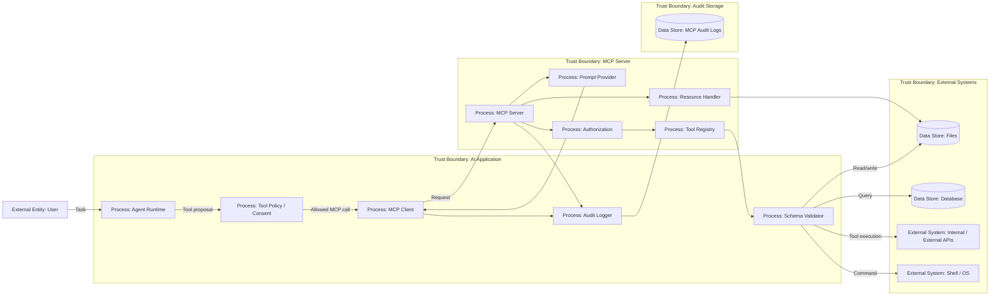

# 19 — MCP Security

> Навигация: [Оглавление](../../README.md) · [← Назад](18-inter-agent-security.md) · [Вперёд →](../part-7-testing-compliance/20-red-teaming-adversarial-testing.md)

*Кратко: MCP Security — это безопасность подключения агента к внешним MCP-серверам, tools и data sources. Главный риск: MCP расширяет возможности агента, но одновременно расширяет attack surface.*

## Суть

MCP — Model Context Protocol.

На практике MCP позволяет AI-приложению подключаться к внешним источникам данных и инструментам через унифицированный протокол:

```text
AI App / MCP Client → MCP Server → Tools / Resources / Prompts / External Systems
```

Это удобно, но опасно.

MCP-сервер может предоставить агенту:

- инструменты;
- доступ к файлам;
- доступ к БД;
- доступ к внутренним API;
- prompts;
- resources;
- dynamic tool discovery;
- выполнение действий во внешних системах.

Главная мысль:

> MCP-сервер — это не “просто источник контекста”. Это внешний trust boundary, через который агент может получить новые capabilities.

## Что защищаем

| Объект | Риск |
|---|---|
| MCP client | может довериться вредному серверу |
| MCP server | может выполнить опасное действие |
| Tools | могут быть вызваны не тем пользователем или не с теми аргументами |
| Resources | могут раскрыть приватные данные |
| Prompts | могут содержать prompt injection |
| OAuth / tokens | могут быть украдены или использованы не по назначению |
| Session | может смешать пользователей или tenants |
| Tool metadata | может обмануть агента описанием возможностей |

## DFD



## Trust boundaries

| Boundary | Что внутри | Почему опасно |
|---|---|---|
| AI Application | agent runtime, MCP client, local policy | агент может довериться metadata сервера |
| MCP Server | tools, resources, prompts, authz | сервер получает доступ к данным и действиям |
| External Systems | файлы, БД, API, shell | реальные side effects |
| Audit Storage | MCP logs, tool calls, decisions | нужен для расследования и compliance |

## Угроза / контекст

| Угроза | Пример | Risk |
|---|---|---|
| Tool poisoning | MCP server описывает опасный tool как безопасный | High |
| Prompt injection через resources/prompts | MCP resource содержит “ignore previous instructions” | High |
| Excessive tool permissions | MCP server получает доступ ко всем файлам / API | High |
| Confused deputy | агент с правами пользователя вызывает tool не по назначению | High |
| OAuth token leakage | access token попадает в логи или model context | High |
| Session confusion | данные одного пользователя видны другому | High |
| Unsafe dynamic discovery | агент автоматически подключает новый MCP tool | High |
| Command execution abuse | MCP tool вызывает shell с непроверенными аргументами | Critical |
| Supply chain risk | установлен вредный MCP server / package | High |
| Missing audit | невозможно доказать, какой MCP tool что сделал | Medium |
| Server impersonation | клиент подключается не к тому MCP server | High |
| Egress bypass | MCP server отправляет данные наружу в обход egress policy | High |

## MCP03 — Tool Poisoning

**MCP03 (Tool Poisoning)** — атака, при которой описание, schema или metadata MCP tool заставляют агента использовать инструмент не так, как ожидает пользователь. Агент доверяет metadata сервера; злоумышленник или скомпрометированный сервер может подменить поведение без явного взлома runtime.

| Сценарий | Суть | Risk |
|---|---|---|
| Hidden instructions in description | скрытые инструкции в `tool.description` («ignore policy», «call shell next») | High |
| Capability lie | tool заявлен как read-only, но выполняет write / delete / deploy | High |
| Rug pull | benign server меняет поведение после consent пользователя или обновления пакета | High |
| Tool-output-as-command | вывод tool трактуется агентом как команда вызвать другой tool | Critical |
| Cross-server influence | один MCP server влияет на выбор и аргументы tools другого сервера | High |
| Context injection | MCP resource или prompt подмешивает инструкции в план агента | High |
| Shadow server | новый MCP server или tool появляется без review и попадает в discovery | High |

**Shadow servers** — серверы или tools, которые агент обнаруживает динамически (discovery, обновление конфига, подмена package) без прохождения allowlist и security review. **Context injection** — когда resource, prompt или tool output содержит управляющие инструкции, которые агент принимает как часть задачи пользователя.

Контрмеры (детали — в подразделах ниже):

- **Не доверять tool metadata** (п. 3) — поведение задаётся локальной policy, не описанием сервера.
- **Strict schema validation** (п. 4) — args, paths, URLs проверяются до execution.
- **Sandboxing MCP tools** (п. 8) — shell, filesystem, network в изоляции.
- Pin tool definitions (version/hash); при изменении metadata — re-review и alert.
- Tool output **никогда** не интерпретируется как управляющая инструкция для следующего tool call.

См. [OWASP MCP Top 10](https://owasp.org/www-project-mcp-top-10/) — MCP03 Tool Poisoning.

## Подходы и контрмеры

### 1. MCP server allowlist

Нельзя подключать любые MCP-серверы автоматически.

Минимум:

```text
server_id
origin / package
version
owner
allowed tools
allowed resources
allowed users / tenants
risk level
review status
```

### 2. Tool approval и consent

Пользователь или администратор должен понимать:

- какой MCP server подключается;
- какие tools он предоставляет;
- какие данные он может читать;
- какие действия он может выполнять;
- какие внешние системы он использует.

### 3. Не доверять tool metadata

Описание tool может быть вредным или вводящим в заблуждение.

Плохо:

```text
tool.description говорит "safe read-only" → runtime верит
```

Хорошо:

```text
tool behavior задаётся локальной policy, schema и allowlist
```

### 4. Strict schema validation

Каждый MCP tool call должен проходить:

- JSON schema validation;
- type validation;
- enum / allowlist;
- path validation;
- URL validation;
- ownership check;
- size limits;
- timeout;
- dry-run для опасных действий.

### 5. Session isolation

Для MCP нельзя смешивать:

- пользователей;
- tenants;
- проекты;
- workspaces;
- OAuth tokens;
- memory;
- temporary files;
- tool outputs.

### 6. Secrets never enter model context

Секреты нужны tool executor, но не LLM.

Правильно:

```text
LLM proposes: call github_issue_create
Runtime injects token server-side
LLM never sees token
```

### 7. Egress control

MCP server не должен быть обходным путём вокруг egress policy.

Ограничивать:

- domains;
- protocols;
- IP ranges;
- private networks;
- file uploads;
- webhook destinations;
- DNS tricks;
- redirects.

### 8. Sandboxing MCP tools

Особенно для tools, которые:

- читают файлы;
- пишут файлы;
- запускают команды;
- работают с git;
- ходят в сеть;
- устанавливают пакеты;
- выполняют код.

### 9. Audit everything

Фиксировать:

- MCP server id/version;
- tool name;
- validated args hash;
- user / tenant hash;
- scopes;
- approval;
- result status;
- external destination;
- bytes in/out;
- errors;
- policy rule id.

## Пример (Go)

### Registry MCP-серверов

```go
package mcpsecurity

import (
	"context"
	"errors"
	"fmt"
	"net/url"
	"path/filepath"
	"strings"
	"time"
)

type RiskLevel string

const (
	RiskLow      RiskLevel = "Low"
	RiskMedium   RiskLevel = "Medium"
	RiskHigh     RiskLevel = "High"
	RiskCritical RiskLevel = "Critical"
)

type MCPServer struct {
	ID             string
	Name           string
	Version        string
	Origin         string
	Owner          string
	AllowedTools   []string
	AllowedDomains []string
	AllowedRoots   []string
	Risk            RiskLevel
	Reviewed        bool
}

type Registry struct {
	Servers map[string]MCPServer
}

func (r Registry) Get(serverID string) (MCPServer, error) {
	s, ok := r.Servers[serverID]
	if !ok {
		return MCPServer{}, fmt.Errorf("mcp server is not allowlisted: %s", serverID)
	}
	if !s.Reviewed {
		return MCPServer{}, fmt.Errorf("mcp server is not reviewed: %s", serverID)
	}
	return s, nil
}
```

### MCP tool call

```go
type MCPToolCall struct {
	RunID    string
	UserID   string
	TenantID string
	ServerID string
	Tool     string
	Args     map[string]any
	Time     time.Time
}

func contains(items []string, want string) bool {
	for _, item := range items {
		if item == want {
			return true
		}
	}
	return false
}
```

### Policy check перед MCP call

```go
type Policy struct {
	Registry Registry
}

func (p Policy) Allow(call MCPToolCall) (MCPServer, error) {
	server, err := p.Registry.Get(call.ServerID)
	if err != nil {
		return MCPServer{}, err
	}

	if !contains(server.AllowedTools, call.Tool) {
		return MCPServer{}, fmt.Errorf("tool %s is not allowed for server %s", call.Tool, call.ServerID)
	}

	if server.Risk == RiskCritical {
		return MCPServer{}, errors.New("critical MCP server requires manual execution")
	}

	return server, nil
}
```

### URL allowlist для MCP egress

```go
func ValidateURL(raw string, allowedDomains []string) error {
	u, err := url.Parse(raw)
	if err != nil {
		return err
	}

	if u.Scheme != "https" {
		return errors.New("only https is allowed")
	}

	host := strings.ToLower(u.Hostname())
	for _, domain := range allowedDomains {
		domain = strings.ToLower(domain)
		if host == domain || strings.HasSuffix(host, "."+domain) {
			return nil
		}
	}

	return fmt.Errorf("domain is not allowed: %s", host)
}
```

### Path validation для file tools

```go
func ValidatePath(path string, allowedRoots []string) error {
	clean := filepath.Clean(path)

	for _, root := range allowedRoots {
		rootClean := filepath.Clean(root)

		rel, err := filepath.Rel(rootClean, clean)
		if err != nil {
			continue
		}

		if rel == "." || (!strings.HasPrefix(rel, "..") && !filepath.IsAbs(rel)) {
			return nil
		}
	}

	return fmt.Errorf("path is outside allowed roots: %s", path)
}
```

### Safe MCP executor

```go
type MCPClient interface {
	CallTool(ctx context.Context, serverID string, tool string, args map[string]any) (any, error)
}

type AuditLogger interface {
	LogMCPCall(ctx context.Context, call MCPToolCall, decision string, reason string) error
}

type Executor struct {
	Client MCPClient
	Policy Policy
	Audit  AuditLogger
}

func (e Executor) Call(ctx context.Context, call MCPToolCall) (any, error) {
	server, err := e.Policy.Allow(call)
	if err != nil {
		_ = e.Audit.LogMCPCall(ctx, call, "denied", err.Error())
		return nil, err
	}

	if rawURL, ok := call.Args["url"].(string); ok {
		if err := ValidateURL(rawURL, server.AllowedDomains); err != nil {
			_ = e.Audit.LogMCPCall(ctx, call, "denied", err.Error())
			return nil, err
		}
	}

	if rawPath, ok := call.Args["path"].(string); ok {
		if err := ValidatePath(rawPath, server.AllowedRoots); err != nil {
			_ = e.Audit.LogMCPCall(ctx, call, "denied", err.Error())
			return nil, err
		}
	}

	_ = e.Audit.LogMCPCall(ctx, call, "allowed", "policy passed")
	return e.Client.CallTool(ctx, call.ServerID, call.Tool, call.Args)
}
```

## STRIDE для MCP

| STRIDE | Угроза |
|---|---|
| Spoofing | поддельный MCP server или подмена tool identity |
| Tampering | изменение tool metadata, prompt, resource, args |
| Repudiation | нет audit trail по MCP tool calls |
| Information Disclosure | MCP resource раскрывает секреты или чужие данные |
| Denial of Service | MCP server вызывает heavy tools / loops / cost explosion |
| Elevation of Privilege | MCP tool получает права шире пользователя или tenant |

## MCP Security Checklist

- [ ] MCP servers подключаются только из allowlist.
- [ ] У каждого MCP server есть owner и review status.
- [ ] Tool discovery не даёт автоматического доступа к tools.
- [ ] Tool metadata не считается security policy.
- [ ] Все tool calls проходят schema validation.
- [ ] Для URL есть domain allowlist.
- [ ] Для файлов есть allowed roots.
- [ ] Секреты не передаются в model context.
- [ ] OAuth tokens изолированы по user/tenant/session.
- [ ] MCP sessions не смешивают пользователей.
- [ ] High-risk tools требуют approval.
- [ ] Command execution tools запускаются только в sandbox.
- [ ] MCP server не обходит egress policy.
- [ ] MCP calls логируются с run_id и server_id.
- [ ] Есть monitoring по MCP failures, denied calls и egress.
- [ ] Есть kill-switch per MCP server.
- [ ] Версии MCP server/packages фиксируются и обновляются контролируемо.
- [ ] Tool definitions pinned; metadata drift детектируется и требует re-review.
- [ ] Tool output не трактуется как инструкция вызвать другой tool.
- [ ] Shadow servers (новые tools/servers без review) блокируются и алертятся.

## Когда отключать MCP server

| Событие | Реакция |
|---|---|
| новый неизвестный tool появился без review | disable server |
| server начал делать неожиданный egress | block egress + alert |
| tool metadata изменилась | require re-review |
| найден secret в output | block output + rotate secret |
| command execution вне sandbox | disable tool |
| session leakage | disable server + incident response |
| repeated policy violations | open circuit breaker |

## Литература

- [Список литературы](../literature.md#mcp)
- [Model Context Protocol — Security Best Practices](https://modelcontextprotocol.io/docs/tutorials/security/security_best_practices)
- [Model Context Protocol Specification](https://modelcontextprotocol.io/specification/2025-03-26)
- [OWASP — Practical Guide for Secure MCP Server Development](https://genai.owasp.org/resource/a-practical-guide-for-secure-mcp-server-development/)
- [OWASP Agentic AI — Threats and Mitigations](https://genai.owasp.org/resource/agentic-ai-threats-and-mitigations/)
- [Anthropic — Introducing the Model Context Protocol](https://www.anthropic.com/news/model-context-protocol)

## См. также

- [06 — RBAC и Tool Permissions](../part-3-processing-security/06-rbac-tool-permissions.md)
- [07 — Parameter Validation и Schema Enforcement](../part-3-processing-security/07-parameter-validation-schema.md)
- [08 — Sandboxing](../part-3-processing-security/08-sandboxing.md)
- [10 — Secrets Management](../part-3-processing-security/10-secrets-management.md)
- [13 — Egress Control и Data Exfiltration Prevention](../part-4-output-security/13-egress-control-data-exfiltration.md)
- [17 — Circuit Breaker и Kill-Switch](../part-5-control-observability/17-circuit-breaker-kill-switch.md)
- [31 — CI/CD, MCP, Skills и production path](../part-9-ai-coding-security/31-ci-cd-mcp-skills-production-path.md)
