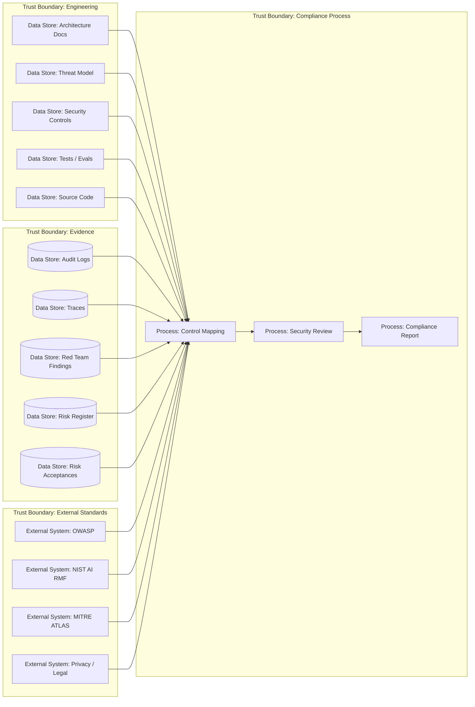
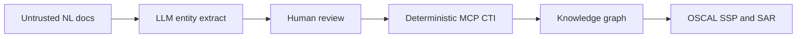

# 21 — Compliance и Standards

> Навигация: [Оглавление](../../README.md) · [← Назад](20-red-teaming-adversarial-testing.md) · [Вперёд →](22-supply-chain-security.md)

*Кратко: compliance для AI-агента — это не “поставить галочку”, а связать архитектуру, угрозы, контрмеры, тесты, логи и incident response с понятными стандартами и фреймворками.*

> Примеры в разделе — на Go. Те же примеры на других языках:
> [Python](../../examples/python/part-7/21-compliance-standards.py) ·
> [TypeScript](../../examples/typescript/part-7/21-compliance-standards.ts)

## Суть

Для конспекта по AI-безопасности стандарты нужны как карта:

- какие риски уже известны;
- какие controls ожидаются;
- как доказать, что защита работает;
- как связать threat model, red teaming, logging и incident response;
- как показать зрелость системы.

Главная мысль:

> Compliance не заменяет безопасность, но помогает не забыть важные классы рисков.

## Базовые фреймворки

| Фреймворк | Для чего использовать |
|---|---|
| OWASP LLM Top 10 | типовые риски LLM-приложений |
| OWASP Agentic AI / ASI Top 10 | агентные риски: goal hijack, tool misuse, rogue agents |
| OWASP MCP Security | безопасность MCP-серверов и tools |
| MITRE ATLAS | тактики и техники атак на AI-системы |
| NIST AI RMF | управление AI-рисками на уровне процесса |
| NIST OSCAL | machine-readable SSP/SAR и обмен assessment evidence |
| NIST SSDF / secure SDLC | supply chain и secure development |
| ISO/IEC 42001 | AI management system |
| SOC2 / ISO 27001 | организационные security controls |
| GDPR / privacy rules | персональные данные, minimization, retention, subject rights |

## DFD



## Как маппить разделы конспекта

| Раздел | OWASP / стандарт | Evidence |
|---|---|---|
| 01 Architecture | NIST Map, OWASP ASI | DFD, trust boundaries |
| 02 Threat Model | STRIDE, MITRE ATLAS, NIST Map | risk register |
| 03 Prompt Injection | OWASP LLM01, ASI01 | tests, detections |
| 04 PII Redaction | OWASP LLM02, privacy | redaction logs |
| 05 Rate Limits | OWASP LLM10 | budget metrics |
| 06 RBAC Tools | ASI02, ASI03 | policy decisions |
| 07 Schema Validation | OWASP LLM05 | validation failures |
| 08 Sandboxing | ASI05 | sandbox configs |
| 09 Memory Isolation | ASI06 | memory audit |
| 10 Secrets | OWASP LLM02, secure SDLC | secret scan reports |
| 11 Output Validation | OWASP LLM05 | output validation logs |
| 12 Hallucination | OWASP LLM09 | source verification |
| 13 Egress Control | OWASP LLM02 | egress block logs |
| 14 Human-in-the-Loop | ASI09 | approval logs |
| 15 Observability | NIST Manage | traces, audit logs |
| 16 Monitoring | NIST Measure / Manage | alerts, metrics |
| 17 Kill-Switch | incident readiness | breaker events |
| 18 Inter-Agent | ASI07, ASI08 | handoff logs |
| 19 MCP Security | MCP security guidance, ASI04 | MCP registry, call logs |
| 20 Red Teaming | NIST TEVV, MITRE ATLAS | test results |
| 22 Supply Chain | ASI04, secure SDLC | SBOM, dependency scans |
| 23 Incident Response | NIST Manage | incident reports |

## Угроза / контекст

| Угроза | Пример | Risk |
|---|---|---|
| Paper compliance | документы есть, но controls не работают | High |
| Нет evidence | невозможно доказать, что approval/egress реально сработали | Medium |
| Устаревший threat model | новые tools/MCP подключены, а риски не обновлены | High |
| Неполный scope | compliance покрывает LLM, но не covers tools и agents | High |
| Нет risk acceptance | опасные исключения живут без владельца и срока | Medium |
| Нет regression evidence | найденный bypass исправлен, но теста нет | Medium |
| Privacy gap | PII попадает в prompts, logs или third-party APIs | High |

## Подходы и контрмеры

### 1. Evidence-driven compliance

Для каждого control нужно хранить evidence:

```text
control → implementation → test → log/trace → owner → status
```

### 2. Control matrix

Минимальные поля:

```text
id
framework
requirement
control
implementation
evidence
owner
status
review_date
```

### 3. Risk acceptance

Если control не реализован, это должно быть явно:

```text
risk
reason
temporary mitigation
owner
expiration date
```

### 4. Standards не должны управлять архитектурой напрямую

Правильная последовательность:

```text
architecture → threat model → controls → tests → mapping to standards
```

Плохая последовательность:

```text
стандарт → формальные чекбоксы → иллюзия безопасности
```

## Пример (Go)

### Control matrix

```go
package compliance

import (
	"encoding/json"
	"errors"
	"time"
)

type Status string

const (
	Implemented Status = "implemented"
	Partial     Status = "partial"
	Planned     Status = "planned"
	AcceptedRisk Status = "accepted_risk"
)

type Control struct {
	ID             string    `json:"id"`
	Framework      string    `json:"framework"`
	Requirement    string    `json:"requirement"`
	Control        string    `json:"control"`
	Implementation string    `json:"implementation"`
	Evidence        []string  `json:"evidence"`
	Owner           string    `json:"owner"`
	Status          Status    `json:"status"`
	ReviewDate      time.Time `json:"review_date"`
}
```

### Пример controls

```go
var Controls = []Control{
	{
		ID:             "CTRL-001",
		Framework:      "OWASP LLM01",
		Requirement:    "Prompt Injection mitigation",
		Control:        "Detect and isolate untrusted instructions",
		Implementation: "Input guard + context isolation + tool approval",
		Evidence:        []string{"RT-001", "prompt_injection_detected logs"},
		Owner:           "agent-runtime",
		Status:          Implemented,
	},
	{
		ID:             "CTRL-002",
		Framework:      "OWASP LLM02",
		Requirement:    "Sensitive information disclosure prevention",
		Control:        "PII/secrets redaction before output and logs",
		Implementation: "Redaction pipeline + egress scanner",
		Evidence:        []string{"redaction logs", "egress_blocked events"},
		Owner:           "security",
		Status:          Partial,
	},
	{
		ID:             "CTRL-003",
		Framework:      "NIST AI RMF Measure",
		Requirement:    "Testing, evaluation, verification and validation",
		Control:        "Adversarial regression suite",
		Implementation: "Red team cases in CI",
		Evidence:        []string{"redteam-report.md", "CI run artifacts"},
		Owner:           "platform",
		Status:          Planned,
	},
}
```

### Проверка compliance matrix

```go
func ValidateControls(controls []Control) error {
	for _, c := range controls {
		if c.ID == "" || c.Framework == "" || c.Control == "" {
			return errors.New("control has required empty fields")
		}

		if c.Owner == "" {
			return errors.New("control has no owner: " + c.ID)
		}

		if c.Status == Implemented && len(c.Evidence) == 0 {
			return errors.New("implemented control has no evidence: " + c.ID)
		}

		if c.Status == AcceptedRisk && c.ReviewDate.IsZero() {
			return errors.New("accepted risk has no review date: " + c.ID)
		}
	}

	return nil
}
```

### Экспорт отчёта

```go
func ExportJSON(controls []Control) ([]byte, error) {
	if err := ValidateControls(controls); err != nil {
		return nil, err
	}

	return json.MarshalIndent(controls, "", "  ")
}
```

## Case study: MCP → knowledge graph → NIST OSCAL

В critical infrastructure / OT часто нельзя делать active scan, а на входе — **неструктурированные** описания инфраструктуры (legacy docs, summary от оператора). Нужны audit-ready артефакты, а не «модель нашла CVE по памяти».

Case study ([arXiv:2607.08288](https://arxiv.org/abs/2607.08288)): multi-agent pipeline на MCP превращает NL-описание в knowledge graph и machine-readable [NIST OSCAL](https://pages.nist.gov/OSCAL/) — System Security Plan (SSP) и Security Assessment Report (SAR).



### Урок для AI-агентов

| Паттерн | Почему |
|---|---|
| LLM reasoning **отделён** от deterministic retrieval | CVE/CVSS/KEV не «вспоминаются» — приходят из MCP tool call к authoritative source |
| MCP tool-use ≠ RAG similarity | binary exists/not vs probabilistic association; ошибки класса «нет данных», не «выдуманная связь» |
| Schema-valid OSCAL | evidence пригоден для audit workflow, не только markdown-отчёт |

### Ограничение (главное)

MCP grounding **сдвигает** ошибки, не устраняет их. В paper: factual hallucination на deterministically sourced KG nodes ≈ 0%, но semantic errors на **Phase 0 (entity extraction)** дают contextual false positives дальше по пайплайну. Контрольная точка — **human review extraction** (версии ОС, asset IDs, границы системы), а не «модель уже с MCP = trust».

Связь с конспектом: evidence в этом разделе; MCP trust / Runtime Trust Gap — [§19](../part-6-multi-agent-security/19-mcp-security.md); operational checklist — [§25](../part-8-practice/25-security-by-design-checklist.md) (C-08/C-09).

## Чек-лист

- [ ] Есть DFD и trust boundaries.
- [ ] Есть STRIDE/risk register.
- [ ] Каждый high-risk control имеет owner.
- [ ] Каждый implemented control имеет evidence.
- [ ] Red team findings связаны с regression tests.
- [ ] Privacy risks покрыты отдельно.
- [ ] MCP/tools входят в compliance scope.
- [ ] Exceptions имеют expiration date.
- [ ] Risk register обновляется при добавлении tool/MCP/server.
- [ ] Logs/traces достаточны для расследования.
- [ ] Compliance mapping не заменяет threat model.
- [ ] Есть периодический review.
- [ ] Где нужен audit: machine-readable artifacts (OSCAL SSP/SAR или эквивалент), не только prose.
- [ ] CTI/vuln claims только из verified tool/MCP sources; extraction из NL docs проходит human review.

## Литература

- [Список литературы](../literature.md#стандарты-и-фреймворки)
- [Muth & Margraf — From Legacy Documentation to OSCAL](https://arxiv.org/abs/2607.08288) — MCP-grounded pipeline → KG → OSCAL SSP/SAR
- [NIST OSCAL](https://pages.nist.gov/OSCAL/) — machine-readable security assessment exchange
- [NIST AI Risk Management Framework](https://www.nist.gov/itl/ai-risk-management-framework)
- [NIST AI RMF Playbook](https://airc.nist.gov/airmf-resources/playbook/)
- [OWASP Top 10 for LLM Applications](https://owasp.org/www-project-top-10-for-large-language-model-applications/)
- [OWASP Agentic AI — Threats and Mitigations](https://genai.owasp.org/resource/agentic-ai-threats-and-mitigations/)
- [MITRE ATLAS](https://atlas.mitre.org/)

## См. также

- [02 — Модель угроз](../part-1-architecture-threats/02-threat-model.md)
- [15 — Observability и Tracing](../part-5-control-observability/15-observability-tracing.md)
- [19 — MCP Security](../part-6-multi-agent-security/19-mcp-security.md)
- [20 — Red Teaming и Adversarial Testing](20-red-teaming-adversarial-testing.md)
- [22 — Supply Chain Security](22-supply-chain-security.md)
- [23 — Incident Response и Recovery](23-incident-response-recovery.md)
- [25 — Security-by-Design чек-лист](../part-8-practice/25-security-by-design-checklist.md)
