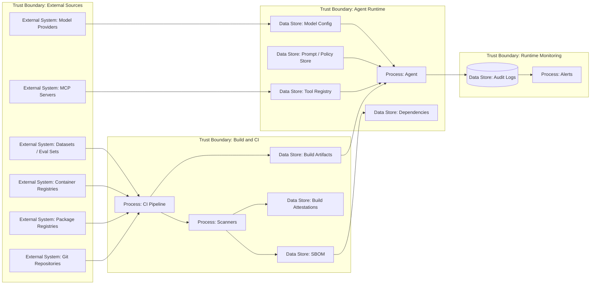

# 22 — Supply Chain Security

> Навигация: [Оглавление](../../README.md) · [← Назад](21-compliance-standards.md) · [Вперёд →](23-incident-response-recovery.md)

*Кратко: supply chain security для AI-агента — это контроль всего, что попадает в runtime: код, зависимости, модели, prompts, datasets, tools, MCP servers, containers, CI/CD и конфигурации.*

> Примеры в разделе — на Go. Те же примеры на других языках:
> [Python](../../examples/python/part-7/22-supply-chain-security.py) ·
> [TypeScript](../../examples/typescript/part-7/22-supply-chain-security.ts)

## Суть

В классическом backend supply chain — это зависимости, контейнеры, CI/CD и deployment.

В AI-агенте supply chain шире:

- Go/Python/JS зависимости;
- Docker images;
- prompts;
- model providers;
- model versions;
- eval datasets;
- vector indexes;
- MCP servers;
- tools;
- browser automation;
- shell scripts;
- plugins;
- guardrails;
- policy files;
- CI/CD workflows;
- secrets and configs.

Главная мысль:

> Агентная supply chain опасна тем, что новый tool или MCP server может дать агенту новые capabilities без изменения основного кода.

## DFD



## Что входит в AI supply chain

| Компонент | Риски |
|---|---|
| Dependencies | malicious package, dependency confusion, vulnerable transitive deps |
| Container images | устаревшие base images, embedded secrets |
| Prompts | prompt injection в system/developer prompts, несанкционированное изменение |
| Policies | ослабление RBAC, egress, approval, rate limits |
| Models | смена поведения модели, неподтверждённая версия, provider risk |
| Datasets | poisoning, leakage, copyrighted/sensitive data |
| Vector DB / index | poisoned embeddings, cross-tenant leakage |
| Tools | dangerous side effects, hidden network calls |
| MCP servers | command execution, excessive permissions, malicious metadata |
| CI/CD | token leakage, compromised workflow, unreviewed deploy |
| Secrets | hardcoded keys, overbroad tokens, missing rotation |

### Instruction и skill supply chain

В AI-coding и IDE-агентах появляется отдельный управляющий слой — не код приложения, а инструкции и skills, которые задают поведение агента:

- `AGENTS.md`, `.cursor/rules`, `CLAUDE.md`, steering files — это **не документация**, а недоверенный контент с правами на поведение агента; версионируется и ревьюится как код.
- **Agent Skills**: видимое `description` (что видит человек при выборе) vs скрытое `body` (progressive disclosure — агент видит больше при активации).
- **Skill poisoning**: безопасное `description` + вредный `body` или optional script.
- **Rug pull**: benign skill/MCP server/модель меняет поведение после consent или обновления на `latest` — pin по version или hash, не `latest`.

Подробный разбор AI-coding supply chain — в [30 — AI Coding Supply Chain](../part-9-ai-coding-security/30-ai-coding-supply-chain.md).

## Угроза / контекст

| Угроза | Пример | Risk |
|---|---|---|
| Malicious dependency | пакет добавляет network exfiltration | High |
| Dependency confusion | устанавливается пакет из public registry вместо internal | High |
| Prompt tampering | system prompt изменён без review | High |
| Tool poisoning | новый tool описан как read-only, но выполняет write | High |
| MCP server compromise | MCP server получает доступ к файлам и shell | Critical |
| Model version drift | новая модель меняет tool-use поведение | Medium |
| Untrusted model provenance | дообученная или аблитерированная модель неизвестного происхождения; поведение и safety-гарантии не подтверждены | High |
| Dataset poisoning | eval set или knowledge base содержит вредные инструкции | High |
| Secret leakage in build | token попал в logs или container layer | High |
| Unpinned image | build подтянул новый base image без проверки | Medium |
| No provenance | неизвестно, откуда взялся artifact | Medium |

## Подходы и контрмеры

### 1. Pin versions

Фиксировать:

- dependency versions;
- model versions;
- Docker image digests;
- MCP server versions;
- prompt versions;
- policy versions;
- tool schema versions.

### 2. SBOM

Хранить Software Bill of Materials:

```text
artifact → dependencies → versions → hashes → licenses → vulnerabilities
```

Для агентной системы дополнительно:

```text
agent SBOM → tools → prompts → model config → MCP servers → policies
```

### 3. Review для capabilities

Любой новый tool/MCP server — это изменение capability surface.

Нужен review:

```text
new tool → threat model update → policy update → tests → approval → deploy
```

### 4. Prompt/policy as code

Prompts и security policies должны жить как код:

- version control;
- code review;
- diff;
- tests;
- owners;
- rollback;
- release notes.

### 5. CI gates

Примеры gates:

- dependency scan;
- secret scan;
- container scan;
- license check;
- prompt diff review;
- tool schema validation;
- MCP server allowlist check;
- red team regression suite;
- SBOM generation.

### 6. Runtime verification

CI недостаточно.

В runtime проверять:

- разрешён ли tool;
- совпадает ли tool schema hash;
- разрешён ли MCP server;
- не изменилась ли model version;
- не отключены ли guardrails;
- не изменились ли policy rules.

## Пример (Go)

### Описание AI artifact inventory

```go
package supplychain

import (
	"crypto/sha256"
	"encoding/hex"
	"encoding/json"
	"errors"
)

type ArtifactType string

const (
	Dependency ArtifactType = "dependency"
	Container  ArtifactType = "container"
	Prompt     ArtifactType = "prompt"
	Policy     ArtifactType = "policy"
	Tool       ArtifactType = "tool"
	MCPServer  ArtifactType = "mcp_server"
	Model      ArtifactType = "model"
	Dataset    ArtifactType = "dataset"
)

type Artifact struct {
	Name        string       `json:"name"`
	Type        ArtifactType `json:"type"`
	Version     string       `json:"version"`
	Hash        string       `json:"hash"`
	Source      string       `json:"source"`
	Owner       string       `json:"owner"`
	Reviewed    bool         `json:"reviewed"`
	Capabilities []string    `json:"capabilities,omitempty"`
}
```

### Inventory validation

```go
func ValidateInventory(items []Artifact) error {
	for _, item := range items {
		if item.Name == "" || item.Type == "" || item.Version == "" {
			return errors.New("artifact has required empty fields")
		}

		if item.Owner == "" {
			return errors.New("artifact has no owner: " + item.Name)
		}

		if item.Hash == "" && item.Type != Model {
			return errors.New("artifact has no hash: " + item.Name)
		}

		if isCapabilityArtifact(item.Type) && !item.Reviewed {
			return errors.New("capability artifact is not reviewed: " + item.Name)
		}
	}

	return nil
}

func isCapabilityArtifact(t ArtifactType) bool {
	return t == Tool || t == MCPServer || t == Policy || t == Prompt
}
```

### Hash prompt / policy

```go
func HashBytes(b []byte) string {
	sum := sha256.Sum256(b)
	return hex.EncodeToString(sum[:])
}

func NewPromptArtifact(name string, version string, source string, owner string, content []byte) Artifact {
	return Artifact{
		Name:     name,
		Type:     Prompt,
		Version:  version,
		Hash:     HashBytes(content),
		Source:   source,
		Owner:    owner,
		Reviewed: true,
	}
}
```

### Tool schema hash check

```go
type ToolSchema struct {
	Name    string         `json:"name"`
	Version string         `json:"version"`
	Schema  map[string]any `json:"schema"`
	Hash    string         `json:"hash"`
}

func ComputeSchemaHash(schema map[string]any) (string, error) {
	b, err := json.Marshal(schema)
	if err != nil {
		return "", err
	}
	return HashBytes(b), nil
}

func ValidateToolSchema(schema ToolSchema) error {
	actual, err := ComputeSchemaHash(schema.Schema)
	if err != nil {
		return err
	}
	if actual != schema.Hash {
		return errors.New("tool schema hash mismatch: " + schema.Name)
	}
	return nil
}
```

### Allowlist для runtime artifacts

```go
type Allowlist struct {
	Allowed map[string]string // name -> hash
}

func (a Allowlist) Check(item Artifact) error {
	expectedHash, ok := a.Allowed[item.Name]
	if !ok {
		return errors.New("artifact not allowlisted: " + item.Name)
	}

	if expectedHash != item.Hash {
		return errors.New("artifact hash mismatch: " + item.Name)
	}

	return nil
}
```

## Supply chain checklist

- [ ] Dependencies pinned.
- [ ] Container images pinned by digest.
- [ ] Есть SBOM.
- [ ] Есть secret scanning.
- [ ] Есть dependency scanning.
- [ ] Есть container scanning.
- [ ] Prompts хранятся в version control.
- [ ] Security policies хранятся в version control.
- [ ] Tool schemas версионируются.
- [ ] MCP servers в allowlist.
- [ ] Новый tool требует threat model update.
- [ ] Новый MCP server требует review.
- [ ] Model version фиксируется.
- [ ] Model provenance проверен: источник весов, кто дообучал; не используются произвольные аблитерированные или «расцензуренные» модели без review.
- [ ] Eval datasets версионируются.
- [ ] Vector index имеет source/provenance.
- [ ] CI запускает red team regression tests.
- [ ] Runtime проверяет hashes/versions для critical artifacts.
- [ ] Есть rollback.
- [ ] Instruction files (`AGENTS.md`, `.cursor/rules`, `CLAUDE.md`) версионируются и ревьюятся.
- [ ] Agent Skills/plugins ревьюятся по description и body; pinned by version/hash.
- [ ] Защита от rug pull: skills/MCP/модели pinned, не `latest`.

## Когда блокировать release

| Событие | Решение |
|---|---|
| secret найден в repo/container | block release |
| critical dependency vuln | block или risk acceptance |
| prompt изменён без review | block release |
| policy ослаблена без owner | block release |
| новый tool без threat model | block release |
| MCP server не в allowlist | block release |
| red team regression failed | block release |
| SBOM не создан | block release для production |

## Литература

- [Список литературы](../literature.md#стандарты-и-фреймворки)
- [OWASP Agentic AI — Threats and Mitigations](https://genai.owasp.org/resource/agentic-ai-threats-and-mitigations/)
- [OWASP Top 10 for LLM Applications](https://owasp.org/www-project-top-10-for-large-language-model-applications/)
- [OWASP Practical Guide for Secure MCP Server Development](https://genai.owasp.org/resource/a-practical-guide-for-secure-mcp-server-development/)
- [SLSA Framework](https://slsa.dev/)
- [NIST Secure Software Development Framework](https://csrc.nist.gov/Projects/ssdf)
- [OpenSSF Scorecard](https://github.com/ossf/scorecard)
- [CycloneDX SBOM Standard](https://cyclonedx.org/)
- [OWASP Agentic Skills Top 10](https://owasp.org/www-project-agentic-skills-top-10/)

## См. также

- [10 — Secrets Management](../part-3-processing-security/10-secrets-management.md)
- [19 — MCP Security](../part-6-multi-agent-security/19-mcp-security.md)
- [20 — Red Teaming и Adversarial Testing](20-red-teaming-adversarial-testing.md)
- [21 — Compliance и Standards](21-compliance-standards.md)
- [23 — Incident Response и Recovery](23-incident-response-recovery.md)
- [30 — AI Coding Supply Chain](../part-9-ai-coding-security/30-ai-coding-supply-chain.md)
