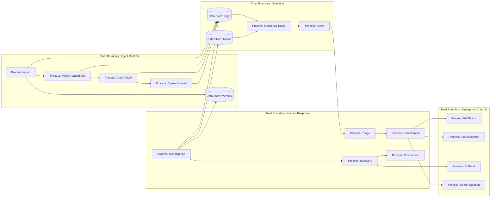

# 23 — Incident Response и Recovery

> Навигация: [Оглавление](../../README.md) · [← Назад](22-supply-chain-security.md) · [Вперёд →](../part-8-practice/24-end-to-end-secure-agent-go.md)

*Кратко: incident response для AI-агента — это процесс обнаружения, остановки, расследования и восстановления после prompt injection, tool misuse, data exfiltration, memory poisoning, supply chain compromise или unsafe automation.*

## Суть

AI-агент может ошибиться сам или быть атакован.

Инцидент в агентной системе может выглядеть не как обычный взлом:

- агент отправил приватные данные наружу;
- агент выполнил опасный tool call;
- prompt injection изменила цель задачи;
- вредный документ попал в memory;
- MCP server начал выполнять неожиданные команды;
- новая модель стала иначе выбирать tools;
- red team нашёл bypass;
- approval был подтверждён из-за deceptive UI;
- logs содержат секреты;
- egress был заблокирован, но попытка уже является сигналом.

Главная мысль:

> Incident response должен быть готов до инцидента: logs, traces, kill-switch, owners, playbooks, rollback.

## DFD



## Классы инцидентов

| Инцидент | Пример | Risk |
|---|---|---|
| Prompt injection success | агент выполнил инструкцию из вредного документа | High |
| Tool misuse | агент вызвал write/delete/send tool без approval | High |
| Data exfiltration | приватные данные ушли во внешний API | Critical |
| Secret exposure | токен попал в prompt, output, logs или tool args | Critical |
| Memory poisoning | вредная инструкция сохранена как trusted memory | High |
| MCP compromise | MCP server выполняет неожиданные команды | Critical |
| Supply chain compromise | зависимость/tool/prompt изменены вредоносно | Critical |
| Runaway cost | loop потратил большой бюджет | Medium |
| Hallucinated harmful output | агент дал опасную неподтверждённую инструкцию | Medium |
| Cross-tenant leakage | данные одного tenant видны другому | Critical |
| Approval failure | человек подтвердил опасное действие из-за плохого UI | High |

## Incident lifecycle

```text
Prepare → Detect → Triage → Contain → Eradicate → Recover → Learn
```

### 1. Prepare

Заранее должны быть:

- owners;
- severity levels;
- contacts;
- kill-switch;
- rollback;
- secret rotation;
- trace retention;
- audit logs;
- playbooks;
- test data;
- communication templates.

### 2. Detect

Источники сигналов:

- monitoring alerts;
- egress blocked;
- repeated tool denied;
- user report;
- red team finding;
- anomaly detection;
- unexpected bill/token usage;
- log review;
- CI red team regression failure.

### 3. Triage

Вопросы:

```text
Какая система затронута?
Какой run_id?
Какие tools вызваны?
Какие данные были доступны?
Был ли egress?
Были ли секреты?
Есть ли affected users/tenants?
Нужно ли включить kill-switch?
```

### 4. Containment

Варианты:

- stop affected run;
- disable tool;
- disable MCP server;
- enable read-only mode;
- block egress domain;
- open circuit breaker;
- revoke token;
- rotate secret;
- isolate memory;
- rollback prompt/policy/model;
- suspend tenant/user/session.

### 5. Eradication

Убрать причину:

- исправить prompt/context isolation;
- обновить policy;
- закрыть schema bypass;
- удалить poisoned memory;
- patch MCP server;
- update dependency;
- rotate leaked credentials;
- добавить tests;
- настроить alert.

### 6. Recovery

Возвращать систему постепенно:

```text
read-only mode → limited tools → normal mode
```

Проверить:

- red team regression pass;
- logs чистые;
- egress rules работают;
- leaked secrets rotated;
- memory cleaned;
- affected users notified if needed;
- monitoring enabled.

### 7. Lessons learned

Postmortem должен ответить:

- что произошло;
- почему controls не остановили;
- почему monitoring сработал/не сработал;
- что изменить в threat model;
- какие тесты добавить;
- какие playbooks обновить;
- кто owner;
- срок исправления.

## Severity

| Severity | Критерий |
|---|---|
| Critical | утечка секретов/PII, cross-tenant leakage, удаление/изменение данных, shell/production compromise |
| High | tool misuse, successful prompt injection with side effects, MCP compromise without confirmed exfil |
| Medium | blocked exfil attempt, repeated denied actions, hallucination with limited impact |
| Low | локальный guardrail miss без side effects |

## Пример (Go)

### Incident model

```go
package incident

import (
	"encoding/json"
	"errors"
	"time"
)

type Severity string

const (
	Critical Severity = "Critical"
	High     Severity = "High"
	Medium   Severity = "Medium"
	Low      Severity = "Low"
)

type Status string

const (
	Open        Status = "open"
	Contained   Status = "contained"
	Recovering  Status = "recovering"
	Resolved    Status = "resolved"
)

type Incident struct {
	ID          string    `json:"id"`
	Title       string    `json:"title"`
	Severity    Severity  `json:"severity"`
	Status      Status    `json:"status"`
	RunIDs      []string  `json:"run_ids"`
	AffectedTools []string `json:"affected_tools"`
	AffectedUsers []string `json:"affected_users"`
	DataTypes   []string  `json:"data_types"`
	DetectedAt  time.Time `json:"detected_at"`
	Owner       string    `json:"owner"`
	Summary     string    `json:"summary"`
}
```

### Классификация по сигналам

```go
type Signal struct {
	Event string
	Tool  string
	RunID string
	Attrs map[string]string
}

func Classify(signal Signal) Severity {
	switch signal.Event {
	case "secret_exfiltrated", "cross_tenant_leakage", "production_shell_executed":
		return Critical
	case "egress_with_secret_blocked", "mcp_server_compromised", "unsafe_tool_executed":
		return High
	case "prompt_injection_detected", "tool_denied_repeated", "budget_exceeded":
		return Medium
	default:
		return Low
	}
}
```

### Containment plan

```go
type ContainmentAction string

const (
	StopRun       ContainmentAction = "stop_run"
	DisableTool   ContainmentAction = "disable_tool"
	BlockEgress    ContainmentAction = "block_egress"
	RotateSecret   ContainmentAction = "rotate_secret"
	IsolateMemory  ContainmentAction = "isolate_memory"
	ReadOnlyMode   ContainmentAction = "read_only_mode"
	DisableMCP     ContainmentAction = "disable_mcp_server"
)

func BuildContainmentPlan(signal Signal) []ContainmentAction {
	switch signal.Event {
	case "secret_exfiltrated":
		return []ContainmentAction{StopRun, BlockEgress, RotateSecret, DisableTool}
	case "mcp_server_compromised":
		return []ContainmentAction{DisableMCP, BlockEgress, IsolateMemory}
	case "memory_poisoning_detected":
		return []ContainmentAction{StopRun, IsolateMemory}
	case "unsafe_tool_executed":
		return []ContainmentAction{StopRun, DisableTool, ReadOnlyMode}
	default:
		return []ContainmentAction{StopRun}
	}
}
```

### Incident report validation

```go
func ValidateIncident(i Incident) error {
	if i.ID == "" || i.Title == "" || i.Owner == "" {
		return errors.New("incident has required empty fields")
	}

	if i.Severity == "" || i.Status == "" {
		return errors.New("incident has no severity or status")
	}

	if len(i.RunIDs) == 0 {
		return errors.New("incident has no run ids")
	}

	if i.DetectedAt.IsZero() {
		return errors.New("incident has no detected_at")
	}

	return nil
}

func ExportIncident(i Incident) ([]byte, error) {
	if err := ValidateIncident(i); err != nil {
		return nil, err
	}

	return json.MarshalIndent(i, "", "  ")
}
```

## Playbook: Prompt Injection Success

```text
1. Найти run_id.
2. Остановить run.
3. Проверить tool calls.
4. Проверить egress.
5. Проверить memory writes.
6. Удалить poisoned memory.
7. Добавить payload в red team suite.
8. Усилить context isolation / detector / policy.
9. Перезапустить regression tests.
10. Обновить threat model.
```

## Playbook: Secret Exposure

```text
1. Остановить affected run.
2. Определить secret type.
3. Заблокировать egress destination.
4. Проверить logs/traces/tool args/output.
5. Rotate secret.
6. Найти affected systems.
7. Удалить или redacted stored logs, где это допустимо.
8. Проверить, был ли secret использован.
9. Добавить detection rule.
10. Обновить secrets policy.
```

## Playbook: MCP Server Compromise

```text
1. Отключить MCP server через kill-switch.
2. Заблокировать его egress.
3. Проверить tool calls и resources.
4. Проверить file/db/shell access.
5. Проверить tokens и session leakage.
6. Обновить allowlist/review status.
7. Patch/upgrade/remove server.
8. Добавить regression test.
9. Проверить supply chain inventory.
10. Провести postmortem.
```

## Чек-лист

- [ ] Есть severity matrix.
- [ ] Есть владельцы incident response.
- [ ] Есть kill-switch.
- [ ] Есть rollback prompt/policy/model/tool.
- [ ] Есть secret rotation procedure.
- [ ] Logs/traces хранятся достаточно долго.
- [ ] Каждый alert содержит run_id.
- [ ] Можно отключить tool/MCP/egress отдельно.
- [ ] Есть playbook для prompt injection.
- [ ] Есть playbook для secret exposure.
- [ ] Есть playbook для MCP compromise.
- [ ] Есть процедура очистки memory.
- [ ] Red team findings добавляются в regression suite.
- [ ] После инцидента обновляется threat model.
- [ ] После инцидента обновляется monitoring.
- [ ] Postmortem имеет owner и due dates.

## Литература

- [Список литературы](../literature.md#практические-руководства)
- [NIST Computer Security Incident Handling Guide SP 800-61](https://csrc.nist.gov/pubs/sp/800/61/r2/final)
- [NIST AI Risk Management Framework](https://www.nist.gov/itl/ai-risk-management-framework)
- [OWASP Agentic AI — Threats and Mitigations](https://genai.owasp.org/resource/agentic-ai-threats-and-mitigations/)
- [MITRE ATLAS](https://atlas.mitre.org/)
- [OpenTelemetry Documentation](https://opentelemetry.io/docs/)

## См. также

- [15 — Observability и Tracing](../part-5-control-observability/15-observability-tracing.md)
- [16 — Monitoring и Alerting](../part-5-control-observability/16-monitoring-alerting.md)
- [17 — Circuit Breaker и Kill-Switch](../part-5-control-observability/17-circuit-breaker-kill-switch.md)
- [19 — MCP Security](../part-6-multi-agent-security/19-mcp-security.md)
- [20 — Red Teaming и Adversarial Testing](20-red-teaming-adversarial-testing.md)
