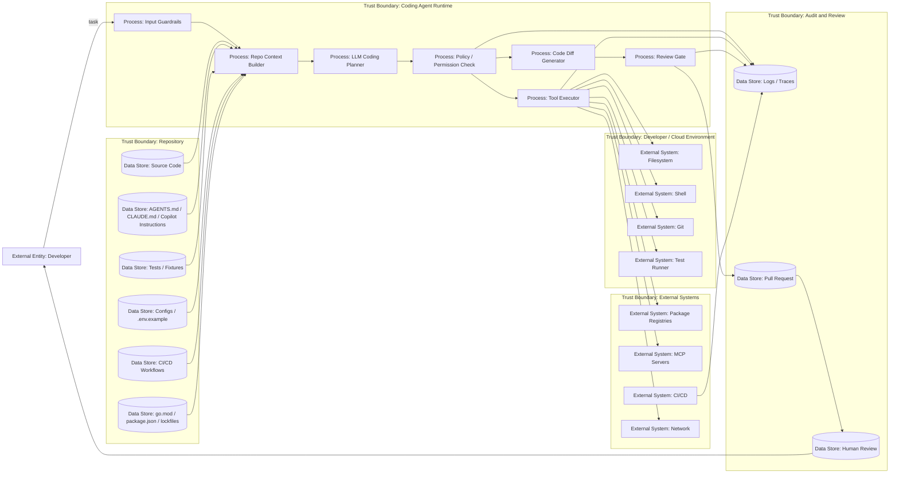

# 26 — AI-coding agent: модель угроз

> Навигация: [Оглавление](../../README.md) · [← Назад](../part-8-practice/25-security-by-design-checklist.md) · [Вперёд →](27-repository-instructions-attack-surface.md)

*Кратко: AI-coding agent — это AI-агент, который работает с репозиторием, файлами, shell, Git, зависимостями, тестами, CI/CD и pull request workflow. Это не отдельная от AI Security тема, а отдельный прикладной профиль с повышенным blast radius.*

> Примеры в разделе — на Go. Те же примеры на других языках:
> [Python](../../examples/python/part-9/26-ai-coding-agent-threat-model.py) ·
> [TypeScript](../../examples/typescript/part-9/26-ai-coding-agent-threat-model.ts)

## Суть

AI-coding agent отличается от обычного чат-ассистента тем, что он не просто отвечает на вопрос о коде.

Он может:

- читать репозиторий;
- менять файлы;
- запускать команды;
- запускать тесты;
- менять зависимости;
- менять CI/CD;
- создавать ветки;
- открывать pull request;
- использовать MCP-серверы;
- использовать skills/plugins;
- работать с `.env`, logs, configs, build scripts;
- действовать с правами разработчика.

Формула:

```text
AI-coding agent = AI-agent + repo context + filesystem + shell + git + dependencies + CI/CD + review/merge path
```

Главная разница:

```text
Обычный AI-агент опасен тем, что может выполнить действие.

AI-coding agent опасен тем, что может изменить механизм будущих действий:
код, зависимости, pipeline, security checks и production path.
```

## Сравнение: обычный AI-агент vs AI-coding agent

Шкала риска:

```text
0 — почти нет
1 — низко
2 — средне
3 — высоко
```

| Риск / показатель | Обычный AI-агент | AI-coding agent | Почему важно |
|---|---:|---:|---|
| Prompt Injection | 3 | 3 | у обоих критично, но у coding agent больше источников инструкций |
| Tool Hijacking | 3 | 3 | tools есть у обоих |
| Data Exfiltration | 3 | 3 | у обоих возможна утечка |
| Secret Exposure | 2 | 3 | coding agent видит `.env`, configs, CI logs, shell output |
| Supply Chain | 2 | 3 | агент может менять зависимости, lockfiles, Dockerfile, CI |
| Sandbox / Shell Abuse | 1–2 | 3 | shell часто является штатной функцией |
| CI/CD Compromise | 1 | 3 | агент может изменить workflow и путь к production |
| Repository Poisoning | 1 | 3 | repo становится источником инструкций |
| Unsafe Generated Output | 2 | 3 | output = код, diff, script, config, workflow |
| Approval Fatigue | 2 | 3 | много мелких команд и изменений |
| Incident Recovery Complexity | 2 | 3 | нужно чистить код, git history, secrets, CI, artifacts |

Условная суммарная оценка:

```text
Обычный AI-агент:  ~22 / 33
AI-coding agent:   ~33 / 33
```

Это не CVSS, а прикладной security scoring для threat model.

## Уникальные сущности AI-coding agent

| Сущность | Есть у обычного агента | Есть в AI-coding | Risk |
|---|---:|---:|---|
| `AGENTS.md` | редко | да | High |
| `CLAUDE.md` / `GEMINI.md` | редко | да | High |
| `.github/copilot-instructions.md` | нет | да | High |
| Path-specific instructions | нет | да | Medium/High |
| Repo context | редко | да | High |
| Git diff | нет | да | High |
| Pull request | редко | да | Medium |
| Package manager files | редко | да | High |
| Lockfiles | редко | да | Medium |
| CI/CD workflows | редко | да | High |
| Test fixtures as prompt source | редко | да | Medium |
| Generated tests | редко | да | Medium |
| Shell commands | опционально | часто | High |
| Local filesystem | опционально | часто | High |
| Dev secrets | опционально | часто | High |
| MCP config in IDE | иногда | часто | High |
| Skills / plugins | иногда | часто | Medium/High |

## DFD



## STRIDE для AI-coding agent

| STRIDE | Угроза |
|---|---|
| Spoofing | поддельный MCP server, package, agent identity, commit author |
| Tampering | изменение AGENTS.md, workflow, lockfile, tests, security checks |
| Repudiation | непонятно, какие изменения сделал агент и кто разрешил |
| Information Disclosure | утечка `.env`, secrets, private code, CI logs |
| Denial of Service | бесконечные тесты, build loops, token/cost runaway |
| Elevation of Privilege | агент получает shell/network/CI/CD права шире задачи |

## Главные threat scenarios

| ID | Сценарий | Risk | Контроль |
|---|---|---|---|
| AC-001 | Вредный `AGENTS.md` заставляет агента отключить security checks | High | instruction review, policy, diff review |
| AC-002 | Агент меняет GitHub Actions и получает доступ к secrets | Critical | workflow review, branch protection, restricted tokens |
| AC-003 | Агент добавляет вредную зависимость | High | dependency review, pinning, SBOM, scanners |
| AC-004 | Shell command выполняет unsafe script из интернета | Critical | sandbox, network off, approval |
| AC-005 | MCP tool описан как read-only, но делает write | High | MCP allowlist, schema, behavior review |
| AC-006 | Generated test скрывает баг или удаляет проверку | Medium | human review, test diff review |
| AC-007 | Агент чинит CI удалением security gate | High | protected workflows, CODEOWNERS |
| AC-008 | Секрет попадает в prompt/log/diff | Critical | secret redaction, scanning, rotation |

## Go snippet: риск-профиль coding task

```go
package aicoding

type RiskLevel string

const (
	Low      RiskLevel = "Low"
	Medium   RiskLevel = "Medium"
	High     RiskLevel = "High"
	Critical RiskLevel = "Critical"
)

type CodingTask struct {
	ID           string
	Title        string
	FilesTouched []string
	ToolsUsed    []string
	Network      bool
	Shell         bool
	Dependencies bool
	CIChanges    bool
	SecretsSeen  bool
}

func ClassifyTask(t CodingTask) RiskLevel {
	if t.SecretsSeen {
		return Critical
	}
	if t.CIChanges || t.Dependencies {
		return High
	}
	if t.Shell || t.Network {
		return High
	}
	if len(t.FilesTouched) > 10 {
		return Medium
	}
	return Low
}
```

## Чек-лист

- [ ] AI-coding agent описан отдельно в threat model.
- [ ] Репозиторий считается источником недоверенного контекста.
- [ ] Instruction files перечислены и ревьюятся.
- [ ] Shell/network/filesystem имеют отдельные permissions.
- [ ] Dependency и CI/CD changes считаются high-risk.
- [ ] Generated code проходит human review.
- [ ] Агент не может сам merge/deploy.
- [ ] Есть audit по tool calls, commands, file changes, PR.
- [ ] Есть red team tests для repo poisoning.
- [ ] Есть incident playbook для compromised coding agent.

## Литература

- [Список литературы](../literature.md#стандарты-и-фреймворки)
- [OpenAI Codex — Agent approvals and security](https://developers.openai.com/codex/agent-approvals-security)
- [OpenAI Codex — Sandboxing](https://developers.openai.com/codex/concepts/sandboxing)
- [GitHub Copilot cloud agent](https://docs.github.com/en/copilot/concepts/agents/cloud-agent/about-cloud-agent)
- [GitHub Copilot — custom instructions](https://docs.github.com/copilot/customizing-copilot/adding-custom-instructions-for-github-copilot)
- [AGENTS.md](https://agents.md/)
- [Anthropic — How we contain Claude across products](https://www.anthropic.com/engineering/how-we-contain-claude)
- [OWASP AI Agent Security Cheat Sheet](https://cheatsheetseries.owasp.org/cheatsheets/AI_Agent_Security_Cheat_Sheet.html)

## См. также

- [02 — Модель угроз](../part-1-architecture-threats/02-threat-model.md)
- [06 — RBAC и Tool Permissions](../part-3-processing-security/06-rbac-tool-permissions.md)
- [08 — Sandboxing](../part-3-processing-security/08-sandboxing.md)
- [22 — Supply Chain Security](../part-7-testing-compliance/22-supply-chain-security.md)
