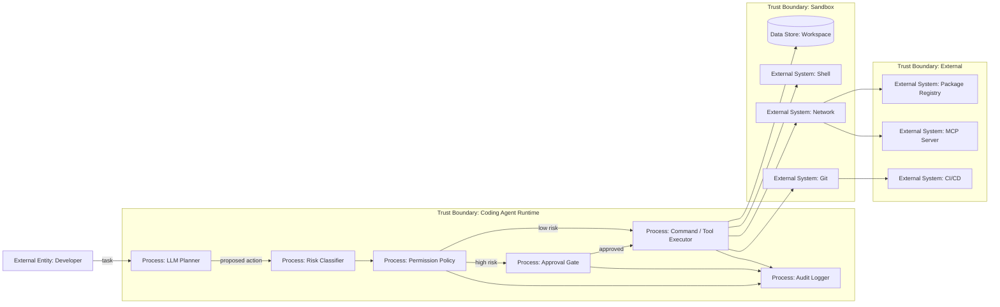

# 28 — Permissions, sandbox и approval для coding agents

> Навигация: [Оглавление](../../README.md) · [← Назад](27-repository-instructions-attack-surface.md) · [Вперёд →](29-ai-generated-code-review-spec-driven.md)

*Кратко: coding agent должен работать в ограниченном режиме: read-only или workspace-write, network off по умолчанию, shell и внешние действия — через approval, опасные изменения — через review.*

> Примеры в разделе — на Go. Те же примеры на других языках:
> [Python](../../examples/python/part-9/28-coding-agent-permissions-sandbox-approval.py) ·
> [TypeScript](../../examples/typescript/part-9/28-coding-agent-permissions-sandbox-approval.ts)

## Суть

Coding agent почти всегда хочет больше прав:

- читать файлы;
- менять файлы;
- запускать команды;
- ставить зависимости;
- ходить в сеть;
- запускать тесты;
- менять git history;
- создавать ветки;
- работать с MCP;
- менять CI/CD.

Безопасная модель обратная:

```text
минимум прав по умолчанию → расширение только под задачу → approval для high-risk → audit
```

Главное:

> Sandbox и approval — разные контроли. Sandbox ограничивает технические возможности, approval определяет, когда агент должен остановиться и спросить разрешение.

## Рекомендуемые режимы

| Режим | FS | Shell | Network | Когда использовать |
|---|---|---|---|---|
| `read-only` | только чтение | нет / ограниченно | off | анализ, review, планирование |
| `workspace-write` | запись только в workspace | approval | off by default | обычные правки кода |
| `workspace-write+network` | workspace write | approval | allowlist | установка deps / API docs |
| `danger-full-access` | полный доступ | полный доступ | полный доступ | почти никогда, только вручную |
| `cloud-ephemeral` | изолированная среда | ограниченно | controlled | background coding agent |
| `manual-only` | нет прямого выполнения | нет | нет | critical changes |

## DFD



## Угроза / контекст

| Угроза | Пример | Risk |
|---|---|---|
| Full access by default | агент может менять любые файлы и ходить в сеть | Critical |
| Shell abuse | агент запускает `curl | sh` | Critical |
| Network exfiltration | агент отправляет secrets наружу | Critical |
| Workspace escape | агент пишет вне рабочей директории | High |
| Approval fatigue | разработчик подтверждает всё подряд | Medium/High |
| Dependency install без review | агент ставит вредный пакет | High |
| CI workflow edit без review | агент меняет pipeline и secrets access | Critical |
| Silent command execution | команды выполняются без логов | High |
| Sandbox unavailable → allow | при ошибке sandbox runtime разрешает действие | High |

## Риск-классификация действий

| Действие | Risk | Контроль |
|---|---|---|
| Read source file | Low | log optionally |
| Edit source file | Medium | workspace-write |
| Run unit tests | Medium | approval optional |
| Run shell command | High | approval + sandbox |
| Install dependency | High | approval + dependency review |
| Access network | High | approval + allowlist |
| Change CI workflow | Critical | mandatory human review |
| Read `.env` | Critical | block or explicit approval |
| Commit / push branch | Medium/High | review gate |
| Merge / deploy | Critical | agent must not do directly |

## Go snippet: permission model

```go
package codingperms

import (
	"errors"
	"net/url"
	"path/filepath"
	"strings"
)

type Mode string

const (
	ReadOnly       Mode = "read_only"
	WorkspaceWrite Mode = "workspace_write"
	NetworkAllowed Mode = "network_allowed"
	FullAccess     Mode = "danger_full_access"
)

type ActionType string

const (
	ReadFile     ActionType = "read_file"
	WriteFile    ActionType = "write_file"
	RunShell     ActionType = "run_shell"
	NetworkCall  ActionType = "network_call"
	InstallDep   ActionType = "install_dependency"
	EditWorkflow ActionType = "edit_workflow"
	ReadSecret   ActionType = "read_secret"
)

type Action struct {
	Type    ActionType
	Path    string
	Command string
	URL     string
}

type Policy struct {
	Mode             Mode
	WorkspaceRoot    string
	NetworkAllowlist []string
}
```

## Go snippet: policy check

```go
func (p Policy) Allow(action Action) error {
	switch action.Type {
	case ReadFile:
		return p.validatePath(action.Path)
	case WriteFile:
		if p.Mode != WorkspaceWrite && p.Mode != NetworkAllowed && p.Mode != FullAccess {
			return errors.New("write denied in current mode")
		}
		return p.validatePath(action.Path)
	case RunShell:
		if p.Mode == ReadOnly {
			return errors.New("shell denied in read-only mode")
		}
		return requiresApproval("shell command requires approval")
	case NetworkCall:
		if p.Mode != NetworkAllowed && p.Mode != FullAccess {
			return errors.New("network denied in current mode")
		}
		return p.validateURL(action.URL)
	case InstallDep:
		return requiresApproval("dependency install requires approval")
	case EditWorkflow:
		return errors.New("CI workflow edit requires mandatory human review")
	case ReadSecret:
		return errors.New("secret read is blocked")
	default:
		return errors.New("unknown action")
	}
}

func (p Policy) validatePath(path string) error {
	root := filepath.Clean(p.WorkspaceRoot)
	clean := filepath.Clean(path)

	rel, err := filepath.Rel(root, clean)
	if err != nil {
		return err
	}

	if strings.HasPrefix(rel, "..") || filepath.IsAbs(rel) {
		return errors.New("path escapes workspace")
	}

	return nil
}

func (p Policy) validateURL(raw string) error {
	u, err := url.Parse(raw)
	if err != nil {
		return err
	}
	if u.Scheme != "https" {
		return errors.New("only https is allowed")
	}
	host := strings.ToLower(u.Hostname())
	for _, allowed := range p.NetworkAllowlist {
		if host == allowed || strings.HasSuffix(host, "."+allowed) {
			return nil
		}
	}
	return errors.New("network destination denied")
}

func requiresApproval(reason string) error {
	return errors.New("approval_required: " + reason)
}
```

## Go snippet: safe command allowlist

```go
var allowedCommands = map[string]bool{
	"go test ./...": true,
	"go vet ./...": true,
	"npm test": true,
	"npm run lint": true,
}

func ValidateCommand(cmd string) error {
	cmd = strings.TrimSpace(cmd)

	if strings.Contains(cmd, "curl ") && strings.Contains(cmd, "| sh") {
		return errors.New("curl pipe shell is forbidden")
	}

	if strings.Contains(cmd, "rm -rf /") {
		return errors.New("dangerous delete command")
	}

	if !allowedCommands[cmd] {
		return errors.New("command is not allowlisted")
	}

	return nil
}
```

## Approval request должен показывать

Плохо:

```text
Разрешить агенту продолжить?
```

Хорошо:

```text
Action: run_shell
Command: go test ./...
Workspace: /repo
Network: disabled
Risk: High
Reason: shell command execution
Files affected: none
```

## Fail closed

Если невозможно проверить policy, sandbox state, approval decision, network allowlist, workspace root или tool registry — действие блокируется.

```text
policy unavailable → deny
sandbox unavailable → deny
approval timeout → deny
```

## Чек-лист

- [ ] По умолчанию используется read-only или workspace-write.
- [ ] Network выключен по умолчанию.
- [ ] Shell требует approval.
- [ ] Dependency install требует approval.
- [ ] CI/CD changes требуют mandatory review.
- [ ] Workspace escape блокируется.
- [ ] `.env` и secrets не читаются агентом.
- [ ] Approval UI показывает команду, путь, URL и risk.
- [ ] Approval timeout блокирует действие.
- [ ] Все команды логируются.
- [ ] Full access не используется как стандартный режим.
- [ ] При ошибке policy/sandbox используется fail closed.

## Литература

- [Список литературы](../literature.md#практические-руководства)
- [OpenAI Codex — Agent approvals and security](https://developers.openai.com/codex/agent-approvals-security)
- [OpenAI Codex — Sandboxing](https://developers.openai.com/codex/concepts/sandboxing)
- [Anthropic — How we contain Claude across products](https://www.anthropic.com/engineering/how-we-contain-claude)
- [GitHub Copilot cloud agent](https://docs.github.com/en/copilot/concepts/agents/cloud-agent/about-cloud-agent)

## См. также

- [06 — RBAC и Tool Permissions](../part-3-processing-security/06-rbac-tool-permissions.md)
- [08 — Sandboxing](../part-3-processing-security/08-sandboxing.md)
- [14 — Human-in-the-Loop](../part-5-control-observability/14-human-in-the-loop.md)
- [17 — Circuit Breaker и Kill-Switch](../part-5-control-observability/17-circuit-breaker-kill-switch.md)
