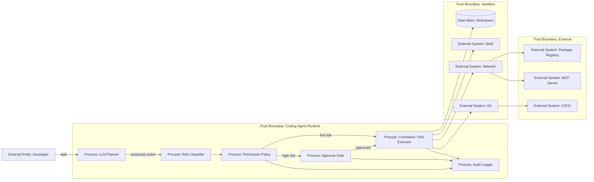
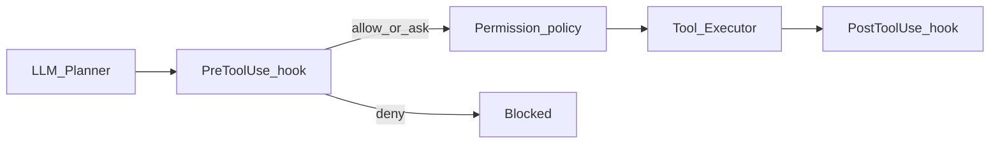
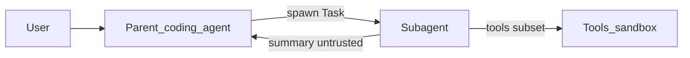

# 28 — Permissions, sandbox и approval для coding agents

> Навигация: [Оглавление](../../README.md) · [← Назад](27-repository-instructions-attack-surface.md) · [Вперёд →](29-ai-generated-code-review-spec-driven.md)

*Кратко: coding agent должен работать в ограниченном режиме: read-only или workspace-write, network off по умолчанию, shell и внешние действия — через approval, опасные изменения — через review.*

> Примеры в разделе — на Go. Те же примеры на других языках:
> [Python](../../examples/python/part-9/28-coding-agent-permissions-sandbox-approval.py) ·
> [TypeScript](../../examples/typescript/part-9/28-coding-agent-permissions-sandbox-approval.ts)

## Суть

Coding agent почти всегда хочет больше прав:

- читать файлы;
- менять файлы;
- запускать команды;
- ставить зависимости;
- ходить в сеть;
- запускать тесты;
- менять git history;
- создавать ветки;
- работать с MCP;
- менять CI/CD.

Безопасная модель обратная:

```text
минимум прав по умолчанию → расширение только под задачу → approval для high-risk → audit
```

Главное:

> Sandbox и approval — разные контроли. Sandbox ограничивает технические возможности, approval определяет, когда агент должен остановиться и спросить разрешение.

## Рекомендуемые режимы

| Режим | FS | Shell | Network | Когда использовать |
|---|---|---|---|---|
| `read-only` | только чтение | нет / ограниченно | off | анализ, review, планирование |
| `workspace-write` | запись только в workspace | approval | off by default | обычные правки кода |
| `workspace-write+network` | workspace write | approval | allowlist | установка deps / API docs |
| `danger-full-access` | полный доступ | полный доступ | полный доступ | почти никогда, только вручную |
| `cloud-ephemeral` | изолированная среда | ограниченно | controlled | background coding agent |
| `manual-only` | нет прямого выполнения | нет | нет | critical changes |

## DFD


```mermaid
flowchart LR
    Developer[External Entity: Developer]

    subgraph Runtime["Trust Boundary: Coding Agent Runtime"]
        Planner[Process: LLM Planner]
        Risk[Process: Risk Classifier]
        Permission[Process: Permission Policy]
        Approval[Process: Approval Gate]
        Executor[Process: Command / Tool Executor]
        Audit[Process: Audit Logger]
    end

    subgraph Sandbox["Trust Boundary: Sandbox"]
        Workspace[(Data Store: Workspace)]
        Shell[External System: Shell]
        Network[External System: Network]
        Git[External System: Git]
    end

    subgraph External["Trust Boundary: External"]
        PackageRegistry[External System: Package Registry]
        MCP[External System: MCP Server]
        CI[External System: CI/CD]
    end

    Developer -->|task| Planner
    Planner -->|proposed action| Risk
    Risk --> Permission
    Permission -->|low risk| Executor
    Permission -->|high risk| Approval
    Approval -->|approved| Executor
    Executor --> Workspace
    Executor --> Shell
    Executor --> Network
    Executor --> Git
    Network --> PackageRegistry
    Network --> MCP
    Git --> CI
    Permission --> Audit
    Approval --> Audit
    Executor --> Audit
```

## Угроза / контекст

| Угроза | Пример | Risk |
|---|---|---|
| Full access by default | агент может менять любые файлы и ходить в сеть | Critical |
| Shell abuse | агент запускает `curl | sh` | Critical |
| Network exfiltration | агент отправляет secrets наружу | Critical |
| Workspace escape | агент пишет вне рабочей директории | High |
| Safe cmd, unsafe cwd | allowlisted `rm`/`git`/`npm` с cwd = `$HOME` / `/` / соседний репо | High |
| Approval fatigue | разработчик подтверждает всё подряд | Medium/High |
| Dependency install без review | агент ставит вредный пакет | High |
| CI workflow edit без review | агент меняет pipeline и secrets access | Critical |
| Silent command execution | команды выполняются без логов | High |
| Sandbox unavailable → allow | при ошибке sandbox runtime разрешает действие | High |

## Риск-классификация действий

| Действие | Risk | Контроль |
|---|---|---|
| Read source file | Low | log optionally |
| Edit source file | Medium | workspace-write |
| Run unit tests | Medium | approval optional |
| Run shell command | High | approval + sandbox + [cwd in workspace](#cwd-safety-rule) |
| Install dependency | High | approval + dependency review |
| Access network | High | approval + allowlist |
| Change CI workflow | Critical | mandatory human review |
| Read `.env` | Critical | block or explicit approval |
| Commit / push branch | Medium/High | review gate |
| Merge / deploy | Critical | agent must not do directly |

<a id="cwd-safety-rule"></a>

### Правило рабочей директории (cwd)

```text
Безопасная команда, выполненная вне рабочей директории, тоже опасна.
Allowlist binary ≠ разрешение запускать её с произвольным cwd / path.
```

Allowlisted `rm`, `git`, `npm` с `cwd = $HOME` / `/` / соседний репозиторий — уже не «безопасный тест в workspace»: меняют чужие файлы, читают `.env` через относительные пути, трогают соседние репо. Для `RunShell` требовать `Cwd` внутри `WorkspaceRoot` (или явный deny); та же семантика, что у `validatePath` для read/write. Уровень изоляции FS/сети — [§08 jailing](../part-3-processing-security/08-sandboxing.md#sandbox-jailing).

## Go snippet: permission model

```go
package codingperms

import (
	"errors"
	"net/url"
	"path/filepath"
	"strings"
)

type Mode string

const (
	ReadOnly       Mode = "read_only"
	WorkspaceWrite Mode = "workspace_write"
	NetworkAllowed Mode = "network_allowed"
	FullAccess     Mode = "danger_full_access"
)

type ActionType string

const (
	ReadFile     ActionType = "read_file"
	WriteFile    ActionType = "write_file"
	RunShell     ActionType = "run_shell"
	NetworkCall  ActionType = "network_call"
	InstallDep   ActionType = "install_dependency"
	EditWorkflow ActionType = "edit_workflow"
	ReadSecret   ActionType = "read_secret"
)

type Action struct {
	Type    ActionType
	Path    string
	Command string
	Cwd     string // обязателен для RunShell; должен лежать в WorkspaceRoot
	URL     string
}

type Policy struct {
	Mode             Mode
	WorkspaceRoot    string
	NetworkAllowlist []string
}
```

## Go snippet: policy check

```go
func (p Policy) Allow(action Action) error {
	switch action.Type {
	case ReadFile:
		return p.validatePath(action.Path)
	case WriteFile:
		if p.Mode != WorkspaceWrite && p.Mode != NetworkAllowed && p.Mode != FullAccess {
			return errors.New("write denied in current mode")
		}
		return p.validatePath(action.Path)
	case RunShell:
		if p.Mode == ReadOnly {
			return errors.New("shell denied in read-only mode")
		}
		if action.Cwd == "" {
			return errors.New("shell cwd is required")
		}
		if err := p.validatePath(action.Cwd); err != nil {
			return err
		}
		return requiresApproval("shell command requires approval")
	case NetworkCall:
		if p.Mode != NetworkAllowed && p.Mode != FullAccess {
			return errors.New("network denied in current mode")
		}
		return p.validateURL(action.URL)
	case InstallDep:
		return requiresApproval("dependency install requires approval")
	case EditWorkflow:
		return errors.New("CI workflow edit requires mandatory human review")
	case ReadSecret:
		return errors.New("secret read is blocked")
	default:
		return errors.New("unknown action")
	}
}

func (p Policy) validatePath(path string) error {
	root := filepath.Clean(p.WorkspaceRoot)
	clean := filepath.Clean(path)

	rel, err := filepath.Rel(root, clean)
	if err != nil {
		return err
	}

	if strings.HasPrefix(rel, "..") || filepath.IsAbs(rel) {
		return errors.New("path escapes workspace")
	}

	return nil
}

func (p Policy) validateURL(raw string) error {
	u, err := url.Parse(raw)
	if err != nil {
		return err
	}
	if u.Scheme != "https" {
		return errors.New("only https is allowed")
	}
	host := strings.ToLower(u.Hostname())
	for _, allowed := range p.NetworkAllowlist {
		if host == allowed || strings.HasSuffix(host, "."+allowed) {
			return nil
		}
	}
	return errors.New("network destination denied")
}

func requiresApproval(reason string) error {
	return errors.New("approval_required: " + reason)
}
```

## Go snippet: safe command allowlist

```go
var allowedCommands = map[string]bool{
	"go test ./...": true,
	"go vet ./...": true,
	"npm test": true,
	"npm run lint": true,
}

func ValidateCommand(cmd string) error {
	cmd = strings.TrimSpace(cmd)

	if strings.Contains(cmd, "curl ") && strings.Contains(cmd, "| sh") {
		return errors.New("curl pipe shell is forbidden")
	}

	if strings.Contains(cmd, "rm -rf /") {
		return errors.New("dangerous delete command")
	}

	if !allowedCommands[cmd] {
		return errors.New("command is not allowlisted")
	}

	return nil
}
```

## Approval request должен показывать

Плохо:

```text
Разрешить агенту продолжить?
```

Хорошо:

```text
Action: run_shell
Command: go test ./...
Workspace: /repo
Network: disabled
Risk: High
Reason: shell command execution
Files affected: none
```

Для server-initiated **sampling** approval показывает **текст** внедряемого prompt, не только имя MCP-сервера. Approve-once не распространяется на последующие sampling-запросы того же сервера. Канон канала — [§19 split-context](../part-6-multi-agent-security/19-mcp-security.md#split-context-mcp-injection).

<a id="agent-hooks"></a>

## Hooks: gate и поверхность

У coding-агента lifecycle hook (pre/post tool) — два лица одного объекта: детерминированный gate **и** исполняемый код из репо / plugin. Хуки установки skill — [§36](../part-10-course-appendix/36-mcp-skill-review-workshop.md), не здесь.


```mermaid
flowchart LR
    Planner[LLM_Planner]
    Hook[PreToolUse_hook]
    Policy[Permission_policy]
    Exec[Tool_Executor]
    Post[PostToolUse_hook]
    Planner --> Hook
    Hook -->|"deny"| Stop[Blocked]
    Hook -->|"allow_or_ask"| Policy
    Policy --> Exec
    Exec --> Post
```

```text
hook != policy
hook allow != HITL
repo hook != trusted control
install hook != PreToolUse
```

`PreToolUse` может deny / ask / allow до execution. `PostToolUse` уже после факта — не откат. Hard allow/deny — permission system, не hook filter ([Claude Code — Hooks](https://code.claude.com/docs/en/hooks)).

| Угроза | Пример | Risk |
|---|---|---|
| Poisoned repo hook | `.claude/settings.json` / `.claude/hooks/*` в коммите запускает чужой `command` | Critical |
| Auto-allow | `permissionDecision: allow` из репо обходит диалог | Critical |
| Fail-open | кривой путь скрипта → gate молча выключен | High |
| Hook-shell | хук сам вызывает shell / сеть вне sandbox | High |

Контроли: review hook как код; least privilege; hook не заменяет policy и [§14 HITL](../part-5-control-observability/14-human-in-the-loop.md); managed / user settings выше unreviewed repo hook. Запись settings/hooks = high-risk write — [§31](31-ci-cd-mcp-skills-production-path.md#curxecute).

```go
type HookPhase string

const (
	HookPre  HookPhase = "pre"
	HookPost HookPhase = "post"
)

// GateHook — stub: hook allow без policy → deny; post не отменяет выполненное.
func GateHook(phase HookPhase, hookAllow bool, policyAllow bool) error {
	if hookAllow && !policyAllow {
		return errors.New("deny: hook allow is not policy")
	}
	if phase == HookPost {
		return errors.New("post hook cannot undo")
	}
	if !policyAllow {
		return errors.New("deny: policy")
	}
	return nil
}
```

Синхрон: [Python](../../examples/python/part-9/28-coding-agent-permissions-sandbox-approval.py) · [TypeScript](../../examples/typescript/part-9/28-coding-agent-permissions-sandbox-approval.ts).

<a id="coding-subagents"></a>

## Subagents внутри coding-агента

Родитель IDE порождает child (Task / custom). Это **не** peer handoff ([§18](../part-6-multi-agent-security/18-inter-agent-security.md)): одно окно сессии, наследуемый permission mode, summary обратно родителю.


```mermaid
flowchart LR
    User[User]
    Parent[Parent_coding_agent]
    Child[Subagent]
    Tools[Tools_sandbox]
    User --> Parent
    Parent -->|"spawn Task"| Child
    Child -->|"tools subset"| Tools
    Child -->|"summary untrusted"| Parent
```

```text
subagent != peer agent
inherited mode != narrower scope
child blast <= parent blast
inheritance != enforcement
```

Своё окно контекста и другой system prompt ≠ изоляция прав. Mode родителя (`bypass` / `acceptEdits` / `auto`) наследуется и frontmatter ребёнка его не сужает ([Claude Code — Subagents](https://code.claude.com/docs/en/subagents)). Isolated context: ребёнок может не увидеть поздний запрет пользователя; родитель принимает summary как «свой» результат.

| Угроза | Пример | Risk |
|---|---|---|
| Inherit bypass / auto | ребёнок едет в mode родителя при другом prompt | Critical |
| Tools не subset | child вызывает tool, которого нет у parent | Critical |
| Isolated context | поздний запрет пользователя не попал к child | High |
| Repo `.claude/agents/` | кастомный агент с лишними tools / mcpServers в коммите | High |

Контроли: child tools ⊆ parent; child mode не шире parent; policy и [§14](../part-5-control-observability/14-human-in-the-loop.md) на **каждый** child call (`inheritance != enforcement`); output ребёнка untrusted ([§18 messages](../part-6-multi-agent-security/18-inter-agent-security.md)); review `.claude/agents/` как код.

```go
func modeRank(m string) int {
	switch m {
	case "read_only", "default":
		return 0
	case "workspace_write", "acceptEdits":
		return 1
	case "auto", "network":
		return 2
	case "bypass", "bypassPermissions", "danger_full_access":
		return 3
	default:
		return 1
	}
}

// GateChild — stub: child tools не ⊆ parent → deny; mode шире parent → deny.
func GateChild(parentTools, childTools []string, parentMode, childMode string) error {
	allow := map[string]bool{}
	for _, t := range parentTools {
		allow[t] = true
	}
	for _, t := range childTools {
		if !allow[t] {
			return errors.New("deny: child tool not in parent set")
		}
	}
	if modeRank(childMode) > modeRank(parentMode) {
		return errors.New("deny: child mode wider than parent")
	}
	return nil
}
```

## Fail closed

Если невозможно проверить policy, sandbox state, approval decision, network allowlist, workspace root или tool registry — действие блокируется.

```text
policy unavailable → deny
sandbox unavailable → deny
approval timeout → deny
```

## Чек-лист

- [ ] По умолчанию используется read-only или workspace-write.
- [ ] Network выключен по умолчанию.
- [ ] Shell требует approval.
- [ ] Dependency install требует approval.
- [ ] CI/CD changes требуют mandatory review.
- [ ] Workspace escape блокируется.
- [ ] Shell `Cwd` обязателен и проверяется на границы workspace ([cwd safety](#cwd-safety-rule)); allowlist binary ≠ произвольный cwd.
- [ ] `.env` и secrets не читаются агентом.
- [ ] Approval UI показывает команду, путь, URL и risk.
- [ ] Sampling approval показывает текст prompt, не только имя сервера; approve-once ≠ blanket на последующие запросы.
- [ ] Approval timeout блокирует действие.
- [ ] Все команды логируются.
- [ ] Full access не используется как стандартный режим.
- [ ] При ошибке policy/sandbox используется fail closed.
- [ ] Hook не считается policy: `hook allow` не снимает approval / sandbox ([#agent-hooks](#agent-hooks)).
- [ ] Repo hook (`.claude/settings.json`, скрипты) проходит review как код; fail-open не считается контролем.
- [ ] Субагент: child tools ⊆ parent, child mode не шире parent ([#coding-subagents](#coding-subagents)).
- [ ] Policy / approval на каждый child call; summary ребёнка untrusted; `.claude/agents/` ревьюится как код.

## Литература

- [Список литературы](../literature.md#практические-руководства)
- [OpenAI Codex — Agent approvals and security](https://developers.openai.com/codex/agent-approvals-security)
- [OpenAI Codex — Sandboxing](https://developers.openai.com/codex/concepts/sandboxing)
- [Claude Code — Hooks](https://code.claude.com/docs/en/hooks) — PreToolUse / PostToolUse; hook ≠ permission system
- [Claude Code — Subagents](https://code.claude.com/docs/en/subagents) — inherit mode; `child blast <= parent blast`
- [Anthropic — How we contain Claude across products](https://www.anthropic.com/engineering/how-we-contain-claude)
- [GitHub Copilot cloud agent](https://docs.github.com/en/copilot/concepts/agents/cloud-agent/about-cloud-agent)

## См. также

- [06 — RBAC и Tool Permissions](../part-3-processing-security/06-rbac-tool-permissions.md)
- [08 — Sandboxing](../part-3-processing-security/08-sandboxing.md#sandbox-jailing) — jailing (min env, RW cwd, RO FS)
- [Hooks: gate и поверхность](#agent-hooks) — `hook != policy`; repo hook untrusted
- [Subagents внутри coding-агента](#coding-subagents) — `subagent != peer agent`; child blast ≤ parent
- [14 — Human-in-the-Loop](../part-5-control-observability/14-human-in-the-loop.md) — hook allow ≠ HITL; child call тоже HITL
- [18 — Inter-Agent Security](../part-6-multi-agent-security/18-inter-agent-security.md) — peer handoff, не intra-session child
- [31 — CI/CD / MCP / Skills](31-ci-cd-mcp-skills-production-path.md#curxecute) — settings/hooks = high-risk write
- [36 — MCP / Skill Review](../part-10-course-appendix/36-mcp-skill-review-workshop.md) — только install hooks
- [19 — Split-context MCP injection](../part-6-multi-agent-security/19-mcp-security.md#split-context-mcp-injection) — sampling как канал фрагмента
- [17 — Circuit Breaker и Kill-Switch](../part-5-control-observability/17-circuit-breaker-kill-switch.md)
