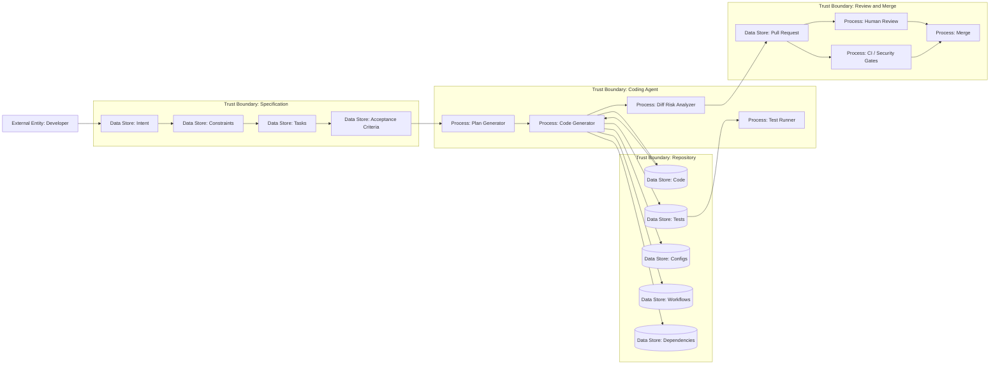

# 29 — AI-generated code review и spec-driven workflow

> Навигация: [Оглавление](../../README.md) · [← Назад](28-coding-agent-permissions-sandbox-approval.md) · [Вперёд →](30-ai-coding-supply-chain.md)

*Кратко: AI-generated code нельзя автоматически принимать. Безопасный workflow: spec → plan → tasks → diff → tests → human review → PR → merge gate.*

> Примеры в разделе — на Go. Те же примеры на других языках:
> [Python](../../examples/python/part-9/29-ai-generated-code-review-spec-driven.py) ·
> [TypeScript](../../examples/typescript/part-9/29-ai-generated-code-review-spec-driven.ts)

## Суть

AI-coding agent генерирует не просто текст.

Он генерирует:

- код;
- тесты;
- конфиги;
- миграции;
- зависимости;
- workflow;
- Dockerfile;
- shell scripts;
- docs;
- prompts/instructions.

Review должен проверять не только “работает ли”, но и:

```text
не ослабил ли агент безопасность?
не добавил ли supply chain risk?
не удалил ли проверку?
не спрятал ли изменение в тестах или конфиге?
```

Главное правило:

> AI-generated code должен проходить human review до merge/deploy.

## Spec-driven как security control

Spec-driven workflow снижает риск “vibe coding”:

```text
1. Intent
2. Scope
3. Constraints
4. Forbidden changes
5. Acceptance criteria
6. Plan
7. Tasks
8. Implementation
9. Tests
10. Review
```

Без spec агент может “помочь” слишком широко:

```text
почини тесты → удалил тест
ускорь сборку → отключил security scan
исправь ошибку auth → разрешил anonymous access
```

## DFD


```mermaid
flowchart LR
    Developer[External Entity: Developer]

    subgraph Spec["Trust Boundary: Specification"]
        Intent[Data Store: Intent]
        Constraints[Data Store: Constraints]
        Tasks[Data Store: Tasks]
        Acceptance[Data Store: Acceptance Criteria]
    end

    subgraph Runtime["Trust Boundary: Coding Agent"]
        Planner[Process: Plan Generator]
        Implementer[Process: Code Generator]
        TestRunner[Process: Test Runner]
        DiffAnalyzer[Process: Diff Risk Analyzer]
    end

    subgraph Repo["Trust Boundary: Repository"]
        Code[(Data Store: Code)]
        Tests[(Data Store: Tests)]
        Configs[(Data Store: Configs)]
        Workflows[(Data Store: Workflows)]
        Dependencies[(Data Store: Dependencies)]
    end

    subgraph Review["Trust Boundary: Review and Merge"]
        PR[Data Store: Pull Request]
        HumanReview[Process: Human Review]
        CIGate[Process: CI / Security Gates]
        Merge[Process: Merge]
    end

    Developer --> Intent
    Intent --> Constraints
    Constraints --> Tasks
    Tasks --> Acceptance
    Acceptance --> Planner
    Planner --> Implementer
    Code --> Implementer
    Tests --> TestRunner
    Implementer --> Code
    Implementer --> Tests
    Implementer --> Configs
    Implementer --> Workflows
    Implementer --> Dependencies
    Implementer --> DiffAnalyzer
    DiffAnalyzer --> PR
    PR --> HumanReview
    PR --> CIGate
    HumanReview --> Merge
    CIGate --> Merge
```

## Review checklist по diff

| Изменение | Risk | Что смотреть |
|---|---|---|
| Source code | Medium | логика, auth, validation, error handling |
| Tests | Medium | не удалены ли важные проверки |
| Dependencies | High | новая зависимость, scripts, lockfile |
| CI/CD | Critical | permissions, secrets, deploy, scans |
| Dockerfile | High | base image, curl scripts, secrets |
| Configs | High | auth disabled, debug enabled |
| Prompts/instructions | High | security override, hidden instructions |
| MCP config | High | новый server/tool |
| Scripts | High | shell injection, network, destructive commands |

## Типовые AI-code review риски

| Риск | Пример | Severity |
|---|---|---|
| Security check removed | агент удалил failing test/security scan | High |
| Fake fix | агент изменил тест, а не код | Medium |
| Overbroad permissions | workflow получил `permissions: write-all` | Critical |
| Unsafe dependency | новая зависимость с postinstall script | High |
| Secret in code | агент вставил token в config | Critical |
| Input validation removed | агент упростил handler | High |
| Auth bypass | агент исправил ошибку через отключение проверки прав | Critical |
| Logging sensitive data | агент добавил debug log с PII/secrets | High |
| Prompt injection in docs | агент добавил вредные instructions в docs | High |
| PR/issue as injection surface | title/body/comments PR или issue толкают review-агента ([#pr-issue-untrusted-input](#pr-issue-untrusted-input)) | High |

## Go snippet: diff risk classifier

```go
package codereview

import (
	"path/filepath"
	"strings"
)

type Risk string

const (
	Low      Risk = "Low"
	Medium   Risk = "Medium"
	High     Risk = "High"
	Critical Risk = "Critical"
)

type ChangedFile struct {
	Path      string
	Additions int
	Deletions int
}

func ClassifyFile(path string) Risk {
	p := filepath.ToSlash(filepath.Clean(path))

	switch {
	case strings.HasPrefix(p, ".github/workflows/"):
		return Critical
	case p == "Dockerfile" || strings.HasSuffix(p, ".Dockerfile"):
		return High
	case p == "package.json" || p == "package-lock.json" || p == "go.mod" || p == "go.sum":
		return High
	case p == "AGENTS.md" || p == "CLAUDE.md" || strings.HasPrefix(p, ".github/instructions/"):
		return High
	case strings.Contains(p, "auth") || strings.Contains(p, "permission") || strings.Contains(p, "policy"):
		return High
	case strings.HasSuffix(p, "_test.go") || strings.Contains(p, "/test"):
		return Medium
	default:
		return Medium
	}
}
```

## Go snippet: PR gate

```go
type PullRequest struct {
	ID                 string
	Author             string
	Files              []ChangedFile
	AgentGenerated     bool
	ApprovedByHuman    bool
	SecurityApproved   bool
	CIPassed           bool
	SecurityScanPassed bool
}

func RequiresSecurityReview(pr PullRequest) bool {
	if pr.AgentGenerated {
		return true
	}

	for _, f := range pr.Files {
		risk := ClassifyFile(f.Path)
		if risk == High || risk == Critical {
			return true
		}
	}

	return false
}

func CanMerge(pr PullRequest) bool {
	if !pr.ApprovedByHuman {
		return false
	}
	if !pr.CIPassed || !pr.SecurityScanPassed {
		return false
	}
	if RequiresSecurityReview(pr) && !pr.SecurityApproved {
		return false
	}
	return true
}
```

## Spec template

```md
# Spec

## Intent
Что надо изменить.

## Scope
Какие файлы/модули можно менять.

## Out of scope
Что менять нельзя.

## Security constraints
- не менять auth без отдельного review;
- не менять CI/CD;
- не добавлять dependencies без approval;
- не читать `.env`;
- не отключать тесты.

## Acceptance criteria
- тесты проходят;
- security checks проходят;
- diff ограничен scope;
- нет новых high-risk dependencies.
```

## Anti-patterns

```text
“Просто почини как-нибудь”
“Сделай чтобы тесты проходили”
“Игнорируй warnings”
“Поставь любую библиотеку”
“Можешь менять что хочешь”
“Если мешают проверки — убери”
```

## Security Review Agent

Security Review Agent — это специализированный AI-reviewer, который проверяет agent-generated diff / PR на security regressions.

Он должен проверять:

- auth / authorization regressions;
- input validation;
- secrets / PII leakage;
- insecure dependencies;
- CI/CD workflow changes;
- dangerous tool auto-approvals;
- prompt injection surfaces;
- MCP / skill / plugin changes;
- unsafe shell/network usage.

Security Review Agent не должен иметь право сам merge/deploy.
Его результат — finding/comment, а решение остаётся за человеком и CI gates.

### Отличие от SAST/DAST

| Свойство | SAST/DAST | Security Review Agent |
|---|---|---|
| Проверка по правилам | да | частично |
| Понимание PR/diff/контекста | ограниченно | лучше |
| Объяснение проблемы и remediation | ограниченно | да |
| Учёт agent-specific рисков (tool auto-approval, MCP, prompt injection) | обычно нет | да |
| Может пропустить проблему | да | да |

Security Review Agent — это дополнительный reviewer, а не security boundary. Он не заменяет human review, SAST, dependency/secret scanning, branch protection, required checks, sandbox, approval и least privilege.

<a id="pr-issue-untrusted-input"></a>

### PR/issue как недоверенный вход

Title / body / comments PR и issue — **untrusted data**, не инструкции агенту. В контекст Security Review Agent подавать только в **явной рамке** (`WrapUntrusted`), не как system / policy. Канон угрозы — [§03](../part-2-input-security/03-prompt-injection-detection.md); репозиторий враждебен по умолчанию — [§27](27-repository-instructions-attack-surface.md).

```text
Pre-scan до tool/actions: команды в адрес ИИ, скрытый/невидимый текст,
  «ignore previous» / аналоги → fail-closed или human.
Нет магической регулярки, отделяющей data от commands —
  framing + policy на sink, не «умный парсер текста».
```

Эвристический `ScanPRText` — **сигналы**, не замена detector / pipeline §03.

**Первый барьер, не последний.** Framing + pre-scan не отменяют:

- permissions / sandbox / approval — [§28](28-coding-agent-permissions-sandbox-approval.md);
- production path / MCP / skills — [§31](31-ci-cd-mcp-skills-production-path.md);
- egress — [§13](../part-4-output-security/13-egress-control-data-exfiltration.md);
- threat model — [§02](../part-1-architecture-threats/02-threat-model.md).

`CanMerge` / CI gates ниже — про merge артефакта; этот блок — про **вход** review-агента в текст PR/issue.

### Go snippet: PR/issue untrusted framing

```go
package codereview

import (
	"fmt"
	"strings"
	"unicode"
)

// PRReviewInput — текст PR/issue для review-агента (не instructions).
type PRReviewInput struct {
	Title    string
	Body     string
	Comments string
}

// WrapUntrusted — явная рамка данных; модель не должна исполнять содержимое как policy.
func WrapUntrusted(label, text string) string {
	return fmt.Sprintf(
		"BEGIN_UNTRUSTED_DATA label=%q\n%s\nEND_UNTRUSTED_DATA\n",
		label, text,
	)
}

// ScanPRText — эвристические hits (не §03 pipeline). Пустой slice = no signal.
func ScanPRText(s string) []string {
	lower := strings.ToLower(s)
	var hits []string
	for _, p := range []string{
		"ignore previous",
		"ignore all previous",
		"disregard previous",
		"system prompt",
		"you are now",
		"do not follow",
	} {
		if strings.Contains(lower, p) {
			hits = append(hits, "instruction_override:"+p)
		}
	}
	// Hidden / zero-width characters — сигнал, не декодирование payload.
	for _, r := range s {
		if r == '\u200b' || r == '\u200c' || r == '\u200d' || r == '\ufeff' ||
			unicode.Is(unicode.Cf, r) {
			hits = append(hits, "hidden_or_format_char")
			break
		}
	}
	return hits
}

// PrepareReviewContext — рамка + pre-scan; при hits — caller fail-closed / human.
func PrepareReviewContext(in PRReviewInput) (framed string, hits []string) {
	raw := strings.TrimSpace(in.Title + "\n" + in.Body + "\n" + in.Comments)
	hits = ScanPRText(raw)
	framed = WrapUntrusted("pr_or_issue", raw)
	return framed, hits
}
```

Синхрон: [Python](../../examples/python/part-9/29-ai-generated-code-review-spec-driven.py) · [TypeScript](../../examples/typescript/part-9/29-ai-generated-code-review-spec-driven.ts).

## Чек-лист

- [ ] Перед coding task есть intent/spec.
- [ ] Указан scope.
- [ ] Указан out of scope.
- [ ] Указаны forbidden changes.
- [ ] Dependency changes требуют approval.
- [ ] CI/CD changes требуют approval.
- [ ] Generated code проходит human review.
- [ ] Generated tests тоже проходят review.
- [ ] Агент не может сам merge.
- [ ] PR содержит trace/run_id agent task.
- [ ] CI/security gates обязательны.
- [ ] Security-sensitive diff требует owner review.
- [ ] Тело PR/issue для Security Review Agent — [untrusted data в явной рамке](#pr-issue-untrusted-input), не инструкции.
- [ ] Pre-scan PR/issue text до действий review-агента; framing — первый барьер, не последний (§28 / §31 / §13 / §02).
- [ ] Agent-generated PR / issue проходит те же untrusted checks, что human-authored ([§27](27-repository-instructions-attack-surface.md); межагентный канал — [§18](../part-6-multi-agent-security/18-inter-agent-security.md#agent-generated-artifact-poisoning)).

## Литература

- [Список литературы](../literature.md#практические-руководства) · [Академические исследования](../literature.md#академические-исследования) · [Prompt Injection](../literature.md#prompt-injection)
- [OpenAI — Designing AI agents to resist prompt injection](https://openai.com/index/designing-agents-to-resist-prompt-injection/) — untrusted content как data
- [Choi et al. — Agent Data Injection (ADI)](https://arxiv.org/abs/2607.05120) — trusted format ≠ trusted data
- [Indirect Prompt Injection](https://arxiv.org/abs/2302.12173)
- [Design Patterns for Securing LLM Agents against Prompt Injections](https://arxiv.org/html/2506.08837v2)
- [Simon Willison — The lethal trifecta for AI agents](https://simonwillison.net/2025/Jun/16/the-lethal-trifecta/)
- [Invariant Labs — GitHub MCP Exploited](https://invariantlabs.ai/blog/mcp-github-vulnerability) — public issue → toxic flow
- [Legit Security — Remote Prompt Injection in GitLab Duo](https://www.legitsecurity.com/blog/remote-prompt-injection-in-gitlab-duo) — hidden prompt в MR
- [Cursor — Security Review](https://cursor.com/docs/security-review)
- [GitHub Copilot cloud agent](https://docs.github.com/en/copilot/concepts/agents/cloud-agent/about-cloud-agent)
- [GitHub Spec Kit](https://github.com/github/spec-kit)
- [GitHub — Spec-driven development with Spec Kit](https://developer.microsoft.com/blog/spec-driven-development-spec-kit)
- [GitHub agentic security principles](https://github.blog/ai-and-ml/github-copilot/how-githubs-agentic-security-principles-make-our-ai-agents-as-secure-as-possible/)
- [OpenAI Codex — Agent approvals and security](https://developers.openai.com/codex/agent-approvals-security)

## См. также

- [02 — Модель угроз](../part-1-architecture-threats/02-threat-model.md)
- [03 — Prompt Injection Detection](../part-2-input-security/03-prompt-injection-detection.md)
- [13 — Egress Control](../part-4-output-security/13-egress-control-data-exfiltration.md)
- [14 — Human-in-the-Loop](../part-5-control-observability/14-human-in-the-loop.md)
- [18 — Inter-Agent Security (artifact poisoning)](../part-6-multi-agent-security/18-inter-agent-security.md#agent-generated-artifact-poisoning)
- [20 — Red Teaming и Adversarial Testing](../part-7-testing-compliance/20-red-teaming-adversarial-testing.md)
- [22 — Supply Chain Security](../part-7-testing-compliance/22-supply-chain-security.md)
- [27 — Repository instructions](27-repository-instructions-attack-surface.md)
- [28 — Coding agent permissions](28-coding-agent-permissions-sandbox-approval.md)
- [31 — CI/CD, MCP, Skills](31-ci-cd-mcp-skills-production-path.md)
- [32 — AI Coding Security Checklist](32-ai-coding-security-checklist.md) — `AC-CR-12` / `AC-CR-13` / `AC-RT-10`
