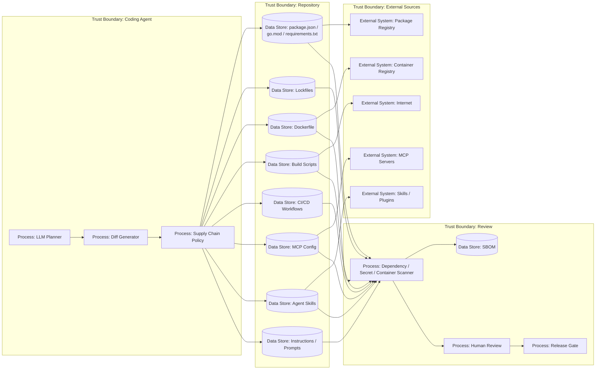

# 30 — AI Coding Supply Chain

> Навигация: [Оглавление](../../README.md) · [← Назад](29-ai-generated-code-review-spec-driven.md) · [Вперёд →](31-ci-cd-mcp-skills-production-path.md)

*Кратко: AI-coding supply chain — это контроль всего, что агент может добавить или изменить в разработке: dependencies, lockfiles, scripts, Dockerfile, CI/CD, MCP config, skills, prompts и generated code.*

> Примеры в разделе — на Go. Те же примеры на других языках:
> [Python](../../examples/python/part-9/30-ai-coding-supply-chain.py) ·
> [TypeScript](../../examples/typescript/part-9/30-ai-coding-supply-chain.ts)

## Суть

В обычной supply chain защите мы проверяем зависимости, контейнеры и CI/CD.

В AI-coding добавляется новое:

> агент сам может предложить или выполнить supply chain change.

Примеры:

- добавить npm/go/python dependency;
- изменить lockfile;
- добавить postinstall/prebuild script;
- изменить Dockerfile;
- скачать скрипт из интернета;
- добавить MCP server;
- добавить skill/plugin;
- изменить AGENTS.md;
- изменить GitHub Actions;
- отключить scanner;
- добавить generated code с вредным поведением.

## DFD



## High-risk files

| Файл / область | Почему опасно |
|---|---|
| `package.json` | scripts, dependencies, supply chain |
| `package-lock.json` / `yarn.lock` / `pnpm-lock.yaml` | transitive dependency changes |
| `go.mod` / `go.sum` | новые модули и версии |
| `requirements.txt` / `poetry.lock` | Python dependencies |
| `Dockerfile` | base image, curl scripts, secrets |
| `.github/workflows/*` | CI/CD, secrets, deploy |
| `AGENTS.md` / `CLAUDE.md` | agent instruction supply chain |
| MCP config | новые tools/resources |
| skills/plugins | исполняемые инструкции и scripts |
| build scripts | shell execution |
| migration scripts | изменение данных |

## Угроза / контекст

| Угроза | Пример | Risk |
|---|---|---|
| Dependency confusion | агент добавил пакет с именем internal-пакета | High |
| Malicious package | dependency содержит postinstall exfiltration | Critical |
| Rug pull | безопасная версия заменена вредной latest-версией | High |
| Lockfile poisoning | diff выглядит большим и скрывает вредную transitive dep | High |
| Dockerfile injection | `curl ... | sh` в build | Critical |
| CI/CD weakening | агент отключил dependency scan | High |
| MCP server addition | новый MCP server получает filesystem/shell | Critical |
| Skill poisoning | skill description безопасный, body вредный | High |
| Prompt/policy tampering | агент изменил security instructions | High |
| Secret in artifact | secret попал в image layer или generated file | Critical |

## Контрмеры

### 1. Dependency changes = high-risk

Любое изменение package manager files, lockfiles, Dockerfile, workflow, MCP config или skill требует отдельного review.

### 2. Pin versions

Плохо:

```text
latest
*
^1.0.0 без понимания
curl https://.../install.sh | sh
```

Лучше:

```text
точная версия
hash
digest
SBOM
reviewed source
```

### 3. Package scripts review

Особенно проверять:

```text
preinstall
install
postinstall
prebuild
prepare
test scripts
release scripts
```

### 4. Agent cannot disable security gates

Агент не должен сам отключать scanners, branch protection, required checks, CODEOWNERS, secrets policy и deploy environments.

### 5. Prompt / skill / MCP тоже supply chain

Instruction files и skills — это не “документация”, а управляющий слой агента.

### 6. Model provenance

Coding-агент не должен подключать недоверенные модели, веса или inference-эндпоинты без review: источник весов, кто дообучал, какие safety-гарантии сняты. Произвольные аблитерированные или «расцензуренные» модели — high-risk artifact. Общий контекст model supply chain — в [22 — Supply Chain Security](../part-7-testing-compliance/22-supply-chain-security.md).

## Go snippet: supply chain diff detector

```go
package aicodingsupply

import (
	"path/filepath"
	"strings"
)

type ChangeKind string

const (
	DependencyChange  ChangeKind = "dependency_change"
	CIChange          ChangeKind = "ci_change"
	DockerChange      ChangeKind = "docker_change"
	InstructionChange ChangeKind = "instruction_change"
	MCPChange         ChangeKind = "mcp_change"
	SkillChange       ChangeKind = "skill_change"
	RegularCode       ChangeKind = "regular_code"
)

func ClassifyChange(path string) ChangeKind {
	p := filepath.ToSlash(filepath.Clean(path))

	switch p {
	case "package.json", "package-lock.json", "pnpm-lock.yaml", "yarn.lock", "go.mod", "go.sum", "requirements.txt", "poetry.lock":
		return DependencyChange
	case "Dockerfile":
		return DockerChange
	case "AGENTS.md", "CLAUDE.md", "GEMINI.md":
		return InstructionChange
	}

	if strings.HasPrefix(p, ".github/workflows/") {
		return CIChange
	}
	if strings.HasPrefix(p, ".mcp/") {
		return MCPChange
	}
	if strings.HasPrefix(p, ".skills/") {
		return SkillChange
	}

	return RegularCode
}
```

## Go snippet: release gate

```go
type ChangedFile struct {
	Path string
}

type ReviewDecision struct {
	HumanApproved   bool
	SecurityApproved bool
	ScannersPassed  bool
	SBOMUpdated     bool
}

func BlocksRelease(files []ChangedFile, decision ReviewDecision) bool {
	highRisk := false

	for _, f := range files {
		switch ClassifyChange(f.Path) {
		case DependencyChange, CIChange, DockerChange, InstructionChange, MCPChange, SkillChange:
			highRisk = true
		}
	}

	if !decision.ScannersPassed {
		return true
	}
	if highRisk && !decision.SecurityApproved {
		return true
	}
	if highRisk && !decision.HumanApproved {
		return true
	}
	if highRisk && !decision.SBOMUpdated {
		return true
	}
	return false
}
```

## Чек-лист

- [ ] Dependency changes считаются high-risk.
- [ ] Lockfile changes ревьюятся.
- [ ] Dockerfile changes ревьюятся.
- [ ] CI/CD changes ревьюятся отдельно.
- [ ] Package scripts проверяются.
- [ ] MCP config changes требуют review.
- [ ] Skill/plugin changes требуют review.
- [ ] Instruction files входят в supply chain.
- [ ] Агент не может отключить scanners.
- [ ] Агент не может изменить required checks без review.
- [ ] Версии pinned.
- [ ] Агент не подтягивает недоверенные модели/веса/inference-эндпоинты; model provenance проверен (см. §22).
- [ ] Есть SBOM.
- [ ] Есть secret scanning.
- [ ] Есть dependency scanning.
- [ ] Есть rollback.

## Литература

- [Список литературы](../literature.md#стандарты-и-фреймворки)
- [SLSA Framework](https://slsa.dev/)
- [NIST Secure Software Development Framework](https://csrc.nist.gov/Projects/ssdf)
- [CycloneDX SBOM Standard](https://cyclonedx.org/)
- [OpenSSF Scorecard](https://github.com/ossf/scorecard)
- [OWASP Agentic Skills Top 10](https://owasp.org/www-project-agentic-skills-top-10/)
- [OWASP Practical Guide for Secure MCP Server Development](https://genai.owasp.org/resource/a-practical-guide-for-secure-mcp-server-development/)

## См. также

- [10 — Secrets Management](../part-3-processing-security/10-secrets-management.md)
- [19 — MCP Security](../part-6-multi-agent-security/19-mcp-security.md)
- [22 — Supply Chain Security](../part-7-testing-compliance/22-supply-chain-security.md)
- [27 — Репозиторий как источник инструкций](27-repository-instructions-attack-surface.md)
