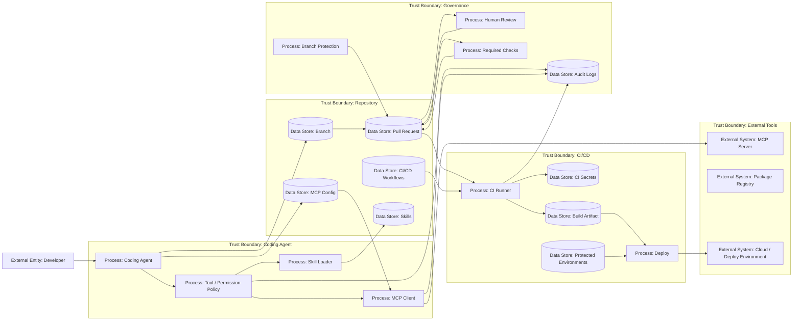

# 31 — CI/CD, MCP, Skills и production path

> Навигация: [Оглавление](../../README.md) · [← Назад](30-ai-coding-supply-chain.md) · [Вперёд →](32-ai-coding-security-checklist.md)

*Кратко: AI-coding agent опасен не только локальными изменениями. Через CI/CD, MCP и skills он может повлиять на путь к production.*

> Примеры в разделе — на Go. Те же примеры на других языках:
> [Python](../../examples/python/part-9/31-ci-cd-mcp-skills-production-path.py) ·
> [TypeScript](../../examples/typescript/part-9/31-ci-cd-mcp-skills-production-path.ts)

## Суть

AI-coding agent часто работает не один:

```text
IDE / terminal agent → repo changes → branch → PR → CI/CD → artifact → deploy
```

Параллельно он может использовать:

- MCP-серверы;
- skills/plugins;
- package registries;
- browser tools;
- database tools;
- shell tools;
- cloud environments.

Главный риск:

> агент может изменить не только код, но и инфраструктуру, через которую код попадает в production.

## DFD



## CI/CD threat model

| Угроза | Пример | Risk |
|---|---|---|
| Workflow injection | агент добавляет шаг, который печатает secrets | Critical |
| Overbroad token permissions | `permissions: write-all` | Critical |
| Disable scanner | агент отключает SAST/dependency scan | High |
| Bypass required checks | агент меняет workflow name/condition | High |
| Artifact poisoning | build artifact содержит вредный код | Critical |
| PR from fork + secrets | workflow ошибочно отдаёт secrets fork PR | Critical |
| Deploy gate bypass | агент меняет environment protection | Critical |
| Auto-merge by agent | агент сам мержит PR | High |

## MCP threat model в AI-coding

| Угроза | Пример | Risk |
|---|---|---|
| MCP tool poisoning | tool description содержит скрытые инструкции | High |
| Shadow server | новый MCP server появляется без review | High |
| Context injection | MCP resource влияет на coding plan | High |
| Filesystem overreach | MCP server читает весь home directory | Critical |
| Shell tool abuse | MCP tool запускает команды | Critical |
| Egress bypass | MCP server отправляет данные наружу | Critical |
| Cross-server contamination | output одного server влияет на другой tool | High |
| Localhost trust gap | browser tool агента → local MCP/WebSocket без auth → RCE на dev-машине | Critical |

## Localhost is not a trust boundary (dev context)

Dev-машина coding agent хранит secrets, tokens, SSH keys и часто примыкает к production (VPN, cloud creds, deploy access). **AutoJack** показывает: вредная страница → browser tool → `localhost` MCP/WebSocket без auth → RCE на хосте.

В AI-coding контексте это особенно опасно: агент постоянно открывает внешние страницы (docs, issues, PR diffs), а локальные MCP/skills слушают loopback. Контрмеры: auth+authz на local MCP, egress блокирует loopback/private, experimental frameworks — в sandbox/devbox. Подробнее: [19 — MCP Security](../part-6-multi-agent-security/19-mcp-security.md#localhost-is-not-a-trust-boundary-autojack), [08 — Sandboxing](../part-3-processing-security/08-sandboxing.md#localhost-is-not-a-trust-boundary).

## Skills threat model

| Угроза | Пример | Risk |
|---|---|---|
| Skill poisoning | description безопасный, body вредный | High |
| Rug pull | skill обновился и получил вредный script | High |
| Over-permissioned skill | skill запускает shell/network без необходимости | High |
| Hidden workflow | skill меняет CI/dependencies | High |
| Instruction override | skill просит игнорировать security policy | High |
| Unreviewed sharing | skill принесён из внешнего источника | Medium/High |

## Skill Security: уровни контроля

Формула:

```text
Skill Security = не «ставим всё», а «выбираем уровень контроля под риск».
```

Не всем нужен enterprise-контур. Нужен осознанный уровень под среду и последствия ошибки.

| Уровень | Когда | Минимум контролей |
|---|---|---|
| **prototype** | локальный эксперимент | понимание skills как attack surface; не ставить third-party без осознанного риска |
| **startup** | команда / доступ к файлам · shell · API | trusted source; review manifest/instructions; запрет секретов в skill; approval на опасные действия |
| **production** | регулярное использование | sandbox для scripts; audit log; version pinning; egress control; review scripts; update/diff review (rug pull) |
| **regulated** | sensitive / compliance | formal policy; allowlist skills; threat model; обязательный human approval |

### На что смотреть на каждом уровне

**description vs body** (`SKILL.md` / аналог): описание для модели (description) — не доверенная политика (policy). Тело и скрипты (body / scripts) проходят отдельный review. Учебные anti-patterns: [§34 MCP / Skill Review Workshop](../part-10-course-appendix/34-mcp-skill-review-workshop.md), [examples/course/bad-good-skill-manifest.md](../../examples/course/bad-good-skill-manifest.md).

**Sandbox** для skill-скриптов: не запускать install/postinstall и произвольный shell от имени разработчика без изоляции. См. [08 — Sandboxing](../part-3-processing-security/08-sandboxing.md).

**Provenance + pin**: фиксированная версия (pin), не `latest`; известный источник и ответственный (owner). При обновлении — **diff review** (rug pull): что изменилось в instructions/scripts/permissions. См. [30 — AI Coding Supply Chain](30-ai-coding-supply-chain.md), [19 — MCP Security](../part-6-multi-agent-security/19-mcp-security.md).

Skills и инструкции в репозитории пересекаются с [27 — Repository instructions](27-repository-instructions-attack-surface.md). Операционный минимум: [templates/agentic-security-baseline.md](../../templates/agentic-security-baseline.md).

### Go snippet: минимум контролей по уровню

```go
package skillsecurity

type Level string

const (
	LevelPrototype  Level = "prototype"
	LevelStartup    Level = "startup"
	LevelProduction Level = "production"
	LevelRegulated  Level = "regulated"
)

// RequiredControls — минимальный набор имён контролей для уровня (иллюстративно).
func RequiredControls(level Level) []string {
	switch level {
	case LevelPrototype:
		return []string{"attack_surface_awareness"}
	case LevelStartup:
		return []string{
			"trusted_source", "manifest_review", "no_secrets_in_skill", "approval_dangerous",
		}
	case LevelProduction:
		return []string{
			"trusted_source", "manifest_review", "no_secrets_in_skill", "approval_dangerous",
			"sandbox_scripts", "audit_log", "version_pin", "egress_control", "update_diff_review",
		}
	case LevelRegulated:
		return []string{
			"trusted_source", "manifest_review", "no_secrets_in_skill", "approval_dangerous",
			"sandbox_scripts", "audit_log", "version_pin", "egress_control", "update_diff_review",
			"formal_policy", "skill_allowlist", "threat_model", "mandatory_hitl",
		}
	default:
		return nil
	}
}

func MeetsMinimum(level Level, enabled map[string]bool) bool {
	for _, c := range RequiredControls(level) {
		if !enabled[c] {
			return false
		}
	}
	return true
}
```

## Production path controls

| Контроль | Для чего |
|---|---|
| Branch protection | агент не может напрямую писать в protected branch |
| Required reviews | human review до merge |
| CODEOWNERS | security-sensitive files требуют owner review |
| Required checks | тесты, scan, lint, policy gates |
| Protected environments | deploy требует approval |
| Least privilege token | CI токены без лишних прав |
| No secrets for untrusted PR | защита fork PR |
| Artifact signing | контроль происхождения artifact |
| SBOM | visibility dependencies |
| Audit logs | расследование действий агента |

## Go snippet: high-risk path detector

```go
package productionpath

import (
	"path/filepath"
	"strings"
)

func IsProductionPath(path string) bool {
	p := filepath.ToSlash(filepath.Clean(path))

	if strings.HasPrefix(p, ".github/workflows/") {
		return true
	}
	if strings.HasPrefix(p, "deploy/") || strings.HasPrefix(p, "k8s/") || strings.HasPrefix(p, "helm/") {
		return true
	}
	if p == "Dockerfile" || strings.HasSuffix(p, ".Dockerfile") {
		return true
	}
	if strings.Contains(p, "terraform") || strings.HasSuffix(p, ".tf") {
		return true
	}
	if p == "CODEOWNERS" || strings.HasSuffix(p, "/CODEOWNERS") {
		return true
	}
	return false
}
```

## Go snippet: production gate

```go
type PR struct {
	ID               string
	AgentGenerated   bool
	ChangedFiles     []string
	HumanApproved    bool
	SecurityApproved bool
	RequiredChecksOK bool
}

func NeedsProductionReview(pr PR) bool {
	if pr.AgentGenerated {
		return true
	}
	for _, path := range pr.ChangedFiles {
		if IsProductionPath(path) {
			return true
		}
	}
	return false
}

func CanEnterProductionPath(pr PR) bool {
	if !pr.RequiredChecksOK {
		return false
	}
	if NeedsProductionReview(pr) && !pr.HumanApproved {
		return false
	}
	if NeedsProductionReview(pr) && !pr.SecurityApproved {
		return false
	}
	return true
}
```

## MCP/Skills controls

| Контроль | MCP | Skills |
|---|---:|---:|
| allowlist | да | да |
| owner | да | да |
| version pinning | да | да |
| permission review | да | да |
| schema validation | да | частично |
| sandbox | для command tools | для scripts |
| egress control | обязательно | если есть network |
| audit | обязательно | обязательно |
| kill-switch | per server | per skill |
| update review | обязательно | обязательно |

## Чек-лист

- [ ] Agent-generated PR не может merge без человека.
- [ ] Branch protection включён.
- [ ] Required checks включены.
- [ ] CODEOWNERS покрывает CI/CD, security, deploy files.
- [ ] CI token permissions минимальны.
- [ ] Secrets не доступны untrusted PR.
- [ ] Workflow changes требуют security review.
- [ ] Deploy environments protected.
- [ ] MCP servers в allowlist.
- [ ] MCP config changes требуют review.
- [ ] Skills/plugins pinned.
- [ ] Skills/scripts проходят review.
- [ ] Есть kill-switch per MCP server / skill.
- [ ] Agent-generated artifacts имеют provenance.
- [ ] Есть audit по PR, CI, deploy.
- [ ] Локальные MCP/WebSocket в dev-среде требуют auth; browser tools не доверяют localhost.
- [ ] Для среды зафиксирован уровень Skill Security (prototype / startup / production / regulated).
- [ ] Контроли соответствуют выбранному уровню (не «всем всё», а минимум под риск).
- [ ] Description skill не считается policy; body/scripts проходят отдельный review.
- [ ] Для production+: pin версий, sandbox scripts, egress control, audit, diff review при обновлении.
- [ ] Для regulated: allowlist skills, formal policy / threat model, обязательный human approval.
- [ ] Third-party skill не ставится без trusted source и review (даже на startup).

## Литература

- [Список литературы](../literature.md#mcp)
- [GitHub Copilot cloud agent](https://docs.github.com/en/copilot/concepts/agents/cloud-agent/about-cloud-agent)
- [GitHub Actions — Security hardening](https://docs.github.com/en/actions/security-for-github-actions/security-guides/security-hardening-for-github-actions)
- [Model Context Protocol — Security Best Practices](https://modelcontextprotocol.io/docs/tutorials/security/security_best_practices)
- [OpenAI Codex — Skills](https://developers.openai.com/codex/skills)
- [OWASP Agentic Skills Top 10](https://owasp.org/www-project-agentic-skills-top-10/)
- [OWASP Practical Guide for Secure MCP Server Development](https://genai.owasp.org/resource/a-practical-guide-for-secure-mcp-server-development/)

## См. также

- [08 — Sandboxing](../part-3-processing-security/08-sandboxing.md)
- [19 — MCP Security](../part-6-multi-agent-security/19-mcp-security.md)
- [22 — Supply Chain Security](../part-7-testing-compliance/22-supply-chain-security.md)
- [23 — Incident Response и Recovery](../part-7-testing-compliance/23-incident-response-recovery.md)
- [27 — Repository instructions](27-repository-instructions-attack-surface.md)
- [30 — AI Coding Supply Chain](30-ai-coding-supply-chain.md)
- [34 — MCP / Skill Review Workshop](../part-10-course-appendix/34-mcp-skill-review-workshop.md)
