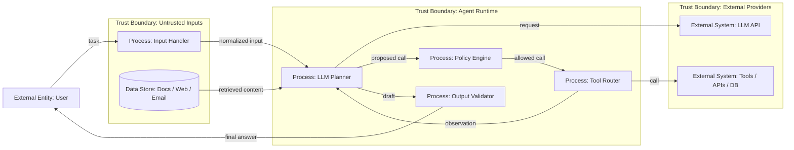

# Шаблон: Threat Model AI-агента

[← Оглавление](../README.md)

> Заполняемая форма. Замени `<...>` на значения системы. Методику см. в [02 — Модель угроз](../notes/part-1-architecture-threats/02-threat-model.md).

## 1. Scope

- **Система:** `<название агента / сервиса>`
- **Версия / дата:** `<vX.Y, YYYY-MM-DD>`
- **Владелец:** `<команда / ответственный>`
- **Что в scope:** `<компоненты, tools, окружения>`
- **Что вне scope:** `<что не рассматриваем>`
- **Автономность:** `<read-only / approval / автономные действия>`

## 2. Активы

| Актив | Пример в системе | Почему важен |
|---|---|---|
| User data | `<...>` | `<...>` |
| System instructions | `<...>` | `<...>` |
| Tool credentials | `<...>` | `<...>` |
| Memory / context | `<...>` | `<...>` |
| Tool outputs | `<...>` | `<...>` |
| Logs / traces | `<...>` | `<...>` |
| External systems | `<...>` | `<...>` |
| Budget / quotas | `<...>` | `<...>` |

## 3. Акторы

| Актор | Что может делать | Доверенный? |
|---|---|---|
| Пользователь | `<...>` | нет |
| Внешний автор контента | `<indirect injection>` | нет |
| Внешний сервис / tool | `<poisoned output>` | нет |
| Другой агент | `<...>` | `<...>` |
| Инсайдер / оператор | `<...>` | частично |

## 4. DFD и trust boundaries

Trust boundaries:

| Boundary | Что отделяет | Риск на границе |
|---|---|---|
| `<Inputs → Runtime>` | `<...>` | `<prompt injection>` |
| `<Runtime → External>` | `<...>` | `<exfiltration, supply chain>` |
| `<Runtime → Storage>` | `<...>` | `<memory poisoning>` |

## 5. STRIDE по элементам DFD

| DFD element | STRIDE | Угроза | Risk (H/M/L) | Контрмеры |
|---|---|---|---|---|
| `<element>` | Spoofing | `<...>` | `<...>` | `<...>` |
| `<element>` | Tampering | `<...>` | `<...>` | `<...>` |
| `<element>` | Repudiation | `<...>` | `<...>` | `<...>` |
| `<element>` | Information Disclosure | `<...>` | `<...>` | `<...>` |
| `<element>` | Denial of Service | `<...>` | `<...>` | `<...>` |
| `<element>` | Elevation of Privilege | `<...>` | `<...>` | `<...>` |

## 6. Risk register

| ID | Риск | Актив | Вероятность | Импакт | Severity | Контрмера | Owner | Статус |
|---|---|---|---|---|---|---|---|---|
| R-001 | `<...>` | `<...>` | `<L/M/H>` | `<L/M/H>` | `<L/M/H>` | `<...>` | `<...>` | open |
| R-002 | `<...>` | `<...>` | `<...>` | `<...>` | `<...>` | `<...>` | `<...>` | open |

## 7. Решение

- **Остаточный риск:** `<принят / требует доработки>`
- **Дата ревью:** `<YYYY-MM-DD>`
- **Следующий пересмотр:** `<при изменении архитектуры / квартально>`
